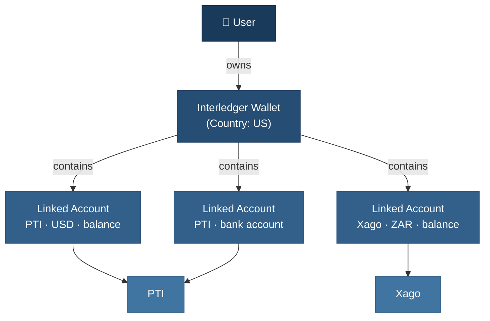

# Concepts: Interledger App vs Service Providers

The Interledger App integrates with GateHub, PTI, Xago, and Chimoney — each with their own vocabularies. A "wallet" in the Interledger App is fundamentally different from a "wallet" in GateHub or PTI. This document maps the terminology.

## Wallet Structure

One user gets **one wallet** containing multiple **linked accounts** from one or more providers.

- Multiple currencies per wallet: **yes** (via linked accounts)
- Multiple providers per wallet: **yes**
- Multiple wallets per user: **no**

## Core Terms

| Term | Interledger App meaning | Notes |
|------|------------------------|-------|
| **Wallet** | The user's single financial account: one ILP address, one country, multiple linked accounts | GateHub "wallet" = XRPL address; PTI "wallet" = per-currency balance; Xago uses "SubAccount" |
| **Linked Account** | Any external account connected to the wallet (balance, bank account, card, interac) | Each has one provider and one currency |
| **User** | Identity & authentication (Kratos) — separate from the wallet | Keeps auth and financial data decoupled |
| **Payment** | An intent to move money (P2P, deposit, withdrawal) — orchestrated asynchronously | Creates one or more Transactions |
| **Transaction** | A ledger entry recording what actually happened to money | Has types: sent, received, deposit, withdrawal, card, web monetization |

## Linked Account Types

| Type | Providers | Purpose |
|------|-----------|---------|
| `balance` | GateHub, PTI, Xago, Chimoney | Money held in custody by the provider |
| `bank_account` | PTI, Xago | External bank account for deposits/withdrawals |
| `card` | PTI, GateHub | Debit or credit card |
| `interac` | Chimoney | Interac e-Transfer (Canada) |

## Provider Translation

| Concept | GateHub | PTI | Xago |
|---------|---------|-----|------|
| "Wallet" equivalent | XRPL address (multiple per user) | Per-currency balance (multiple per user) | SubAccount (~1:1 with user) |
| Money movement | Transaction | Transfer | Transfer |
| Status codes | Numeric (`100` = completed) | String (`SETTLED`) | String (`completed`) |
| User account | User | User | SubAccount |
| `provider_id` format | XRPL address (`rHb9C...`) | UUID | Composite (`xago_ZAR_...`) or beneficiary UUID |

## Common Pitfalls

| Pitfall | What to know |
|---------|-------------|
| Wallet confusion | Interledger wallet ≠ GateHub/PTI wallet. Use `linked_accounts.provider_id` for provider API calls, not `wallets.id`. |
| Transaction vs Payment lookup | Provider transaction ID → Interledger Transaction (via `foreign_id`) → Payment (via `send_transaction_id` / `receive_transaction_id`). |
| Balance mismatch | Check webhook logs, run backfill workflow, compare Pacioli ledger (`accounts` table) with provider API. |
| `provider_id` format | Provider-specific — never parse generically. GateHub=XRPL address, PTI=UUID, Xago=composite, Chimoney=external ID. |
| Status code types | GateHub returns ints, PTI/Xago return strings. Always use the provider-specific mapping in `backend/providers/*/external/`. |

