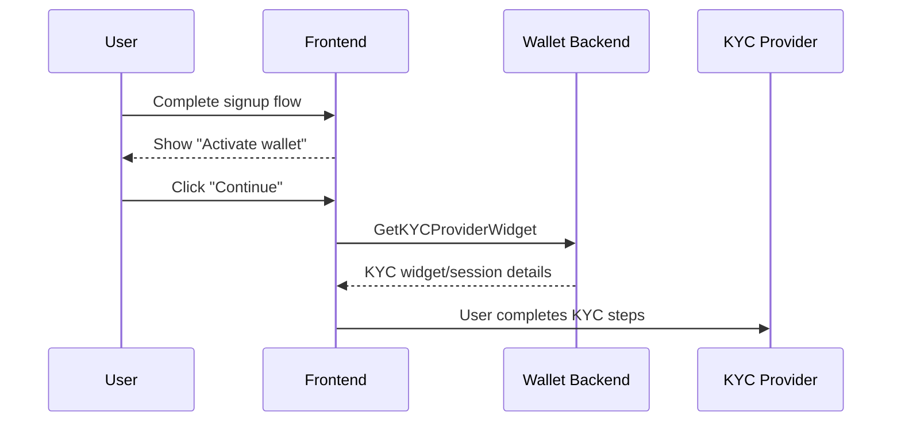
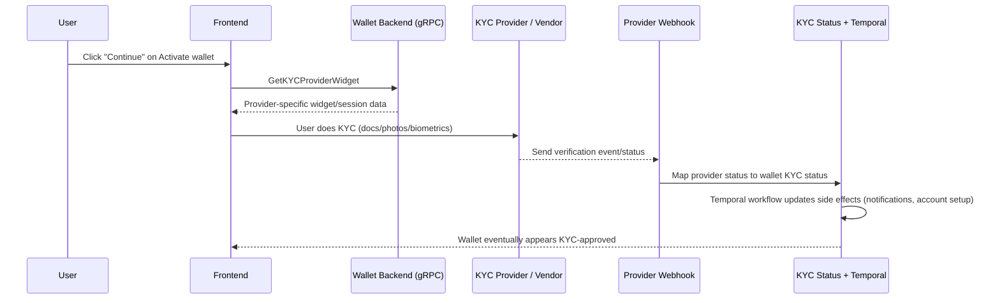
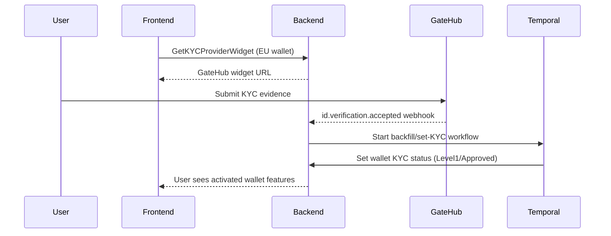
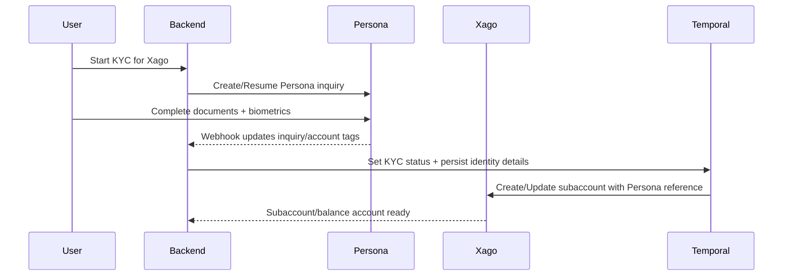

# KYC Explainer

> **Identity verification guide.** Understand KYC flows and how they gate wallet activation across providers.

**Related documents:**
- [Concepts](concepts.md) — Wallet and linked-account terminology
- [Payments Guide](payments-explainer.md) — How KYC gates transaction authorization
- [Provider Payments Guide](provider-payments-guide.md) — Provider-specific KYC implementations
- [Wallets vs Accounts](wallets-vs-accounts-vs-addresses.md) — Wallet activation architecture
- [Payment Troubleshooting](payment-troubleshooting-guide.md) — Debugging KYC-blocked transactions

**Quick Navigation:**
- **User stuck in KYC?** → Jump to [Provider-Specific Flows](#8-provider-specific-kyc-deep-dives)
- **What does "action_required" mean?** → See [KYC Status Values](#6-kyc-status-values)
- **GateHub iframe issues?** → See [GateHub KYC Flow](#81-gatehub-kyc-flow)
- **Xago verification problems?** → See [Xago KYC Flow](#82-xago-kyc-flow)
- **General KYC troubleshooting?** → See [Troubleshooting Checklist](#9-troubleshooting-checklist)

**Scope:** What KYC is, how it works in Interledger App, and how provider differences affect the user journey.

---

## 1) User journey first: signup → activate wallet → KYC

Before going deep into KYC internals, this is the user-facing journey to keep in mind.

After a user completes signup (account creation, verification, and wallet address setup), the app asks them to **Activate wallet**.

In plain terms, **Activate wallet** means:

- “Finish the required identity checks so this wallet can perform regulated financial actions.”

So when a user clicks **Continue** on the Activate wallet prompt, they are starting or resuming their provider-specific KYC flow.

This framing helps avoid confusion: KYC is not a separate product area from activation; it is the core part of wallet activation.

---

## 2) What KYC means in Interledger App

KYC (Know Your Customer) is the process of verifying a user’s real-world identity before allowing regulated financial activity.

From an Interledger App wallet perspective:

- A user has **one Interledger wallet**.
- That wallet can have one or more **linked accounts** at one or more providers (see [Concepts](concepts.md#core-terms) for definitions).
- KYC status is tracked at the wallet level in Interledger App, but **evidence and verification workflows are often provider-specific**.

In practice, KYC should be understood as:

1. **A compliance gate** (can this wallet perform regulated actions?)
2. **A provider integration** (which external party performed verification?)
3. **A changing legal requirement** (rules vary by country, provider, and over time)

---

## 3) Why we intentionally keep KYC data minimal

A core operating principle is data minimization:

- We want to keep as little private user information as possible on our side.
- More PII and biometric data stored by us means more legal, compliance, and breach risk.
- Where possible, providers (or their KYC vendors) handle document capture/biometrics and hold the most sensitive artifacts.

Support talk track:

- “Interledger App tracks KYC status and required profile details to operate the wallet, but the detailed identity verification evidence is generally handled by the provider-side KYC systems.”

---

## 4) Compliance reality: KYC is tied to transactions

At a policy level, KYC is linked to anti-money-laundering (AML) obligations. Operationally, this means:

- Transactions must be attributable to appropriately verified users (see [Payments & Transactions](payments-explainer.md#understanding-transactions)).
- The exact requirement can differ by country and provider.
- We should expect policy evolution, including possibilities like:
  - KYC expiration/reverification windows
  - rule changes by jurisdiction
  - different thresholds for different transaction types

**Important support framing:**

We are still refining exact interpretations per provider/country. The system is designed to be flexible because legal requirements may change.

---

## 5) Language guidance for support conversations

When talking with users or internal teams, use provider-specific phrasing.

Prefer:

- “The user needs to do KYC for GateHub.”
- “The user already completed KYC for Xago.”
- “This wallet is waiting on Chimoney KYC completion.”

Avoid generic phrasing like “KYC is done everywhere” unless you are sure all relevant provider requirements are satisfied.

Why this matters:

- KYC completion in one provider/legal path may not automatically satisfy another provider/legal path.
- During provider migrations, users in the same country may be split across providers.

---

## 6) High-level system flow

A simplified flow when a user clicks **Continue** in “Activate wallet”:

KYC usually includes:

- identity document uploads
- selfie/photo checks
- sometimes additional biometric checks

---

## 7) How provider routing works today (wallet-country driven)

In backend KYC widget routing:

- **EU wallets** → GateHub onboarding widget
- **CA wallets** → Chimoney KYC widget
- **US wallets** → PTI widget flow
- **Other wallets (notably ZA)** → Persona inquiry flow (often for Xago-related onboarding)

This is why support may see different KYC UI and timing for users with similar complaints.

---

## 8) Provider deep dive

## 8.1 GateHub (EU-heavy path)

### How it works

- User is linked as a managed GateHub user and linked to a GateHub gateway.
- User performs KYC in GateHub onboarding flow.
- GateHub sends verification webhooks (for example accepted/rejected/action_required).
- Backend maps these into Interledger KYC statuses and triggers Temporal workflows.

### Support implications

- A GateHub “accepted” signal generally transitions wallet KYC to approved levels.
- Action-required signals should be treated as “user must revisit provider KYC flow.”
- Card operations may have additional GateHub conditions beyond baseline KYC.

### Sequence (GateHub acceptance)

---

## 8.2 Xago + Persona (South Africa path, multi-party)

### How it works

Xago flow is more complex because it can involve an external KYC vendor (Persona):

- Persona handles inquiry/session and verification evidence.
- Interledger App stores and tracks inquiry/account linkage + normalized status.
- Xago subaccount creation/update can depend on Persona artifacts (for example an approved inquiry URL and ID number).

This means there are multiple systems in play:

1. Interledger App
2. Persona (KYC vendor)
3. Xago (financial provider)

### Why this creates migration complexity

Because KYC can be anchored in an external vendor and legal entity context, moving users between providers or legal entities may require revalidation steps. We experienced major complexity during migration from the original Fynbos context to Interledger Foundation-managed operations.

### Sequence (Xago + Persona)

### Support implications

- Tickets may involve either Persona state, Xago state, or mapping between them.
- “KYC completed in Persona” does not always mean all downstream provider-side steps are finished.
- Investigate both inquiry status and provider account linkage.

---

## 8.3 PTI (US path)

### How it works

- US users receive a PTI widget configuration from backend.
- Wallet KYC state enters pending and US-specific provisioning steps may run.
- On KYC progression, wallet/provider setup continues through workflow activities.

### Support implications

- PTI onboarding is widget-driven but state transitions are asynchronous.
- Users can appear “stuck” if provider completion callback/state propagation is delayed.
- Verify both KYC status and PTI wallet/account setup status.

---

## 8.4 Chimoney (Canada path)

### How it works

- Backend provides a Chimoney KYC widget URL.
- Chimoney wallet/sub-account and linked account setup are workflow-driven.
- A watcher workflow polls for successful KYC outcome and then updates wallet KYC status.

### Support implications

- Completion can be delayed due to polling/asynchronous flow.
- Distinguish between: “widget started”, “provider verification complete”, and “wallet status updated”.

---

## 9) KYC migration and future licensing: key support answer patterns

The organization’s long-term goal may include becoming a financial services license holder and reducing dependence on third-party providers.

Common support question:

- “If we move users away from provider X, will they need to do KYC again?”

Safe and accurate support answer:

- “It depends on jurisdiction, legal entity boundaries, and whether existing KYC evidence is legally portable. In many cases, users may need at least partial re-verification. We evaluate this per migration path.”

Do **not** promise universal KYC portability.

---

## 10) Mixed-provider reality within one country

During migrations or staged rollouts, it is valid for:

- some users in country C to be on provider A,
- while others in the same country are on provider B.

When investigating KYC issues, always identify:

1. user wallet country
2. current provider assignment / linked accounts
3. current KYC provider flow

before giving procedural instructions.

---

## 11) Practical troubleshooting checklist for support

When user says “my KYC is stuck,” gather this minimum context:

1. Wallet ID and country
2. Provider path (GateHub / Xago+Persona / PTI / Chimoney)
3. Current KYC status in backend (`unknown`, `pending`, `in_review`, `denied`, `level1`, `level2`)
4. Most recent provider webhook signal (if any)
5. Whether downstream provisioning finished (for example linked account/subaccount creation)

Then classify:

- **No widget/session issue** (cannot start KYC)
- **In-provider issue** (user cannot complete docs/biometrics)
- **Webhook/state propagation issue** (provider done, app not updated)
- **Post-KYC provisioning issue** (KYC approved, but accounts/features not enabled)

---

## 12) Suggested support phrasing library

- “Your wallet activation depends on completing KYC with your assigned provider.”
- “For your account, this is a **GateHub** KYC flow.”
- “For your account, this is an **Xago flow that uses Persona** for identity verification.”
- “We can see your KYC evidence step is complete, and we’re now waiting for provider confirmation to propagate.”
- “KYC requirements can vary by country and may change over time due to regulation.”

---

## 13) Final mental model

Think of KYC in Interledger App as a **policy + orchestration layer**:

- Policy: compliance obligations tied to transactions
- Orchestration: provider-specific onboarding, webhooks, Temporal workflows
- Risk posture: keep sensitive identity data as minimized as possible on our side

When in doubt, ask: **“KYC for which provider, for which jurisdiction, under which legal entity?”**
