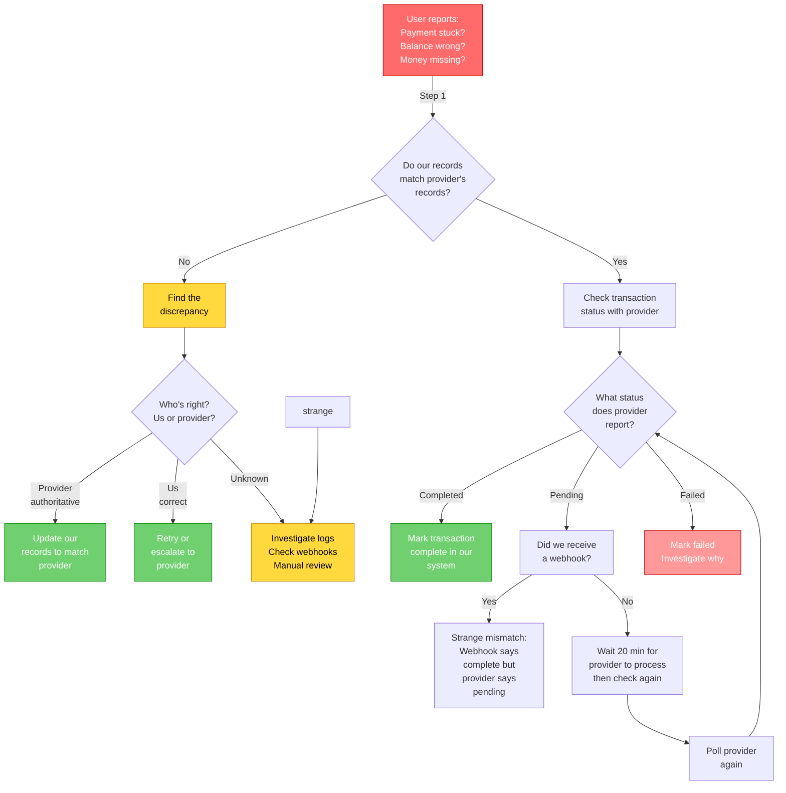

# Payment Troubleshooting Guide

**Audience:** Support staff, operations, first-line debugging  
**Time to read:** 15 minutes

---

## Introduction

When something goes wrong with a payment, follow this systematic debugging framework. Don't guess — follow the evidence trail.



---

## Common Problems & Solutions

### Problem 1: "Payment appears stuck in 'Processing'"

**Symptoms:**
- User initiated payment hours ago
- Status still shows "Sending..."
- Balance hasn't changed

### Investigation Checklist

**Step 1: Check if transaction exists**

```bash
# Query our database
SELECT * FROM transactions 
WHERE id = 'txn_...' OR user_id = 'user_...'
ORDER BY created_at DESC
LIMIT 10;
```

- Transaction exists? ✓ Continue
- No transaction? ✗ Payment never created (UI bug or network issue)

**Step 2: Check transaction status**

```bash
# What status do we have?
Transaction 1:
├─ Status: "pending" (expected for stuck)
├─ Provider ID: "txn_abc123" (GateHub ID)
├─ Created At: 2 hours ago
└─ Provider Fee: £2.00
```

**Step 3: Check with provider (most important)**

```bash
# Query GateHub (or other provider) directly
GateHub API: GET /core/v1/transactions/{txn_abc123}

Response:
{
  "id": "txn_abc123",
  "status": 1,          ← Still pending!
  "amount": "100.00",
  "fee": "2.00"
}

OR

Response:
{
  "id": "txn_abc123",
  "status": 100,        ← Actually completed!
  "amount": "100.00",
  "fee": "2.00"
}
```

### Root Causes & Fixes

**If Provider Says: Pending**

```
Meaning: Provider hasn't finished processing

Causes:
├─ Normal (just needs more time) — Wait up to 20 minutes
├─ Blocked by fraud check — May take 30 min to hours
├─ Provider system slow — Rare but happens
└─ Network issue — Check provider status page

Action:
├─ Wait 20 minutes if recently created
├─ Check provider's status page
├─ Contact provider support if > 30 min pending
└─ Monitor webhook logs for completion
```

**If Provider Says: Completed (Status 100/SETTLED)**

```
Meaning: Provider finished, but our system missed the update

Investigation:
├─ Check webhook logs: Did we receive completion webhook?
│  - If YES: Why didn't we process it?
│  - If NO: Why didn't webhook arrive?
└─ Check our transaction status: Did we update it?

Cause: Webhook Failure
├─ Network interruption (our side)
├─ Webhook URL misconfigured
├─ Webhook handler crashed
└─ Request timeout

Fix:
├─ Manually mark transaction as complete
├─ Credit user's balance (should already have reserve)
├─ Send user notification: "✓ Payment completed"
├─ Investigate: Why webhook didn't trigger update
```

**If Provider Says: Failed (Status 3/FAILED)**

```
Meaning: Provider rejected the transaction

Investigate error:
├─ Check provider response: What was error?
│  Examples:
│  ├─ "Insufficient funds"
│  ├─ "Account locked"
│  ├─ "Daily limit exceeded"
│  └─ "Recipient account not found"
└─ Return error to user with explanation

Fix:
├─ Mark transaction as failed
├─ Return balance to sender (unreserve the amount)
├─ Show user error message from provider
└─ Suggest action (add funds, try again later, contact support)
```

---

### Problem 2: "Balance is wrong - shows £100 but should be £150"

**Symptoms:**
- User balance doesn't match their transactions
- "Missing" money somewhere
- Balance calculation error

### Investigation Checklist

**Step 1: Calculate expected balance**

```bash
# Sum all transactions for this user
SELECT 
  SUM(CASE WHEN type='receive' OR type='deposit' 
       THEN amount - COALESCE(provider_fee, 0)
       ELSE 0 END) as credits,
  SUM(CASE WHEN type='send' OR type='withdrawal'
       THEN amount + COALESCE(provider_fee, 0)
       ELSE 0 END) as debits
FROM transactions
WHERE user_id = 'user_...' AND status = 'completed';

Expected balance = credits - debits
Actual balance = [from database]
Difference = Expected - Actual
```

**Step 2: Investigate the discrepancy**

```
Difference = £50 (we have less than expected)

Check:
├─ Is there a pending transaction for £50? (Yes? Wait for it)
├─ Is there a failed transaction we show as completed? (Fix status)
├─ Did we miss recording a fee? (Add fee)
├─ Did a withdrawal fail but we show as sent? (Fix status)
└─ Database lag? (Wait 30 seconds, recalculate)
```

**Step 3: Check provider balance**

```bash
# Get authoritative balance from GateHub/PTI/Xago
Provider says: Alice has £100

Compare:
├─ Our calculated: £150
├─ Difference: £50 (we think we have more)
│
Who's right?
├─ Provider = Authoritative for real money
├─ Us = Authoritative if we're using internal transfers
└─ Action: Determine cause and reconcile
```

### Root Causes & Fixes

**Case 1: Unprocessed Deposits**

```
Scenario: Alice has pending deposit for £50

Our calculation:
├─ Only counts "completed" transactions
└─ Pending deposits not included (correct)

User perception:
├─ "I deposited £50, why don't I have it?"
└─ Doesn't understand "pending" status

Fix:
├─ Wait for deposit to complete
├─ If stuck > 20 min: Investigate with provider
└─ Educate user about pending status
```

**Case 2: Failed Withdrawal That We Marked as Complete**

```
Scenario: Withdrawal to bank failed but we show as completed

Transaction record:
├─ Status: "completed"
├─ Type: "withdrawal"
├─ Amount: £50
└─ But money never left our account

Fix:
├─ Query provider: "Did withdrawal succeed?"
├─ If NO: Update our transaction status to "failed"
├─ Recharge balance (add the £50 back)
├─ Notify user: "Withdrawal failed, trying again"
```

**Case 3: Fee Charged But Not Recorded**

```
Scenario: Provider charged fee we didn't track

Transaction:
├─ Amount: £100
├─ Provider Fee: £0 (should be £2!)
└─ Our balance change: -£100 (should be -£102)

Fix:
├─ Query provider for actual fee charged
├─ Update transaction record: fee = £2
├─ Recalculate: Balance should decrease additional £2
└─ If already final: Manual adjustment
```

**Case 4: Concurrent Transactions Causing Race Condition**

```
Scenario: Two payments at same time, order confusion

Alice's balance: £100
├─ Sends Bob £50
├─ Simultaneously sends Charlie £60

Timing issue:
├─ T+0: Payment 1 reserves £50
├─ T+1: Payment 2 reserves £60
├─ T+2: Both finalize (£110 total deducted from £100!)
└─ Result: Balance goes negative or transaction fails

Fix:
├─ Check: Did both complete or just one?
├─ Investigate: Transaction order in log
├─ Resolution: Likely one failed (insufficient funds)
├─ Recover: Mark second as failed, unreseve amount
```

---

### Problem 3: "Sender sent money but recipient didn't receive it"

**Symptoms:**
- Sender sees "sent" ✓
- Recipient sees nothing
- Money disappeared?

### Investigation Steps

**Step 1: Verify sender's transaction**

```bash
SELECT * FROM transactions
WHERE user_id = 'sender_...' 
  AND type = 'send'
  AND payment_id = 'pay_...'
  AND timestamp > NOW() - INTERVAL '1 hour';

Result:
├─ Alice's send transaction: Status = "completed" ✓
├─ Amount: £100
├─ Receiver: bob@example.com
└─ Provider confirmed: ✓
```

✓ Sender side is good, continue.

**Step 2: Check recipient's transaction**

```bash
SELECT * FROM transactions
WHERE user_id = 'receiver_...'
  AND type = 'receive'
  AND payment_id = 'pay_...'
  AND timestamp > NOW() - INTERVAL '1 hour';

Result:
├─ Bob's receive transaction: MISSING!
└─ No matching receive for the payment
```

✗ Bob has no matching receive transaction. This is the problem.

**Step 3: Query the payment record**

```bash
SELECT * FROM payments
WHERE id = 'pay_...';

Payment record:
├─ Sender: alice@example.com (user_123)
├─ Receiver: bob@example.com  (user_456)
├─ Status: completed
├─ Sender Transaction ID: txn_send_abc123 ✓
├─ Receiver Transaction ID: txn_receive_??? (MISSING!)
└─ Provider Response: Shows transfer succeeded
```

**Step 4: Check provider directly**

```bash
# Ask provider: Did money reach recipient's account?

GateHub: GET /core/v1/wallets/{bob_wallet_address}/balances

Result:
├─ GBP balance includes the £100
├─ Provider side: ✓ Money definitely arrived
└─ Conclusion: Provider saw it, Bob's balance updated there
```

### Root Causes & Fixes

**Case 1: Webhook Arrived But Receive Transaction Wasn't Created**

```
Timeline:
├─ Sender's send finalized
├─ Provider webhook: "Transfer to Bob completed"
├─ Our webhook handler: Received ✓
├─ Problem: Handler crashed before creating Bob's transaction
└─ Result: Bob's transaction missing, balance correct at provider

Fix:
├─ Manually create Bob's receive transaction
├─ Mark as completed
├─ Credit Bob's balance
├─ Notify Bob: "You received £100 from Alice" (now)
```

**Case 2: Webhook Never Arrived**

```
Timeline:
├─ Provider completed the transfer
├─ Provider webhook: Sent but lost (network issue)
├─ Our system: Still shows "pending"
├─ Result: Both ledgers out of sync

Discovery:
├─ Provider says: Money delivered (confirmed via API)
├─ Our ledger says: Still pending
└─ Time elapsed: > 20 minutes

Fix:
├─ Manually fetch status from provider API
├─ Get confirmation that transfer completed
├─ Create both transactions (send already exists)
├─ Create receive transaction for Bob
├─ Notify: Alice "✓ Sent" (already done)
├─ Notify: Bob "You received £100"
```

**Case 3: Different User Found During Lookup**

```
Scenario: Recipient email matches wrong user

Address resolution:
├─ System looks up: bob@example.com
├─ Finds: Wrong Bob (id_999 instead of id_456)
└─ Sends money to wrong person!

Prevention:
├─ Always verify identity match before transfer
├─ Use stable user IDs, not email addresses
├─ Warn user if recipient just signed up recently

Recovery:
├─ Locate actual funds (in wrong Bob's account)
├─ If wrong Bob hasn't spent it: Ask to return
├─ If spent: Escalate (financial loss)
├─ Apologize to user, refund from reserves
```

---

### Problem 4: "Our balance doesn't match provider's balance"

**Symptoms:**
- Our official balance: $10,000
- Provider's balance: $9,500
- Difference: $500 (we think we have more)

### Investigation Steps

**Step 1: Pull official balance**

```bash
# Fetch from provider
GateHub: GET /core/v1/wallets/{wallet_address}/balances
Response:
{
  "balances": [
    {
      "currency": "USD",
      "amount": "9500.00"
    }
  ]
}

Provider says: $9,500
```

**Step 2: Calculate our expected balance**

```bash
# Sum completed transactions
SELECT SUM(CASE 
  WHEN type IN ('deposit', 'receive') THEN amount - COALESCE(provider_fee, 0)
  WHEN type IN ('withdrawal', 'send') THEN -(amount + COALESCE(provider_fee, 0))
  ELSE 0
END) as expected_balance
FROM transactions
WHERE status = 'completed'
  AND user_id = 'user_...'
  AND currency = 'USD';

Our calculation: $10,000
```

**Step 3: Find the discrepancy**

```
Difference: Provider $9,500 vs Our $10,000 = $500 gap (we think we have more)

Question: What transaction might account for $500?

Investigate:
├─ Recent deposits? (Check pending deposits = $500?)
├─ Recent withdrawals? (Check failed withdrawal = $500?)
├─ Pending transaction? (Holding $500?)
├─ Fee charged we didn't record? (Opposite sign)
└─ Double-credit? (Recorded twice?)
```

**Step 4: Find the specific transaction**

```bash
# Look for $500 within last 24 hours
SELECT * FROM transactions
WHERE user_id = 'user_...' 
  AND ABS(amount) = 500
  AND timestamp > NOW() - INTERVAL '24 hours'
ORDER BY timestamp DESC;

Potential matches:
├─ Transaction ID: txn_456
├─ Type: deposit
├─ Amount: $500
├─ Status: "completed" (at our end)
├─ Provider confirmed: NEVER CHECKED
└─ Action: Query provider about this deposit
```

### Root Causes & Fixes

**Case 1: Deposit Completed at Provider But Transaction Shows Pending**

```
Transaction record:
├─ Type: deposit
├─ Amount: $500
├─ Status: "pending" (our system)
├─ Provider says: "completed" ✓

Investigation:
├─ Webhook never arrived (network issue)
├─ Reason: Interledger webhook handler was down
├─ Proof: Check webhook logs (no entry for this transaction)

Fix:
├─ Mark transaction as "completed"
├─ Confirm our expected balance now matches provider
├─ Action: Investigate webhook handler downtime
└─ Prevention: Set up alerts for webhook failures
```

**Case 2: Internal Transfer at Xago We Forgot to Reconcile**

```
Scenario: Xago provider, two users both at Xago

Our ledger:
├─ Alice -$500 (sent to Bob)
├─ Bob +$500 (received from Alice)
├─ Total: Balanced at our level

Provider's ledger (Xago):
├─ Doesn't know about internal transfer
├─ Our account balance: -$500 only
└─ Discrepancy expected for internal transfers

Reconciliation:
├─ Expected: Us +$500 ahead (because of internal transfer)
├─ Actual: Provider -$500 (doesn't track our internal transfer)
├─ Assessment: "Working as designed"
└─ Action: No fix needed, continue operating

When we settle with Xago:
├─ We report: "Internal transfer of $500 between our users"
├─ Xago confirms: "OK, we see the net effect in our balance"
└─ Settlement proceeds
```

**Case 3: Webhook Arrived, Transaction Marked Complete, But User Saw Failure**

```
Scenario: False negative to user

Timeline:
├─ T+0: Deposit initiated
├─ T+2: Our system: "Pending, let me tell provider"
├─ T+3: Provider sends webhook: "Completed"
├─ T+4: Our webhook handler: Updates transaction to complete ✓
├─ T+5: But user's app still shows "Processing"
│        (Frontend didn't refresh in time)
└─ T+10: User refreshes app: "✓ Deposit complete!"

Symptoms:
├─ User reports: "Money disappeared"
├─ Check system: Transaction is actually complete
├─ Provider confirms: Balance correct

Cause: Frontend display lag, not actual issue

Fix:
├─ Tell user to refresh browser
├─ Confirm: "Your deposit completed successfully"
├─ No system fix needed
```

---

## Prevention Checklist

Before transactions fail, ensure system health:

- [ ] **Network Connectivity**
  - [ ] Test webhook endpoint (POST /webhooks/provider)
  - [ ] Verify outbound connectivity to all provider APIs
  - [ ] Check DNS resolution for provider domains

- [ ] **Provider APIs**
  - [ ] Test provider health endpoints
  - [ ] Verify API credentials are valid (test every 24hr)
  - [ ] Check rate limits aren't being exceeded

- [ ] **Database**
  - [ ] Disk space > 20% available (critical at < 10%)
  - [ ] No long-running queries causing locks
  - [ ] Backups completing successfully

- [ ] **Temporal Workflow Engine**
  - [ ] Temporal server running (check dashboard)
  - [ ] Workers registered and active
  - [ ] No activity timeout errors in logs

- [ ] **User Setups**
  - [ ] All users have at least one linked account
  - [ ] Linked accounts are in "active" state
  - [ ] No account lockouts or restrictions

- [ ] **Provider Credentials**
  - [ ] GateHub app ID/secret valid
  - [ ] PTI API key unexpired
  - [ ] Xago credentials working
  - [ ] Chimoney API token unexpired

- [ ] **Webhook Configuration**
  - [ ] Webhook URL is correct (check config)
  - [ ] Webhook endpoint accessible from outside
  - [ ] Webhook handler not timing out

- [ ] **System Ledgers**
  - [ ] Pacioli (our ledger) running and responsive
  - [ ] Daily reconciliation with providers completing
  - [ ] No unresolved discrepancies > 24 hours old

---

## Escalation Logic

**When to investigate locally:**
- Recent transactions (< 1 hour)
- Clear user error (wrong amount, etc.)
- Webhook/network issues you can verify

**When to contact provider support:**
- Transaction status disputes (provider says different)
- Outage or service degradation
- API errors (500 responses, timeouts)
- Credentials not working

**When to escalate to finance team:**
- Settlement discrepancies
- Large balances missing
- Multiple users affected
- Fraud suspicion

---

## Key Takeaways

1. **Always check provider first** — They have authoritative truth
2. **Follow the framework** — Do ledgers agree? → What's transaction status? → Investigate root cause
3. **Look for webhooks first** — Most problems are webhook failures
4. **Use 20-minute rule** — Wait before assuming stuck, then poll
5. **Reconcile regularly** — Catch problems early, before they compound
6. **Document findings** — Help future troubleshooting and prevent repeats

---

## See Also

- [Payments & Transactions Guide](payments-explainer.md) — Overview and navigation hub
- [Ledger System Architecture](ledger-system-explainer.md) — How discrepancies form and resolve
- [Transaction Types Reference](transaction-types-explainer.md) — Transaction fields and states
- [Provider Payments Guide](provider-payments-guide.md) — Provider-specific behavior and limits

---

*Last updated: March 3, 2026*  
*Audience: Support staff, Operations, First-line debugging*
