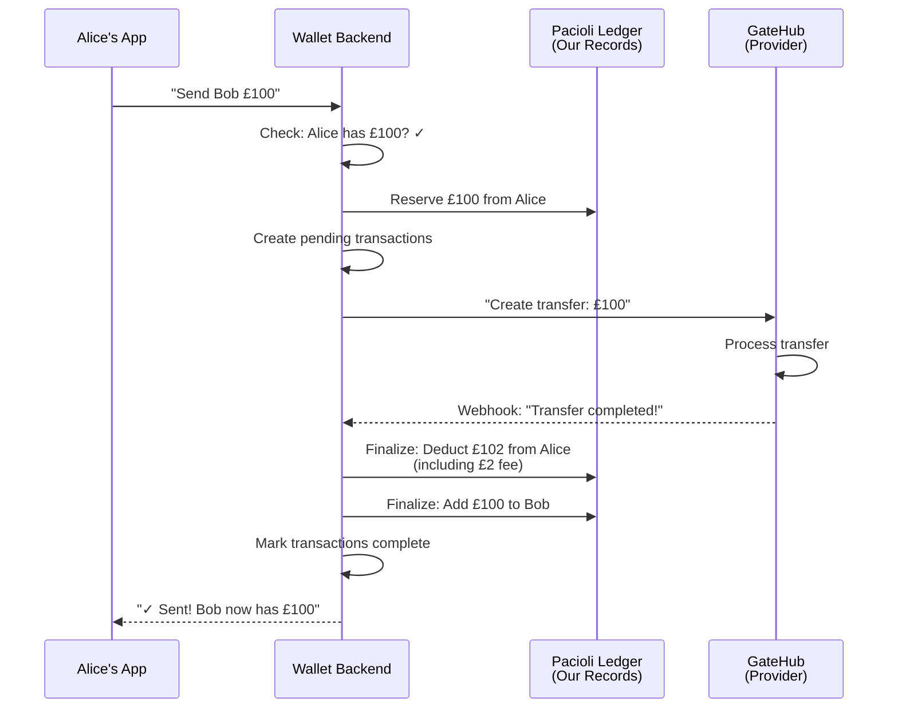

# Payments & Transactions: Navigation Guide

> **Your starting point.** This document provides orientation to the payment system. For detailed information, follow the links to specialist guides below.

**Related documents:**
- [Concepts: Interledger App vs Service Providers](concepts.md) — Terminology and provider translation
- [Wallets vs Accounts vs Addresses](wallets-vs-accounts-vs-addresses.md) — Architecture and address model
- [KYC Explainer](kyc-explainer.md) — How KYC approval gates your payment activity
- [Ledger System Architecture](ledger-system-explainer.md) — Dual-ledger design and reconciliation
- [Transaction Types Reference](transaction-types-explainer.md) — Transaction fields and lifecycle
- [Provider Payments Guide](provider-payments-guide.md) — GateHub, PTI, Xago, Chimoney deep dives
- [Payment Troubleshooting Guide](payment-troubleshooting-guide.md) — Debugging framework and common issues

## Quick Navigation

**Just getting started?** → Start with [The Big Picture](#the-big-picture) below, then [The Payment Story](#the-payment-story)

**Building integrations?** → Read [Transaction Types Reference](transaction-types-explainer.md) for API field mapping

**Troubleshooting a problem?** → Jump to [Payment Troubleshooting Guide](payment-troubleshooting-guide.md)

**Comparing providers?** → See [Provider Payments Guide](provider-payments-guide.md) for GateHub vs PTI vs Xago vs Chimoney

---

## The Big Picture

The Interledger Wallet helps people manage their money across multiple providers and currencies. Think of it like a personal accountant who works with multiple banks on your behalf.

**The core problem we solve**: People want to move money between different financial systems (open payment networks, banks, card networks) without having to maintain separate accounts and logins at each one.

**The solution**: A wallet that:
- Holds your connection to multiple providers
- Tracks every transaction that happens
- Keeps its own records to ensure nothing gets lost
- Settles with providers regularly to match accounts

---

## Architecture: Wallets, Accounts & Addresses

For detailed explanation of how wallets, linked accounts, and payment addresses work together, see:

**→ [Wallets vs Accounts vs Addresses](wallets-vs-accounts-vs-addresses.md)**

This document covers:
- What "wallet" means in the Interledger system
- Linked accounts (balance, bank, card)
- Provider-specific account structures
- Address models (email, payment pointers, ILP addresses)
- How currency selection and account routing works

---

## The Payment Story

Let's follow a real-world example to understand how payments work.

### Alice Sends Bob £100

**Setup:**
- Alice is a US-based user connected to GateHub with £4,500 in her GBP account
- Bob is also connected to GateHub (same provider) and has just signed up with no balance
- Both are users of the Interledger Wallet
- GateHub charges a 2% fee on peer-to-peer transfers

**Alice decides to send Bob £100 for a shared meal.**

*Note: Both users connect to the same provider (GateHub) for this example. Cross-provider payments work similarly, but are routed through the Interledger network with additional routing steps.*

#### Step 1: Alice Initiates the Payment

Alice opens the wallet app and clicks "Send Money."

```
Amount: £100
To: bob@example.com
```

**Note on addresses:** The email address (or wallet URL/payment pointer) is used for discovery — finding Bob's wallet. Behind the scenes, the actual money moves through [linked accounts](wallets-vs-accounts-vs-addresses.md#address-model-wallet-urls-vs-ilp-open-payments-addresses). The system resolves the email to Bob's wallet address and then selects appropriate linked accounts for settlement.

What happens:
- The wallet checks: "Does Alice have £100?"
- Yes ✓ (she has £4,500)
- The wallet records: "Alice intends to send Bob £100"
- Status: **Processing**

#### Step 2: Alice's Money is Reserved

The wallet doesn't immediately take the money. Instead, it **reserves** it.

Think of reservation like putting a hold on a hotel room:
- The room is no longer available to book
- But the payment hasn't actually been collected
- You could still cancel before checkout

In our system:
- Alice's balance shows: £4,500 - £100 = £4,400 (reserved, but not final)
- The money is locked in the **Pacioli ledger** (our internal accounting system)
- GateHub itself doesn't know about this yet

**About the dual-ledger system:** We maintain our own accounting records (Pacioli) separate from the provider's records. See [The Two Ledgers](#the-two-ledgers) below for a detailed explanation of why this matters.

#### Step 3: The System Creates a Transaction

Behind the scenes, the wallet creates two transactions:

1. **Alice's send transaction**: "Alice is sending £100"
2. **Bob's receive transaction**: "Bob is receiving £100"

Both start as **pending**.

```
Send Transaction (Alice)
├─ Amount: £100
├─ Status: Pending
├─ Target: Bob's account
└─ Fee: £2 (GateHub's 2% fee)

Receive Transaction (Bob)
├─ Amount: £100 (minus fee)
├─ Status: Pending
└─ From: Alice
```

#### Step 4: The System Tells GateHub

The system sends a message to GateHub:

```
"Create a transfer of £100 
from Alice's account to Bob's account"
```

GateHub responds with:
```
{
  "transaction_id": "txn_abc123",
  "amount": "100.00",
  "fee": "2.00",
  "status": "1" (pending)
}
```

#### Step 5: Wait for Completion (The Hidden Part)

Here's where it gets interesting. The transfer is pending at GateHub. But when will it complete?

The system uses **two mechanisms** to find out:

**A) Webhook (Fast Path - Normal Case)**
- GateHub sends a message: "Transfer completed!"
- The system receives it instantly
- Transactions are marked complete
- Takes 1-5 seconds

**B) Polling (Safety Net - Backup Case)**
- If 20 minutes pass without a webhook, the system checks manually
- "Hey GateHub, what's the status of transaction txn_abc123?"
- Ensures we never lose track of money

Most of the time, webhooks work fine. The polling is just insurance.

#### Step 6: Money Actually Moves

Once GateHub confirms completion:

1. **Alice's balance is finalized**
   - £4,500 → £4,400 (minus the £100 sent)
   - Wait, the fee! Let's calculate:
   - Amount sent: £100
   - Fee charged: £2 (2% of £100)
   - Total deducted: £102
   - New balance: £4,398

2. **Bob receives the money**
   - Bob's balance: £0 → £100 (he gets the full £100, fee was Alice's responsibility)
   - Bob gets a notification: "You received £100 from Alice"

3. **The transactions flip to completed**
   - Alice's send transaction: ✓ Completed
   - Bob's receive transaction: ✓ Completed

#### Step 7: Status is Completed

```
Send Transaction (Alice)
├─ Amount: £100
├─ Status: ✓ Completed
├─ Fee: £2
├─ Net deducted: £102
└─ Balance after: £4,398

Receive Transaction (Bob)
├─ Amount: £100
├─ Status: ✓ Completed
├─ Fee: £0 (receiver pays nothing)
└─ Balance after: £100
```

**Timeline visualization:**



---

## Transaction Details & Lifecycle

For comprehensive information about transaction structure, fields, types, and lifecycles, see:

**→ [Transaction Types Reference](transaction-types-explainer.md)**

This specialist guide covers:
- What a transaction is and what fields it contains
- Different transaction types (send, receive, deposit, withdrawal, card payment)
- Lifecycle states (pending → completed/failed)
- Why we track both send AND receive transactions
- Provider-specific field mappings (how different providers report the same concepts)
- How to look up transactions programmatically

---

## The Dual-Ledger System

**This is one of the most important concepts to understand.**

We maintain two separate record-keeping systems:
1. **Our Ledger** (Pacioli) — internal accounting, optimistic, immediate
2. **Provider's Ledger** — authoritative, slower, the source of truth

For complete explanation, see:

**→ [Ledger System Architecture](ledger-system-explainer.md)**

This specialist guide covers:
- Why we maintain two ledgers
- How the normal payment flow uses both
- What happens when ledgers disagree
- Reconciliation patterns and settlement procedures
- Real-world examples (Xago transfers, network failures, provider outages)
- Troubleshooting balance discrepancies

---

## Fees, Costs & Provider Behavior

For detailed information on transaction fees, cost structures, and provider-specific payment characteristics, see:

**→ [Provider Payments Guide](provider-payments-guide.md)**

This specialist guide covers:
- Transaction fees by provider (GateHub 2%, PTI variable, Xago 0% internal, Chimoney 1-2%)
- Fee application logic (who pays for deposits vs withdrawals)
- Currency conversion costs (where applicable)
- Settlement fees and account-level charges
- Speed and reliability per provider
- P2P payments vs deposits vs withdrawals by provider
- Special cases (cross-provider payments, hosted transfers, card payments)

---

## Troubleshooting Payments

When something goes wrong, follow a systematic debugging framework:

**→ [Payment Troubleshooting Guide](payment-troubleshooting-guide.md)**

This specialist guide covers:
- Debugging framework flowchart
- Common problems and root causes:
  - Payment stuck in "processing"
  - Balance doesn't match provider
  - Recipient didn't receive funds
  - Ledger discrepancies
- Investigation checklist for each scenario
- Prevention checklist (system health monitoring)
- Escalation logic (when to contact provider support)

---

## Next Steps

1. **New to payments?** Start with [The Big Picture](#the-big-picture) and [The Payment Story](#the-payment-story) above
2. **Integrating an API?** Jump to [Transaction Types Reference](transaction-types-explainer.md) for field specifications
3. **Troubleshooting a live issue?** Go to [Payment Troubleshooting Guide](payment-troubleshooting-guide.md)
4. **Understanding provider differences?** See [Provider Payments Guide](provider-payments-guide.md)
5. **Configuring a new provider?** Contact your provider support with the [Provider Payments Guide](provider-payments-guide.md) in hand

---

## Key Concepts at a Glance

- **One Wallet Per User**: Each user has one financial identity connected to one provider (GateHub, PTI, Xago, or Chimoney)
- **Multiple Linked Accounts**: Within one wallet, users hold multiple currencies and account types
- **Transactions Have Two Sides**: Both sender and receiver get a transaction record for reconciliation
- **Two Ledgers Work Together**: Our system uses immediate optimistic updates while providers supply authoritative truth
- **Fees Are Provider-Specific**: Each provider charges different amounts and applies fees differently
- **Settlement Matches Ledgers**: Regular cross-checks ensure our records match the provider's records

---

## See Also

- [Concepts: Terminology Reference](concepts.md)
- [Wallets vs Accounts vs Addresses](wallets-vs-accounts-vs-addresses.md)
- [KYC Verification Explainer](kyc-explainer.md)
- [GateHub Card Issuing](gatehub-cards-explainer.md)

---

*Last updated: March 3, 2026*  
*Audience: All staff — support, operations, engineering*  
*Part of the Payments Documentation Series*
