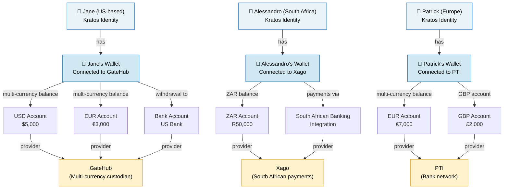
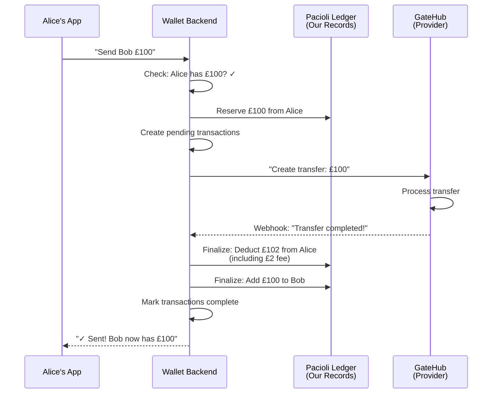
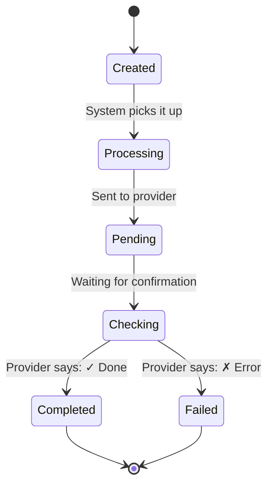
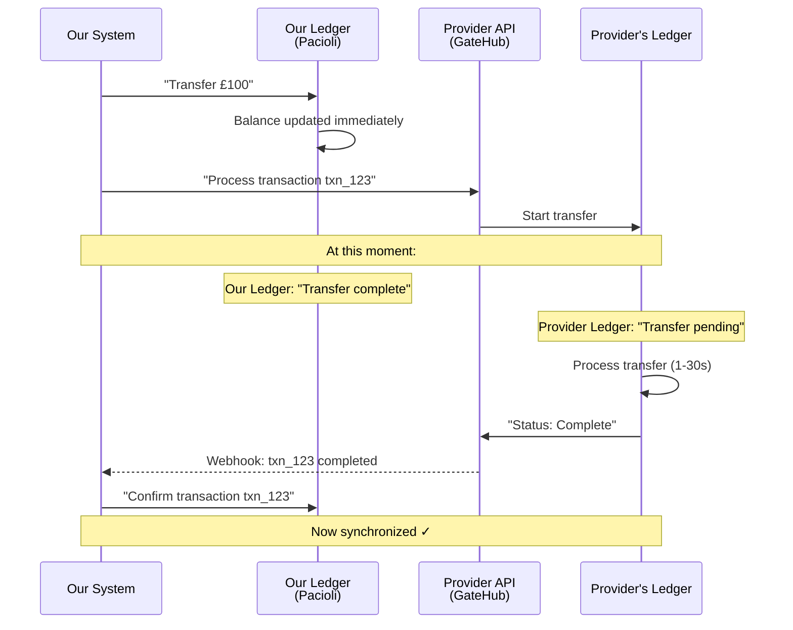
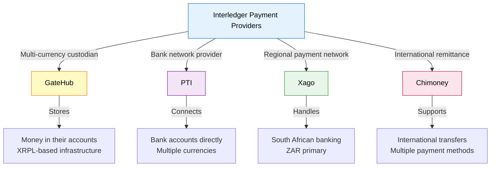
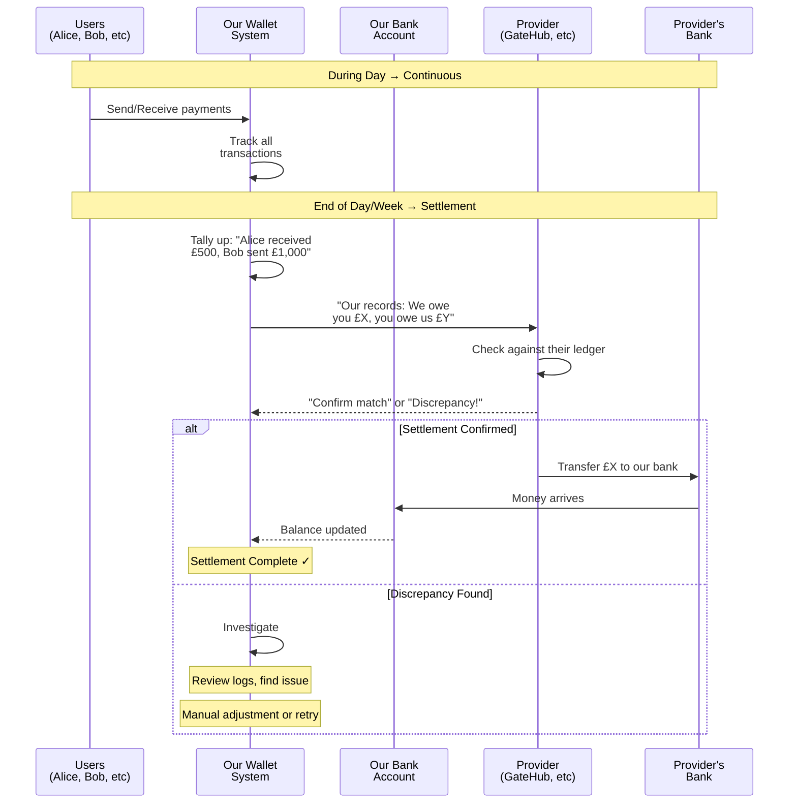
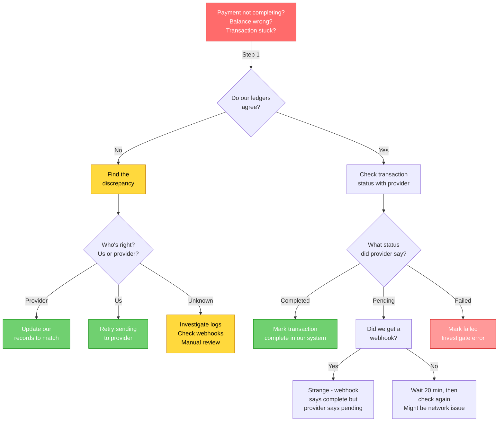

# Payments & Transactions: A Non-Technical Guide to the Interledger Wallet

> **Payments guide.** End-to-end explanation of how money moves through Interledger App.

**Related documents:**
- [Concepts](concepts.md) — Core terminology and provider translation
- [Wallets vs Accounts vs Addresses](wallets-vs-accounts-vs-addresses.md) — Wallet and linked-account architecture
- [Provider Payments Guide](provider-payments-guide.md) — Provider-specific payment behavior
- [Ledger System Architecture](ledger-system-explainer.md) — Why we run dual ledgers and reconciliation
- [Transaction Types Reference](transaction-types-explainer.md) — Transaction fields, states, and mappings
- [Payment Troubleshooting](payment-troubleshooting-guide.md) — Systematic payment debugging
- [KYC Explainer](kyc-explainer.md) — KYC gating and provider-specific verification paths

## Table of Contents
1. [The Big Picture](#the-big-picture)
2. [Wallets and Accounts](#wallets-and-accounts)
3. [The Payment Story](#the-payment-story)
4. [Understanding Transactions](#understanding-transactions)
5. [The Two Ledgers](#the-two-ledgers)
6. [Fees and Costs](#fees-and-costs)
7. [Provider Differences](#provider-differences)
8. [Settlement: Making It Real](#settlement-making-it-real)
9. [Troubleshooting Philosophy](#troubleshooting-philosophy)

---

## The Big Picture

The Interledger Wallet helps people manage their money across multiple providers and currencies. Think of it like a personal accountant who works with multiple banks on your behalf.

**The core problem we solve**: People want to move money between different financial systems (open payment networks, banks, card networks) without having to maintain separate accounts and logins at each one.

**The solution**: A wallet that:
- Holds your connection to multiple providers
- Tracks every transaction that happens
- Keeps its own records to ensure nothing gets lost
- Settles with providers regularly to match accounts

**Three core ideas behind the design:**
1. **Provider-agnostic orchestration** — one payment engine coordinates money movement across providers.
2. **Double-entry accounting** — Pacioli records every debit and credit to prevent loss or double-spend.
3. **Durable workflows** — Temporal orchestrates multi-step payments with retries and recovery.

---

## Wallets and Accounts

### Your Wallet = One Financial Identity (Per Provider)

In the Interledger system, you have **one wallet per user**. This wallet represents your financial identity and connects to **one payment provider**.



### What is a Linked Account?

Within your wallet, you can have multiple **Linked Accounts** across different currencies and account types — all connected to your **single provider**:

- **Balance account**: Money sitting with your provider (like a savings account)
- **Bank account**: Your real bank connected for deposits/withdrawals
- **Card account**: Your debit/credit card for payments
- **Interac account**: Canadian e-transfer account (if your provider is Chimoney)

Each linked account has:
- The account type (balance, bank, card, interac)
- A currency (USD, EUR, ZAR, etc.)
- A unique identifier at your provider (the `provider_id`)

**See [Wallets vs Accounts vs Addresses](wallets-vs-accounts-vs-addresses.md#system-model-one-wallet-many-linked-accounts) for detailed explanation of linked-account properties and provider-specific differences.**

### Multiple Accounts, Single Provider

Your wallet connects to **one payment provider** based on your location/needs:

- **In the US?** You connect to **GateHub** and hold USD, EUR, and other currencies within GateHub
- **In South Africa?** You connect to **Xago** and hold ZAR with integration to SA banking
- **In Europe?** You connect to **PTI** for bank transfers and multi-currency support
- **In Canada?** You might connect to **Chimoney** for Interac e-transfer support

**Cross-Provider Payments:** Even though each user connects to one provider, the Interledger network allows you to send money to users at different providers. Alice (using GateHub) can send to Alessandro (using Xago) through the open payments network.

Think of it like email: you pick one email provider (Gmail, Outlook, etc.), but you can still send messages to people using other providers.

---

## The Payment Story

Let's follow a real-world example to understand how payments work.

### Alice Sends Bob £100

**Setup:**
- Alice is a US-based user connected to GateHub with £4,500 in her GBP account
- Bob is also connected to GateHub (same provider) and has just signed up with no balance
- Both are users of the Interledger Wallet
- GateHub charges a 2% fee on peer-to-peer transfers

**Alice decides to send Bob £100 for a shared meal.**

*Note: Both users connect to the same provider (GateHub) for this example. Cross-provider payments work similarly, but are routed through the Interledger network with additional routing steps.*

#### Step 1: Alice Initiates the Payment

Alice opens the wallet app and clicks "Send Money."

```
Amount: £100
To: bob@example.com
```

**Note on addresses:** The email address (or wallet URL/payment pointer) is used for discovery — finding Bob's wallet. Behind the scenes, the actual money moves through [linked accounts](wallets-vs-accounts-vs-addresses.md#address-model-wallet-urls-vs-ilp-open-payments-addresses). The system resolves the email to Bob's wallet address and then selects appropriate linked accounts for settlement.

What happens:
- The wallet checks: "Does Alice have £100?"
- Yes ✓ (she has £4,500)
- The wallet records: "Alice intends to send Bob £100"
- Status: **Processing**

#### Step 2: Alice's Money is Reserved

The wallet doesn't immediately take the money. Instead, it **reserves** it.

Think of reservation like putting a hold on a hotel room:
- The room is no longer available to book
- But the payment hasn't actually been collected
- You could still cancel before checkout

In our system:
- Alice's balance shows: £4,500 - £100 = £4,400 (reserved, but not final)
- The money is locked in the **Pacioli ledger** (our internal accounting system)
- GateHub itself doesn't know about this yet

**About the dual-ledger system:** We maintain our own accounting records (Pacioli) separate from the provider's records. See [The Two Ledgers](#the-two-ledgers) below for a detailed explanation of why this matters.

#### Step 3: The System Creates a Transaction

Behind the scenes, the wallet creates two transactions:

1. **Alice's send transaction**: "Alice is sending £100"
2. **Bob's receive transaction**: "Bob is receiving £100"

Both start as **pending**.

```
Send Transaction (Alice)
├─ Amount: £100
├─ Status: Pending
├─ Target: Bob's account
└─ Fee: £2 (GateHub's 2% fee)

Receive Transaction (Bob)
├─ Amount: £100 (minus fee)
├─ Status: Pending
└─ From: Alice
```

#### Step 4: The System Tells GateHub

The system sends a message to GateHub:

```
"Create a transfer of £100 
from Alice's account to Bob's account"
```

GateHub responds with:
```
{
  "transaction_id": "txn_abc123",
  "amount": "100.00",
  "fee": "2.00",
  "status": "1" (pending)
}
```

#### Step 5: Wait for Completion (The Hidden Part)

Here's where it gets interesting. The transfer is pending at GateHub. But when will it complete?

The system uses **two mechanisms** to find out:

**A) Webhook (Fast Path - Normal Case)**
- GateHub sends a message: "Transfer completed!"
- The system receives it instantly
- Transactions are marked complete
- Takes 1-5 seconds

**B) Polling (Safety Net - Backup Case)**
- If 20 minutes pass without a webhook, the system checks manually
- "Hey GateHub, what's the status of transaction txn_abc123?"
- Ensures we never lose track of money

Most of the time, webhooks work fine. The polling is just insurance.

#### Step 6: Money Actually Moves

Once GateHub confirms completion:

1. **Alice's balance is finalized**
   - £4,500 → £4,400 (minus the £100 sent)
   - Wait, the fee! Let's calculate:
   - Amount sent: £100
   - Fee charged: £2 (2% of £100)
   - Total deducted: £102
   - New balance: £4,398

2. **Bob receives the money**
   - Bob's balance: £0 → £100 (he gets the full £100, fee was Alice's responsibility)
   - Bob gets a notification: "You received £100 from Alice"

3. **The transactions flip to completed**
   - Alice's send transaction: ✓ Completed
   - Bob's receive transaction: ✓ Completed

#### Step 7: Status is Completed

```
Send Transaction (Alice)
├─ Amount: £100
├─ Status: ✓ Completed
├─ Fee: £2
├─ Net deducted: £102
└─ Balance after: £4,398

Receive Transaction (Bob)
├─ Amount: £100
├─ Status: ✓ Completed
├─ Fee: £0 (receiver pays nothing)
└─ Balance after: £100
```

**Timeline visualization:**



---

## Understanding Transactions

### Payment vs Transaction (at a glance)

| | Payment | Transaction |
|---|---|---|
| **Represents** | Intent to move money | Ledger record of what happened to one wallet |
| **Visibility** | Internal orchestration lifecycle | User-facing history item |
| **Per transfer** | Usually one payment | Usually two transactions (`sent` + `received`) for P2P |
| **State focus** | Created → Confirmed → Processing → Completed/Failed | Pending → Completed/Failed/OnHold |
| **Primary fields** | Sender, receiver, amounts, FX, routing | Wallet owner, amount, provider, transfer details |

### What is a Transaction?

A **transaction** is a record of money movement. It's like a receipt.

**Every transaction has:**

| Field | Meaning | Example |
|-------|---------|---------|
| **ID** | Unique identifier | `txn_abc123` |
| **Type** | What kind of movement | Send, Receive, Deposit, Withdrawal, Card Payment |
| **Amount** | How much money | £100.00 |
| **Currency** | What currency | GBP |
| **Status** | Where it is in process | Pending, Completed, Failed |
| **Provider Fee** | Cost charged by the provider | £2.00 |
| **Provider ID** | ID at the provider's system | GateHub ID: `txn_gate_xyz` |
| **Timestamp** | When it happened | 2026-03-03 14:30:45 UTC |

### Why Track Both Send AND Receive?

You might wonder: if Alice sent £100 and Bob received £100, isn't that the same thing?

**No, and here's why:**

1. **Each person needs a record** of what happened to their balance
   - Alice's send transaction: "My balance went down by £102"
   - Bob's receive transaction: "My balance went up by £100"

2. **Fees might be different**
   - On a deposit from a bank: "You received £100, but the bank charged £2.50 fee, so your net was £97.50"
   - On a withdrawal to a bank: "You wanted £50 out, but the bank charged £1 fee, so we took £51 from your balance"

3. **Different providers track things differently**
   - Some providers track the fee separately
   - Some providers bake the fee into the amount
   - Our system normalizes everything to the same format

4. **Debugging and reconciliation**
   - When money goes missing, we can trace both sides
   - If Alice says she sent it but Bob says he didn't receive it, we have records from both

### Transaction States



---

## The Two Ledgers

This is one of the most important concepts to understand, and also one of the most confusing.

### The Setup

We have two separate record-keeping systems:

1. **Our Ledger** (Pacioli - internal accounting system)
   - We own the data
   - Immediately updated
   - Single source of truth for our business logic
   - Can be updated retroactively if needed

2. **Provider's Ledger** (GateHub, Xago, PTI, Chimoney)
   - They own the data
   - Updated when they confirm
   - Single source of truth for their system
   - We can't change it

### Why Have Two Ledgers?

**Scenario 1: Network Failure**

```
13:45 - Alice sends Bob £100
13:45:30 - Our system: Balance updated ✓
13:45:31 - Internet cuts out  🔌
13:47 - Internet comes back
13:48 - GateHub reply finally arrives: ✓ Confirmed
```

If we ONLY relied on the provider:
- When the internet cut, we wouldn't know if the payment succeeded
- Alice would see her balance unchanged from her perspective
- We'd have to wait for confirmation before telling Alice anything

If we ONLY relied on our ledger:
- We assume it worked and credit both accounts
- But then GateHub says the transfer failed (insufficient funds error he didn't know about)
- We'd have to reverse the transaction and lose consistency

**With both ledgers:**
- Our ledger is "optimistic" - we assume it works and update immediately
- Provider's ledger is "authoritative" - we constantly check against it
- When values differ, we reconcile

**Scenario 2: Provider System is Down**

```
14:00 - Alice's bank account is temporarily locked
14:00 - Alice tries to withdraw £200 via PTI
14:01 - Our ledger: "Withdrawal created, let me tell PTI"
14:02 - PTI responds: "Sorry, can't process. Account locked."
```

If we ONLY had the provider:
- Alice would see nothing for 1-2 minutes until PTI responds
- Bad user experience

With both ledgers:
- Alice's app shows "Withdrawal processing" immediately
- Behind the scenes, we handle the PTI failure gracefully
- We can retry or show her a helpful error message

**Scenario 3: Internal Transfers (Xago and Similar Providers)**

This is a unique case: some providers like Xago allow us to transfer money between subaccounts **without telling the provider**.

```
Alice and Bob are both Xago users in South Africa
Alice wants to send Bob money

Option A (Tell Xago):
├─ We ask Xago: "Transfer £100 from Alice to Bob"
├─ Xago processes it
├─ Xago confirms completion
└─ Everyone agrees on the balance

Option B (Internal Transfer):
├─ We check: "Alice and Bob both use Xago? ✓"
├─ Our Ledger: Deduct £100 from Alice, Add £100 to Bob ✓
├─ We DON'T tell Xago anything
├─ Xago's records remain unchanged
└─ But we know exactly who owns what
```

**Why would we do Option B?**
- **Speed**: Instant to users (no API call to Xago needed)
- **Cost**: No per-transaction fee from Xago
- **Resilience**: Works even if Xago's API is temporarily down
- **Simplicity**: Fewer external dependencies

**The catch**: We must maintain our own ledger accurately, because Xago's ledger won't reflect the transfer. If someone asks Xago "what's my balance?", Xago might give a different answer than we do—and our answer is the real one for our users.

This is why the internal ledger (Pacioli) is so critical: **for some transactions, it's the only record of what actually happened.**

With both ledgers:
- We can make fast, cheap internal transfers between our users
- But we must reconcile with Xago periodically to catch any discrepancies
- If Xago ever disagrees with us, we investigate why

**Scenario 4: Fast P2P Payments (GateHub and Future Optimization)**

GateHub transfers can take seconds to minutes to finalize. But from a user experience perspective, this feels slow.

Today (cautious approach):
```
Alice sends Bob £100 (GateHub)
├─ T=0s: Our Ledger updated, user sees "sending"
├─ T=0.5s: Message sent to GateHub
├─ T=1s: GateHub confirms (status: pending)
├─ T=20s: Webhook arrives: "Transfer complete!"
├─ T=20s: Bob's app notification arrives
└─ User experience: 20-second delay
```

Future (optimistic approach):
```
Alice sends Bob £100 (GateHub)
├─ T=0s: Our Ledger updated, user sees "sent"
├─ T=0.5s: Message sent to GateHub
├─ T=0.5s: Bob's app shows "received" (optimistic)
├─ T=1s: GateHub confirms (status: pending)
├─ Background: Verify with GateHub asynchronously
└─ User experience: near-instant to both parties
```

**The Risk Trade-off:**

With the optimistic approach, we're taking on financial risk:

```
Optimistic scenario:
├─ Alice sends Bob £100
├─ We immediately credit Bob in our ledger
├─ Bob sees £100 received and spends it
├─ T=5s: GateHub responds "Transfer failed: insufficient funds"
│
Problem:
├─ Our ledger says Bob has £100
├─ GateHub says he doesn't
├─ Bob already spent the money
└─ We have a real financial liability
```

**Why Take This Risk?**

Because the alternative is poor user experience. If we always wait for provider confirmation, payments feel slow. By using our ledger as a "financial buffer":

1. Users get near-instant feedback (great UX)
2. We handle the rare failure case gracefully (reversals, notifications)
3. We can afford this risk because most transactions succeed (99%+)
4. We maintain reconciliation to catch and fix any discrepancies

This is why the internal ledger is essential: **it lets us separate user experience (fast) from financial settlement (reliable) and bridge the gap carefully.**

With both ledgers:
- We can optimize for user experience by moving money in our ledger immediately
- We can manage risk by monitoring provider confirmation asynchronously
- If something goes wrong, we have a complete audit trail to fix it

### The Normal Flow

```
Time → Alice sends Bob £100
│
├─ Instant (0s)
│  └─ Our Ledger: Deduct £100 from Alice
│     (User sees immediate feedback)
│
├─ Near-instant (0.5-5 seconds)
│  ├─ Message sent to Provider: "Please confirm"
│  └─ Our Ledger: Mark as "Pending"
│
├─ Provider processes (backend, not visible to user)
│  └─ Provider Ledger: Transfer confirmed ✓
│
└─ Confirmation returns (1-30 seconds typical)
   ├─ Webhook arrives: "Transfer completed!"
   ├─ Our Ledger: Mark as "Completed" ✓
   └─ Bob's app: Notification "You received £100"
```

### When Ledgers Disagree



### What Reconciliation Means

Periodically (and when problems arise), we **reconcile** the ledgers:

1. **Pull data from provider**: "What's the status of all our transactions?"
2. **Compare with our records**: "Do we agree?"
3. **If different**:
   - If provider says "completed" and we say "pending" → We update ours to completed
   - If provider says "failed" and we say "completed" → ALERT! Something went wrong, investigate
   - If provider has transactions we don't know about → Create records locally

Example:

```
Provider says: "Transaction ABC is complete, balance is £4,398"
We say: "Transaction ABC is still pending, balance is £4,500"

Reconciliation action:
├─ Mark transaction ABC as complete ✓
├─ Update balance to £4,398 ✓
└─ Send notification to user if needed ✓
```

### Why This Matters for Settlement

(We'll cover settlement in detail later, but here's how it connects)

Settlement is the **reconciliation of MONEY**, not just data:

1. **Our ledger says**: "We have £50,000 owed to Alice, £30,000 owed to Bob"
   - This includes internal transfers (£5,000 transfer from Alice to Bob) that Xago doesn't know about
   - It also includes API calls to Xago that Xago definitely knows about
2. **Provider's ledger says**: "We have £79,500 on deposit from the Interledger organization"
   - This does NOT include our internal Alice-to-Bob transfer
   - It only reflects what Xago confirmed on their side
3. **Settlement**: "We need to verify these match and move real money if needed"
   - We reconcile: "Our internal transfers netted to $X movement, API transfers were $Y, so total provider balance should be $Z"
   - If provider agrees, we're good
   - If they disagree, we investigate which transfers weren't recorded by the provider

The ledgers have to **logically agree** before we can safely settle, even if they track different sets of transactions.

---

## Fees and Costs

### The Three Types of Fees

#### 1. Provider Fees (Per Transaction)

When transactions happen, providers take a small cut.

**Deposit Fee** (money coming in):
```
You receive £100 from outside
Provider charges 1.5% fee: £1.50
You actually get: £98.50
```

**Withdrawal Fee** (money going out):
```
You want to withdraw £100
Provider charges 2% fee: £2.00
Total deducted from balance: £102
You receive: £100 at your bank
```

**Who pays?**
- **Deposits**: The person receiving pays implicitly (gets less)
- **Withdrawals**: The person withdrawing pays explicitly (balance goes down more)
- **P2P Transfers**: Usually the sender pays (but Interledger absorbs this currently)

**Example with Alice and Bob:**

```
Alice sends Bob £100
├─ Provider fee: £2 (2% of £100)
├─ Alice's balance: -£102 (amount + fee)
└─ Bob's balance: +£100 (amount, no fee)
```

#### 2. Currency Conversion Fees (Cross-Currency Only)

*(Currently not supported in the system, but worth understanding)*

When converting between currencies:
```
Alice has USD, Bob receives GBP
├─ Exchange rate used: 1 USD = 0.79 GBP (might be real market rate or marked up)
├─ FX Fee: Usually 1-3% markup on the rate
└─ Example:
   Alice sends USD 100
   Market rate: 1 USD = 0.79 GBP = 79 GBP
   With 2% FX fee: 1 USD = 0.7742 GBP (worse rate for sender)
   Bob receives: 77.42 GBP
```

#### 3. Settlement Fees (Provider Account Level)

When we settle with the provider, they might charge:
- Monthly account fees
- Batch processing fees
- API usage fees

These are handled at the business/accounting level, not visible in individual transactions.

### How the System Handles Fees

**Fees come from the Provider's Response:**

When we create a transaction, GateHub tells us the fee:

```
Request: Create transfer of £100
Response: 
{
  "id": "txn_123",
  "amount": "100.00",
  "fee": "2.00",
  "total_amount": "100.00",
  "status": "pending"
}
```

Then we:
1. **Store the fee** in our transaction record
2. **Calculate the user's net impact**:
   - For deposits: credited amount = amount - fee
   - For withdrawals: debited amount = amount + fee
3. **Update balances accordingly**

**What the User Sees:**

In normal operation, the frontend shows "0.00" fees with a message:
> "For a limited time, the Interledger Wallet will absorb all fees."

But if we're testing locally or in production with real fees:
- Transaction list shows the actual fee
- Balance reflects the fee automatically
- User knows exactly what they paid

---

## Provider Differences

When you sign up for the Interledger Wallet, you choose **one payment provider** based on your location and needs. Different providers have different characteristics, speeds, and capabilities.

Different payment providers work differently. Here's how to think about the variations:

### Three Major Provider Types



### Comparison Table

| Aspect | GateHub | PTI | Xago | Chimoney |
|--------|---------|-----|------|----------|
| **Primary Use** | Holds multi-currency balances | Bank integration on/off ramps | South African payments | International remittance |
| **Account Model** | User account holds multiple currency vaults | Each transfer is separate | SubAccount per user | External IDs per user |
| **Transaction Types** | Deposit, Withdrawal, Hosted Transfer | Transfer, Card Payment | Transfer (limited) | Transfer, Interac |
| **Status Codes** | Numeric (1=pending, 100=complete, 3=failed) | String (PENDING, SETTLED, FAILED) | String (pending, completed, failed) | Varies by service |
| **Fee Structure** | Per-transaction deposit/withdrawal fees | Per-transaction fees | Per-transaction fees | Per-transfer fees |
| **KYC** | GateHub's KYC flow | Integrated into platform | Varies by method | External KYC typically |
| **Supported Currencies** | 20+ currencies | 10+ currencies | Limited (ZAR primary) | 20+ currencies |
| **Webhook Integration** | Strong (reliable webhooks) | Varies | Less reliable | Integration-dependent |
| **Settlement** | Continuous with user balance management | Periodic with batch settlement | Periodic | Periodic |

### GateHub: The Multi-Currency Custodian

**What it does:** Holds your money in multiple currencies like a bank.

**How it works:**
```
You have:
├─ USD 5,000 vault
├─ EUR 3,000 vault
└─ GBP 2,000 vault

You send someone £100
├─ GateHub checks GBP vault: Has £2,000? ✓
├─ GateHub transfers £100
├─ Creates transaction with status "pending"
├─ Webhook arrives: "Done!" (status: 100)
└─ Balance updated: GBP vault now £1,900
```

**Key traits:**
- Most reliable for webhooks
- Clear numeric status codes
- Fast completion (usually <5 seconds)

### PTI: The Bank Network

**What it does:** Connects directly to traditional banking systems.

**How it works:**
```
You want to withdraw £200 to your UK bank
├─ System creates withdrawal transaction at PTI
├─ PTI initiates bank transfer
├─ Status: PENDING (string, not number)
├─ Bank processes (might take 1-3 business days)
├─ PTI sends webhook: SETTLED
└─ Balance updated after bank clears
```

**Key traits:**
- Slower (bank transfer timing)
- String-based status codes
- Real money through actual banks
- Used for real on/off ramps

### Xago: Regional Payments

**What it does:** Dominates in South Africa, connects ZAR to banking system.

**How it works:**
```
South African user wants to pay another SA user
├─ Creates transfer via Xago ZAR account
├─ Xago processes through ZAR banking
├─ May route through EFT system
├─ Status eventually returns as "completed"
└─ Money arrives within SA banking timeline
```

**Key traits:**
- Regional specialist (South Africa)
- ZAR focus
- Integration with local banking system
- Different fee structures

### Chimoney: International Remittance

**What it does:** Connects to various international payment methods.

**How it works:**
```
You want to send money via Interac (Canada)
├─ Chimoney accepts request
├─ Routes to Interac network
├─ Recipient can pick up as e-transfer
├─ Status updated asynchronously
└─ Chimoney webhook: Payment processed
```

**Key traits:**
- Multiple payment methods per region
- Good for remittances
- Can be slower
- Flexible recipient options

### Why These Differences Matter

**For Operations:**
- If GateHub is down, we can still use PTI/Xago for other regions
- Different speed expectations (GateHub: seconds, PTI: hours/days)
- Different status code formats require provider-specific handling

**For Users:**
- Some providers are faster (GateHub)
- Some provide better rates (Xago in South Africa)
- Some offer multiple withdrawal methods (Chimoney)

**For Reconciliation:**
- Some providers are aggressive with webhooks (GateHub)
- Some need polling and retries (Xago, Chimoney)
- Some have unreliable network connections
- Our system handles all these variations

---

## Settlement: Making It Real

Now let's talk about the most important concept: **settlement**.

### What Settlement Is

Settlement is **reconciliation of real money** between us and the provider.

Think of it like a restaurant's end-of-day:

```
During the day:
├─ Server writes down orders on a notepad
├─ Customer takes credit card payment
├─ Server updates their balance
└─ But no money has actually moved to the restaurant's bank account

At end of day:
├─ Manager reviews all transactions
├─ Confirms all payments went through
├─ Submits batch to credit card processor
├─ Real money arrives in restaurant's bank account next day
└─ Restaurant's bank account now matches the notepad
```

Our system works the same way.

### The Settlement Process



### Why Settlement Matters

**Without Settlement:**

```
Tuesday morning:
├─ Our ledger says: Users have £100,000 total
├─ Provider's ledger says: We have £95,000 on deposit
├─ Difference: £5,000 MISSING
│
What happened?
├─ Option A: Our records are wrong
├─ Option B: Provider has a bug
├─ Option C: We're not tracking something
│
We don't know until we settle!
```

**With Settlement:**

```
Tuesday end-of-day:
├─ Our system: "We have released £100,000 in total to users"
├─ Provider: "We have received £100,000 from Interledger organization"
├─ Match: ✓ Perfect
│
Tomorrow:
└─ Interledger org pays provider's invoice
   (Actual legal/financial settlement)
```

### Real-World Settlement Example

Let's say the Interledger Wallet operates one week:

**What Users Did:**
```
Alice deposited:     $500
Bob deposited:       $300
Charlie withdrew:   -$200
Diana sent Alice:    $50
Eddie's card charged: $100 (fee: $2)
```

**Our System Calculates:**
```
Deposits received:    $800
Withdrawals given:   -$200
P2P transfers:        £50 (separate currency tracking)
Card fees earned:     $2
Total liability:      $602 (we owe this to the provider organization)
```

**Settlement:**
```
Weekly:
├─ Compare our ledger vs Provider ledger
├─ Both agree we have $602 worth of obligations
├─ Provider sends invoice to Interledger Foundation: $602
└─ Interledger closes out that week's accounting

Monthly:
├─ Tally all weekly settlements
├─ Pay consolidated invoice
└─ Provider confirms receipt
```

### Three Levels of Settlement

#### 1. **Data-Level Settlement** (Continuous)

```
Every few minutes:
├─ Check: "What transactions are pending with provider?"
├─ Compare: "Do our records match provider's records?"
├─ If different: Investigate and fix
└─ Ensures no money is lost in limbo
```

#### 2. **Financial-Level Settlement** (Daily/Weekly)

```
End of day:
├─ Tally: "How much did we send to users this week?"
├─ Tally: "How much did users send out this week?"
├─ Calculate: Net position to provider
├─ Generate: Invoice or reconciliation statement
└─ Ensures provider agrees on amounts
```

#### 3. **Cash-Level Settlement** (Monthly/Quarterly)

```
End of period:
├─ Provider sends invoice: "You owe us $X"
├─ Or we receive: "We owe you $Y"
├─ Interledger Foundation pays the invoice
├─ Actual money transfers between bank accounts
└─ Completes the full financial cycle
```

### What Settlement Is NOT

**❌ Settlement ≠ Closing an Account**
- Settlement happens while accounts stay open
- Users can keep transacting

**❌ Settlement ≠ Withdrawing User Money**
- Settlement is about our organization's money with provider
- User balances stay intact

**❌ Settlement ≠ End of Service**
- Settlement is regular business operation
- Not a one-time event

### Settlement at Scale

With thousands of users, settlement becomes critical:

```
If Interledger reaches:
├─ 5,000 users
├─ $10M total in user balances
├─ 50,000 transactions per day
│
Then we need:
├─ Automated reconciliation (hourly checks)
├─ Real-time discrepancy alerts
├─ Clear financial reporting
└─ Fast resolution procedures
```

### Provider-Specific Settlement

Different providers handle it differently:

**GateHub:**
- Continuous settlement model
- Real-time balance updates
- Monthly reconciliation statements
- Pay-for-what-you-use billing

**PTI:**
- Batch settlement
- Daily batch files
- Weekly payment due
- More traditional banking model

**Xago:**
- Daily settlement
- Nightly reconciliation
- Transfer by next business day
- South African banking rules

**Chimoney:**
- Per-transfer settlement (sometimes)
- Or weekly batch
- Depends on payment method
- International remittance timing

---

## Troubleshooting Philosophy

When something goes wrong, here's how to think about it systematically.

### The Debugging Framework



### Common Problems and Root Causes

#### Problem: "Account shows £100, but the balance calculation says it should be £150"

**Root Cause Checklist:**
1. ✓ Unprocessed deposits? (Check transaction status)
2. ✓ Failed withdrawal we didn't mark as failed? (Check provider)
3. ✓ Fee we didn't subtract? (Check transaction fee field)
4. ✓ Database synchronization lag? (Wait 30 seconds, check again)
5. ✓ Concurrent transaction? (Two payments at same time?)

#### Problem: "Payment appears stuck in 'Processing'"

**Root Cause Checklist:**
1. ✓ Webhook never arrived (network issue?)
2. ✓20-minute timer expires → manual poll
3. ✓ Provider never confirmed (ask provider support)
4. ✓ Our poll didn't find completion (timeout issue)
5. ✓ Money actually moved, but we didn't update (data sync bug)

#### Problem: "User says they sent money but recipient didn't receive"

**Investigation Steps:**
```
Step 1: Check Ledgers Agree
├─ Sender's debit: ✓ Confirmed?
└─ Recipient's credit: ? Missing?

Step 2: Check Transactions
├─ Send transaction: Status?
└─ Receive transaction: Was it created?

Step 3: Check Provider
├─ Ask Provider: "Did transfer succeed?"
├─ If yes: Create missing receive transaction
├─ If no: Create failed status record

Step 4: Check Webhooks
├─ Did webhook logs show receipt?
├─ If not: Might be network issue at provider
└─ Manual retry with support
```

#### Problem: "We show different balance than the provider"

**This is a settlement issue:**
```
1. Pull official balance from provider: $5,000
2. Calculate our expected balance: $4,876
3. Difference: $124

4. Investigate:
   ├─ Find transaction #45: $124 deposit
   ├─ Check: Did we credit the user? No!
   ├─ Root cause: Transaction webhook lost
   └─ Fix: Manually create receive transaction

5. Recheck: Now we show $5,000 ✓
```

---

## Further Reading

- **[GateHub Payments (Technical)](./gatehub-payments.md)** - Deep dive on payment flows for developers
- **[GateHub Transaction Fees (Technical)](./gatehub-transaction-fees.md)** - Fee implementation details
- **[Concepts Reference](../../interledger-app/docs/concepts.md)** - Provider terminology guide
- **[Wallet Architecture](../../interledger-app/docs/architecture.md)** - System design (if available)

---

*Last updated: March 3, 2026*  
*Audience: Engineering Managers, Operations Managers, Support Staff*  
*Questions? Contact the Payments Team*
