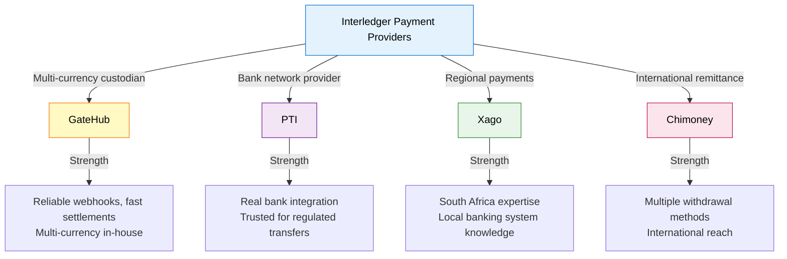

# Provider Payments Guide: Differences & Special Cases

**Audience:** Operations managers, integrators, support technical leads  
**Time to read:** 20-25 minutes

> **Provider comparison reference.** GateHub vs PTI vs Xago vs Chimoney — speeds, fees, capabilities, and special cases.

**Related documents:**
- [Payments Guide](payments-explainer.md) — Overview and navigation hub
- [Wallets vs Accounts vs Addresses](wallets-vs-accounts-vs-addresses.md) — Provider account shapes and routing model
- [Transaction Types Reference](transaction-types-explainer.md) — Transaction status codes per provider
- [Ledger System Architecture](ledger-system-explainer.md) — Settlement models per provider
- [Payment Troubleshooting](payment-troubleshooting-guide.md) — Provider-specific debugging
- [KYC Explainer](kyc-explainer.md) — Provider onboarding and verification differences
- [Concepts](concepts.md) — Provider terminology translation

**Quick Navigation:**
- **Which provider is fastest?** → See [Provider Comparison Matrix](#provider-comparison-matrix)
- **Fee breakdown?** → See [Fee Comparison](#fee-comparison)
- **GateHub details?** → See [GateHub Deep Dive](#gatehub-deep-dive)
- **PTI details?** → See [PTI Deep Dive](#pti-deep-dive)
- **Xago details?** → See [Xago Deep Dive](#xago-deep-dive)
- **Chimoney details?** → See [Chimoney Deep Dive](#chimoney-deep-dive)
- **Cross-provider payments?** → See [Special Cases](#special-cases)

---

## Quick Overview

Each payment provider has different APIs, speeds, fee structures, and capabilities. Understanding these differences is critical for troubleshooting and operations.



---

## Provider Comparison Matrix

| Aspect | GateHub | PTI | Xago | Chimoney |
|--------|---------|-----|------|----------|
| **Primary Use** | Multi-currency custodian | Bank on/off-ramps | South African payments | International remittance |
| **Default Geography** | Global (USD, EUR focus) | Europe (SEPA, UK focus) | South Africa (ZAR focus) | Africa, Asia (remittance routes) |
| **Account Model** | User account with currency vaults | Per-transfer, no persistent user account | SubAccount per user | External ID per protocol |
| **P2P Speed** | 1-5 seconds | 1-3 business days | Minutes to hours | 2-48 hours |
| **Deposit Speed** | Seconds (if balance account) | Hours to days | ZAR: Hours | 1-7 days |
| **Withdrawal Speed** | Seconds (internal) | Hours to days (ACH/SEPA) | Minutes to hours | 1-7 days (wire/local transfer) |
| **Status Codes** | Numeric (1, 100, 3) | String (PENDING, SETTLED, FAILED) | String (pending, completed, failed) | Varies by service |
| **Webhook Reliability** | Excellent | Good | Moderate | Variable |
| **Max Transaction** | Per-vault limit (typically $500k) | Per-transfer limit | Per-subaccount limit | Per-method limit |
| **Fees** | Per-transaction (0.5%-2%) | Per-transfer ($1-$20) | Per-transfer (fixed) | Per-service (0.5%-5%) |
| **Supported Currencies** | 20+ (XRP, USD, EUR, GBP, JPY, SGD, etc.) | 10+ (EUR, GBP, SEK, etc.) | Primary: ZAR | 50+ (via local methods) |
| **KYC Provider** | Internal (GateHub) | Integrated in PTI | External (Persona) | External/Internal |
| **Internal Transfers** | No (always ask GateHub) | No (always initiate transfer) | **Yes** (fast, no fee) | No |
| **Card Issuing** | Yes (EUR debit cards) | Yes | No | No |
| **Settlement Model** | Continuous | Batch (daily) | Daily | Per-transfer or weekly |

---

## GateHub: The Multi-Currency Custodian

### Overview

**What it does:** Holds user money in multiple currency vaults — acts like an online bank.

**Best for:** Users who want to hold multiple currencies, fast P2P, card payments.

**Geographic focus:** Global (but strong in US, EU).

### Account Structure

```
One GateHub account (per user) contains:
├─ USD vault (example: $5,000)
├─ EUR vault (example: €3,000)
├─ GBP vault (example: £2,000)
├─ JPY vault (example: ¥500,000)
└─ ... and other currencies
```

Each vault is independent. Moving money between vaults requires an FX conversion (not currently supported in Interledger Wallet).

### P2P Payment Flow

```
Alice (has GBP) sends Bob (has GBP) £100:

Alice's perspective:
├─ Step 1: Click "Send Bob £100"
├─ Step 2: System checks: "Alice has £100 in GBP vault? ✓"
├─ Step 3: GateHub transfers £100 from Alice vault to Bob vault
├─ Step 4: Webhook: "Transfer completed" within 1-5 seconds
└─ Step 5: Both see balance updates

Bob's perspective:
├─ Notification arrives within 1-5 seconds
└─ Balance shows £100 addition
```

### Webhook Implementation

GateHub webhooks are **highly reliable**:

```
When transaction completes at GateHub:
├─ GateHub generates webhook payload
├─ Sends to our registered webhook URL
├─ Waits for 200 OK response
├─ Retries 5 times (exponential backoff) if no response
└─ Usually arrives within 1-2 seconds
```

### Fees

```
GateHub fee structure:
├─ Deposits: 0.5% - 2% (varies by payment method)
├─ Withdrawals: Fixed fee (e.g., $1-$5) + FX margin
├─ P2P Transfers: 2% (configurable by Interledger)
├─ Card Payments: Interchange + network fees (absorbed by Interledger currently)
└─ Monthly account: $0 (free to manage)
```

Fee is returned in GateHub response:

```json
{
  "id": "txn_abc123",
  "amount": "100.00",
  "fee": "2.00",
  "total_amount": "100.00",
  "status": 1
}
```

### Status Codes

GateHub uses numeric codes (unusual among modern APIs):

| Code | Meaning | Finality |
|------|---------|----------|
| `1` | Pending | Not final — may change |
| `100` | Completed | **Final** — money moved |
| `3` | Failed | **Final** — rejection |

**Issue:** Status `100` is not official REST convention (usually `200` for HTTP). Be careful not to confuse.

### Limitations

1. **No Internal Transfers:** All transactions must go through GateHub's system
   - Slower than Xago's internal model
   - Costs money (fee charged each time)

2. **Currency Vault Model**
   - Currencies are separate buckets, not merged
   - Can't directly pay someone in a currency you don't have
   - Requires FX conversion (not supported yet in Wallet)

3. **Card Issuing Constraints**
   - Cards only EUR-denominated
   - Limited to 20 cards per customer
   - Requires additional KYC documentation

---

## PTI: The Bank Network Provider

### Overview

**What it does:** Connects directly to bank networks (ACH, SEPA, wire transfers).

**Best for:** Users who want real bank-account on/off-ramps, regulated transfers, European payments.

**Geographic focus:** Europe (SEPA), UK (faster payments), North America (ACH).

### Account Structure

```
PTI user account (persistent):
├─ One or more linked bank accounts
├─ One or more currency balances
├─ Card if issued (optional)
└─ Transaction history
```

Unlike GateHub, PTI keeps a persistent user account. No separate vaults — just one balance per currency.

### P2P Payment Flow

```
Alice (PTI, EUR) sends Bob (PTI, EUR) €50:

Timeline:
├─ T+0: Alice initiates transfer
├─ T+0.5s: PTI receives request
├─ T+2s: PTI creates transaction (status: PENDING)
├─ T+3s: PTI sends webhook: status = PENDING
├─ T+10s-2m: Bank network processes (SEPA, ACH, etc.)
├─ T+2m-24h: Funds settle (depends on rail)
├─ T+settlement: PTI webhook: status = SETTLED
└─ Final: Bob sees balance increase
```

### Withdrawal to Real Bank Account

```
Charlie (PTI) withdraws €100 to his bank account:

├─ T+0: Charlie clicks "Withdraw"
├─ T+0.5s: PTI initiates ACH/SEPA transfer
├─ T+2s: Webhook: status = PENDING
├─ T+1h-3d: Bank processes (depends on method)
└─ T+final: Charlie's bank shows €100
```

**Key difference:** The money actually leaves the Interledger system and goes to Charlie's real bank. No middleman.

### Status Codes

PTI uses human-readable strings (more standard):

| Code | Meaning | Finality |
|------|---------|----------|
| `PENDING` | Submitted to bank network | Not final |
| `SETTLED` | Bank confirmed completion | **Final** |
| `FAILED` | Bank rejected transfer | **Final** |

### Webhook Implementation

PTI webhooks are reliable but sometimes delayed:

```
Normal case:
├─ T+0: Transfer confirmed
├─ T+2-5s: Webhook arrives

Slow case:
├─ T+0: Transfer confirmed
├─ T+30s: Still waiting for webhook...
├─ T+20m: Manual poll by Interledger system
└─ Manual update from polling result
```

### Fees

```
PTI fee structure:
├─ SEPA transfer: €0.50 - €1.50
├─ UK faster payment: £0.50 - £1.00
├─ ACH (US): $0.25 - $1.00
├─ Wire transfer: $10 - $30
└─ Monthly account: €5 - €10
```

Fees are sent in response:

```json
{
  "transfer_id": "ptr_xyz789",
  "amount": "100.00",
  "fee": "1.00",
  "status": "PENDING"
}
```

### Special Cases

**Bank Account Verification**

When a user links a new bank account, PTI requires verification:

```
Day 1: User provides bank account info
  └─ Status: UNVERIFIED

Day 2: PTI sends micro-deposits (€0.01, €0.02)
  └─ Status: PENDING_VERIFICATION

Day 5: User confirms amounts received
  └─ Status: VERIFIED

Day 6: User can now withdraw
```

**VAT/Tax Compliance**

PTI requires VAT ID for certain accounts:

```
Company transferring > €10,000/month:
  ├─ Must provide VAT ID
  ├─ PTI validates with tax authority
  └─ Then transfers allowed (slower verification)
```

### Limitations

1. **Slow Settlements:** Bank timings mean 1-3 business days for on/off-ramps
2. **Complex Verification:** Harder KYC, bank account verification required
3. **No Same-Day P2P:** Even PTI-to-PTI transfers take hours

---

## Xago: Regional Payments Specialist

### Overview

**What it does:** Dominates South African payments, connects ZAR to SA banking system.

**Best for:** Users in South Africa, ZAR transactions, fast regional transfers.

**Geographic focus:** South Africa (ZAR primary), partial support for other currencies.

### Account Structure

```
One Xago SubAccount per user, containing:
├─ ZAR balance (primary currency)
├─ One or more linked bank accounts
├─ Transaction history
└─ KYC status
```

Simpler than GateHub (no multiple vaults), more integrated than PTI (banks linked directly).

### P2P Payment Flow

```
Alice (Xago, ZAR) sends Bob (Xago, ZAR) R1,000:

OPTION A: External transfer (tell Xago)
├─ T+0: Alice initiates
├─ T+1s: Xago API called
├─ T+5s: Xago processes transfer
├─ T+10s: Webhook arrives
├─ T+15s: Both see balances update
└─ Total: 15 seconds

OPTION B: Internal transfer (Interledger magic)
├─ T+0: Alice initiates
├─ T+0.2s: Our Pacioli ledger updates
│         (Alice -R1,000, Bob +R1,000)
├─ T+0.3s: User sees "money sent"
├─ T+5m: Async - we notify Xago (optional)
└─ Total: 0.3 seconds (Xago doesn't know)

Interledger uses OPTION B when possible!
```

**Internal transfers are a unique Xago feature.** See [Ledger System Architecture](ledger-system-explainer.md#scenario-3-internal-transfers-xagoesame-provider-case) for details.

### Withdrawal to ZAR Bank Account

```
Charlie (Xago) withdraws R500 to his bank:

├─ T+0: Charlie clicks "Withdraw"
├─ T+5s: Xago initiates ZAR transfer
├─ T+10s: Webhook: status = pending
├─ T+30min: Bank receives (South African banking is fast)
├─ T+40min: Webhook: status = completed
└─ Final: Charlie's bank shows R500
```

Xago withdrawals are faster than PTI/international because they're within SA banking system.

### Status Codes

Xago uses string codes aligned with banking standards:

| Code | Meaning | Finality |
|------|---------|----------|
| `pending` | Submitted to ZAR system | Not final |
| `completed` | ZAR banking confirmed | **Final** |
| `failed` | ZAR system rejected | **Final** |
| `cancelled` | User or system cancelled | **Final** |

### Webhook Implementation

Xago webhooks are less reliable than GateHub but more reliable than Chimoney:

```
Expected:
├─ T+5-10s: Webhook arrives
└─ Interledger updates transaction

Slow path:
├─ T+30s: No webhook
├─ T+35s: Manual poll
├─ T+40s: Get status from Xago API
└─ Update transaction based on polling result
```

### Fees

```
Xago fee structure:
├─ P2P Xago-to-Xago: R0 (free, internal transfer)
├─ ZAR bank deposit: R5-R10
├─ ZAR bank withdrawal: R10-R20
├─ Cross-border outbound: 1-2%
└─ Monthly account: Free
```

Fees usually not in transaction response — calculated separately.

### Internal Transfers Deep Dive

When both users use Xago, we can skip asking Xago and just update our ledger:

```
Why do this?
├─ Speed: Instant vs seconds
├─ Cost: R0 vs R5-R10 fee
├─ Reliability: Doesn't depend on Xago API
└─ User experience: Immediate feedback

How we track it:
├─ Pacioli ledger: Shows transfer immediately
├─ Xago's ledger: Doesn't know about it
├─ Discrepancy: Expected and managed

When we reconcile:
├─ Pull Xago balance: R10,000 (no internal transfers recorded)
├─ Calculate our balance: R9,000 (includes internal transfer)
├─ Difference: R1,000 (our internal transfer)
├─ Assessment: "Expected, internal transfers in flight"
└─ Action: None, continue operating
```

### Special Feature: EFT Integration

Xago connects directly to South African EFT (Electronic Fund Transfer) system:

```
Alice sends Bob via Xago:
├─ If Bob's bank is EFT-enabled: Instant
├─ If Bob's bank is legacy: 24 hours
├─ Xago handles routing automatically
└─ Alice doesn't need to know which bank Bob uses
```

### Limitations

1. **ZAR-Centric:** Other currencies have limited support
2. **South Africa Only:** Integration is ZAR-focused, limited elsewhere
3. **Less Reliable Webhooks:** Sometimes need polling
4. **KYC Complexity:** South Africa has strict requirements (Persona involvement)

---

## Chimoney: International Remittance

### Overview

**What it does:** Connects to various international payment methods for remittances and transfers.

**Best for:** Users sending/receiving money internationally, workers sending remittances, international transfers.

**Geographic focus:** Broad (Africa, Asia, Latin America remittance routes).

### Account Structure

```
Chimoney user account contains:
├─ Balance for each payment method (wallet, mobile money, bank)
├─ Multiple linked beneficiary accounts (bank, mobile, etc.)
└─ Transaction history per method
```

More complex than others — each payment method is semi-independent.

### P2P Payment Flow

```
Alice (Chimoney, user in UK) sends Bob (Chimoney, user in Ghana):

Selection:
├─ Alice chooses payment method: "Interac" (if Canadian) or
│  "Bank Transfer" or "Mobile Money"
└─ Bob specifies receipt method: "GHS bank" or "MTN mobile"

Transfer:
├─ T+0: Request sent to Chimoney
├─ T+1-5s: Chimoney confirms (status: pending)
├─ T+1h-24h: Route through payment method
├─ T+final: Bob receives in chosen method
└─ Webhooks: Usually delayed 2-5 hours
```

### Withdrawal Methods

Chimoney supports multiple withdrawal routes:

```
A user can withdraw to:
├─ Local bank account (varies by country)
├─ Mobile money (MTN, Airtel, Vodafone, etc.)
├─ Cash pickup (Western Union partner locations)
├─ PayPal account
├─ Bitcoin wallet
└─ Interac e-Transfer (Canada)
```

Each has different timelines and fees:

| Method | Speed | Fee | Availability |
|--------|-------|-----|--------------|
| Local Bank | 1-3 days | 1-2% | Most countries |
| Mobile Money | 30 min | $1-$3 | Africa-focused |
| Cash Pickup | Immediate | 2-5% | Major cities only |
| PayPal | 1 day | 2% | Global |
| Bitcoin | 10-60 min | 1% | Global |
| Interac | 1 hour | 2% | Canada only |

### Status Codes

Chimoney varies status codes by protocol:

| Service | Pending | Complete | Failed |
|---------|---------|----------|--------|
| Bank Transfer | `PENDING` | `COMPLETED` | `FAILED` |
| Mobile Money | `IN_TRANSIT` | `DELIVERED` | `REJECTED` |
| Cash Pickup | `READY_FOR_PICKUP` | `PICKED_UP` | `EXPIRED` |

We normalize all to: `pending`, `completed`, `failed`

### Webhook Implementation

Chimoney webhooks are **delayed and less reliable**:

```
Expected:
├─ T+0: Transfer initiated
├─ T+2-5h: Webhook arrives (delayed!)
└─ Interledger updates

Slow path:
├─ T+0: Transfer initiated
├─ T+5h: No webhook
├─ T+6h: Manual poll
├─ T+6.5h: Get status from Chimoney
└─ Update transaction

Very slow path:
├─ T+24h+: Webhook still not arrived
├─ T+24.5h: Manual poll
├─ T+25h: Chimoney says "still in transit"
└─ Check again tomorrow
```

### Fees

```
Chimoney fee structure:
├─ Per-transfer: 0.5% - 2%
├─ Method-specific: +1-2% (mobile premium, cash pickup, etc.)
├─ Monthly account: Free
└─ Example: Send £100 → Fee: £2 (2%) + method fee
```

### Interac Integration (Canada Specific)

Chimoney has special support for Interac e-Transfers to Canada:

```
User in Canada receives money:
├─ Alice sends via Chimoney
├─ Alice chooses: "Interac e-Transfer"
├─ Chimoney initiates e-Transfer to Bob's email
├─ Bob receives email with claim code
├─ Bob clicks, claims money, money hits his bank in 1 hour
└─ Total time: 2-5 hours
```

### Limitations

1. **Slow Webhooks:** 2-5 hour delay is norm, not exception
2. **Variable Timing:** Depends heavily on payment method
3. **Geographic Variance:** Services vary by country
4. **Complex Fee Structure:** Multiple layers of fees depending on method
5. **Less Popular for P2P:** Better for remittances than casual transfers

---

## Fee Comparison Summary

### P2P Transfers (Same Currency, Same Provider)

| Provider | Fee | Speed |
|----------|-----|-------|
| GateHub | 2% | 1-5 sec |
| PTI | €0.50-€1.50 | 1-3 days |
| Xago | R0 (internal) | 0.3 sec |
| Chimoney | 1-2%+ method | 2-24 hours |

**Winner for P2P:** Xago (internal transfers) or GateHub (speed)

### Deposits from Bank Account

| Provider | Fee | Speed |
|----------|-----|-------|
| GateHub | 0.5-2% | Seconds |
| PTI | €0.50-€1.00 | 1-3 days |
| Xago | R5-R10 | 30 min - 2 hours |
| Chimoney | 0.5-2%+ method | 1-7 days |

**Winner for Deposits:** GateHub (if account funded), Xago (if in SA)

### Withdrawals to Bank Account

| Provider | Fee | Speed |
|----------|-----|-------|
| GateHub | $1-$5 + FX margin | Seconds |
| PTI | €1-€50 (wire) | 1-3 days |
| Xago | R10-R20 | 30 min |
| Chimoney | 1-2%+ method | 1-7 days |

**Winner for Withdrawals:** Xago (if in SA), GateHub (if fast needed)

---

## Special Cases & Workarounds

### Cross-Provider Payments

When Alice (GateHub) sends money to Bob (Xago):

```
Alice (GateHub) --→ Interledger Network --→ Bob (Xago)

Process:
├─ Alice initiates P2P to Bob
├─ System detects different providers
├─ Routes through Interledger Protocol / Open Payments
├─ GateHub deducts from Alice
├─ Xago credits Bob
└─ Both providers settle with Interledger

Timing:
├─ Alice sees: 1-5 sec (GateHub speed)
├─ Bob sees: 5-10 sec (routing + Xago speed)
```

### Hosted Transfers (Limited)

Some providers support "hosted payout pages" — redirect user to provider's payment form:

```
Alice wants to send to external account (not Interledger user):
├─ System recognizes recipient is external
├─ Generates "hosted transfer" link
├─ Alice redirected to GateHub payment form
├─ Alice enters amount, confirms
├─ GateHub handles everything (fee, status)
└─ Interledger tracks outcome via webhook
```

**Current support:** Mainly GateHub and PTI. Xago/Chimoney: limited.

### Card Payments

Only GateHub and PTI issue cards (Interledger Wallet has Debit Cards via GateHub):

```
Card Payment Flow:
├─ User swipes/taps card at merchant
├─ Merchant's payment processor contacts GateHub
├─ GateHub checks card limits, fraud, etc.
├─ GateHub deducts from user's balance
├─ GateHub pays merchant via payment network (Visa/Mastercard)
└─ Webhook: Card transaction posted
```

See [GateHub Cards Explainer](gatehub-cards-explainer.md) for full details.

---

## Choosing the Right Provider

### User is in the US?
→ **GateHub** (fast, multi-currency, card support)

### User is in Europe?
→ **PTI** (real bank integration) OR **GateHub** (if they want speed/multi-currency)

### User is in South Africa?
→ **Xago** (ZAR specialist, fastest local transfers)

### User is in Africa/Asia sending remittances?
→ **Chimoney** (broad international reach, many withdrawal methods)

### User wants card payments?
→ **GateHub** (only provider with card issuing)

### User wants multi-provider flexibility?
→ All supported via Interledger Protocol routing

---

## See Also

- [Payments & Transactions Guide](payments-explainer.md) — Overview and navigation hub
- [Ledger System Architecture](ledger-system-explainer.md) — How transactions are recorded and reconciled
- [Transaction Types Reference](transaction-types-explainer.md) — Transaction fields and statuses
- [Payment Troubleshooting Guide](payment-troubleshooting-guide.md) — Debugging provider-specific issues
- [GateHub Cards Explainer](gatehub-cards-explainer.md) — Detailed card issuing documentation
- [Concepts Reference](concepts.md) — Provider terminology mapping

---

*Last updated: March 3, 2026*  
*Audience: Operations managers, Integrators, Technical leads*
