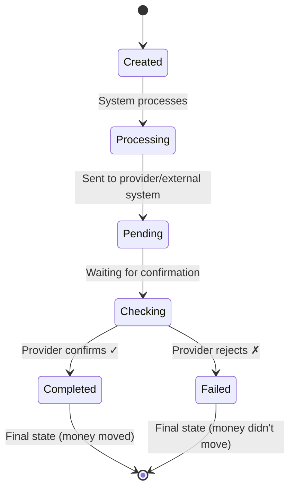

# Transaction Types & Fields Reference

**Audience:** Support staff, operations, developers integrating with payment APIs  
**Time to read:** 10 minutes

> **Transaction field specifications.** Complete reference for transaction structure, types, and provider mappings.

**Related documents:**
- [Payments Guide](payments-explainer.md) — Overview and navigation hub
- [Wallets vs Accounts vs Addresses](wallets-vs-accounts-vs-addresses.md) — How linked accounts shape transaction creation
- [Ledger System Architecture](ledger-system-explainer.md) — How transactions update ledgers
- [Provider Payments Guide](provider-payments-guide.md) — Provider-specific transaction behavior
- [Payment Troubleshooting](payment-troubleshooting-guide.md) — Debugging transaction issues
- [Concepts](concepts.md) — Core terminology (transaction vs payment)

**Quick Navigation:**
- **What fields does a transaction have?** → See [Core Transaction Fields](#core-transaction-fields)
- **Transaction types?** → See [Transaction Types](#transaction-types)
- **Lifecycle states?** → See [Transaction Lifecycle](#transaction-lifecycle)
- **Why two-sided transactions?** → See [Why Track Both Sides](#why-do-we-create-both-send-and-receive-transactions)
- **Provider field mappings?** → See [Provider-Specific Field Mappings](#provider-specific-transaction-field-mappings)

---

## What is a Transaction?

A **transaction** is a record of money movement. It's like a receipt — it documents what happened, when, how much, and whether it succeeded.

Every financial action (deposit, withdrawal, payment, card charge) creates one or more transactions in our system.

---

## Core Transaction Fields

Every transaction has these fields:

| Field | Type | Example | Meaning |
|-------|------|---------|---------|
| **ID** | UUID | `txn_550e8400-e29b-41d4-a716-446655440000` | Unique identifier in our system |
| **Type** | Enum | `send`, `receive`, `deposit`, `withdrawal`, `card_payment` | What kind of movement is this? |
| **Status** | Enum | `created`, `processing`, `pending`, `completed`, `failed` | Where is it in the lifecycle? |
| **Amount** | Decimal | `100.00` | How much money? |
| **Currency** | Code | `GBP`, `USD`, `EUR`, `ZAR` | What currency? |
| **User ID** | UUID | `user_550e8400-e29b-41d4-a716-446655440001` | Which user is affected? |
| **Linked Account ID** | UUID | `acct_550e8400-e29b-41d4-a716-446655440002` | Which linked account? |
| **Provider ID** | String | `txn_gate_abc123` | ID at the provider (GateHub, PTI, etc.) |
| **Provider Fee** | Decimal | `2.00` | What did the provider charge? |
| **Timestamp** | ISO-8601 | `2026-03-03T14:30:45Z` | When did it happen (provider's time)? |
| **Created At** | ISO-8601 | `2026-03-03T14:30:40Z` | When did we record it? |
| **Related Transaction ID** | UUID | `txn_550e8400-e29b-41d4-a716-446655440003` | For two-sided transactions (send ↔ receive), which is the counterpart? |
| **Payment ID** | UUID | `pay_550e8400-e29b-41d4-a716-446655440004` | If this transaction came from a payment, which payment? |
| **Notes** | String | `Withdrawal to US Bank account` | Additional context |

---

## Transaction Types

### Send (`send`)

**What it means:** User is sending money out.

**Who gets it:** The sender

**When it's created:**
- When user initiates P2P payment to another user
- When user initiates hosted transfer to external service
- When user creates withdrawal to bank account

**Balance impact:**
- Sender's balance: **decreases** by `amount + fees`
- Receiver's balance: **increases** by `amount` (no fee on receiver side for P2P)

**Example:**
```
Alice sends Bob £100 (GateHub charges £2 fee)

Alice's transaction:
├─ Type: send
├─ Amount: £100
├─ Fee: £2
├─ Net impact: -£102

Bob's transaction:
├─ Type: receive
├─ Amount: £100
├─ Fee: £0 (receiver doesn't pay)
├─ Net impact: +£100
```

---

### Receive (`receive`)

**What it means:** User is receiving money in.

**Who gets it:** The receiver

**When it's created:**
- When another user sends money to this user
- When external deposit arrives
- When payment pointer receives funds

**Balance impact:**
- Receiver's balance: **increases** by `amount` (minus any receiver-side fees if applicable)
- Sender handled separately

**Example:**
```
Charlie receives £1,000 from external source

Charlie's transaction:
├─ Type: receive
├─ Amount: £1,000
├─ Fee: £0 (bank may have charged, but it's already deducted)
├─ Net impact: +£1,000
```

---

### Deposit (`deposit`)

**What it means:** Money entering the wallet from external source (bank, card, etc.)

**Who gets it:** The user depositing

**When it's created:**
- When user adds money from their bank account
- When user loads wallet via credit/debit card
- When external transfer arrives

**Balance impact:**
- User's balance: **increases** by `amount - fee`
- Provider/bank may charge deposit fee, subtracted before user receives it

**Fee note:**
- Bank/provider deposits often come with fees
- On deposits, **receiver pays implicitly** (shows as reduced amount)
- Example: "Deposit £1,000 with £2.50 fee" → User gets £997.50

**Example:**
```
Diana deposits £500 from her bank (bank charge: £1)

Diana's transaction:
├─ Type: deposit
├─ Amount: £500 (original requested)
├─ Provider Fee: £1 (her bank charged this)
├─ Net impact: +£499 (what actually hits her balance)
```

---

### Withdrawal (`withdrawal`)

**What it means:** Money leaving the wallet to external destination (bank, cash pickup, etc.)

**Who does it:** The user withdrawing

**When it's created:**
- When user requests money out to their bank
- When user requests ATM withdrawal
- When user cashes out to external account

**Balance impact:**
- User's balance: **decreases** by `amount + fee`
- Provider/bank charges withdrawal fee, **paid by the user** (explicit)

**Fee note:**
- On withdrawals, **sender pays explicitly**
- Example: "Withdraw £100 with £1.50 fee" → System debits £101.50, pays out £100
- User sees -£101.50 in balance, recipient sees £100

**Example:**
```
Edward withdraws £200 to his bank (bank charge: £1.50)

Edward's transaction:
├─ Type: withdrawal
├─ Amount: £200 (requested amount)
├─ Fee: £1.50 (bank charged this)
├─ Net impact: -£201.50 (what hits his balance)
├─ Recipient sees: £200 (the net)
```

---

### Card Payment (`card_payment`)

**What it means:** Charge to a card connected to the wallet.

**Who does it:** The card owner (user)

**When it's created:**
- When user swipes card at merchant
- When user taps card contactless
- When card is charged online
- When card ATM withdrawal happens (sometimes categorized separately)

**Balance impact:**
- Card account balance: **decreases** by `amount + fees`
- Funds deducted from associated wallet balance

**Fee note:**
- Card fees vary: interchange, network fees, FX markups
- Shown separately from purchase amount

**Example:**
```
Frank uses his Interledger card at a coffee shop

Frank's transaction:
├─ Type: card_payment
├─ Amount: £5.50 (coffee purchase)
├─ Merchant: "StarBrew Coffee"
├─ Fee: £0 (no card fee, absorbed by Interledger)
├─ Net impact: -£5.50
```

---

### Other Transaction Types (Less Common)

| Type | Meaning | When |
|------|---------|------|
| `refund` | Money returned after cancellation | After payment cancelled |
| `reversal` | Transaction undone | Provider error correction |
| `chargeback` | Card dispute | Card fraud/error claim |
| `web_monetization` | Payment pointer micropayment | WM protocol enabled |
| `internal_transfer` | Xago-style internal move | Same-provider P2P |

---

## Transaction Lifecycle

All transactions progress through these states:



### State Definitions

**Created**
- Just created in our system
- Haven't sent to provider yet
- Usually lasts <1 second

**Processing**
- Being prepared for submission
- Validation checks running
- Building provider request
- Usually lasts <2 seconds

**Pending**
- Sent to provider
- Awaiting confirmation
- Money NOT yet confirmed moved
- **Expected duration: 1 second to 20 minutes** (provider-dependent)

**Checking**
- We've sent the request
- Provider usually responds within 20 minutes
- If they don't respond, we manually poll
- Rare state, usually just a transitional moment

**Completed** ✓
- Provider confirmed transaction succeeded
- Money actually moved
- Balance changes finalized
- **Terminal state** — cannot change

**Failed** ✗
- Provider rejected the transaction
- Money did NOT move
- May have an error message from provider
- **Terminal state** — cannot change

---

## Why Do We Create BOTH Send AND Receive Transactions?

When Alice sends Bob money, we create **two separate transactions**:

1. Alice's send transaction
2. Bob's receive transaction

This might seem redundant, but it's essential:

### Reason 1: Each Person Needs a Record

```
Alice's send transaction shows:
├─ -£102 impact on her balance
├─ Includes the £2 fee she paid
└─ "I sent Bob money"

Bob's receive transaction shows:
├─ +£100 impact on his balance
├─ No fee (he didn't pay)
└─ "I received money from Alice"
```

### Reason 2: Fees May Differ

```
Example: Withdrawal to bank

System sends Bob £100 to his bank
├─ Bob's receive: +£100 (from provider perspective)
├─ But bank subtracted £2 fee
├─ So Bob's bank account gets £98

Our side:
├─ Withdrawal transaction: -£100 (what we sent)
├─ Provider fee transaction: -£2 (what bank charged)
├─ Bob sees: Both impacts on his balance
```

### Reason 3: Debugging

When something goes wrong:

```
Support ticket: "I sent money but recipient says they didn't get it"

Investigation:
├─ Check Alice's send transaction: Status = completed ✓
├─ Check Bob's receive transaction: Status = ??? (missing!)
├─ Root cause found: Bob's transaction wasn't created
├─ Fix: Create Bob's transaction manually, credit his balance
```

### Reason 4: Provider Confirmation

Providers may confirm send and receive at different times:

```
Timeline:
├─ T+0.1s: GateHub confirms send to Alice (her fee paid)
├─ T+0.2s: GateHub confirms funds routed to Bob
├─ T+0.5s: GateHub confirms Bob's balance updated
└─ T+1.0s: GateHub sends pair of webhooks confirming both

We track both:
├─ Alice's send: Mark completed when her debit confirmed
├─ Bob's receive: Mark completed when his credit confirmed
└─ Two different webhooks, two transaction updates
```

---

## Provider-Specific Transaction Field Mappings

Different providers use different field names and status codes. We normalize them.

### GateHub → Interledger

| GateHub Field | Our Field | Example |
|--------------|-----------|---------|
| `id` | `provider_id` | `txn_abc123` |
| `amount` | `amount` | `100.00` |
| `fee` | `provider_fee` | `2.00` |
| `status` | `status` | GateHub: `1` (pending), `100` (complete) → We store: `pending`, `completed` |
| `created` | `timestamp` | `2026-03-03T14:30:45Z` |
| `currency` | `currency` | `GBP` |

### PTI → Interledger

| PTI Field | Our Field | Example |
|----------|-----------|---------|
| `transfer_id` | `provider_id` | `ptr_xyz789` |
| `amount` | `amount` | `50.00` |
| `fee_amount` | `provider_fee` | `0.50` |
| `status` | `status` | PTI uses strings: `PENDING`, `SETTLED`, `FAILED` → We store: `pending`, `completed`, `failed` |
| `created_at` | `timestamp` | `2026-03-03T14:30:45Z` |

### Xago → Interledger

| Xago Field | Our Field | Example |
|-----------|-----------|---------|
| `reference` | `provider_id` | `xgo_ref_123` |
| `amount` | `amount` | `1000.00` |
| `fee` | `provider_fee` | `50.00` |
| `status` | `status` | Xago: `pending`, `completed`, `failed` → We store: `pending`, `completed`, `failed` |
| `timestamp` | `timestamp` | `2026-03-03T14:30:45Z` |

---

## Transaction Queries

### Find transactions for a user

```
SELECT * FROM transactions 
WHERE user_id = 'user_abc123'
ORDER BY timestamp DESC
```

### Find transactions for a payment

```
SELECT * FROM transactions 
WHERE payment_id = 'pay_abc123'
```

### Find completed transactions this month

```
SELECT * FROM transactions 
WHERE status = 'completed' 
AND timestamp >= '2026-03-01'
```

### Find failed transactions needing investigation

```
SELECT * FROM transactions 
WHERE status = 'failed' 
AND timestamp >= NOW() - INTERVAL '24 hours'
```

### Find stuck transactions (pending > 20 min)

```
SELECT * FROM transactions 
WHERE status = 'pending' 
AND timestamp < NOW() - INTERVAL '20 minutes'
```

---

## Common Transaction Issues

### "Transaction shows completed but user balance didn't change"

**Cause:** Transaction status was marked complete but balance calculation failed

**Fix:**
```
1. Verify transaction is actually in database
2. Verify linked account exists
3. Recalculate balance for the account
4. If still missing, manually update balance
```

### "Provider shows fee £2 but we recorded £0"

**Cause:** Fee configuration mismatch (using mock data vs real)

**Fix:**
```
1. Check provider response for fee field
2. Check transaction record for fee value
3. Update fee in transaction if incorrect
4. Verify future transactions capture fees correctly
```

### "Transaction stuck in pending for 2 hours"

**Cause:** Provider never confirmed, webhook never arrived, polling failed

**Fix:**
```
1. Check webhook logs for status confirmation
2. Manually poll provider API for transaction status
3. Update transaction status based on provider's authoritative answer
4. If status is actually complete: update Pacioli ledger
5. Investigate why webhook failed (network? provider issue?)
```

---

## See Also

- [Payments & Transactions Guide](payments-explainer.md) — Overview and navigation hub
- [Payment Story Deep Dive](payments-explainer.md#the-payment-story) — Complete walkthrough with diagrams
- [Ledger System Architecture](ledger-system-explainer.md) — How two ledgers reconcile
- [Payment Troubleshooting Guide](payment-troubleshooting-guide.md) — Debugging payment issues

---

*Last updated: March 3, 2026*  
*Audience: Support staff, Operations, Developers*
