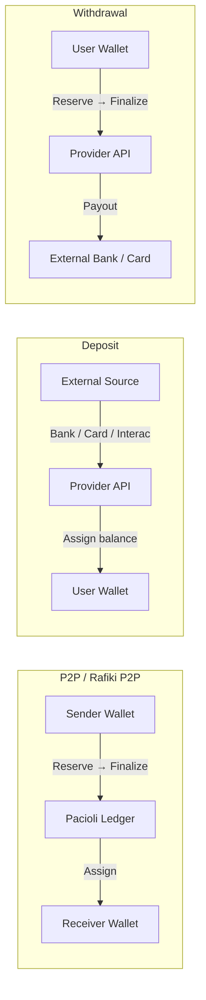
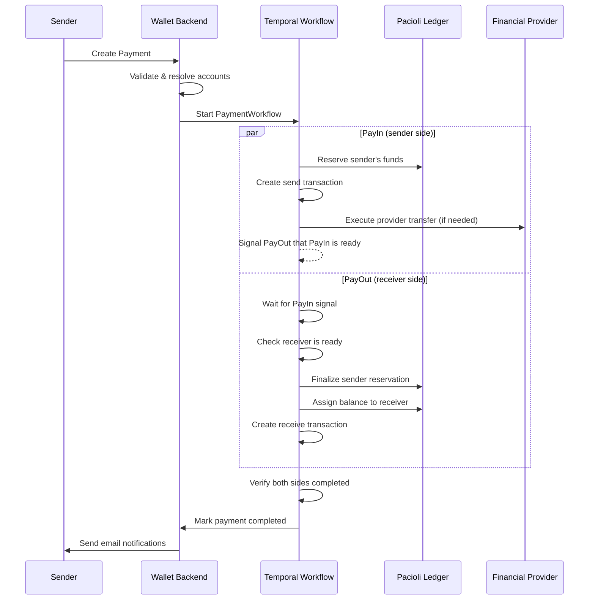
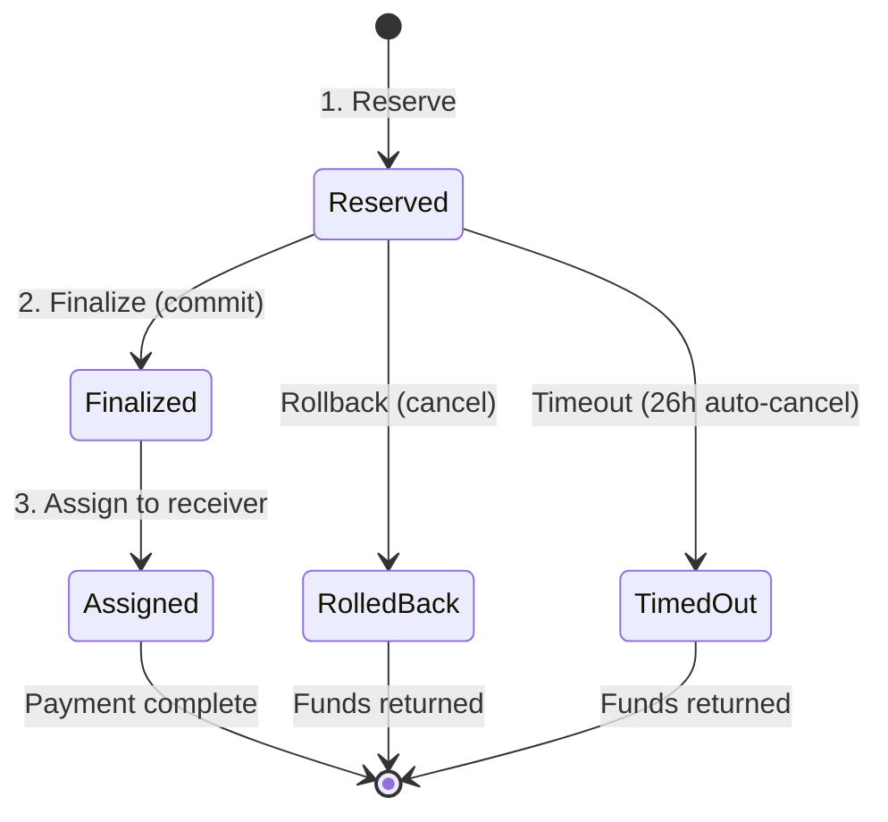
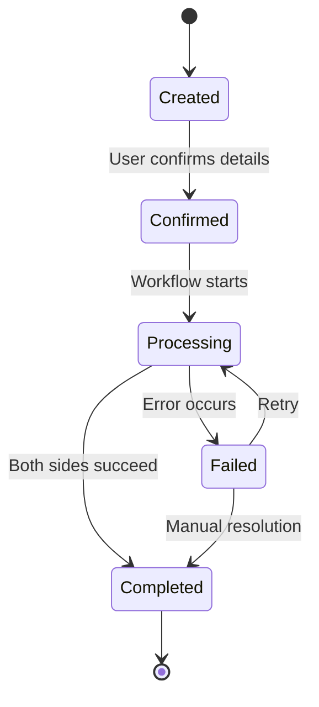
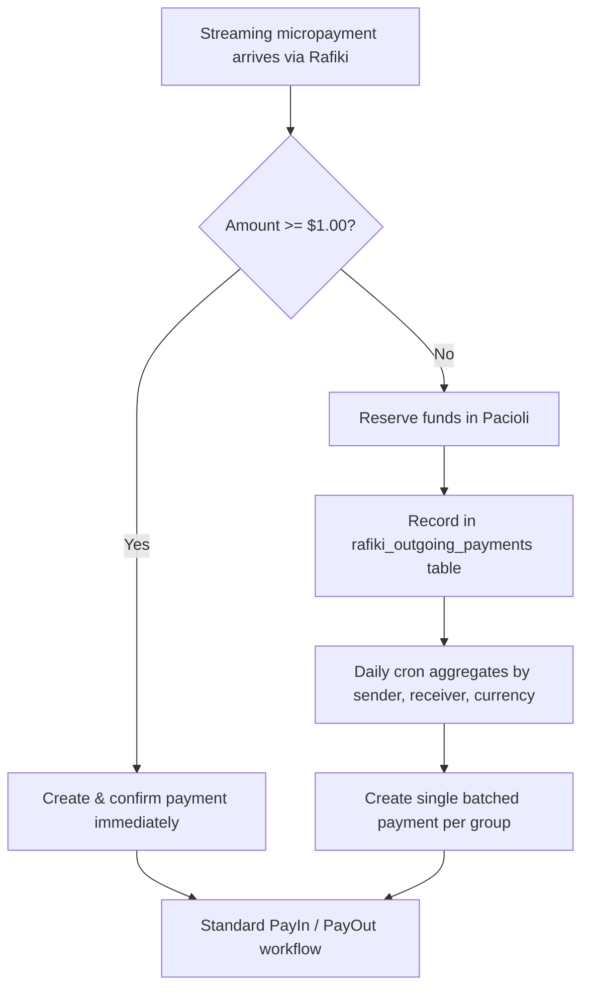
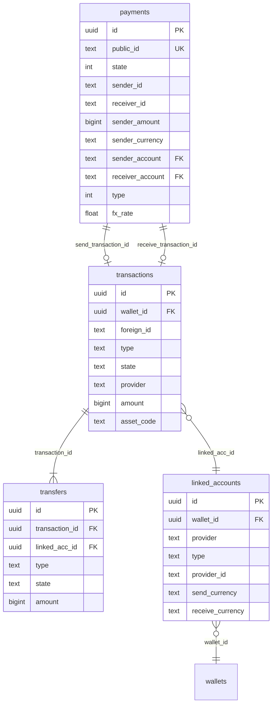

# Understanding Payments

## Overview

The Interledger App moves money between users across multiple currencies and financial providers. This document explains how the payment system works — from the moment a user initiates a payment to the point where both sender and receiver see updated balances.

The system is built around three core ideas:

1. **Provider-agnostic orchestration** — A central payment engine coordinates money movement regardless of which financial provider holds the funds.
2. **Double-entry accounting** — An internal ledger (Pacioli) tracks every debit and credit, ensuring funds are never lost or double-spent.
3. **Durable workflows** — [Temporal](https://temporal.io/) orchestrates multi-step payment processes with automatic retries and failure recovery.

## Key Concepts

### Payments vs Transactions

These two terms describe different layers of the system:

|                           | Payment                                                                           | Transaction                                                            |
|---------------------------|-----------------------------------------------------------------------------------|------------------------------------------------------------------------|
| **What it represents**    | The intent to move money (P2P, deposit, withdrawal) — orchestrated asynchronously | A ledger entry recording what actually happened to money in one wallet |
| **Who sees it**           | Internal workflow engine                                                          | The user in their wallet UI                                            |
| **How many per transfer** | One payment per money movement                                                    | Typically two per payment (one "sent", one "received")                 |
| **State machine**         | Created → Confirmed → Processing → Completed / Failed                             | Pending → Completed / Failed / OnHold                                  |
| **Key fields**            | Sender, receiver, amounts in both currencies, FX rate                             | Wallet owner, amount, provider, transfers (debits/credits)             |

A single **Payment** orchestrates the entire flow. It produces **two Transactions** — one for the sender's wallet (type: `sent`) and one for the receiver's wallet (type: `received`). For deposits and withdrawals, only one transaction is created since money moves between a wallet and an external system rather than between two users.

Each Transaction contains one or more **Transfers** — the individual debit or credit entries (e.g., `debit_balance`, `credit_card`, `credit_bank_acc`) that record exactly how money moved.

> See [payments/types.go](../go/backend/payments/types.go) and [transactions/types.go](../go/backend/transactions/types.go) for the full type definitions.

### Linked Accounts

Before a user can send or receive money, their wallet must contain at least one **linked account** — an external account at a financial provider. Each linked account maps to a specific provider, currency, and account type:

| Field                              | Purpose                                                         |
|------------------------------------|-----------------------------------------------------------------|
| `Provider`                         | Which financial service (`gatehub`, `xago`, `pti`, `chimoney`)  |
| `Type`                             | Account type (`balance`, `card`, `bank_account`, `interac`)     |
| `SendCurrency` / `ReceiveCurrency` | Which currency this account handles                             |
| `CanSend` / `CanReceive`           | Whether this account can be used for outgoing/incoming payments |
| `DefaultSend` / `DefaultReceive`   | Whether this is the default account for its currency            |

A user may have multiple linked accounts across different providers and currencies. The payment engine selects the appropriate account based on the payment's currency and direction.

> See [linkedaccounts/types.go](../go/backend/linkedaccounts/types.go) for details.

### The Pacioli Ledger

All balance management runs through **Pacioli**, a double-entry accounting system named after [Luca Pacioli](https://en.wikipedia.org/wiki/Luca_Pacioli). It ensures that every debit has a corresponding credit and that funds cannot be over-spent.

Each account in Pacioli tracks four values:

- **Credits Posted** — Confirmed incoming funds
- **Debits Posted** — Confirmed outgoing funds
- **Credits Pending** — Reserved incoming funds (not yet confirmed)
- **Debits Pending** — Reserved outgoing funds (not yet confirmed)

The user's **available balance** is calculated as: $\text{Credits Posted} - \text{Debits Posted} - \text{Debits Pending}$

This means reserved funds are immediately deducted from the available balance, even before the payment completes.

## Payment Types

The wallet supports six active payment types:

| Type                   | Code | Description                                                      | PayIn (Sender)                | PayOut (Receiver)                       |
|------------------------|------|------------------------------------------------------------------|-------------------------------|-----------------------------------------|
| **Peer-to-Peer**       | `1`  | Direct transfer between two wallet users                         | Debit sender balance          | Credit receiver balance                 |
| **Web Monetization**   | `2`  | Streaming micropayments via the Web Monetization protocol        | Debit sender balance          | Credit receiver balance (batched daily) |
| **Rafiki P2P**         | `4`  | P2P transfer routed through the Interledger Protocol via Rafiki  | Debit sender balance          | Credit receiver balance                 |
| **Rafiki to External** | `5`  | Outgoing payment to a wallet address on another Interledger node | Debit sender balance          | Handled by the external receiver's node |
| **Withdrawal**         | `6`  | Cash-out from a wallet to an external bank account or card       | Debit wallet balance          | Sent to external bank/card              |
| **Deposit**            | `7`  | Top-up into a wallet from an external bank account or card       | Received from external source | Credit wallet balance                   |

> See [payments/types.go](../go/backend/payments/types.go#L155) for the type constants.

### How Payment Types Differ

### Receiver Identity Types

The payment system supports multiple ways to identify a receiver:

| Identity Type         | Example                              | Resolution                                       |
|-----------------------|--------------------------------------|--------------------------------------------------|
| **WalletID**          | `550e8400-e29b-...`                  | Direct lookup by internal wallet ID              |
| **WalletURL**         | `https://wallet.example/alice`       | Resolved to a local wallet via Rafiki wallet address |
| **ExternalWalletURL** | `https://other-provider.example/bob` | Routed via Rafiki/ILP to an external node        |

> **Deprecated identity types:** Email, Twitter, Discord, and Slack receiver identities still exist in the codebase but are being removed. Do not build new features against them.

## Payment Workflow

Every payment follows the same high-level orchestration pattern, regardless of provider:

### The Reserve → Finalize → Assign Pattern

This three-step pattern is the heart of every payment's balance management:

1. **Reserve** — Creates a pending transfer in the Pacioli ledger. The sender's available balance decreases immediately, but their total balance stays the same. If they don't have enough available funds, the payment fails here.

2. **Finalize** — Commits the pending transfer. The sender's total balance now decreases. Funds are held in an operational account.

3. **Assign** — Creates a posted transfer from the operational account to the receiver's account. The receiver's balance increases and the funds become available instantly.

If anything goes wrong, the system **rolls back** the reservation, returning the funds to the sender's available balance. Reservations also have a 26-hour automatic timeout as a safety net.

### Payment State Machine

Before a payment moves from **Created** to **Confirmed**, the system may require additional actions from the user (defined as `RequiredActions`):

- **3D Secure verification** — For card-based payments
- **Account selection** — If the user has multiple linked accounts for a currency
- **OTP verification** — One-time password confirmation
- **IP address** — For fraud detection

## Financial Providers

The wallet integrates with four financial providers, each serving different currencies and regions. All providers implement a common interface for balance operations (`ReserveBalance`, `FinaliseReserve`, `RollbackReserve`, `AssignBalance`, `GetBalance`), but differ in how deposits, withdrawals, and onboarding work.

> Provider dispatch logic lives in [payments/ops/workflows.go](../go/backend/payments/ops/workflows.go). Each provider also has its own workflow definitions under `providers/<name>/ops/`.

### Provider Overview

| Feature               | GateHub                          | Xago                              | PTI (Fiant)                          | Chimoney                                      |
|-----------------------|----------------------------------|-----------------------------------|--------------------------------------|-----------------------------------------------|
| **Currency**          | EUR                              | ZAR, USD                          | USD                                  | CAD                                           |
| **Region**            | Europe                           | South Africa                      | United States                        | Canada                                        |
| **Account types**     | Balance                          | Balance, Bank account             | Balance, Card, Bank account          | Balance, Interac                              |
| **KYC method**        | Widget (Paywiser iframe)         | API (Persona verification)        | API (assessment workflows)           | API (polling for status)                      |
| **Deposit method**    | On/off-ramp widget (bank/card)   | Bank transfer to provided details | Card or bank account (TabaPay)       | Payment link redirect (card, Interac, crypto) |
| **Withdrawal method** | On/off-ramp widget               | Bank transfer via beneficiary     | Bank account or card (TabaPay)       | Interac e-Transfer                            |
| **P2P mechanism**     | Hosted transfer via GateHub API  | Internal ledger only              | Transfer between PTI user wallets    | Internal ledger only                          |
| **Card support**      | Yes (virtual + plastic, 3DS)     | No                                | Yes (TabaPay tokenized)              | No                                            |
| **Provider fees**     | Yes (extracted from GateHub API) | No                                | No (explicit zero)                   | No                                            |
| **Webhook auth**      | HMAC-SHA256                      | None                              | JWE + JWS (RSA encryption + signing) | Svix HMAC-SHA256                              |

### Onboarding and KYC

Each provider has a different approach to user verification:

| Provider     | Method                   | Detail                                                                                                                                                                                                                                |
|--------------|--------------------------|---------------------------------------------------------------------------------------------------------------------------------------------------------------------------------------------------------------------------------------|
| **GateHub**  | Embedded widget (iframe) | The wallet embeds a GateHub/Paywiser onboarding widget. KYC outcome arrives via `id.verification.accepted` or `id.verification.rejected` webhook. On approval, a `BackfillAccountWorkflow` runs to set up the user's balance account. |
| **Xago**     | API-driven (Persona)     | KYC is handled by [Persona](https://withpersona.com/). Once approved, the wallet creates a Xago sub-account with the verified identity details (inquiry URL, ID number, physical address).                                            |
| **PTI**      | API-driven (assessment)  | Uses scenario-based assessments (`ilf_transfer`, `ilf_deposit`, `ilf_withdrawal`). If PTI returns a 422 during a transaction, the system automatically triggers an assessment, waits for acceptance, and retries.                     |
| **Chimoney** | API-driven (polling)     | The wallet creates a Chimoney sub-account wallet and polls `GetWallet` every 30 seconds until `Verification.Status == "completed"`.                                                                                                   |

### How Each Provider Handles Deposits

| Provider     | User Experience                                                                             | Completion Signal                                            | Balance Credit                      |
|--------------|---------------------------------------------------------------------------------------------|--------------------------------------------------------------|-------------------------------------|
| **GateHub**  | User interacts with an on/off-ramp widget embedded in the wallet UI                         | `core.deposit.completed` webhook                             | Immediate credit minus provider fee |
| **Xago**     | User transfers funds to Xago-provided bank details (account number, branch code, reference) | Webhook with code `104`                                      | Immediate credit of full amount     |
| **PTI**      | User enters card or bank details; tokenized via TabaPay                                     | `SETTLED` status webhook                                     | Credit upon settlement              |
| **Chimoney** | User redirected to Chimoney payment link (supports cards, Interac, crypto)                  | Polling (5 min) + `chimoney.redeem.completed` webhook signal | Credit after redemption verified    |

### How Each Provider Handles Withdrawals

| Provider     | User Experience                                            | Completion Signal                             | Balance Debit                                   |
|--------------|------------------------------------------------------------|-----------------------------------------------|-------------------------------------------------|
| **GateHub**  | User initiates via on/off-ramp widget                      | Polling GateHub API for completion            | Reserve (amount + fee) → finalize on completion |
| **Xago**     | User creates beneficiary with bank details, then withdraws | Polling every 1 hour for `Success` status     | Reserve → finalize on success                   |
| **PTI**      | User withdraws to linked bank account or card              | `SETTLED` status webhook                      | Reserve → finalize on settlement                |
| **Chimoney** | User withdraws via Interac e-Transfer to linked email      | Polling every 5 minutes for `redeemed` status | Reserve → finalize on redemption                |

### How Each Provider Handles P2P Transfers

| Provider     | Mechanism                                            | Completion Detection             | Polling Interval |
|--------------|------------------------------------------------------|----------------------------------|------------------|
| **GateHub**  | Creates a hosted transfer via GateHub's external API | Hybrid: webhook signal + polling | 20 minutes       |
| **Xago**     | Internal ledger transfer only (no external API call) | Immediate                        | N/A              |
| **PTI**      | Creates a transfer between PTI user wallets          | Polling PTI transaction status   | 10 minutes       |
| **Chimoney** | Internal ledger transfer via Chimoney API            | Immediate                        | N/A              |

For GateHub P2P specifically, the PayOut workflow uses a **hybrid completion detection** mechanism:
- **Primary**: A webhook (`core.deposit.completed` with `deposit_type: "hosted"`) triggers a Temporal signal on the `payment_gatehub_signals` channel
- **Fallback**: A 20-minute polling timer checks the GateHub transaction status via the provider API

This ensures reliable completion even when webhooks are delayed or lost.

### Provider Webhook Events

Each provider sends different webhook events that the backend processes:

**GateHub:**
- `id.verification.accepted` / `rejected` — KYC outcome
- `core.deposit.completed` — Deposit completed or hosted transfer signaled
- `cards.card.created` — Card issued
- `cards.3ds.auth_3ds_confirmation` — 3D Secure confirmation
- `cards.transaction.event` — Card purchase or ATM withdrawal

**Xago:**
- Code `104` — Deposit confirmed (only handled code; others return 501)

**PTI (Fiant):**
- `USER` — User status updates
- `USER_ASSESSMENT` / `KYC` — Assessment state changes (ACCEPTED, REFUSED, UNDER_REVIEW, etc.)
- `TRANSACTION_STATUS` — Transaction lifecycle (AUTHORIZED, SETTLED, REFUSED, REFUNDED, etc.)

**Chimoney:**
- `chimoney.redeem.completed` / `failed` — Deposit redemption outcome
- `charge.card.completed` / `charge.interac.completed` / `charge.crypto.*.confirmed` — Payment method charge confirmation

## Rafiki and Open Payments

[Rafiki](https://github.com/interledger/rafiki) is the Interledger Protocol (ILP) connector that enables the wallet to send and receive payments across different financial networks. It is **not** a financial provider like GateHub or Xago — instead, it's the interoperability layer that connects the wallet to the global Interledger network.

### What Rafiki Provides

- **Wallet Addresses** — Human-readable payment pointers (e.g., `https://ilp.example/alice`) that other Interledger participants can send money to. Each Interledger App wallet gets one wallet address.
- **Open Payments API** — A standard HTTP API that allows third-party applications to initiate payments with user consent
- **Grants** — GNAP-based authorization tokens that control what operations third parties can perform (create quotes, initiate payments, etc.)
- **ILP Routing** — Routes payment packets between Interledger peers

### How Rafiki Payments Work

When a Rafiki outgoing payment is created (e.g., a user sends money to a wallet address on another node), Rafiki notifies the wallet backend via an `outgoing_payment.created` webhook. The backend then:

1. **For payments >= $1.00** — Creates and immediately confirms a `RafikiPeer2Peer` payment, which triggers the standard PayIn/PayOut workflow
2. **For payments < $1.00** (web monetization micropayments) — Reserves the funds immediately and records them for daily batch settlement

### Web Monetization

Web monetization micropayments are handled differently to avoid the overhead of running a full payment workflow for tiny amounts:

The daily cron job (`WebMonetizationPaymentsWorkflow`) runs at midnight, aggregates all unbatched micropayments grouped by sender, receiver, and currency, and creates a single payment for each group.

> See [rafiki/ops/workflows.go](../go/backend/rafiki/ops/workflows.go) for the batch workflow and [rafiki/ops/webhooks.go](../go/backend/rafiki/ops/webhooks.go) for webhook processing.

### External Wallet Payments

When a payment is sent to an **ExternalWalletURL** (a wallet address hosted by another Interledger node), the PayOut workflow behaves differently:

- The `CreatePayoutTransaction` activity skips creating a receive transaction locally
- The receive side is handled entirely by the external node's Rafiki instance
- The sender's PayIn completes normally with a reserve and finalize

## Database Schema

The payment system uses several interconnected tables:

### Key Tables

| Table                      | Purpose                                                                                                 |
|----------------------------|---------------------------------------------------------------------------------------------------------|
| `payments`                 | High-level payment records with sender/receiver identities, amounts, state, and links to transactions   |
| `transactions`             | Per-wallet ledger records visible to users (sent, received, withdrawal, deposit, etc.)                  |
| `transfers`                | Individual debit/credit entries within a transaction                                                    |
| `linked_accounts`          | Maps wallets to external provider accounts (each has a `provider_id` whose format is provider-specific) |
| `gatehub_users`            | Maps wallets to their GateHub user accounts                                                             |
| `gatehub_transactions`     | Maps external GateHub transaction IDs to internal payment IDs (used for webhook routing)                |
| `rafiki_payment_pointers`  | Maps Rafiki wallet addresses to internal wallet IDs                                                     |
| `rafiki_outgoing_payments` | Tracks Rafiki outgoing payments for web monetization batching                                           |

## Transaction Types

Transactions have more granular types than payments, reflecting the specific nature of each money movement:

| Transaction Type            | Description                                                   |
|-----------------------------|---------------------------------------------------------------|
| `sent`                      | Money sent to another user (P2P sender side)                  |
| `received`                  | Money received from another user (P2P receiver side)          |
| `withdrawal`                | Money withdrawn to an external account                        |
| `deposit`                   | Money deposited from an external source                       |
| `transfer`                  | Generic internal transfer                                     |
| `open_payments_incoming`    | Incoming payment via Open Payments / Rafiki                   |
| `open_payments_outgoing`    | Outgoing payment via Open Payments / Rafiki                   |
| `web_monetization_incoming` | Received via web monetization                                 |
| `web_monetization_outgoing` | Sent via web monetization                                     |
| `card_transaction`          | Card purchase, ATM withdrawal, or similar (GateHub/PTI cards) |

## Email Notifications

After a payment completes, the system sends email notifications:

- **Sender** receives a "Payment Sent" email with the amount, recipient, and date
- **Receiver** receives a "Payment Received" email with the amount, sender, and date
- On **failure**, the sender receives a "Payment Failed" email

## Monitoring and Debugging

### Temporal Workflow UI

Payments are orchestrated as Temporal workflows. The Temporal UI (typically at `http://localhost:8233` in local development) allows you to:

- Search for workflows by payment ID
- View child workflows: `payment_payin_{id}` and `payment_payout_{id}`
- Inspect workflow state: RUNNING, COMPLETED, FAILED, or TERMINATED
- View activity execution history and retry attempts

### Common Issues

**Payment stuck in Processing:**
Check the Temporal workflow status. Common causes include insufficient balance (non-retryable), receiver not having a linked account for the payment currency, or an external provider timeout (automatically retried).

**Receiver doesn't see the payment:**
Verify that `receive_transaction_id` is populated on the payment record and that the corresponding transaction has state `Completed`. If the receiver was identified by an `ExternalWalletURL`, the receive transaction is created by the external node, not locally.

**Withdrawal not completing:**
Different providers have different polling intervals. GateHub and PTI use webhooks for withdrawal completion. Xago polls hourly, and Chimoney polls every 5 minutes. Check the provider's webhook delivery or the polling activity in the Temporal workflow history.

**GateHub P2P transfer stuck polling:**
The PayOut workflow polls the GateHub transaction status and only exits when `status == 100` (completed). If the provider returns an unexpected status code, the workflow will continue polling indefinitely. Verify the transaction status via the GateHub API and check the `gatehub_transactions` table for the correct external transaction ID mapping.

