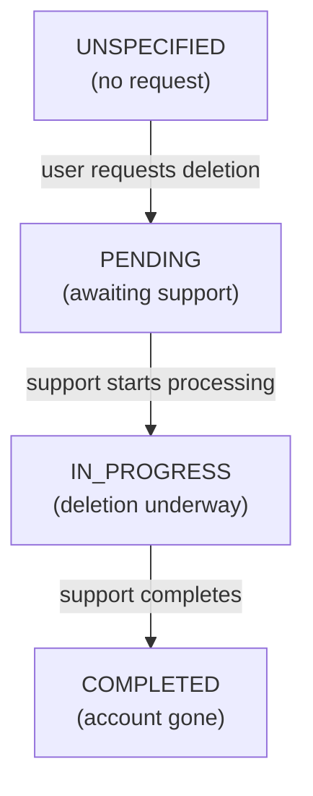
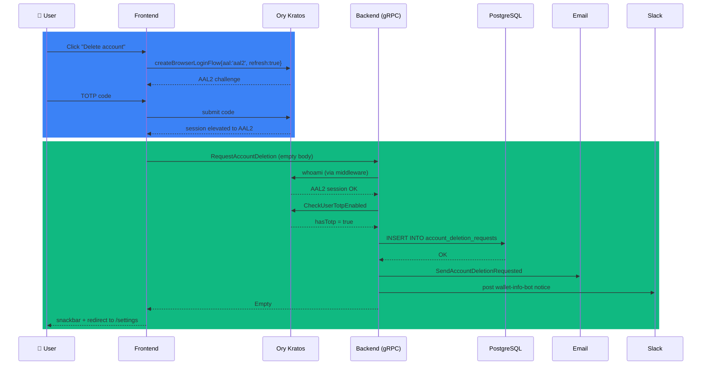

# Account Deletion Flow

> **Account closure guide.** Self-service deletion request that gates on Kratos AAL2 + TOTP enrolment, persists a pending row for manual processing, and notifies the user and support.

**Related documents:**

- [Signup Explainer](signup-guide.md) — Account creation, TOTP enrolment, and AAL levels
- [KYC Explainer](kyc-guide.md) — Wallet activation lifecycle that precedes deletion
- [Environment Variables](env-variables.md) — Kratos session configuration that backs AAL enforcement

**Quick Navigation:**

- **What states does a request go through?** → See [Status Flow](#status-flow)
- **Why does TOTP enrolment matter?** → See [Authentication Contract](#authentication-contract)
- **How is the feature rolled out?** → See [Feature Flag](#feature-flag)
- **What does support do with the row?** → See [Support Playbook](#support-playbook)

## Overview

A logged-in user can request that their account be deleted from the Settings page. The wallet backend records a pending request and emails the user; actual data deletion is performed manually by support after the row appears. The same RPC is also used by the FE to render a pending-state indicator after the request is submitted.

The flow is **destructive and irreversible**, so the backend gates it on two independent checks:

1. The session must be AAL2 (TOTP-confirmed) — enforced by the gRPC user middleware.
2. The user must have TOTP enrolled in Kratos — enforced explicitly inside the handler.

A user without TOTP enrolment is rejected with a structured error so the FE can show a precise message instead of routing through the AAL2 step-up flow.

## Status Flow

- `COMPLETED` is **not surfaced in the UI**: once an account is deleted the user can no longer log in to observe it.
- Status transitions after `PENDING` are driven by support tooling, not the user-facing app.

## Authentication Contract

Kratos is configured with `session.whoami.required_aal: highest_available` (see [Environment Variables](env-variables.md)). The gRPC user middleware translates a `session_aal2_required` response from Kratos into `codes.Unauthenticated` with `ErrorInfo{reason:"aal2_required"}`. The frontend `ConnectError` constructor redirects to the TOTP challenge page on that signal.

In practice the FE pre-empts the redirect by wrapping the destructive submit in `withTotpChallenge(...)`, which opens a popup, drives a Kratos step-up flow, and re-submits the action after the session is elevated to AAL2.

The handler additionally calls `Users().CheckUserTotpEnabled(ctx, userID)` and returns `user.ErrTotpNotConfigured` (mapped to `FailedPrecondition` + `ErrCodeUserTotpNotConfigured`) when the helper reports the identity has no TOTP credential. Kratos' `highest_available` AAL otherwise lets non-enrolled users through on AAL1, so the explicit gate is required for a destructive action.

## Request Flow

The handler persists the row **before** sending email so duplicate clicks are deduplicated before support is paged. If the email send fails, the inserted row is rolled back so a retry isn't blocked by `ErrAlreadyRequested`.

## Feature Flag

`Features.deleteAccountEnabled` is a per-wallet flag stored in `wallet_features.delete_account_enabled`. It defaults to **false** for every country branch in `features/ops.Features()`. Enabling the flow for a wallet is an explicit opt-in:

- **Manual:** SQL upsert (testing/local dev).
- **Admin UI:** botanist's wallet profile page renders the flag as a toggle. Toggling persists via `SetWalletFeatures` → `wallet_features` row.

The FE gates the route and the settings-list link on this flag:

- `loader` in `settings.delete-account.tsx` redirects to `/settings` when the flag is off.
- `loader` in `settings.tsx` skips the `getAccountDeletionStatus` RPC entirely when the flag is off and the `<AccountDeletionRow>` is not rendered.

## Side Effects

When `RequestAccountDeletion` succeeds, the backend produces these outputs in order:

1. **`account_deletion_requests` row** with `user_id` = the Kratos identity ID and `status = 'pending'`. The `user_id` column has a unique index so a duplicate request returns `accountdeletion.ErrAlreadyRequested`.
2. **Support-inbox email** with subject `[<env>] Account deletion requested — user <userID>`. A failure here returns from the handler and triggers a rollback (see below).
3. **User confirmation email** with subject `We've received your account deletion request`. Best-effort — failures are logged with `userID` but do not fail the RPC.
4. **Slack notification** posted as `wallet-info-bot` to the `ChannelNotifyEvents` channel, including the user's email and wallet IDs. Best-effort — the wallet-list query that gates this notification can fail; on failure the post is skipped with a warning log.

Rollback semantics:

- DB insert succeeded but **support-inbox email** failed → the row is deleted so a retry isn't blocked by `ErrAlreadyRequested`. If the rollback itself fails, the row is left for manual cleanup and a Sentry event is captured.
- DB insert succeeded, support email succeeded, user confirmation or Slack failed → no rollback. The request stands and operators are paged.

## Errors

| gRPC code | AppError code | Trigger | FE behaviour |
|---|---|---|---|
| `Unauthenticated` | (kratos ErrorInfo) | Session below AAL2 | FE auto-redirects to `/totp/challenge`; `withTotpChallenge` pre-empts this with an in-page popup |
| `FailedPrecondition` | `ErrCodeUserTotpNotConfigured` | User has no TOTP credential | FE renders "Two-factor authentication must be configured before deleting your account." |
| `AlreadyExists` | `ErrCodeAccountDeletionAlreadyRequested` | A pending/in-progress row already exists | Action handler renders the error inline. Rarely reached because the loader redirects to `/settings` before the action runs. |
| `Internal` | (generic) | DB or email failure | FE renders a generic error message; the user can retry from the page. |

The `settings.delete-account.tsx` loader treats any non-`UNSPECIFIED` status from `GetAccountDeletionStatus` as a redirect signal back to `/settings`, so the `AlreadyExists` action-side branch only fires for race conditions where the row appears between loader and submit. The `settings.tsx` index loader does **not** redirect — it renders an in-flight indicator row instead.

## User Experience

- **Settings index** (`/settings`)
  - **Flag off:** no row.
  - **Flag on, no pending request:** red "Delete account" link in the Account card.
  - **Flag on, pending request:** non-clickable "Account deletion pending" row with a clock icon.
  - **Flag on, in-progress:** non-clickable "Account deletion in progress" row with a refresh icon.
  - **Flag on, status RPC error:** non-clickable warning row instructing the user to try later.
- **Delete-account page** (`/settings/delete-account`)
  - Warning card explaining irreversibility and the need to withdraw funds within 2–3 days.
  - Cancel and "Delete account" buttons.
  - Clicking "Delete account" opens the global TOTP step-up popup. After verify, the action submits with an empty body; on success the user is redirected to `/settings` with a confirmation snackbar.

## API & Backend Changes

| Surface | Symbol | Purpose |
|---|---|---|
| Proto (user) | `RequestAccountDeletion(RequestAccountDeletionRequest) returns (Empty)` | Submit a request. Request body is empty. |
| Proto (user) | `GetAccountDeletionStatus(Empty) returns (AccountDeletionStatus)` | Read current status for the authenticated user. |
| Proto (user) | `Features.deleteAccountEnabled` (slot 14) | Per-wallet feature flag. |
| Proto (admin) | `Features.deleteAccountEnabled` (slot 14) | Same flag, surfaced for botanist. |
| Go | `accountdeletion.Client.Request / GetForUser / Delete` | Persistence ops. |
| Go | `user.Client.CheckUserTotpEnabled` | Reads `credentials.totp` from the Kratos identity. |
| DB | `account_deletion_requests` | One row per user (unique on `user_id`), columns include `status`, `created_at`, `updated_at`. |
| DB | `wallet_features.delete_account_enabled` | Per-wallet flag, default `false`. |

## Testing & Monitoring

- **Handler unit tests** in `go/backend/grpc/account_deletion_test.go` cover the happy path, the rollback-on-support-email-error regression, the wallet-lookup-failure-tolerated case (Slack post is skipped, request still succeeds), the TOTP-not-enrolled precondition, and the already-requested duplicate (both assert the structured AppError reason code).
- **End-to-end scenarios** in `e2e/features/006-account-deletion.feature` cover FF-off (link hidden, route redirects), FF-on (link visible, full delete flow with TOTP step-up, pending indicator, duplicate-rejection).
- **Admin scenario** in `e2e/features/101-botanist-wallets.feature` exercises the botanist toggle and verifies the DB row reflects the UI state.
- **Alerts:** Sentry captures rollback failures with the user ID and both underlying errors. User-confirmation email failures and wallet-list failures (which suppress the Slack post) are logged as warnings, not paged.

## Support Playbook

- **Locate pending requests:** `SELECT user_id, created_at FROM account_deletion_requests WHERE status = 'pending' ORDER BY created_at`.
- **Enable the feature for a single wallet:** botanist → wallet profile → toggle `deleteAccountEnabled`.
- **Roll a request back to allow retry:** `DELETE FROM account_deletion_requests WHERE user_id = $1`. The user can then submit again from the app.
- **Diagnose a stuck request:** check Sentry for the rollback-failure log lines (search for "account deletion: rollback failed"). The pending row may need manual cleanup.
- **A user reports the page redirects them away unexpectedly:** confirm `wallet_features.delete_account_enabled` is `true` for their wallet, and confirm no prior request exists.
