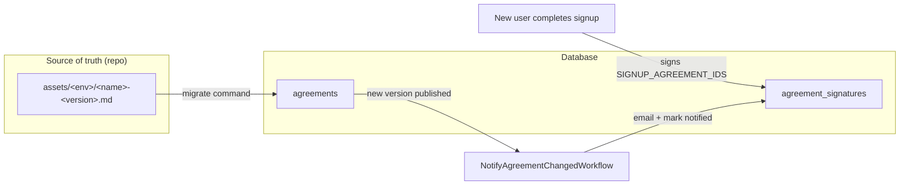
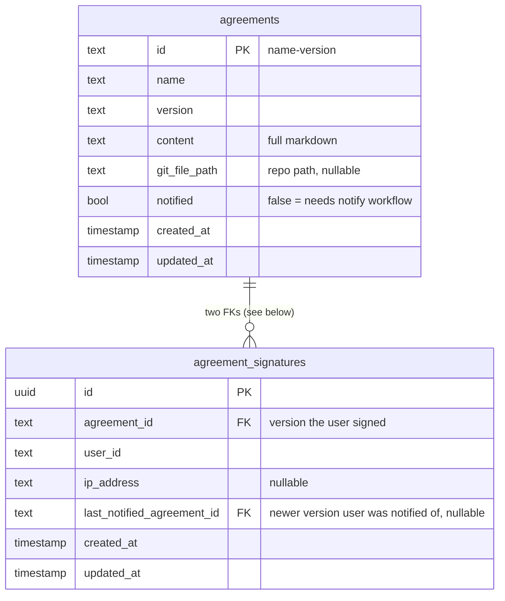
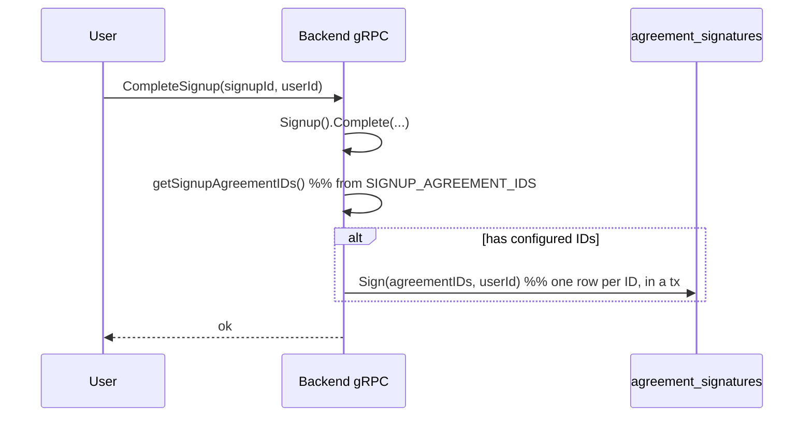
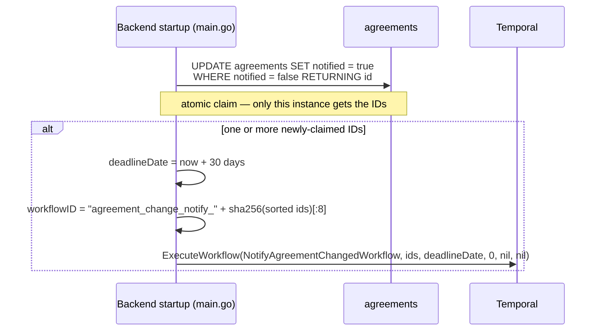
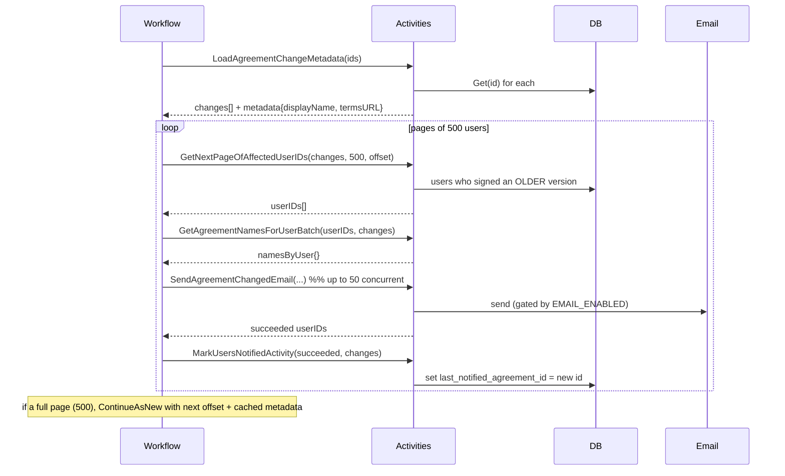

# Agreements & Legal Consent

> **Agreements guide.** How legal agreements (privacy policy, terms, user policy) are versioned, signed at signup, stored, and how existing signers are notified when a new version is published.

**Related documents:**

- [Terminology](terminology.md) — Core wallet concepts and vocabulary
- [Signup Flow](signup-guide.md) — Where signup-time agreement signatures are recorded
- [Environment Variables](env-variables.md) — `SIGNUP_AGREEMENT_IDS`, `EMAIL_ENABLED`, and SendGrid configuration
- [KYC Explainer](kyc-guide.md) — Adjacent compliance flow
- [Logging Reference](logging-reference.md) — Where agreement warnings surface

**Quick Navigation:**

- **What is an agreement?** → [What agreements are](#what-agreements-are)
- **How is it stored?** → [Data model](#data-model)
- **How do new users sign?** → [Signing at signup (active agreements)](#signing-at-signup-active-agreements)
- **How do I add a new agreement / version?** → [Adding or updating an agreement](#adding-or-updating-an-agreement)
- **What happens when one is added?** → [What happens when an agreement is published](#what-happens-when-an-agreement-is-published)
- **How are users notified?** → [Notifying existing signers](#notifying-existing-signers)
- **Can the env var change when I add an agreement?** → [Does `SIGNUP_AGREEMENT_IDS` update automatically?](#does-signup_agreement_ids-update-automatically)
- **What else must I update?** → [Rollout checklist: what to update together](#rollout-checklist-what-to-update-together)
- **How is it tested?** → [End-to-end tests](#end-to-end-tests)

---

## What agreements are

An **agreement** is a versioned legal document a user accepts — for example a privacy policy, terms of service, or user policy. The wallet keeps an auditable record of *which exact version* of *which document* each user accepted, and *when*.

Two independent mechanisms are easy to confuse, so it's worth separating them up front:

1. **Signing at signup** — when a new user completes signup, the backend records a signature against a fixed, explicitly configured set of agreement IDs (the [`SIGNUP_AGREEMENT_IDS`](#signing-at-signup-active-agreements) env var). These are the *"active"* agreements: the ones a brand-new account accepts.
2. **Notifying existing signers of a change** — when a *new version* of an existing agreement is published, every user who signed an *older* version is emailed and marked as notified, with a 30-day deadline. This is the `feat/wal-542-notify-users` workflow.

The two are not wired together. Publishing a new version triggers notifications, but it does **not** change what new signups sign — see [Does `SIGNUP_AGREEMENT_IDS` update automatically?](#does-signup_agreement_ids-update-automatically).



### Naming and ID format

An agreement is identified by its `id`, which is always `<name>-<version>`:

- `name` — letters, digits, underscores (e.g. `privacy_policy`, `terms_of_service`, `user_policy`)
- `version` — semantic version `MAJOR.MINOR.PATCH` (e.g. `0.0.0`, `1.0.0`, `9.9.9`)

Examples: `privacy_policy-0.0.0`, `user_policy-1.0.0`.

The source files live in the repo as Markdown and the filename **is** the ID plus `.md`. The migrator validates every filename against:

```
^[a-zA-Z0-9_]+-[0-9]+\.[0-9]+\.[0-9]+\.md$
```

A file that does not match this pattern fails the migration outright. (`go/backend/agreements/migrations/migrations.go`)

---

## Data model

Two tables, defined in `go/backend/db/schema.hcl`.



### `agreements`

| Column | Meaning |
|---|---|
| `id` | `<name>-<version>`, primary key |
| `name` | Document name, e.g. `privacy_policy` |
| `version` | Semantic version, e.g. `1.0.0` |
| `content` | Full Markdown body of the agreement |
| `git_file_path` | Repo-relative path of the source file (`go/backend/agreements/migrations/assets/<env>/<file>`), for traceability |
| `notified` | `false` while a freshly inserted agreement still needs its change-notification workflow; flipped to `true` once the workflow has been claimed |
| `created_at` / `updated_at` | Timestamps |

### `agreement_signatures`

| Column | Meaning |
|---|---|
| `id` | UUID primary key |
| `agreement_id` | FK → `agreements.id`; the exact version the user signed |
| `user_id` | The signing user |
| `ip_address` | IP at signing time (nullable) |
| `last_notified_agreement_id` | FK → `agreements.id`; set to the *new* version's ID once the user has been notified that the agreement they signed has a newer version. This is the audit marker proving the user was informed. |
| `created_at` / `updated_at` | Timestamps |

> A user is considered to have signed an **older** version of an agreement when they have a signature row whose joined agreement has the same `name` but a different `id` than the newly published version. There is no `active` boolean on the row — "old vs new" is derived from the name/id comparison at query time.

---

## Signing at signup (active agreements)

The set of agreements a new user accepts is controlled entirely by the **`SIGNUP_AGREEMENT_IDS`** environment variable on the backend.

- **Format:** comma-separated list of agreement IDs, e.g. `privacy_policy-0.0.0,user_policy-1.0.0`.
- **Parsing:** read once at startup in `cli.go` (`parseSignupAgreementIDs`), trimmed, empty entries dropped. An empty/unset value yields `nil` (no signatures recorded at signup).
- **Storage:** kept in a package-level slice via `grpc.InitAgreementIDs(args.SignupAgreementIDs)` at startup.
- **Local default:** `local/wallet.yaml` sets `SIGNUP_AGREEMENT_IDS=${BACKEND_SIGNUP_AGREEMENT_IDS:-privacy_policy-0.0.0}`.
- **Helm default:** `helm/interledger-app/values.yaml` ships `signup_agreement_ids: ""` (set per environment).

When a user finishes signup, `CompleteSignup` (in `go/backend/grpc/signup.go`) signs each configured ID for that user:



Two safeguards worth knowing about:

- **Signup never fails on agreement errors.** If recording signatures fails, `CompleteSignup` logs a warning (`complete_signup: failed to record agreement signatures`) and still returns success — agreement bookkeeping must not block account creation.
- **Foreign-key safety.** `Sign` inserts inside a transaction; if an ID doesn't exist in `agreements` (FK violation, Postgres `23503`), it returns `ErrNotFound`. So every ID in `SIGNUP_AGREEMENT_IDS` must correspond to a real migrated agreement.

### Other access paths

- **`GetAgreement(id)`** (gRPC) returns the stored Markdown `content` for an agreement ID. Note: the protea `/legal` pages do **not** currently call this — they render their own hardcoded copy of the text (see the [Rollout checklist](#rollout-checklist-what-to-update-together)).
- **`SignAgreements(agreementIds, userId)`** (gRPC) signs an explicit list for a user (`userId` must be a UUID, at least one ID required). This is the general-purpose signing RPC; `CompleteSignup` is the signup-time convenience path.

---

## Adding or updating an agreement

Agreements are **environment-specific**. The content lives under:

```
go/backend/agreements/migrations/assets/<env>/<name>-<version>.md
```

where `<env>` is one of `prod`, `staging`, `dev`, `sandbox`, `local`, `testing` (resolved from `env.GetEnv()` at runtime). Different environments can carry different text for the same logical document.

These files are compiled into the binary via Go's `//go:embed assets/*`, so **changing an agreement means editing/adding a file and shipping a new build** — there is no runtime upload.

**To add a brand-new agreement or a new version of an existing one:**

1. Add the Markdown file to `assets/<env>/`, named `<name>-<version>.md` and matching the filename regex. A new version is just a new file with a higher version (e.g. add `privacy_policy-1.0.0.md` alongside `privacy_policy-0.0.0.md`).
2. Build and deploy the backend.
3. The `migrate` command (run as a deploy step before the server starts) calls `MigrateFromEmbeddedMarkdowns`, which inserts any file whose ID is not already in the `agreements` table, using:
   ```sql
   INSERT INTO agreements (id, name, version, content, git_file_path, notified)
   VALUES ($1, $2, $3, $4, $5, false)
   ON CONFLICT DO NOTHING
   ```
   New rows are inserted with **`notified = false`**. Existing rows are left untouched (`ON CONFLICT DO NOTHING`), so editing the body of an *already-migrated* ID will **not** update the stored content — bump the version instead.
4. If you want **new signups** to accept the new version, also update [`SIGNUP_AGREEMENT_IDS`](#does-signup_agreement_ids-update-automatically) — this is a separate, manual step.

> This covers only the backend record. The user-facing legal text, signup links, and other touch points live elsewhere and must be updated in the same change — see the full [Rollout checklist](#rollout-checklist-what-to-update-together).

> `MigrateFromMarkdowns` (reading from a directory rather than the embed FS) is the same logic for tooling/tests and inserts **without** setting `notified = false` — only the embedded path drives the notification flow.

---

## What happens when an agreement is published

The trigger lives in `go/backend/main.go`, run once when the server boots — after the `migrate` command has already inserted any new agreement rows (with `notified = false`):



Key properties:

- **Atomic claim.** The `UPDATE ... RETURNING id` flips `notified` to `true` and returns the just-flipped IDs in one statement, so in a multi-replica deployment exactly one instance claims a given new agreement and starts the workflow.
- **Deterministic workflow ID.** Built from a SHA-256 of the sorted agreement IDs, with `WorkflowIDReusePolicy = ALLOW_DUPLICATE_FAILED_ONLY`. A successful run for the same set won't be re-run; a failed one can retry.
- **30-day deadline.** `jobs.AgreementChangeDeadlineDays = 30`; the deadline date is formatted (`January 2, 2006`) and passed into the emails.
- **Non-fatal.** Any failure to claim or start the workflow is logged as a warning, not fatal — startup proceeds.

---

## Notifying existing signers

`NotifyAgreementChangedWorkflow` (in `go/backend/jobs/agreement_change_notify.go`) emails every user who signed an *older* version of each changed agreement and records that they were notified.



Details:

- **Who is "affected".** `ListAffectedUserIDsPaginated` selects distinct `user_id`s who have a signature joined to an agreement with the same `name` but a *different* `id` than the new version (`a.name = $name AND a.id != $exceptID`). So only signers of older versions are contacted, never signers of the new one.
- **Pagination & scale.** Page size **500** users; emails dispatched up to **50** concurrently. When a page is full, the workflow `ContinueAsNew`s with the next offset and carries the metadata cache forward, so it scales to large user bases without unbounded history.
- **Retries.** Metadata/page/mark activities allow 3 attempts; email send allows 3 attempts (2-minute timeout). A user is only marked notified if their email activity **succeeded** — failures are logged and the user is left un-notified (eligible for a later retry).
- **Email content.** Each email lists the affected agreements by display name plus a link, and the 30-day deadline. Display names: `privacy_policy → "Privacy Policy"`, `terms_of_service → "Terms of Service"`, `user_policy → "User Policy"`, otherwise title-cased from underscores. The link is `<APP_URL>/legal/<name-with-dashes>` (e.g. `/legal/privacy-policy`) — this must resolve to a frontend legal page whose content is maintained separately from the backend (see the [Rollout checklist](#rollout-checklist-what-to-update-together)); if no matching slug case exists, the link 404s.
- **`EMAIL_ENABLED`.** When `false` (the default locally and in e2e), the email client is a no-op that returns success — so the workflow + DB-marker path still completes and users are still marked notified, but no SMTP is sent. Real delivery requires `EMAIL_ENABLED` unset/true plus the `SENDGRID_*` variables (see [Environment Variables](env-variables.md)).
- **The notification marker.** `MarkUsersNotified` sets `last_notified_agreement_id` to the new version's ID on the user's *old* signature rows for that agreement name. This is the auditable proof the user was informed; it does **not** create a new signature — the user has not re-accepted, only been notified.

---

## Does `SIGNUP_AGREEMENT_IDS` update automatically?

**No.** This trips people up often, so to be explicit:

- `SIGNUP_AGREEMENT_IDS` is read **once at startup**, parsed in `cli.go`, and stored in a package-level slice. It is **not** reloaded at runtime and **not** derived from the `agreements` table.
- Adding a new agreement Markdown file (and thus a new row in `agreements`) does **not** add its ID to `SIGNUP_AGREEMENT_IDS`. The two are independent.
- Therefore, after publishing `privacy_policy-1.0.0`:
  - **Existing signers** of `privacy_policy-0.0.0` are notified automatically (the workflow).
  - **New signups** keep signing whatever IDs are still listed in `SIGNUP_AGREEMENT_IDS` — i.e. still `privacy_policy-0.0.0` — until you **edit the env var to the new ID and redeploy/restart** the backend.

So rolling out a new mandatory version is a two-part operation: ship the file (notifies existing users), **and** update `SIGNUP_AGREEMENT_IDS` to the new ID (makes new users sign it). Forgetting the second step means new accounts continue accepting the old version.

### Can I update the env var at the same time as adding the agreement?

**Yes — and you should.** Because the ID is deterministic (`<name>-<version>`), you already know the new ID before deploying (e.g. `privacy_policy-1.0.0`), so the new Markdown file and the `SIGNUP_AGREEMENT_IDS` change belong in the **same change set / PR / deploy**. "Separate step" above means the env var is *not auto-derived* from the agreements table — not that it needs a separate deploy.

This is safe because of the startup ordering:

- The agreement row is inserted by the **`migrate` command** (`MigrateFromEmbeddedMarkdowns`), which runs as its own phase **before** the server starts serving signups.
- `SIGNUP_AGREEMENT_IDS` is read into memory when the server boots (`InitAgreementIDs`), after migration.
- So by the time any signup signs the new ID, the matching agreement already exists and the foreign key is satisfied. (If an env-listed ID were somehow missing, signing logs `ErrNotFound` and signup still succeeds — it never blocks account creation.)

Why isn't it just automatic, then? The explicit env var is an intentional opt-in: adding a new agreement file should *not* silently force every new signup onto it (e.g. you may publish a new version only to notify existing users, while new users still sign the current one). Listing the ID is how you opt new signups in.

---

## Rollout checklist: what to update together

A new policy (or new version of an existing one) touches several **decoupled** places. None of them updates the others automatically — missing one produces a silent inconsistency (e.g. new users sign an old version, or a notification email links to a 404). Treat the following as a single change set.

> **The biggest gotcha:** the backend stores agreement `content`, but the user-facing `/legal/<slug>` pages do **not** render it. The frontend serves its own **hardcoded** copy of the legal text (see below). The backend copy is the auditable record that users signed; the frontend copy is what they actually read. They are maintained separately and must be kept in sync by hand.

### 1. Backend agreement content — *required*

- Add the Markdown file `go/backend/agreements/migrations/assets/<env>/<name>-<version>.md` for **every** environment you're rolling out to (`prod`, `staging`, `dev`, `sandbox`, `local`; `testing` carries its own fixtures). Per-environment divergence is allowed and intentional.
- For a content change, **bump the version** (new file) — editing an already-migrated ID is a no-op (`ON CONFLICT DO NOTHING`).
- Rebuild and deploy the backend. The `migrate` step inserts the new row with `notified = false`; when the server then starts (`start`), it claims that row and triggers the [notification workflow](#what-happens-when-an-agreement-is-published) for existing signers.

### 2. Active signup set (`SIGNUP_AGREEMENT_IDS`) — *required if new users should sign it*

- Update the env var in **both** config sources, per environment:
  - `local/wallet.yaml` → `BACKEND_SIGNUP_AGREEMENT_IDS` (feeds `SIGNUP_AGREEMENT_IDS`)
  - `helm/interledger-app/values.yaml` → `signup_agreement_ids`
- Redeploy/restart the backend (read once at startup — see [above](#does-signup_agreement_ids-update-automatically)).
- Every ID listed must exist as a migrated agreement, or signup-time signing logs `ErrNotFound`.

### 3. Frontend legal pages (`typescript/protea`) — *required for the document to be readable*

- **Page content.** Add/update the slug case in `getCurrentLegalPage()` in `typescript/protea/app/data/content.server.ts`. The slug is the agreement **name with underscores replaced by dashes** (`privacy_policy` → `privacy-policy`), matching the `/legal/<slug>` link in notification emails (`agreement_change_notify.go`). If there's no matching slug case, the route `legal_.($jurisdiction).$slug.tsx` returns **404** — including the link in the change-notification email.
- **Legal index.** Add a link to the new document in the `'legal'` case of `getCurrentMarketingPage()` (same file) so it appears on the `/legal` listing.
- **Signup consent.** If the policy must be disclosed at signup, add a `<Router to="/legal/<slug>">` link to the consent checkbox in `typescript/protea/app/routes/signup/Password.tsx`. (The checkbox itself is a single generic "I agree" gate — it is not validated per-policy — so the displayed links are purely informational and must be maintained manually.)
- **Keep the displayed version/date in sync** with the backend version you shipped in step 1.
- Rebuild and deploy the frontend.

> The frontend currently has more `/legal` documents (e.g. `e-sign-agreement`, `wallet-license`, `accessibility-statement`) than the backend tracks as signable agreements. **Frontend legal pages and backend agreements are not 1:1** — only documents that should be *signed/notified* need a backend agreement; documents that are merely *displayed* only need a frontend slug case.

### 4. Notification display name (`agreement_change_notify.go`) — *optional, recommended for new names*

- For a new agreement **name** (not just a new version), add a `case` to `agreementDisplayName()` in `go/backend/jobs/agreement_change_notify.go` to control the email's human-readable title. Without it, the name is auto-title-cased from underscores (`data_policy` → "Data Policy"), which is usually fine — add a case only if you want different wording.

### 5. Tests — *recommended*

- Extend the e2e features/steps below if the new policy needs coverage; the existing steps are parameterized by name/version.

| Place | File | Required? |
|---|---|---|
| Backend content (per env) | `go/backend/agreements/migrations/assets/<env>/<name>-<version>.md` | Yes |
| Signup set | `local/wallet.yaml`, `helm/interledger-app/values.yaml` | If new users must sign it |
| FE page content | `typescript/protea/app/data/content.server.ts` (`getCurrentLegalPage`) | Yes (else `/legal/<slug>` 404s) |
| FE legal index | `typescript/protea/app/data/content.server.ts` (`getCurrentMarketingPage`) | Recommended |
| FE signup consent links | `typescript/protea/app/routes/signup/Password.tsx` | If disclosed at signup |
| Email display name | `go/backend/jobs/agreement_change_notify.go` (`agreementDisplayName`) | Optional (new names only) |
| Tests | `e2e/features/*.feature`, `e2e/agreements.go` | Recommended |

---

## End-to-end tests

Two Gherkin features cover the flow (`e2e/features/`), with step definitions in `e2e/agreements.go` and helpers in `e2e/db_helpers.go` / `e2e/temporal_helpers.go`. See the [e2e step reference](https://github.com/interledger/interledger-app/blob/main/e2e/STEP_REFERENCE.md) for the full step catalog.

**`006-agreements-signup.feature` — signature recorded at signup:**

```gherkin
Scenario: A successful signup records a signature for the configured agreement
  Given that my "country" is "South Africa"
  And I completed the signup workflow
  Then a signup record should exist in the database for myself
  And an agreement signature should exist for myself for "privacy_policy-0.0.0"
```

The `should exist for myself` step polls up to 15s to absorb the `signups.user_id` NULL race (signature is written server-side in `CompleteSignup`, after the Kratos identity exists).

**`007-agreements-change-notify.feature` — existing signer notified:**

```gherkin
Scenario: A new privacy_policy version notifies the existing signer
  Given that my "country" is "South Africa"
  And I completed the signup workflow
  Then an agreement signature should exist for myself for "privacy_policy-0.0.0"
  Given a new "privacy_policy" agreement version "9.9.9" is published
  When the agreement change notification workflow runs
  Then I should be marked notified for the new agreement
```

The change-notify steps insert a test agreement (`notified = false`), trigger `NotifyAgreementChangedWorkflow` via the Temporal SDK (mirroring `main.go`'s startup trigger), and assert `agreement_signatures.last_notified_agreement_id` was updated — proving the workflow reached `MarkUsersNotifiedActivity`. With `EMAIL_ENABLED=false` in the e2e env this validates the workflow + DB-marker path, not real SMTP. The After hook cleans up the test agreement and clears any `last_notified_agreement_id` references so rows don't leak across runs.

---

## Tips & Best Practices

- **Always bump the version for content changes.** Editing the body of an already-migrated ID is a no-op (`ON CONFLICT DO NOTHING`); create `<name>-<newversion>.md` instead.
- **Publishing a new version ≠ changing signup.** Update `SIGNUP_AGREEMENT_IDS` and redeploy if new users should sign the new version.
- **Keep `SIGNUP_AGREEMENT_IDS` IDs valid.** Every listed ID must exist in `agreements`, or signup-time signing returns `ErrNotFound` (logged, signup still succeeds).
- **Per-environment content is intentional.** Edit the file under the right `assets/<env>/` directory; they can legitimately diverge.
- **For real emails**, ensure `EMAIL_ENABLED` is not `false` and the `SENDGRID_*` variables are configured; otherwise users are marked notified without an email being sent.
- **`notified = false` is the published flag.** If you ever need to re-run notifications for an agreement, set its `notified` back to `false` and restart (a fresh instance will claim and re-trigger the workflow).
- **Update everything together.** A new policy spans the backend file, the signup env var, and the frontend legal pages/links — none updates the others automatically. Run through the [Rollout checklist](#rollout-checklist-what-to-update-together) so the displayed text, signed version, and email links don't drift apart.
