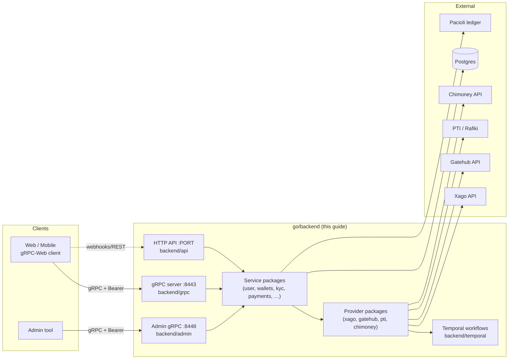
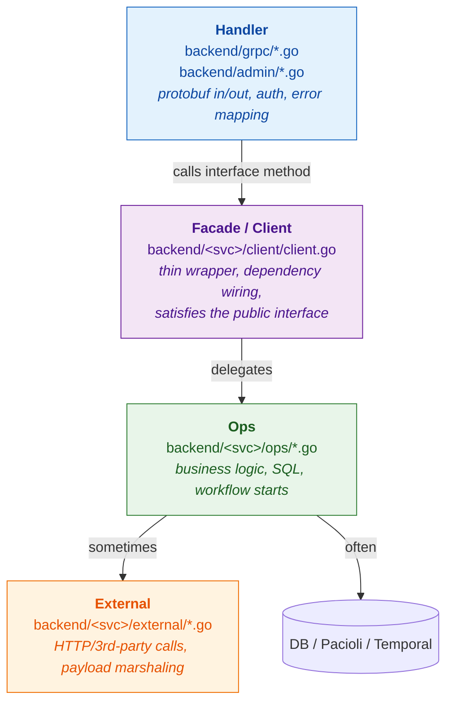
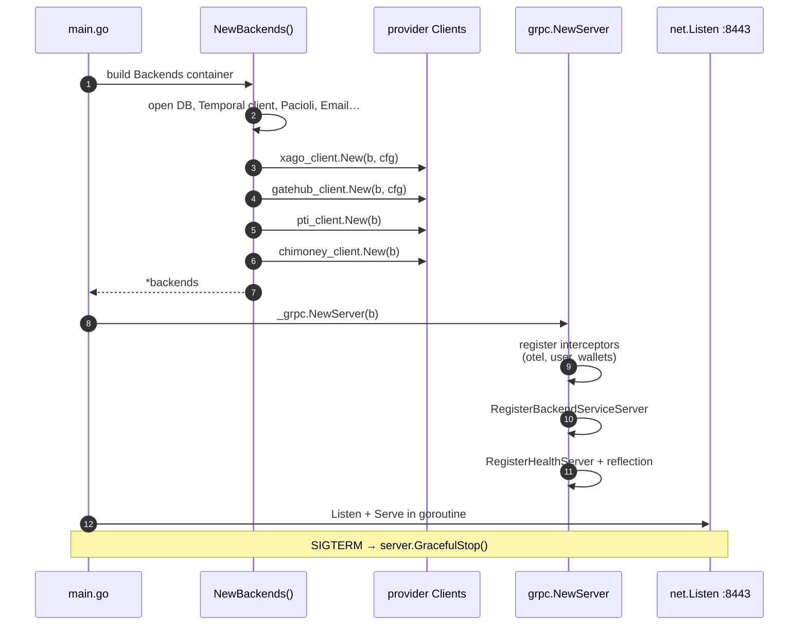
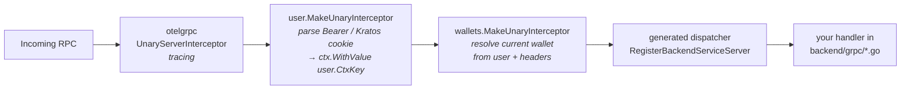
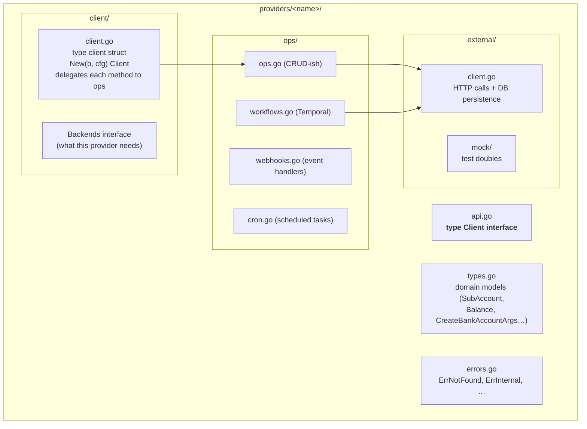
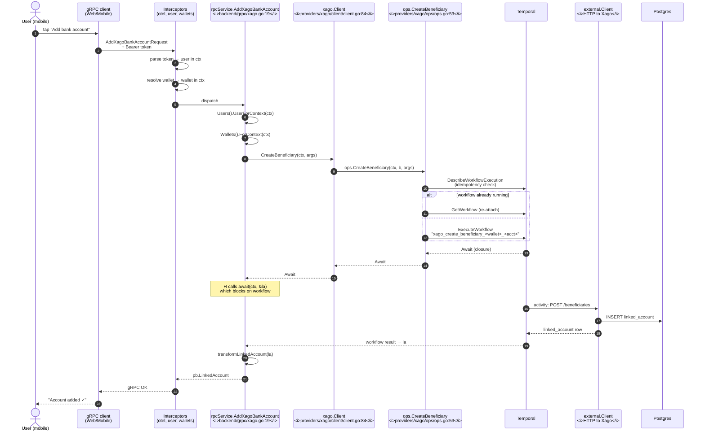
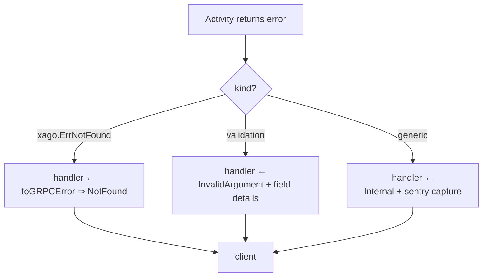

# Backend Architecture Guide — gRPC Edition

> An interactive walkthrough of the Go backend in `/go/backend`. Renders best
> in any Mermaid-aware viewer (GitHub, GitLab, VS Code preview, Obsidian,
> MkDocs Material with the `mermaid2` plugin). Diagrams animate on hover/zoom
> in most renderers — try clicking nodes in the sequence diagrams below.

---

## Table of Contents

1. [How to read this guide](#how-to-read-this-guide)
2. [Architecture at a glance](#architecture-at-a-glance)
3. [Repository layout](#repository-layout)
4. [The 4-layer service anatomy](#the-4-layer-service-anatomy)
5. [gRPC server bootstrapping](#grpc-server-bootstrapping)
6. [Code conventions (and which are Go-specific)](#code-conventions-and-which-are-go-specific)
7. [The Provider pattern, deep-dive](#the-provider-pattern-deep-dive)
8. [Worked example — `AddXagoBankAccount` end-to-end](#worked-example--addxagobankaccount-end-to-end)
9. [Adding a new provider — the checklist](#adding-a-new-provider--the-checklist)
10. [Claude Code interactive companion](#claude-code-interactive-companion)
11. [Glossary](#glossary)

---

## How to read this guide

This document is structured as a **guided tour**. You can read top-to-bottom,
but each section is self-contained:

| If you want to…                                         | Jump to                                                                                  |
| ------------------------------------------------------- | ---------------------------------------------------------------------------------------- |
| See the big picture                                     | [Architecture at a glance](#architecture-at-a-glance)                                    |
| Understand where files live                             | [Repository layout](#repository-layout)                                                  |
| Learn the layering pattern (handler / facade / ops)     | [The 4-layer service anatomy](#the-4-layer-service-anatomy)                              |
| See how gRPC is wired up                                | [gRPC server bootstrapping](#grpc-server-bootstrapping)                                  |
| Trace one real request, top-to-bottom                   | [Worked example](#worked-example--addxagobankaccount-end-to-end)                         |
| Add a new payment provider                              | [Adding a new provider](#adding-a-new-provider--the-checklist)                           |
| Use Claude to explore further                           | [Claude Code interactive companion](#claude-code-interactive-companion)                  |

Throughout, file references use the form `path/to/file.go:line` — paste them
into your editor's quick-open or hand them to Claude Code.

---

## Architecture at a glance



Three things to notice:

1. **Two gRPC servers in one binary**: a public one (`:8443`) and an admin one
   (`:8448`). They share the same `Backends` container but use different
   middleware chains.
2. **Providers are first-class** packages — not generic adapters. Each external
   integration (Xago, Gatehub, …) gets its own folder with a consistent shape.
3. **Long-running side effects go through Temporal** — handlers don't block on
   third-party APIs.

---

## Repository layout

```
interledger-app/
├── go/
│   ├── go.work                         # Go workspace (multi-module)
│   ├── backend/                        ◄── THIS GUIDE focuses here
│   │   ├── main.go                     # Composition root
│   │   ├── grpc/                       # Public gRPC handlers
│   │   ├── admin/                      # Admin gRPC handlers (:8448)
│   │   ├── api/                        # REST/HTTP handlers
│   │   ├── providers/                  # ★ External integrations
│   │   │   ├── xago/      gatehub/  pti/  chimoney/
│   │   │   └── http/                   # shared HTTP transport utils
│   │   ├── user/  wallets/  kyc/  payments/ …  # Domain services
│   │   ├── temporal/                   # Workflow runtime
│   │   └── …
│   ├── pacioli/                        # Double-entry ledger service
│   ├── geo/   log/   tracing/   env/   # Cross-cutting libs
│   ├── mock/                           # Mock servers for providers
│   │   ├── mockgatehub/  mockxago/  mockchimoney/  mockpti/  mockbos/
│   └── proto/                          # Generated Go proto code
├── proto/
│   └── backend/v1/backend.proto        # ★ Source of truth for RPCs
└── documentation/docs/                 # ← you are here
```

> 🧭 **Convention spotlight — no `internal/`, no `pkg/`.**  
> Many Go projects use `cmd/`, `internal/`, `pkg/` to enforce visibility. This
> repo deliberately doesn't. Discoverability is favored over compiler-enforced
> privacy: every domain gets a flat top-level package under `backend/`.

---

## The 4-layer service anatomy

Every domain service (and every provider) follows the same four-layer shape.
Once you see this in one place, you see it everywhere.



**Why split `client/` and `ops/` if `client/` is a thin wrapper?**

- The **interface** lives at the package root (e.g. `xago/api.go` defines
  `xago.Client`). Anyone can import the interface without pulling in DB/HTTP
  dependencies.
- The **concrete client** in `client/client.go` is what gets constructed in
  `main.go`. It owns the `external.Client` and a `Backends` dependency bundle.
- The **ops** package contains free functions `Foo(ctx, b Backends, …)`. They
  are easy to test in isolation because dependencies are passed as arguments,
  not stored on a receiver.

> 🧠 **Go-specific?**  
> *Partly.* The 4-layer split itself is generic (Hexagonal / Ports &
> Adapters). But two patterns here are very Go-flavored:
> - **Free functions over methods** in the `ops/` layer — leverages Go's lack
>   of a class system. Swap dependencies by passing different `Backends`.
> - **`var _ xago.Client = &client{}`** at the top of `client.go`
>   ([example](#provider-skeleton-anatomy)) is a Go idiom: a compile-time
>   *interface satisfaction assertion*. It costs nothing at runtime and gives
>   you immediate feedback when the interface drifts.

---

## gRPC server bootstrapping

### The composition root

Everything is wired in `main.go`. There is **no DI framework** (no
`google/wire`, no `uber/fx`) — just constructor calls.



Reference points:

- **Composition root** — `go/backend/main.go:244` constructs the gRPC server,
  `:249` serves it, `:251` builds the admin server, `:256` serves admin.
- **`NewBackends`** — `go/backend/main.go:666` is where every dependency is
  wired manually (DB, Temporal, providers, etc.).
- **`serveGrpc()`** — `go/backend/main.go:264` listens, registers a SIGTERM
  handler that calls `server.GracefulStop()`, and serves in a goroutine.

### The interceptor chain

`go/backend/grpc/server.go:17-30`:



A few specifics worth remembering:

- The `Backends` interface for the gRPC layer is defined in
  `go/backend/grpc/backends.go:35-65`. Every domain a handler can touch goes
  through a getter on this interface — `b.Users()`, `b.Wallets()`,
  `b.Xago()`, etc. **This is the boundary the handler talks to.**
- `grpc_health_v1.RegisterHealthServer` (`server.go:27`) is what makes
  Kubernetes liveness/readiness probes work.
- `reflection.Register(server)` (`server.go:28`) is what lets `grpcurl` or
  Postman discover the service without the `.proto` file.

### Auth middleware in detail

`go/backend/user/middleware/middleware.go:45-120`:

1. Inspect RPC method name → does it require auth? (skip-list at lines 23-42).
2. Try `Authorization: Bearer …` header → call `UserFromToken`.
3. Fall back to a Kratos session cookie.
4. Stuff the resolved user into the context with
   `context.WithValue(ctx, user.CtxKey, u)`.

In handlers you retrieve it with `s.b.Users().UserForContext(ctx)`. Same
pattern for wallet — `s.b.Wallets().ForContext(ctx)`.

> 🧠 **Go-specific?** *Yes.* `context.Context` value-passing for
> request-scoped data (user, request ID, traces) is idiomatic Go. The
> `CtxKey` typed-key trick prevents accidental key collisions — that's a Go
> best practice baked into `gorilla/mux`, the stdlib `net/http`, and gRPC
> alike.

---

## Code conventions (and which are Go-specific)

| Convention                                                    | Where to see it                                                  | Go-specific?                                                                                                                                |
| ------------------------------------------------------------- | ---------------------------------------------------------------- | ------------------------------------------------------------------------------------------------------------------------------------------- |
| Interface defined **at package root**, impls in subpackages   | `providers/xago/api.go` defines `xago.Client`                    | **Yes (idiomatic).** Go favors small interfaces near the consumer.                                                                          |
| `var _ xago.Client = &client{}` compile-time assertion        | `providers/xago/client/client.go:54`                             | **Yes.** Pure Go idiom.                                                                                                                     |
| `Backends` mega-interface for DI                              | `grpc/backends.go:35`, `xago/client/client.go:30`                | **Half.** The pattern is generic; using interfaces (vs structs) for DI is Go-leaning.                                                        |
| Free functions in `ops/` taking a `Backends` arg              | `xago/ops/ops.go:21,53,…`                                        | **Yes.** No classes, no `this`, no method chaining.                                                                                          |
| `context.Context` as first parameter of every public function | Everywhere                                                       | **Yes.** Go stdlib convention since Go 1.7.                                                                                                  |
| Errors compared with `errors.Is` / `errors.As`                | `grpc/errors.go:92,103`                                          | **Yes.** Go 1.13+ wrapping convention.                                                                                                       |
| Sentinel errors (`xago.ErrNotFound`, `user.ErrNoUserFound`)   | `providers/xago/errors.go`, `user/errors.go`                     | **Yes.** Common Go pattern; mapped to gRPC codes in `errors.go:30-42`.                                                                       |
| Errors mapped to gRPC status codes via lookup table           | `grpc/errors.go:30-42`                                           | Generic gRPC, but the `errors.Is` loop is Go.                                                                                               |
| Mock generation via `//go:generate mockgen`                   | Across packages, e.g. `wallets/mock/`                            | Go-specific tooling.                                                                                                                         |
| Table-driven tests + `gomock`                                 | `grpc/contacts_test.go`                                          | Go-specific (table tests are textbook Go).                                                                                                  |
| Structured logging with zap                                   | `log.Info(...)` everywhere; wrapper at `gitlab.com/fynbos/log`   | Library-specific; the wrapper is in-house.                                                                                                  |
| Tracing with OpenTelemetry                                    | `otelgrpc.UnaryServerInterceptor` in `grpc/server.go:19`         | Cross-language.                                                                                                                              |
| Long-running work via Temporal                                | `xago/ops/ops.go:53` (`CreateBeneficiary`)                       | Cross-language; the Go SDK is what's used here.                                                                                              |
| Flat package layout (no `internal/`)                          | `go/backend/`                                                    | Go-specific *non-use* — most repos use `internal/` for visibility, this one doesn't.                                                         |
| Two gRPC servers in one binary                                | `main.go:244,251`                                                | Generic.                                                                                                                                     |

### Error handling in one picture

```mermaid
flowchart LR
    H[handler returns err] --> T{toGRPCError(err)}
    T -->|validator.ValidationErrors| V[InvalidArgument<br/>+ FieldViolation details]
    T -->|sentinel match in errorStatus| S[mapped status.Error]
    T -->|errors.Is loop| W[mapped status.Error<br/>even when wrapped]
    T -->|fallthrough| I[Internal<br/>+ sentry.CaptureException]
    V --> Client((gRPC client))
    S --> Client
    W --> Client
    I --> Client
```

The lookup table at `grpc/errors.go:30-42` is the **only** place where domain
errors become gRPC status codes. If you add a new sentinel error in your
service, register it here.

---

## The Provider pattern, deep-dive

A "provider" in this codebase = an external integration that holds money,
moves money, or knows about an account on the user's behalf (Xago, Gatehub,
PTI, Chimoney, …).

### Provider skeleton anatomy



### Comparing the existing providers

| Provider | Region / use-case            | Code path                              | Async backbone                        |
| -------- | ---------------------------- | -------------------------------------- | ------------------------------------- |
| Xago     | ZAR / USD settlement (SA)    | `providers/xago/`                      | Temporal workflows + webhooks         |
| Gatehub  | EUR on/off-ramp (EU)         | `providers/gatehub/`                   | Widget URLs + webhooks                |
| PTI      | USD settlement via Rafiki    | `providers/pti/`                       | Direct sync calls + Rafiki workflows  |
| Chimoney | Cross-border transfers (CAD) | `providers/chimoney/`                  | Direct sync calls                     |

All four expose a `Client` interface at their package root, all four are
constructed in `NewBackends()` in `main.go`, all four are exposed as a getter
on `grpc.Backends`.

### What the gRPC handler sees

The handler **never** imports `external/` or `ops/`. It only sees:

```text
backend/grpc/xago.go   ──imports──▶   backend/providers/xago    (interface + types)
                         ↑
                         │ behind the scenes via Backends.Xago()
                         ↓
                       backend/providers/xago/client    (impl)
```

This is the seam that makes adding a provider safe — the handler talks to an
interface, not to an HTTP client.

---

## Worked example — `AddXagoBankAccount` end-to-end

Pick one specific RPC: a user adds a bank account so they can withdraw to it.



### Step-by-step, with file references

#### Step 1 — Proto definition

`proto/backend/v1/backend.proto:132`:

```text
rpc AddXagoBankAccount(AddXagoBankAccountRequest) returns (LinkedAccount);
```

Request message at `backend.proto:546-551`. Generated Go stubs land in
`go/proto/backend/v1/`.

#### Step 2 — Server registration

`go/backend/grpc/server.go:23`:

```text
backendv1.RegisterBackendServiceServer(server, &rpcService{b: b})
```

This single call wires *every* RPC defined in the proto to a method on
`rpcService`. The compiler will fail your build if any method is missing.

#### Step 3 — Handler

`go/backend/grpc/xago.go:19-49`:

- L20-23 → ensure user is present (returns `Unauthenticated` if not).
- L25-28 → resolve wallet from context.
- L30-37 → invoke the provider:
  `s.b.Xago().CreateBeneficiary(ctx, xago.CreateBankAccountArgs{…})`.
- L42-46 → block on the `Await` closure to get the actual `LinkedAccount`.
- L48 → marshal back to protobuf via `transformLinkedAccount`.

> 🧠 **What's `Await`?**  
> `xago.Await` (defined in `providers/xago/types.go`) is `func(ctx, out
> any) error`. It's the Temporal workflow's `.Get` method, type-erased.
> The handler decides *when* to block on the result — convenient for tests
> and for switching between sync/async without changing call sites.

#### Step 4 — Facade

`go/backend/providers/xago/client/client.go:84-86`:

```text
func (c *client) CreateBeneficiary(ctx, bankAcc) (xago.Await, error) {
    return ops.CreateBeneficiary(ctx, c.b, bankAcc)
}
```

Pure delegation. The reason this layer exists at all: it owns the
`external.Client` and the `Backends` bundle so `ops/` doesn't have to.

#### Step 5 — Ops + Temporal workflow

`go/backend/providers/xago/ops/ops.go:53-89`:

1. Build `StartWorkflowOptions` with a deterministic `ID` so retries
   collapse onto the same workflow:
   `"xago_create_beneficiary_<walletID>_<accountNumber>"`.
2. `WorkflowIDReusePolicy: TERMINATE_IF_RUNNING` — if a stale workflow
   exists, kill it.
3. `DescribeWorkflowExecution` to check status.
4. If running → `GetWorkflow` (re-attach). Otherwise → `ExecuteWorkflow`.
5. Return `await.Get` so the handler can block when it wants the result.

The actual workflow body lives in `xago/ops/workflows.go` (search for
`CreateBeneficiaryWorkflow`).

#### Step 6 — External call + DB persistence

`go/backend/providers/xago/external/client.go` — the workflow's activities
call HTTP, parse responses, and `INSERT` into `xago_*` tables.

#### Step 7 — Response transformation

Back in `grpc/xago.go:48`, `transformLinkedAccount(la)` (defined alongside)
maps the domain struct to the protobuf message. **Domain types don't leak to
the wire; protobuf types don't leak into business logic.**

### What if it fails?



Mapping table: `grpc/errors.go:30-42`. Sentinels: `xago/errors.go`.

---

## Adding a new provider — the checklist

Say you want to add **Acme** as a new payment provider.

```mermaid
flowchart TB
    classDef step fill:#f0f7ff,stroke:#1565c0
    S1[1️⃣  Define proto RPCs<br/>proto/backend/v1/backend.proto]:::step
    S2[2️⃣  Run buf / make to regenerate Go stubs]:::step
    S3[3️⃣  Create providers/acme/ skeleton<br/>api.go · types.go · errors.go]:::step
    S4[4️⃣  Implement providers/acme/external/<br/>HTTP client + mock/]:::step
    S5[5️⃣  Implement providers/acme/ops/<br/>+ Temporal workflows if needed]:::step
    S6[6️⃣  Implement providers/acme/client/<br/>satisfy acme.Client interface]:::step
    S7[7️⃣  Wire in main.go NewBackends<br/>b.acme = acme_client.New&#40;b, cfg&#41;]:::step
    S8[8️⃣  Add Acme&#40;&#41; to grpc/backends.go<br/>and admin/backends.go interfaces]:::step
    S9[9️⃣  Implement gRPC handlers in<br/>backend/grpc/acme.go]:::step
    S10[🔟  Map domain errors in grpc/errors.go]:::step
    S11[1️⃣1️⃣  Add tests: ops table tests<br/>+ handler tests with mocks]:::step
    S12[1️⃣2️⃣  Add mock server in go/mock/mockacme/]:::step

    S1 --> S2 --> S3 --> S4 --> S5 --> S6 --> S7 --> S8 --> S9 --> S10 --> S11 --> S12
```



### Step-by-step

<details>
<summary><b>1. Add RPCs to the proto</b></summary>

Append your RPCs and messages to `proto/backend/v1/backend.proto` (look for
the `// Xago` block at line 132 as a template). Conventions:

- RPC names are `PascalCase` verbs: `AddAcmeBankAccount`, `GetAcmeBalances`.
- Request/response messages share the RPC name + `Request`/`Response`.
- Reuse `LinkedAccount`, `Balance`, etc. where it fits — don't duplicate.

</details>

<details>
<summary><b>2. Regenerate Go stubs</b></summary>

```bash
cd proto && make           # uses buf via buf.gen.yaml
```

Generated code appears under `go/proto/backend/v1/`.

</details>

<details>
<summary><b>3-6. Create the provider package</b></summary>

Mirror `providers/xago/` — it's the most fully-featured template:

```
backend/providers/acme/
├── api.go          # type Client interface { … }
├── types.go        # domain structs
├── errors.go       # var ErrNotFound = errors.New(…)
├── client/
│   └── client.go   # New(b, cfg) Client; var _ acme.Client = &client{}
├── ops/
│   ├── ops.go
│   ├── workflows.go    # if you need Temporal
│   └── backends.go     # type Backends interface { … }
└── external/
    ├── client.go
    └── mock/
```

The `Backends` interface in `client/client.go` declares **only** the other
domain services your provider needs — keep it minimal so test setup is easy.

</details>

<details>
<summary><b>7. Wire it in <code>main.go</code></b></summary>

Inside `NewBackends()` (around lines 666-867), after constructing
prerequisites, add:

```text
b.acme = acme_client.New(b, b.acmeConfig)
```

…and expose it on the `backends` struct with an `Acme()` getter
(returning `acme.Client`).

</details>

<details>
<summary><b>8. Expose on the gRPC <code>Backends</code> interface</b></summary>

Two places:

- `go/backend/grpc/backends.go` — add `Acme() acme.Client`.
- `go/backend/admin/backends.go` — add the same if admin needs it.

The compiler enforces that `*backends` (in `main.go`) satisfies both — you'll
know immediately if you forgot something.

</details>

<details>
<summary><b>9. Implement the handlers</b></summary>

Create `go/backend/grpc/acme.go`. Each handler:

1. Auth check via `s.b.Users().UserForContext(ctx)`.
2. Wallet check via `s.b.Wallets().ForContext(ctx)`.
3. Domain call via `s.b.Acme().YourMethod(ctx, args)`.
4. `transformXxx` to the protobuf response.
5. Return `nil, toGRPCError(err)` on errors.

</details>

<details>
<summary><b>10-12. Errors, tests, mocks</b></summary>

- Register sentinels in `grpc/errors.go:errorStatus`.
- Mirror an existing `*_test.go` (e.g. `grpc/contacts_test.go`) — uses
  `gomock`, `NewTestContainer(t, ctrl)`.
- Optionally add a fake server under `go/mock/mockacme/` for local dev.

</details>

### Acceptance checklist

- [ ] Proto compiles, all RPC stubs generated
- [ ] `go vet ./...` and `go build ./...` clean from `go/backend`
- [ ] `var _ acme.Client = &client{}` present in `client/client.go`
- [ ] Handler doesn't import `external/` or `ops/` directly
- [ ] All sentinels mapped in `grpc/errors.go`
- [ ] Mock server runs locally if other devs need to test against you
- [ ] At least one happy-path + one error-path handler test

---

## Claude Code interactive companion

This is the *interactive* part. The diagrams above render and zoom; the
prompts below let you continue exploration in this same session — Claude
already has the context loaded.

### How to use this section

Paste any of the prompts below into your Claude Code chat. Claude can:

- Read files & jump to file:line.
- Render new Mermaid diagrams on demand.
- Generate ASCII call-graphs.
- Run `grpcurl` against a local server to demo a real call.
- Open `git log` / `git blame` to explain history.

### Guided tour prompts

> 💬 **Tour 1 — "Show me how `Backends` is built"**
>
> > Walk me through `NewBackends()` in `go/backend/main.go` step by step.
> > For every provider construction, render a Mermaid diagram showing what
> > it depends on (DB, Temporal, other providers). Use file:line refs.

> 💬 **Tour 2 — "Compare two providers"**
>
> > Compare `providers/xago` and `providers/gatehub` side by side. Build a
> > table of every method on each `Client` interface and note which are
> > sync vs async (Temporal-backed). Highlight any divergence from the
> > 4-layer pattern.

> 💬 **Tour 3 — "Trace a different RPC"**
>
> > Pick `GetGatehubDepositWidget` and trace it the same way the
> > backend-architecture-guide traces `AddXagoBankAccount`. Render a new
> > Mermaid sequence diagram. Note any differences in the flow (e.g.
> > Temporal vs direct HTTP).

> 💬 **Tour 4 — "Show me the auth flow"**
>
> > Render a sequence diagram of how a Bearer token in an incoming gRPC
> > request becomes `s.b.Users().UserForContext(ctx)` returning a `*User`
> > inside a handler. Read
> > `go/backend/user/middleware/middleware.go` and
> > `go/backend/user/client/`. Highlight the AAL (Authentication Assurance
> > Level) check.

> 💬 **Tour 5 — "Generate a new-provider scaffold"**
>
> > Without writing any production code, list every file I'd need to
> > create under `providers/acme/` to add a new provider called Acme.
> > For each file, give me a 3-line description of what should be inside
> > and which existing file is the closest template.

### Self-check questions

Try answering these from the guide; if you can't, ask Claude.

1. Why are there two gRPC servers in this binary, and what binds to what
   port? *(hint: §[gRPC server bootstrapping](#grpc-server-bootstrapping))*
2. Where does a domain error like `wallets.ErrNoWalletFound` get translated
   into `codes.NotFound`?
3. What's the *exact* import direction between `grpc/xago.go`,
   `providers/xago/client`, `providers/xago/ops`, and
   `providers/xago/external`? Draw it as an arrow chain.
4. If `CreateBeneficiary` gets called twice for the same wallet + account
   number within seconds, what stops two side-effecting calls to Xago from
   happening?
5. The handler returns `pb.LinkedAccount` but ops returns
   `linkedaccounts.LinkedAccount`. Where is the mapping function, and why
   isn't it inside `linkedaccounts/`?

### Diagram-on-demand prompts

> 💬 **"Render a class-style diagram of `grpc.Backends`"**
>
> > Read `go/backend/grpc/backends.go` and render a Mermaid `classDiagram`
> > listing every getter and the package each return type comes from.
> > Group providers vs domain services with subgraphs.

> 💬 **"Show the data lifecycle of a `LinkedAccount`"**
>
> > Trace `LinkedAccount` from creation (in some `external/` activity) →
> > storage in DB → fetch in `linkedaccounts/ops` → return to handler →
> > transform to protobuf. Render a flow diagram.

> 💬 **"Make me a state diagram of an Xago workflow"**
>
> > Read `go/backend/providers/xago/ops/workflows.go` and render a state
> > diagram of the Temporal workflow lifecycle for `CreateBeneficiary`.

### Exploration shortcuts

| To explore…                  | Tell Claude…                                                                                        |
| ---------------------------- | ---------------------------------------------------------------------------------------------------- |
| Any RPC's full path          | `"Trace <RpcName> end-to-end and render a sequence diagram."`                                       |
| One package's public API     | `"List every exported symbol in <pkg> with a one-line summary."`                                    |
| Test patterns                | `"Read <file>_test.go and explain the testing conventions used here."`                              |
| What changed recently        | `"git log --oneline -20 -- go/backend/providers/<name>/ and summarize the last 5 changes."`         |
| Generated code               | `"Show me the generated server interface for BackendService and which methods aren't implemented."` |

> ✨ **Tip — pinning**  
> If you want Claude to keep this guide top-of-mind across the session,
> say:  
> > *"Use `documentation/docs/backend-architecture-guide.md` as the
> > reference for any backend questions in this session."*

---

## Glossary

| Term            | Meaning in this codebase                                                                       |
| --------------- | ---------------------------------------------------------------------------------------------- |
| **Backends**    | The dependency-injection container interface. Every layer has its own narrower `Backends`.     |
| **Provider**    | A package under `backend/providers/` integrating one external money / account system.          |
| **Facade**      | The `client/client.go` thin wrapper that satisfies the public `Client` interface.              |
| **Ops**         | Free functions in `<svc>/ops/` doing the actual work: SQL, workflow starts, business rules.    |
| **External**    | The HTTP-talking layer in `<svc>/external/`. The only place that knows about the 3rd-party API.|
| **Await**       | A `func(ctx, out any) error` closure returned by ops when work is async; usually a Temporal `.Get`. |
| **Sentinel error** | A package-level `var ErrFoo = errors.New(…)` used with `errors.Is`.                         |
| **AAL**         | Authentication Assurance Level — used by middleware to require step-up auth on sensitive RPCs. |
| **Pacioli**     | The internal double-entry ledger service (`go/pacioli/`).                                      |
| **Rafiki**      | An Open Payments / Interledger reference implementation; PTI integration uses it.              |

---

*Document version 1 — generated for branch
`claude/backend-architecture-guide-t9o18`. To regenerate or extend, ask
Claude Code:* > *"Update `backend-architecture-guide.md` to include
\<topic\>."*
