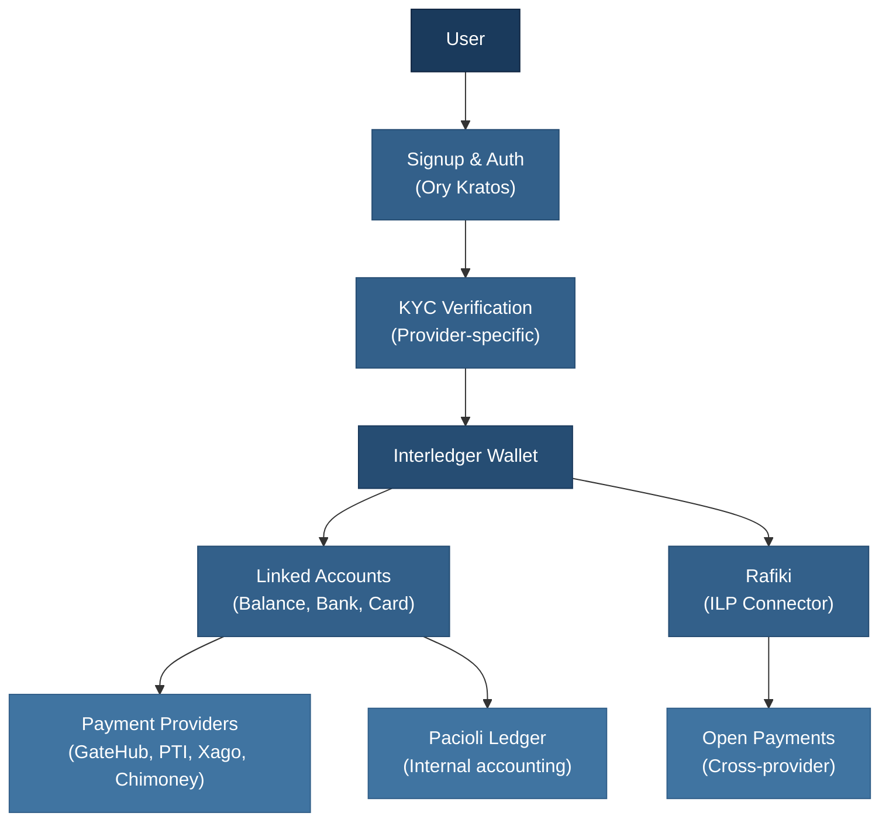

# Interledger App Wallet

The Interledger App Wallet is a reference implementation for **Account Servicing Entities (ASEs)** demonstrating how to integrate with the Interledger network to build an open payment network where multiple organizations can connect and interoperate.

It enables:

- **Cross-border payments** that are quick and easy
- **High-speed transactions** across multiple providers and currencies
- **Content creator monetization** via Open Payments and Web Monetization

Users get a single wallet that connects to one payment provider (GateHub, PTI, Xago, or Chimoney) and holds multiple linked accounts across different currencies — without maintaining separate accounts at each provider.

---

## Documentation Guide

### Getting Started

| Document | Description |
|----------|-------------|
| [Core Concepts](concepts.md) | Terminology reference — maps provider vocabularies to Interledger App concepts |
| [Signup Flow](signup-explainer.md) | The complete registration process: profile, phone verification, TOTP, wallet address |
| [KYC & Identity Verification](kyc-explainer.md) | How identity verification gates wallet activation, per provider |

### Architecture

| Document | Description |
|----------|-------------|
| [Wallets, Accounts & Addresses](wallets-vs-accounts-vs-addresses.md) | The three-layer model: wallet containers, linked accounts, and payment addresses |
| [Dual-Ledger System](ledger-system-explainer.md) | Why we maintain Pacioli (internal) and provider (external) ledgers, and how they reconcile |

### Payments

| Document | Description |
|----------|-------------|
| [Payments & Transactions](payments-explainer.md) | End-to-end guide: how money moves, reservation, settlement, and the payment lifecycle |
| [Transaction Types Reference](transaction-types-explainer.md) | Field specifications for send, receive, deposit, withdrawal, and card transactions |
| [Provider Comparison](provider-payments-guide.md) | GateHub vs PTI vs Xago vs Chimoney — speeds, fees, capabilities, and special cases |

### Integrations

| Document | Description |
|----------|-------------|
| [GateHub Cards](gatehub-cards-explainer.md) | EUR debit card issuing: customer onboarding, card lifecycle, 3DS, webhooks |

### Operations

| Document | Description |
|----------|-------------|
| [Payment Troubleshooting](payment-troubleshooting-guide.md) | Systematic debugging framework for stuck payments, balance mismatches, and missing receipts |
| [Logging Policy](logging-policy.md) | Log levels, formatting standards, and what must never be logged |

---

## Quick Reference

