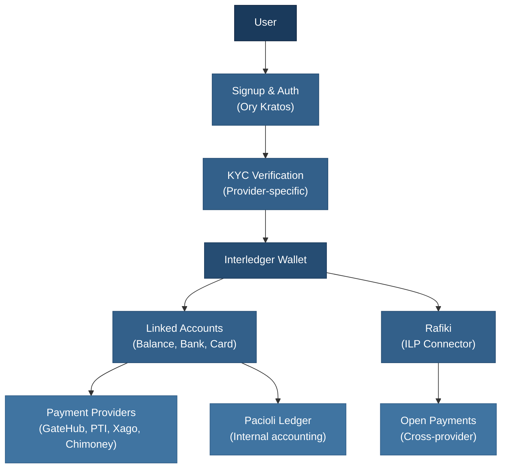

# Interledger App Wallet

The Interledger App Wallet is a multi-provider payment platform built on the Interledger network. It operates as an **Account Servicing Entity (ASE)**, connecting to payment providers in different countries to offer users a unified wallet experience across an open payment network.

It enables:

- **Cross-border payments** that are quick and easy
- **High-speed transactions** across currencies and providers
- **Content creator monetization** via Open Payments and Web Monetization

Users get a single wallet tied to one payment provider (GateHub, PTI, Xago, or Chimoney) based on their country, with linked accounts that can hold balances across different currencies.

---

## Documentation Guide

### Getting Started

| Document | Description |
|----------|-------------|
| [Core Concepts](terminology.md) | Terminology reference — maps provider vocabularies to Interledger App concepts |
| [Signup Flow](signup-guide.md) | The complete registration process: profile, phone verification, TOTP, wallet address |
| [KYC & Identity Verification](kyc-guide.md) | How identity verification gates wallet activation, per provider |

### Architecture

| Document | Description |
|----------|-------------|
| [Wallets, Accounts & Addresses](wallets-accounts-addresses-guide.md) | The three-layer model: wallet containers, linked accounts, and payment addresses |
| [Dual-Ledger System](ledger-system-guide.md) | Why we maintain Pacioli (internal) and provider (external) ledgers, and how they reconcile |

### Payments

| Document | Description |
|----------|-------------|
| [Payments & Transactions](payments-guide.md) | End-to-end guide: how money moves, reservation, settlement, and the payment lifecycle |
| [Transaction Types Reference](transaction-types-reference.md) | Field specifications for send, receive, deposit, withdrawal, and card transactions |
| [Provider Comparison](provider-payments-reference.md) | GateHub vs PTI vs Xago vs Chimoney — speeds, fees, capabilities, and special cases |

### Integrations

| Document | Description |
|----------|-------------|
| [GateHub Cards](gatehub-cards-guide.md) | EUR debit card issuing: customer onboarding, card lifecycle, 3DS, webhooks |

### Operations

| Document | Description |
|----------|-------------|
| [Payment Troubleshooting](payment-troubleshooting-guide.md) | Systematic debugging framework for stuck payments, balance mismatches, and missing receipts |

### Developers

| Document | Description |
|----------|-------------|
| [Logging Reference](logging-reference.md) | Log levels, formatting standards, and structured logging guidelines |

---

## Quick Reference

