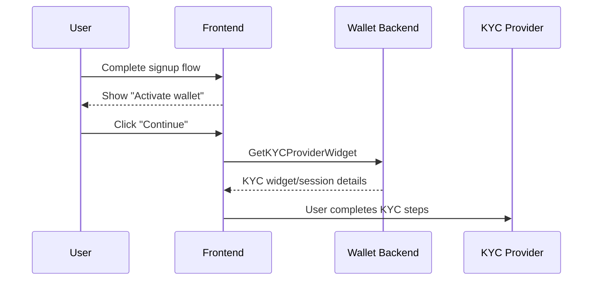
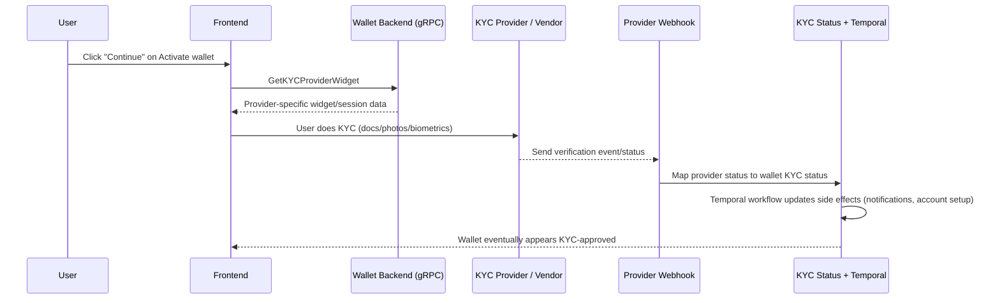
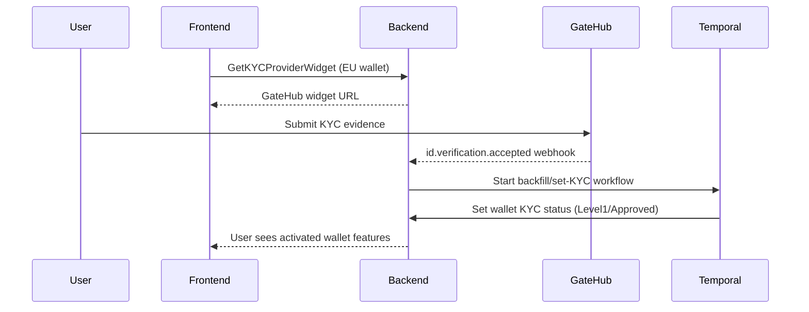
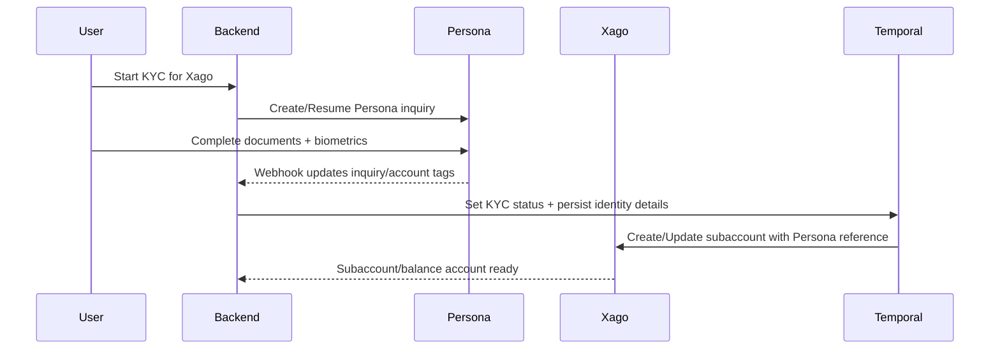
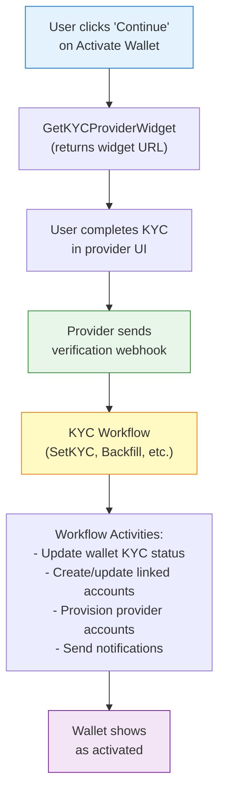
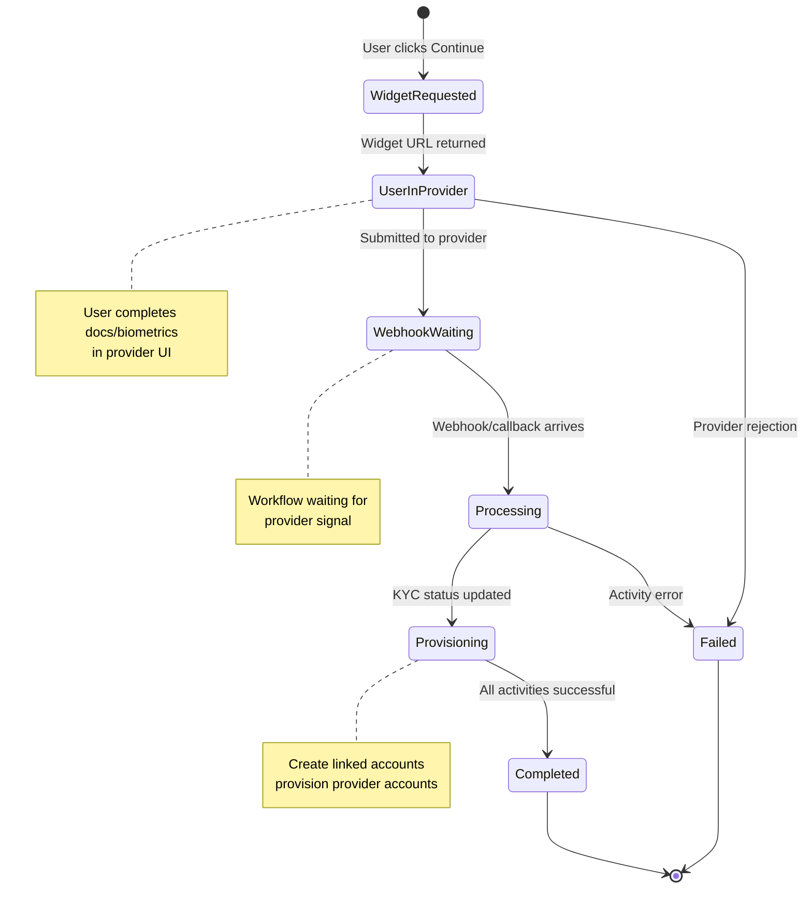

# KYC Explainer

> **Identity verification guide.** Understand KYC flows and how they gate wallet activation across providers.

**Related documents:**

- [Concepts](terminology.md) — Wallet and linked-account terminology
- [Payments Guide](payments-guide.md) — How KYC gates transaction authorization
- [Provider Payments Guide](provider-payments-reference.md) — Provider-specific KYC implementations
- [Ledger System Architecture](ledger-system-guide.md) — How KYC completion affects balance/account provisioning
- [Wallets vs Accounts](wallets-accounts-addresses-guide.md) — Wallet activation architecture
- [Payment Troubleshooting](payment-troubleshooting-guide.md) — Debugging KYC-blocked transactions
- [Environment Variables](env-variables.md) — Provider endpoints and KYC integration credentials by environment

**Quick Navigation:**

- **User stuck in KYC?** → Jump to [Provider Deep Dive](#8-provider-deep-dive)
- **Need context for `action_required`?** → See [GateHub KYC Flow](#81-gatehub-eu-heavy-path)
- **GateHub iframe issues?** → See [GateHub KYC Flow](#81-gatehub-eu-heavy-path)
- **Xago verification problems?** → See [Xago KYC Flow](#82-xago-and-persona-south-africa-path)
- **General KYC troubleshooting?** → See [Practical Troubleshooting Checklist](#11-practical-troubleshooting-checklist-for-support)

**Scope:** What KYC is, how it works in Interledger App, and how provider differences affect the user journey.

---

## 1) User journey first: signup → activate wallet → KYC

Before going deep into KYC internals, this is the user-facing journey to keep in mind.

After a user completes signup (account creation, verification, and wallet address setup), the app asks them to **Activate wallet**.

In plain terms, **Activate wallet** means:

- “Finish the required identity checks so this wallet can perform regulated financial actions.”

So when a user clicks **Continue** on the Activate wallet prompt, they are starting or resuming their provider-specific KYC flow.



This framing helps avoid confusion: KYC is not a separate product area from activation; it is the core part of wallet activation.

---

## 2) What KYC means in Interledger App

KYC (Know Your Customer) is the process of verifying a user’s real-world identity before allowing regulated financial activity.

From an Interledger App wallet perspective:

- A user has **one Interledger wallet**.
- That wallet has **linked accounts** at its associated provider (see [Concepts](terminology.md#core-terms) for definitions).
- KYC status is tracked at the wallet level in Interledger App, but **evidence and verification workflows are often provider-specific**.

In practice, KYC should be understood as:

1. **A compliance gate** (can this wallet perform regulated actions?)
2. **A provider integration** (which external party performed verification?)
3. **A changing legal requirement** (rules vary by country, provider, and over time)

---

## 3) Why we intentionally keep KYC data minimal

A core operating principle is data minimization:

- We want to keep as little private user information as possible on our side.
- More PII and biometric data stored by us means more legal, compliance, and breach risk.
- Where possible, providers (or their KYC vendors) handle document capture/biometrics and hold the most sensitive artifacts.

Support talk track:

- “Interledger App tracks KYC status and required profile details to operate the wallet, but the detailed identity verification evidence is generally handled by the provider-side KYC systems.”

---

## 4) Compliance reality: KYC is tied to transactions

At a policy level, KYC is linked to anti-money-laundering (AML) obligations. Operationally, this means:

- Transactions must be attributable to appropriately verified users (see [Payments & Transactions](payments-guide.md#understanding-transactions)).
- The exact requirement can differ by country and provider.
- We should expect policy evolution, including possibilities like:
  - KYC expiration/reverification windows
  - rule changes by jurisdiction
  - different thresholds for different transaction types

**Important support framing:**

We are still refining exact interpretations per provider/country. The system is designed to be flexible because legal requirements may change.

---

## 5) Language guidance for support conversations

When talking with users or internal teams, use provider-specific phrasing.

Prefer:

- “The user needs to do KYC for GateHub.”
- “The user already completed KYC for Xago.”
- “This wallet is waiting on Chimoney KYC completion.”

Avoid generic phrasing like “KYC is done everywhere” unless you are sure all relevant provider requirements are satisfied.

Why this matters:

- KYC completion in one provider/legal path may not automatically satisfy another provider/legal path.
- During provider migrations, users in the same country may be split across providers.

---

## 6) High-level system flow

A simplified flow when a user clicks **Continue** in “Activate wallet”:



KYC usually includes:

- identity document uploads
- selfie/photo checks
- sometimes additional biometric checks

---

## 7) How provider routing works today (wallet-country driven)

In backend KYC widget routing:

- **EU wallets** → GateHub onboarding widget
- **CA wallets** → Chimoney KYC widget
- **US wallets** → PTI widget flow
- **Other wallets (notably ZA)** → Persona inquiry flow (often for Xago-related onboarding)

This is why support may see different KYC UI and timing for users with similar complaints.

---

## 8) Provider deep dive

## 8.1 GateHub (EU-heavy path)

### How it works

- User is linked as a managed GateHub user and linked to a GateHub gateway.
- User performs KYC in GateHub onboarding flow.
- GateHub sends verification webhooks (for example accepted/rejected/action_required).
- Backend maps these into Interledger KYC statuses and triggers Temporal workflows.

### Support implications

- A GateHub “accepted” signal generally transitions wallet KYC to approved levels.
- Action-required signals should be treated as “user must revisit provider KYC flow.”
- Card operations may have additional GateHub conditions beyond baseline KYC.

### Sequence (GateHub acceptance)



---

## 8.2 Xago and Persona (South Africa path)

### How it works

Xago flow is more complex because it can involve an external KYC vendor (Persona):

- Persona handles inquiry/session and verification evidence.
- Interledger App stores and tracks inquiry/account linkage + normalized status.
- Xago subaccount creation/update can depend on Persona artifacts (for example an approved inquiry URL and ID number).

This means there are multiple systems in play:

1. Interledger App
2. Persona (KYC vendor)
3. Xago (financial provider)

### Why this creates migration complexity

Because KYC can be anchored in an external vendor and legal entity context, moving users between providers or legal entities may require revalidation steps. We experienced major complexity during migration from the original Fynbos context to Interledger Foundation-managed operations.

### Sequence (Xago + Persona)



### Support implications

- Tickets may involve either Persona state, Xago state, or mapping between them.
- “KYC completed in Persona” does not always mean all downstream provider-side steps are finished.
- Investigate both inquiry status and provider account linkage.

---

## 8.3 PTI (US path)

### How it works

- US users receive a PTI widget configuration from backend.
- Wallet KYC state enters pending and US-specific provisioning steps may run.
- On KYC progression, wallet/provider setup continues through workflow activities.

### Support implications

- PTI onboarding is widget-driven but state transitions are asynchronous.
- Users can appear “stuck” if provider completion callback/state propagation is delayed.
- Verify both KYC status and PTI wallet/account setup status.

---

## 8.4 Chimoney (Canada path)

### How it works

- Backend provides a Chimoney KYC widget URL.
- Chimoney wallet/sub-account and linked account setup are workflow-driven.
- A watcher workflow polls for successful KYC outcome and then updates wallet KYC status.

### Support implications

- Completion can be delayed due to polling/asynchronous flow.
- Distinguish between: “widget started”, “provider verification complete”, and “wallet status updated”.

---

## 9) KYC migration and future licensing: key support answer patterns

The organization’s long-term goal may include becoming a financial services license holder and reducing dependence on third-party providers.

Common support question:

- “If we move users away from provider X, will they need to do KYC again?”

Safe and accurate support answer:

- “It depends on jurisdiction, legal entity boundaries, and whether existing KYC evidence is legally portable. In many cases, users may need at least partial re-verification. We evaluate this per migration path.”

Do **not** promise universal KYC portability.

---

## 10) Mixed-provider reality within one country

During migrations or staged rollouts, it is valid for:

- some users in country C to be on provider A,
- while others in the same country are on provider B.

When investigating KYC issues, always identify:

1. user wallet country
2. current provider assignment / linked accounts
3. current KYC provider flow

before giving procedural instructions.

---

## 11) Practical troubleshooting checklist for support

When user says “my KYC is stuck,” gather this minimum context:

1. Wallet ID and country
2. Provider path (GateHub / Xago+Persona / PTI / Chimoney)
3. Current KYC status in backend (int enum, string values via `kyc.Status.String()`): `Unknown` (0), `Pending` (1), `DocumentsRequired` (2), `Approved` (3), `Denied` (4), `InReview` (5), `Level1` (6), `Level2` (7)
4. Most recent provider webhook signal (if any)
5. Whether downstream provisioning finished (for example linked account/subaccount creation)

Then classify:

- **No widget/session issue** (cannot start KYC)
- **In-provider issue** (user cannot complete docs/biometrics)
- **Webhook/state propagation issue** (provider done, app not updated)
- **Post-KYC provisioning issue** (KYC approved, but accounts/features not enabled)

---

## 12) Suggested support phrasing library

- “Your wallet activation depends on completing KYC with your assigned provider.”
- “For your account, this is a **GateHub** KYC flow.”
- “For your account, this is an **Xago flow that uses Persona** for identity verification.”
- “We can see your KYC evidence step is complete, and we’re now waiting for provider confirmation to propagate.”
- “KYC requirements can vary by country and may change over time due to regulation.”

---

## 13) Temporal Debugging Guide for KYC

Temporal is the workflow orchestration engine that manages KYC processing. When users appear stuck in wallet activation or KYC status isn't updating, Temporal's Web UI provides visibility into what's happening behind the scenes.

**Accessing Temporal Web UI:**
- URL: `http://localhost:8233` (or your Temporal server address)
- No authentication required for local development
- Production: Requires proper credentials

### Understanding KYC Workflow Structure

KYC workflows vary by provider, but they all follow a similar pattern of orchestrating provider integration, status updates, and downstream provisioning.



**Common KYC workflow types:**
- **SetKYCWorkflow** - Updates wallet KYC status based on provider webhooks
- **BackfillKYCWorkflow** - Syncs existing provider KYC state to wallet
- **CreateLinkedAccountWorkflow** - Provisions provider accounts after KYC approval
- **KYCWatcherWorkflow** - Polls provider for KYC completion (Chimoney, some PTI flows)

### Finding a Stuck KYC Process in Temporal

**Step 1: Get the User/Wallet Identifier**

From your database:
```sql
-- Find wallet by user email
SELECT w.id as wallet_id, w.country, w.kyc_status, u.id as user_id
FROM wallets w
JOIN users u ON u.wallet_id = w.id
JOIN identities i ON i.id = u.identity_id
WHERE i.email = 'user@example.com';

-- Or directly by wallet ID
SELECT id, country, kyc_status, created_at, updated_at
FROM wallets
WHERE id = 'wallet_uuid';
```

Copy the `wallet_id` or `user_id` to search for workflows.

**Step 2: Search for KYC Workflows**

1. Open Temporal Web UI: `http://localhost:8233`
2. Go to **"Workflows"** tab (left sidebar)
3. Search for workflows using the wallet or user ID:
   - Enter the UUID in the search box
   - Or filter by workflow type: `SetKYCWorkflow`, `BackfillKYCWorkflow`, etc.

**Step 3: Check Workflow Status**

| Status | Meaning | Action |
|--------|---------|--------|
| **Running** | Workflow is actively processing or waiting | Check duration — KYC workflows vary by provider |
| **Completed** | Workflow finished successfully | Verify wallet KYC status updated in database |
| **Failed** | Workflow encountered an error | Check error message for root cause |
| **Terminated** | Manually stopped or system shutdown | Investigate why and whether to retry |
| **Timed Out** | Exceeded maximum allowed time | Rare for KYC workflows; check activity timeouts |

### Investigating a Running KYC Workflow

**Provider-specific normal durations:**

| Provider | Normal Duration | What's Happening |
|----------|----------------|------------------|
| **GateHub** | 5-30 seconds | Webhook-driven, completes quickly after verification |
| **Xago + Persona** | 2-5 minutes | Multi-step: Persona inquiry → webhook → Xago account creation |
| **PTI** | 1-3 minutes | Widget callback → account provisioning |
| **Chimoney** | 5-20 minutes | Polling-based, checks every few minutes for completion |

**Step 1: Click on the Workflow ID** to see details

**Step 2: Check the "Summary" section**
```
WorkflowId:      SetKYCWorkflow_<wallet_uuid>
Type:            SetKYCWorkflow
Status:          Running
Start Time:      8 minutes ago
Run Time:        8 minutes
```

**Questions to ask based on provider:**

**GateHub (webhook-driven):**
- **< 2 minutes** → Normal, waiting for webhook
- **2-10 minutes** → Check webhook logs, provider may be slow
- **> 10 minutes** → Webhook likely lost, investigate provider status

**Xago + Persona (multi-step):**
- **< 5 minutes** → Normal, multi-step process
- **5-15 minutes** → Monitor, could be Xago account creation delay
- **> 15 minutes** → Check both Persona inquiry state AND Xago account status

**Chimoney (polling):**
- **< 20 minutes** → Normal, polling every few minutes
- **20-40 minutes** → Monitor, may need manual check of Chimoney status
- **> 40 minutes** → Likely provider issue or polling failure

**PTI (callback):**
- **< 5 minutes** → Normal, waiting for widget callback
- **5-15 minutes** → Check callback logs
- **> 15 minutes** → Callback likely lost or failed

**Step 3: View the "Pending Activities" section**

```
Pending Activities:
  CreateXagoSubaccount (started 3 minutes ago)
```

This shows which activity is currently executing. Common activities:

- `UpdateWalletKYCStatus` - Writing KYC status to database
- `CreateLinkedAccount` - Creating provider account link
- `CreateGatehubManagedUser` - Provisioning GateHub user
- `CreateXagoSubaccount` - Provisioning Xago subaccount
- `CreatePersonaInquiry` - Starting Persona verification
- `GetChimoneyKYCStatus` - Polling Chimoney for completion

**Step 4: Check the "History" tab**

Look for key events in the workflow timeline:

1. **Workflow started:**
   ```
   WorkflowExecutionStarted
   Input: { "walletId": "...", "provider": "gatehub", "event": "id.verification.accepted" }
   ```

2. **Activities executing:**
   ```
   ActivityTaskScheduled: UpdateWalletKYCStatus
   ActivityTaskStarted:   UpdateWalletKYCStatus
   ActivityTaskCompleted: UpdateWalletKYCStatus
   ```

3. **For webhook-driven flows, look for signal:**
   ```
   WorkflowExecutionSignaled
   Signal: kyc_verification_webhook
   Input: { "status": "accepted", "userId": "..." }
   ```

4. **Provider-specific activities:**

   **GateHub:**
   ```
   ActivityTaskCompleted: CreateGatehubManagedUser
   ActivityTaskCompleted: LinkGatehubGateway
   ActivityTaskCompleted: UpdateWalletKYCStatus (status: level1)
   ```

   **Xago + Persona:**
   ```
   ActivityTaskCompleted: CreatePersonaInquiry
   [Wait for webhook signal]
   WorkflowExecutionSignaled: persona_inquiry_completed
   ActivityTaskScheduled: CreateXagoSubaccount
   ActivityTaskCompleted: CreateXagoSubaccount
   ActivityTaskCompleted: UpdateWalletKYCStatus (status: level1)
   ```

   **Chimoney:**
   ```
   ActivityTaskScheduled: GetChimoneyKYCStatus (attempt 1)
   ActivityTaskCompleted: GetChimoneyKYCStatus (result: pending)
   [Timer: wait 2 minutes]
   ActivityTaskScheduled: GetChimoneyKYCStatus (attempt 2)
   ActivityTaskCompleted: GetChimoneyKYCStatus (result: approved)
   ActivityTaskCompleted: UpdateWalletKYCStatus
   ```

### Common KYC Temporal Scenarios

#### Scenario 1: Waiting for Provider Webhook (GateHub, Xago)

**What you see:**
```
Type:      SetKYCWorkflow
Status:    Running
Run Time:  3 minutes
History:   - WorkflowExecutionStarted ✓
           - (waiting for signal)
```

**Meaning:** Workflow was started (probably by a widget redirect or preemptive setup) and is now waiting for the provider to send verification results.

**Action:**
- **If < 5 minutes:** Normal, user may still be completing KYC in provider UI
- **If 5-15 minutes:** Check if user completed provider KYC steps
- **If > 15 minutes:** 
  - Verify user finished provider KYC
  - Check webhook logs for missed events
  - Check provider status directly

**How to check provider status:**

**GateHub:**
```bash
# Query GateHub user status
curl -H "Authorization: Bearer <token>" \
  https://mockgatehub.interledger.test/id/v1/users/<gatehub_user_id>

# Look for kyc_status field
{
  "kyc_status": "accepted",  ← KYC completed
  "updated_at": "..."
}
```

**Persona (for Xago):**
```sql
-- Check inquiry status in database
SELECT id, status, created_at, updated_at
FROM persona_inquiries
WHERE wallet_id = 'wallet_uuid';
```

#### Scenario 2: Polling for Completion (Chimoney, some PTI)

**What you see:**
```
Type:      KYCWatcherWorkflow
Status:    Running
Run Time:  12 minutes
History:   - GetChimoneyKYCStatus (attempt 1) → pending
           - Timer: 2 minutes
           - GetChimoneyKYCStatus (attempt 2) → pending
           - Timer: 2 minutes
           - GetChimoneyKYCStatus (attempt 3) → pending
           - (current: waiting for next poll)
```

**Meaning:** Workflow is periodically checking Chimoney API for KYC completion. This is normal behavior.

**Action:**
- **If < 20 minutes:** Normal, polls happen every 2-5 minutes
- **If 20-40 minutes:** Monitor, but still within expected range
- **If > 40 minutes and all polls return "pending":**
  - Check Chimoney dashboard directly
  - Verify user completed KYC in Chimoney widget
  - Check for Chimoney API issues

#### Scenario 3: Activity Stuck or Failing

**What you see:**
```
Status:    Running
Run Time:  8 minutes
Pending Activities:
  - CreateXagoSubaccount (attempt 3, started 1 minute ago)
History:   - ActivityTaskScheduled: CreateXagoSubaccount
           - ActivityTaskStarted
           - ActivityTaskFailed (error: "rate limit exceeded")
           - [Retry delay: 30 seconds]
           - ActivityTaskStarted (attempt 2)
           - ActivityTaskFailed (error: "rate limit exceeded")
           - [Retry delay: 60 seconds]
           - ActivityTaskStarted (attempt 3)
```

**Meaning:** An activity is failing and being retried. Common causes:

- Provider API rate limits
- Provider API downtime
- Network connectivity issues
- Database locks/timeouts
- Invalid provider credentials

**Action:**
1. Click on the failed activity in History to see error details
2. Common errors and fixes:

   | Error | Cause | Fix |
   |-------|-------|-----|
   | `"rate limit exceeded"` | Too many API calls to provider | Wait for retry, workflows auto-retry |
   | `"account already exists"` | Duplicate account creation attempt | Safe to ignore, workflow handles this |
   | `"invalid credentials"` | Provider API keys incorrect | Check environment configuration |
   | `"network timeout"` | Provider API slow/down | Check provider status, retry |
   | `"database locked"` | Concurrent updates | Auto-retries should resolve |

3. Temporal has built-in retry logic (up to 10 attempts with backoff)
4. If still failing after 10 attempts, workflow will fail and require manual intervention

#### Scenario 4: Workflow Completed but KYC Status Not Updated

**What you see in Temporal:**
```
Status:     Completed
Run Time:   4.5 seconds
Completion: Success
```

**But in database:**
```sql
SELECT kyc_status FROM wallets WHERE id = 'wallet_uuid';
-- Result: "pending" (expected: "level1" or "approved")
```

**Meaning:** Workflow executed successfully, but either:
1. The status update activity didn't run (check workflow history)
2. Status was updated to a different value than expected
3. Wrong wallet ID was used

**Action:**
1. Check workflow history for `UpdateWalletKYCStatus` activity
2. Look at activity input/output:
   ```
   ActivityTaskCompleted: UpdateWalletKYCStatus
   Input:  { "walletId": "...", "status": "level1" }
   Output: { "success": true }
   ```
3. If activity ran successfully, verify database write:
   ```sql
   -- Check wallet audit log or update timestamp
   SELECT id, kyc_status, updated_at
   FROM wallets
   WHERE id = 'wallet_uuid';
   ```
4. If timestamps match but status is wrong, check business logic in activity code

### Provider-Specific Debugging Tips

#### GateHub KYC Troubleshooting

**Webhook events to look for:**
- `id.verification.action_required` - User needs to provide more info
- `id.verification.accepted` - KYC approved
- `id.verification.rejected` - KYC denied
- `id.verification.in_review` - Manual review in progress

**Common issues:**
- **"Action required" loop**: User completed widget but GateHub needs more documents
  - Check GateHub dashboard for specific requirements
  - User must re-enter widget to upload additional docs
  
- **Webhook arrives but workflow doesn't start:**
  - Check webhook signature validation
  - Verify webhook endpoint is accessible
  - Check webhook logs for HTTP errors

**Debug workflow:**
```
Workflow: SetKYCWorkflow
Search: wallet_uuid or gatehub_user_id
Expected activities:
  1. ParseWebhookEvent
  2. ValidateGatehubUser
  3. UpdateWalletKYCStatus
  4. (optional) CreateLinkedAccount
  5. SendUserNotification
```

#### Xago + Persona Troubleshooting

**This is a multi-stage flow:**

**Stage 1: Persona Inquiry**
```
Workflow: CreatePersonaInquiryWorkflow
Activities:
  - CreatePersonaInquiry (returns inquiry URL)
  - StoreInquiryReference
```

**Stage 2: User Completes Persona**
```
[User action: completes docs/photos in Persona UI]
Webhook: persona_inquiry_completed
Signal to workflow: persona_verification_complete
```

**Stage 3: Xago Account Creation**
```
Workflow: SetKYCWorkflow (continues after signal)
Activities:
  - CreateXagoSubaccount (uses Persona inquiry ID)
  - UpdateWalletKYCStatus
  - CreateLinkedAccount
```

**Common issues:**
- **Persona inquiry created but user never received URL:**
  - Check inquiry creation response for URL
  - Verify frontend received inquiry URL from backend
  - Check network logs in browser

- **User completed Persona but no webhook received:**
  - Check Persona webhook configuration
  - Verify webhook endpoint is publicly accessible
  - Check Persona dashboard for webhook delivery status

- **Persona approved but Xago account creation fails:**
  - Verify Persona inquiry ID is stored correctly
  - Check Xago API for duplicate account errors
  - Verify ID number format matches Xago requirements

**Debug workflow:**
```
Workflow: SetKYCWorkflow (Xago/Persona path)
Search: wallet_uuid or persona_inquiry_id
Expected flow:
  1. CreatePersonaInquiry
  2. [Wait for signal: persona_verification_complete]
  3. CreateXagoSubaccount
  4. UpdateWalletKYCStatus (status: level1)
  5. CreateLinkedAccount (provider: xago)
```

#### PTI KYC Troubleshooting

**PTI flow is callback-based:**

```
1. User gets PTI widget URL
2. User completes KYC in PTI widget
3. PTI redirects to callback URL with token
4. Backend validates token and starts workflow
5. Workflow updates KYC status and provisions account
```

**Common issues:**
- **Callback URL never called:**
  - Verify callback URL is accessible from PTI's servers
  - Check firewall/network rules
  - Check PTI logs for callback attempts

- **Callback received but token invalid:**
  - Check token signature validation
  - Verify PTI shared secret is correct
  - Check for token expiration

- **KYC approved but account not provisioned:**
  - Check workflow for account creation failures
  - Verify PTI API credentials
  - Check for duplicate account errors

**Debug workflow:**
```
Workflow: SetKYCWorkflow (PTI path)
Search: wallet_uuid or pti_user_id
Expected flow:
  1. ValidateCallbackToken
  2. UpdateWalletKYCStatus
  3. CreatePTIWallet
  4. CreateLinkedAccount (provider: pti)
```

#### Chimoney KYC Troubleshooting

**Chimoney uses polling (no webhooks):**

```
Workflow: KYCWatcherWorkflow
Loop every 2-5 minutes:
  1. GetChimoneyKYCStatus
  2. If pending: wait, retry
  3. If approved: UpdateWalletKYCStatus, complete
  4. If rejected: UpdateWalletKYCStatus, complete
```

**Common issues:**
- **Polling workflow shows "pending" for too long:**
  - Check Chimoney dashboard directly
  - Verify user completed Chimoney KYC widget
  - Chimoney manual review can take 24-48 hours

- **Polling fails with API error:**
  - Check Chimoney API credentials
  - Verify Chimoney rate limits
  - Check network connectivity

- **User approved in Chimoney but workflow still polling:**
  - Check polling interval (may need to wait for next poll)
  - Verify polling is checking the correct Chimoney user ID
  - Check for API response parsing errors

**Debug workflow:**
```
Workflow: KYCWatcherWorkflow
Search: wallet_uuid or chimoney_user_id
Expected pattern:
  Loop history (every 2-5 minutes):
    - ActivityTaskScheduled: GetChimoneyKYCStatus
    - ActivityTaskCompleted: GetChimoneyKYCStatus (result: pending/approved/rejected)
    - TimerFired: wait_interval
  Until status != pending:
    - UpdateWalletKYCStatus
    - WorkflowExecutionCompleted
```

### Manual Intervention: Signaling KYC Workflows

⚠️ **WARNING: Only use manual signals when you've confirmed the provider has approved KYC and the webhook/callback was lost.**

**When to manually signal:**
1. Provider confirms KYC approved (check provider dashboard)
2. No webhook/callback arrived (checked logs)
3. Workflow is stuck waiting for signal (checked Temporal history)

**How to manually signal:**

**Using Temporal CLI:**
```bash
# For webhook-based providers (GateHub, Xago)
docker compose exec temporal temporal workflow signal \
  --workflow-id "SetKYCWorkflow_<wallet_uuid>" \
  --name "kyc_verification_webhook" \
  --input '{"provider":"gatehub","status":"accepted","userId":"<gatehub_user_id>"}'

# For Persona
docker compose exec temporal temporal workflow signal \
  --workflow-id "SetKYCWorkflow_<wallet_uuid>" \
  --name "persona_verification_complete" \
  --input '{"inquiryId":"<inquiry_id>","status":"approved"}'
```

**Using Temporal Web UI:**
1. Open the stuck workflow
2. Click **"Signal"** button (top right)
3. Signal Name: `kyc_verification_webhook` or `persona_verification_complete`
4. Signal Input (JSON):
   ```json
   {
     "provider": "gatehub",
     "status": "accepted",
     "userId": "gatehub_user_uuid"
   }
   ```
5. Click **"Send Signal"**

The workflow should immediately resume and complete KYC processing.

### KYC Workflow Best Practices for Support

1. **Always check Temporal first for "stuck activation" tickets**
   - Shows exact state of KYC processing
   - Reveals which provider step is blocking
   - Faster than manual database/log digging

2. **Know your provider patterns:**
   - GateHub/Xago: webhook-driven, should complete in < 5 minutes
   - Chimoney: polling-based, can take 20+ minutes
   - PTI: callback-based, usually < 5 minutes

3. **Look for signals to understand webhook delivery:**
   - `WorkflowExecutionSignaled` = webhook arrived
   - Missing signal = webhook lost or delayed

4. **Check provider status directly when workflows are stuck:**
   - Don't assume workflow state = provider state
   - Provider may have approved KYC but webhook failed

5. **Document workflow IDs when escalating:**
   - Wallet ID → Workflow ID mapping
   - Provider-specific identifiers (Persona inquiry ID, GateHub user ID, etc.)
   - Helps engineering investigate faster

6. **Don't terminate workflows unless necessary:**
   - Workflows have retry logic
   - Terminating can cause inconsistent state
   - Only terminate for unrecoverable errors (wrong wallet ID, etc.)

### KYC Workflow Lifecycle Summary



**Key timing expectations by provider:**

| Provider | Widget → Webhook | Webhook → Complete | Total Normal Time |
|----------|------------------|-------------------|-------------------|
| **GateHub** | 2-10 minutes | 10-30 seconds | 2-11 minutes |
| **Xago + Persona** | 3-15 minutes | 1-3 minutes | 4-18 minutes |
| **PTI** | 2-10 minutes | 30-90 seconds | 3-12 minutes |
| **Chimoney (polling)** | 5-30 minutes | 30-60 seconds | 6-31 minutes |

**Stuck if:**
- GateHub: > 15 minutes with no signal
- Xago: > 20 minutes with no signal
- PTI: > 15 minutes with no callback
- Chimoney: > 45 minutes of polling "pending"

---

## 14) Final mental model

Think of KYC in Interledger App as a **policy + orchestration layer**:

- Policy: compliance obligations tied to transactions
- Orchestration: provider-specific onboarding, webhooks, Temporal workflows
- Risk posture: keep sensitive identity data as minimized as possible on our side

When in doubt, ask: **“KYC for which provider, for which jurisdiction, under which legal entity?”**
