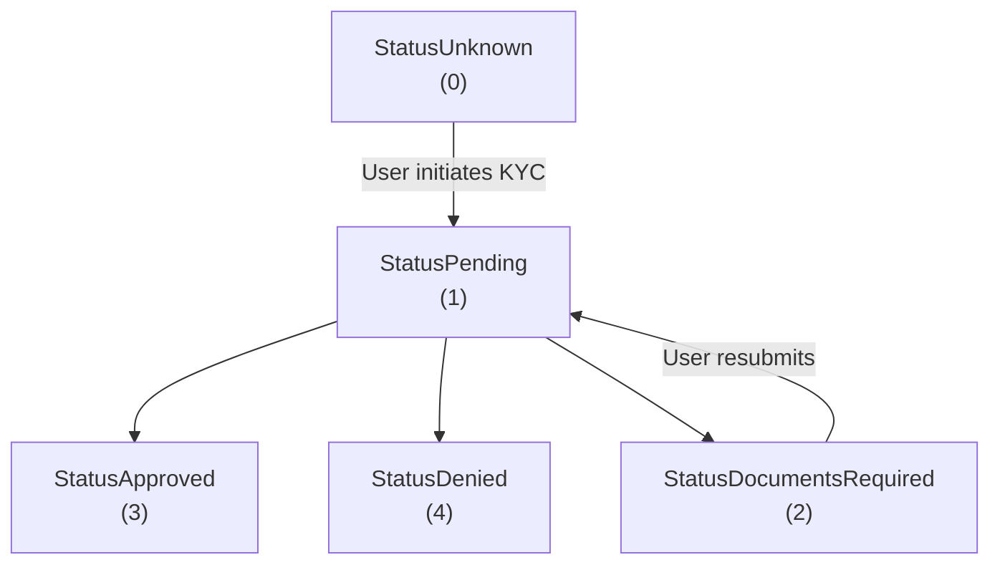

# KYC Resubmission Flow (Phase 1)

## Overview
This document describes the improved KYC verification flow (Phase 1) that allows users to resubmit their documents when additional information is required or when their documents expire. This enables users to update and resubmit KYC directly in the app, without manual support intervention.

## Status Flow (Phase 1)

- All documents-required webhook events set status to `StatusDocumentsRequired` (2).
- User cannot transact while in `StatusDocumentsRequired`.
- User can resubmit documents via the app, which sets status back to `StatusPending`.

## Webhook Events (Phase 1)

All of the following GateHub webhook events map to `StatusDocumentsRequired`:

- **id.verification.action_required**: Additional documents/data needed.
- **id.verification.resubmission**: User must resubmit verification documents.
- **id.document_notice.expired**: Documents expired.
- **id.document_notice.warning**: Documents will expire soon (Phase 1: treated the same as documents required).

## Backend Handling

When any of the above webhooks are received:

1. The wallet KYC status is set to `StatusDocumentsRequired` via the generic KYC workflow.
2. The user receives an email: "Action Required – Please Resubmit Your Verification Documents".
3. A Slack notification is sent to the `signup_kyc` channel (`wallet-info-bot`).

## Email Notification

- When status becomes `StatusDocumentsRequired`, user receives an email: "Action Required – Please Resubmit Your Verification Documents".
- Email contains a direct link to the KYC resubmission page in the app.

## User Experience

- **Dashboard Banner**: Users with `StatusDocumentsRequired` see a prominent message and a "Reactivate wallet" link to `/personal-details`.
- **KYC Page**: Users can access the KYC widget to upload new documents. After resubmission, status moves to `StatusPending`.

## API & Backend Changes

- **StatusDocumentsRequired** is used for all documents-required webhook types in Phase 1.
- Transaction permissions are blocked for users in this status (cannot pay, deposit, withdraw, or use Rafiki address).
- KYC widget is accessible for users in `StatusUnknown`, `StatusPending`, or `StatusDocumentsRequired`.

## Business Rules (Phase 1)

- Resubmission is allowed for users in `StatusUnknown` or `StatusDocumentsRequired`.
- Users in `StatusDocumentsRequired` cannot transact until resubmission is complete.
- All other statuses follow existing rules.

## Testing & Monitoring

- Unit tests cover webhook handling for all documents-required event types, status transitions, and transaction blocking.
- E2E tests cover the resubmission flow via MockGateHub webhook triggers.
- Alerts: webhook/email failures.

## Support Playbook

- If user cannot resubmit: check KYC status, webhook processing workflow
- If documents still show as expired after resubmission: check for webhook, workflow status, provider status.

---

**For Phase 2 (future):** The flow will split into two statuses (`StatusDocumentsRequired` and `StatusDocumentsWillExpire`) with different transaction permissions and additional email templates. `id.document_notice.warning` would then map to the softer warning state instead of blocking transactions.
