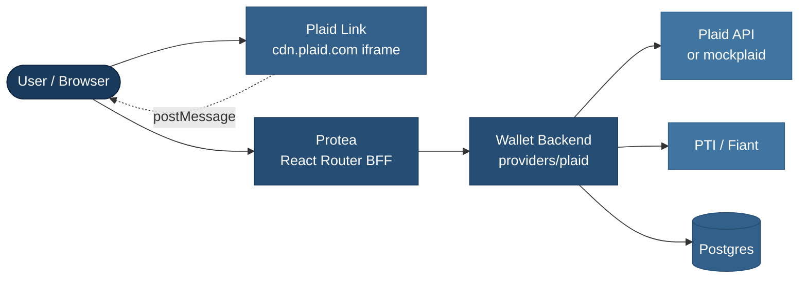
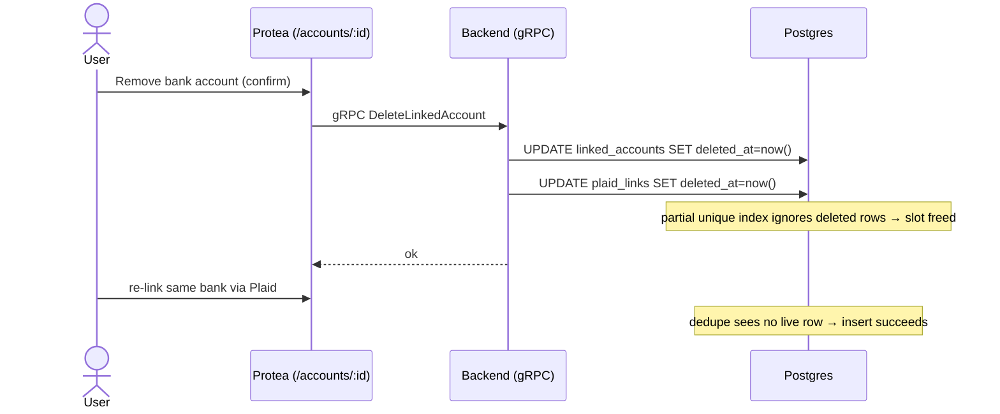

# Plaid Bank Linking — How It Works

> **Bank-linking integration reference.** How US users connect a real bank account through Plaid and register it with PTI (Fiant) as an ACH deposit source.

**Related documents:**

- [Concepts](terminology.md) — Core terminology ("Account" → Linked Account mapping)
- [Wallets, Accounts & Addresses](wallets-accounts-addresses-guide.md) — The wallet / linked-account model this plugs into
- [Provider Payments Reference](provider-payments-reference.md) — PTI-specific payment behavior
- [Payments Guide](payments-guide.md) — How a linked bank funds a deposit
- [Account Deletion Guide](account-deletion-guide.md) — Soft-delete conventions across the app
- [Backend Configuration Guide](backend-configuration-guide.md) — `plaid.*` config block reference
- [Environment Variables](env-variables.md) — `PLAID_ENABLED` on the frontend

**Quick Navigation:**

- **New to Plaid here?** → [System Overview](#1-system-overview)
- **What the user sees?** → [UI Interaction](#4-ui-interaction)
- **The connect flow end-to-end?** → [Link Flow](#5-link-flow-connect--register)
- **Remove / re-link a bank?** → [Soft Delete & Re-link](#6-soft-delete-and-re-link)
- **Concurrency guards?** → [Concurrency Model](#7-concurrency-model)
- **New tables/columns?** → [Data Model](#8-data-model)
- **Config & the feature toggle?** → [Configuration & Toggle](#9-configuration-and-toggle)
- **Problems hit in dev?** → [Issues Discovered](#11-issues-discovered-during-development)

This document explains how the [Plaid](https://plaid.com/docs/) bank-linking integration lets a US wallet user connect their real bank account and use it as an ACH deposit source, without the wallet ever seeing bank credentials.

> **Context:** The Interledger App Wallet is a multi-provider platform. A US user's wallet is served by **PTI**, which fronts the **Fiant** payment rails. Plaid is the bank-connection layer that feeds a verified bank account into Fiant as a `payment-information` record.

> **Terminology Note:** A Plaid-linked bank is represented as a `bank` type [Linked Account](terminology.md#linked-account-types) with `provider = pti`. Plaid-specific data (the bank `account_id`) lives in a companion `plaid_links` row, not on `linked_accounts`. See [Data Model](#8-data-model).

> **Status:** The whole integration is gated behind a feature toggle and is **off** in every deployed environment. It replaces the legacy manual bank-details form once promoted. See [Configuration & Toggle](#9-configuration-and-toggle).

---

## Table of Contents

1. [System Overview](#1-system-overview)
2. [Why Plaid](#2-why-plaid)
3. [Entity & Component Model](#3-entity--component-model)
4. [UI Interaction](#4-ui-interaction)
5. [Link Flow (Connect → Register)](#5-link-flow-connect--register)
6. [Soft Delete and Re-link](#6-soft-delete-and-re-link)
7. [Concurrency Model](#7-concurrency-model)
8. [Data Model](#8-data-model)
9. [Configuration and Toggle](#9-configuration-and-toggle)
10. [Backend Reference](#10-backend-reference)
11. [Issues Discovered During Development](#11-issues-discovered-during-development)
12. [Testing](#12-testing)
13. [External Documentation](#13-external-documentation)

---

## 1. System Overview

Six components participate in a bank link:



- **Plaid Link** — Plaid's hosted, cross-origin widget where the user picks their bank and logs in. Credentials never reach our servers.
- **Protea** — serves the `/connect/bank` page and proxies Plaid calls to the backend, forwarding the Kratos session cookie.
- **Backend `providers/plaid`** — talks to Plaid, mints a Fiant processor token, registers the bank with Fiant, and persists the result.
- **Fiant (PTI)** — receives the processor token as a `payment-information` record; that record is what deposits draw from.

---

## 2. Why Plaid

The legacy path asks the user to type bank details into a form (`/connect/bank/us`). That is high-friction, error-prone (mistyped routing/account numbers), and gives us no proof the account is real or owned by the user.

Plaid removes all three: the user authenticates with their bank inside Plaid's own UI, Plaid verifies ownership, and hands us a short-lived token that we exchange for a **Fiant-scoped processor token**. We never see or store credentials. The result is lower funding drop-off, verified accounts, and reduced fraud surface.

---

## 3. Entity & Component Model

| Layer | Artifact | Responsibility |
|-------|----------|----------------|
| Frontend route | `routes/connect_.bank.tsx` | Gated entry page, auto-launches the overlay |
| Frontend hook | `components/Plaid/usePlaidLinkFlow.ts` | Requests link token, drives `usePlaidLink`, posts result |
| Frontend BFF | `lib/plaid.server.ts` | Typed server-side calls to `/api/plaid/*`, cookie forwarding |
| Backend HTTP | `providers/plaid/ops/handlers.go` + `router.go` | `/api/plaid/*` endpoints behind Kratos session middleware |
| Backend client | `providers/plaid/client/client.go` | Typed wrapper over the Plaid Go SDK |
| Backend bridge | `plaid_fiant_linker.go` | Dedupe → Fiant register → dual-row persist, with locking |
| Backend queries | `providers/plaid/ops/links.go` | `plaid_links` CRUD (live-row scoped) |
| Persistence | `linked_accounts` + `plaid_links` | The linked bank and its Plaid metadata |

---

## 4. UI Interaction

The user reaches the flow from the **Home** bank card. When the toggle is on, that card routes to `/connect/bank`; when off, it routes to the legacy manual form.

`/connect/bank` is deliberately thin — it exists only to launch Plaid Link:

1. **Loader gates** (all redirect Home if unmet):
   - `PLAID_ENABLED` must be on.
   - The bank feature (`banksEnabled`) must be on.
   - The user must hold a **US balance** (US-only).
2. **Auto-launch** — on mount the page calls `connect()` once (a `useRef` guard prevents a double token-mint under React StrictMode).
3. **Plaid overlay** — the user picks their bank, logs in, and selects an account, all inside Plaid's cross-origin iframe.
4. **On success** — the selected `public_token` + account details post back through the BFF; a snackbar confirms *"Bank account linked"* and the bank appears on `/accounts`.
5. **On cancel** — dismissing the overlay returns the user Home; nothing is created.
6. **On script error** — if Plaid's runtime fails to load, the page shows a "couldn't start" message with a **Try again** button.

Removing a bank is done from `/accounts/:accountId` via a **confirmation dialog** ("Remove bank account?"). Confirming soft-deletes the account.

---

## 5. Link Flow (Connect → Register)

The connect action is **single-shot**: one backend call performs exchange → processor token → Fiant registration → persistence. (An earlier POC stored the access token in Redis across two calls; that was removed — no long-lived token is stored.)

```mermaid
sequenceDiagram
    actor User
    participant Page as Protea (/connect/bank)
    participant Link as Plaid Link (iframe)
    participant BFF as Protea server
    participant BE as Backend (/api/plaid)
    participant Plaid as Plaid API
    participant Fiant as PTI / Fiant
    participant DB as Postgres

    User->>Page: open /connect/bank (auto-launch)
    Page->>BFF: intent=create_link_token
    BFF->>BE: POST /api/plaid/link-token
    BE->>Plaid: /link/token/create
    Plaid-->>BE: {link_token}
    BE-->>Page: {link_token}
    Page->>Link: usePlaidLink opens overlay
    User->>Link: pick bank, log in, select account
    Link-->>Page: onSuccess(public_token, account_id/name/mask)

    Page->>BFF: intent=exchange_and_link
    BFF->>BE: POST /api/plaid/link-to-fiant
    Note over BE: WithAccountLock(userID, accountID)
    BE->>DB: dedupe check (plaid_links, live only)
    BE->>Plaid: /item/public_token/exchange → access_token
    BE->>Plaid: /processor/token/create (processor=fiant)
    Plaid-->>BE: {processor_token}
    BE->>Fiant: POST /users/{extId}/payment-information
    Fiant-->>BE: {payment_information_id}
    Note over BE,DB: WithTx — atomic
    BE->>DB: INSERT linked_accounts (provider=pti)
    BE->>DB: INSERT plaid_links (wallet_id, plaid_account_id)
    BE-->>BFF: {linked_account_id}
    BFF-->>Page: snackbar "Bank account linked"
    Page->>Page: revalidate → bank shown on /accounts
```

If the same Plaid account is already linked (live), the dedupe check short-circuits **before** any Plaid or Fiant call and the user sees *"Account already linked"* — no wasted external work, no duplicate row.

---

## 6. Soft Delete and Re-link

Removing a bank soft-deletes both the `linked_accounts` row (existing app convention — see [Account Deletion Guide](account-deletion-guide.md)) and its `plaid_links` row. The dedupe unique index only covers **live** rows, so the `(wallet_id, plaid_account_id)` slot is freed and the same bank can be re-linked immediately.



---

## 7. Concurrency Model

Two independent guards protect two distinct hazards during registration (`plaid_fiant_linker.go`):

| | Account lock — `WithAccountLock` | Transaction wrapper — `WithTx` |
|---|---|---|
| **Mechanism** | `pg_advisory_xact_lock(hashtext(userID + ":" + accountID))` | `sqlx.Tx` around both inserts |
| **Guards** | the **external** side effects (dedupe → mint processor token → Fiant register) | the **internal** two-row DB write |
| **Scope** | per-(user, account) mutex over the critical section | atomic `linked_accounts` + `plaid_links` insert |
| **Prevents** | two concurrent requests both calling Fiant → duplicate `payment-information` records + orphaned tokens | a `linked_accounts` row with no matching `plaid_links` row, or vice-versa |

**Why both:** a DB transaction cannot roll back a Fiant API call, so the advisory lock serializes the *external* work; the transaction keeps the *local* write consistent. The partial unique index `plaid_links_wallet_plaid_uniq` is the final backstop if the lock is ever bypassed (e.g. across processes).

> The lock transaction only holds the advisory lock — the work inside `fn` (including `WithTx`) commits on the connection pool independently. The lock is a per-key mutex, not the write transaction itself.

---

## 8. Data Model

### New table: `plaid_links`

1:1 with `linked_accounts`, keyed by `linked_account_id` (FK). It keeps the provider-agnostic `linked_accounts` table free of a Plaid-only column and gives dedupe a dedicated, indexed home.

| Column | Type | Notes |
|--------|------|-------|
| `id` | uuid | PK, `gen_random_uuid()` |
| `linked_account_id` | uuid | FK → `linked_accounts.id` |
| `wallet_id` | uuid | **Denormalized** from `linked_accounts` so dedupe and listing need no join |
| `plaid_account_id` | text | The Plaid `accounts[*].account_id` the bank was provisioned from |
| `created_at` / `updated_at` | timestamp | |
| `deleted_at` | timestamp (null) | Soft-delete marker |

**Indexes:**

```
plaid_links_wallet_plaid_uniq   UNIQUE (wallet_id, plaid_account_id)   WHERE deleted_at IS NULL
plaid_links_linked_account_id          (linked_account_id)
```

The **partial** unique index is the crux of dedupe + re-link: the same Plaid account cannot be linked twice while live, but soft-deleted rows are exempt.

> **Migration note:** The schema source of truth is `go/backend/db/schema.hcl`; migrations are generated with `atlas migrate diff`. This change adds a new table only (no destructive column change), so it applies cleanly. Regenerate Atlas test migrations before running Go tests if the schema changed.

---

## 9. Configuration and Toggle

The backend and frontend consume the integration differently, so they read config differently.

**Backend** reads a typed `plaid.*` block from YAML, validated on boot (`config/start.go`). When `plaid.enabled` is true the rest is required and constrained:

| Field | Constraint |
|-------|------------|
| `plaid.client_id`, `plaid.secret` | required, secrets |
| `plaid.env` | one of `sandbox`, `production` |
| `plaid.products` | non-empty |
| `plaid.country_codes` | non-empty |
| `plaid.processor` | must be `fiant` |
| `plaid.api_url` | optional — overrides the SDK base URL (points at **mockplaid** locally / in e2e) |

See the [Backend Configuration Guide](backend-configuration-guide.md) for the full reference.

**Frontend (Protea)** only needs to know whether the feature is on, to pick the route and render the CTA. It still reads a plain **`PLAID_ENABLED`** env var — Protea has not been migrated to the backend config system. Intentional and low-risk (a single boolean, no secrets).

**The toggle:** `PLAID_ENABLED` is the single switch between the Plaid flow and the legacy manual bank form. It gates the Home CTA target, the `/connect/bank` loader, and (backend-side) whether the Plaid package mounts at all. The manual path remains until Plaid is production-proven, then is dropped.

---

## 10. Backend Reference

`/api/plaid/*` endpoints are mounted behind the existing Kratos session middleware (`providers/plaid/ops/router.go`) and only when `plaid.enabled`.

| Endpoint | Purpose |
|----------|---------|
| `POST /api/plaid/link-token` | Mint a Plaid Link token for the session user |
| `POST /api/plaid/link-to-fiant` | Single-shot: exchange → processor token → Fiant register → persist |

Key backend pieces:

- **`client/client.go`** — wraps the Plaid Go SDK (`plaid-go/v42`): link-token create, public-token exchange, processor-token mint, item removal. Unwraps SDK errors to expose the full Plaid JSON error body in logs instead of a bare HTTP status.
- **`plaid_fiant_linker.go`** — orchestration (dedupe, lock, Fiant call, atomic persist). The PTI external client gained `CreateBankAccountFromPlaid`, which carries the `plaidProcessorToken`.
- **`ops/links.go`** — `plaid_links` create/get/list/soft-delete, all scoped to live rows.

The persisted linked account is a US ACH bank: `provider = pti`, `type = bank`, `state = Verified`, USD, `SendNetwork/ReceiveNetwork = ACH`.

---

## 11. Issues Discovered During Development

Plaid Link is a third-party, CDN-hosted, cross-origin widget. Getting it under deterministic control surfaced several problems worth recording.

### 11.1 `cdn.plaid.com` is HSTS-preloaded — mock must genuinely resolve

`react-plaid-link` always loads Plaid's runtime from `cdn.plaid.com`, and that host is **HSTS-preloaded**, so a cert warning cannot be clicked through. To run against **mockplaid** locally and in e2e, `cdn.plaid.com` must *genuinely resolve* to the mock via a trusted-host redirect — `make hosts` (hosts entry) + `make certs` + `make trust` (trusted local CA). There is no bypass; the host resolution and TLS trust have to be real.

### 11.2 Cross-origin iframe can't be reached with normal selectors

The Link UI renders in an iframe served from another origin, so it is not in the same document. In e2e it is driven through a Playwright `FrameLocator` scoped to that iframe (`e2e/plaid.go`).

### 11.3 Wallet may still be "Activation Pending" right after KYC

Immediately post-KYC the wallet can lack a US balance, so the `/connect/bank` loader redirects Home and the overlay never launches. The e2e helper re-navigates until activation settles (up to ~90s) rather than asserting on first load.

### 11.4 The linked-account write is asynchronous

Registration (exchange → processor token → Fiant → DB insert) completes **after** the overlay tears down. Reading the account count immediately races the insert, so assertions poll (up to ~20s) until the expected count is reached.

### 11.5 Kratos identity lookup capped at 250 per page

DB assertions resolve the user via Kratos. Listing all identities and scanning client-side flaked once the local Kratos accumulated >250 identities (every run mints fresh users). Fixed by using Kratos' server-side exact filter `?credentials_identifier=<email>` — an indexed lookup independent of total identity count.

### 11.6 The mock always succeeded — failure UX was unreachable

The mock returned success for every valid input, so the backend's link-failure path couldn't be tested. A **Failing Bank** institution (`ins_mock_fail`) was added whose `public_token` carries a `-FAIL-` marker; the mock rejects it with a Plaid error envelope, driving the backend's 502 → frontend error snackbar. The fault rides on the token, so it is per-selection and never leaks across concurrent scenarios.

### 11.7 Concurrent double-link could hit Fiant twice

Two requests for the same account could both pass the dedupe check and both call Fiant, creating duplicate `payment-information` records. Addressed with the advisory account lock + partial unique index — see [Concurrency Model](#7-concurrency-model).

### 11.8 React StrictMode double-mint

`/connect/bank` auto-launches on mount; StrictMode's double-invoke in dev minted two link tokens. Guarded with a `useRef` latch so `connect()` runs once.

---

## 12. Testing

A dedicated **mockplaid** service (`go/mock/mockplaid`) mocks the Plaid API and hosts a stand-in Link UI, so tests never hit real Plaid. Three deterministic institutions give reproducible behavior:

| Bank | Behavior | Proves |
|------|----------|--------|
| **Tartan** | stable `account_id` | dedupe + re-link after delete |
| **Platypus** | new `account_id` each time | multiple distinct accounts |
| **Failing Bank** (`ins_mock_fail`) | rejects the `-FAIL-` token | link-failure error UX |

The `@plaid` e2e suite (`e2e/features/007-plaid-bank-link.feature`) covers: happy-path link, duplicate caught, multiple distinct banks, re-link after remove, cancel-links-nothing, non-US user gated out, a Plaid-linked account funding a PTI deposit, and a forced backend failure surfacing the error. CI runs the suite with `PLAID_ENABLED=true` and mock credentials.

---

## 13. External Documentation

- [Plaid Docs — Overview](https://plaid.com/docs/)
- [Plaid Link](https://plaid.com/docs/link/) — the hosted connection widget
- [`react-plaid-link`](https://plaid.com/docs/link/web/) — React wrapper used by Protea
- [`/link/token/create`](https://plaid.com/docs/api/link/#linktokencreate)
- [`/item/public_token/exchange`](https://plaid.com/docs/api/items/#itempublic_tokenexchange)
- [`/processor/token/create`](https://plaid.com/docs/api/processors/#processortokencreate) — mints the processor token forwarded to Fiant
- [Plaid Sandbox](https://plaid.com/docs/sandbox/) — test institutions and credentials
- [Plaid Go SDK (`plaid-go`)](https://github.com/plaid/plaid-go)
