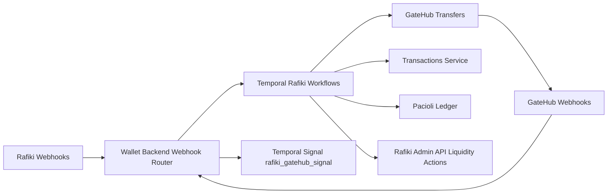
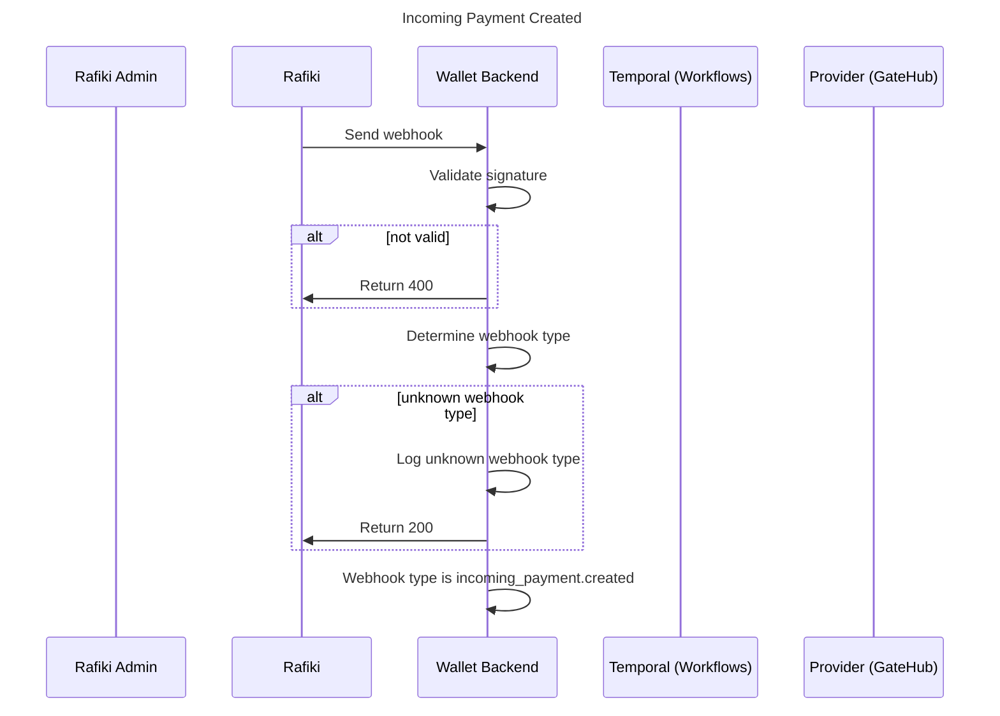
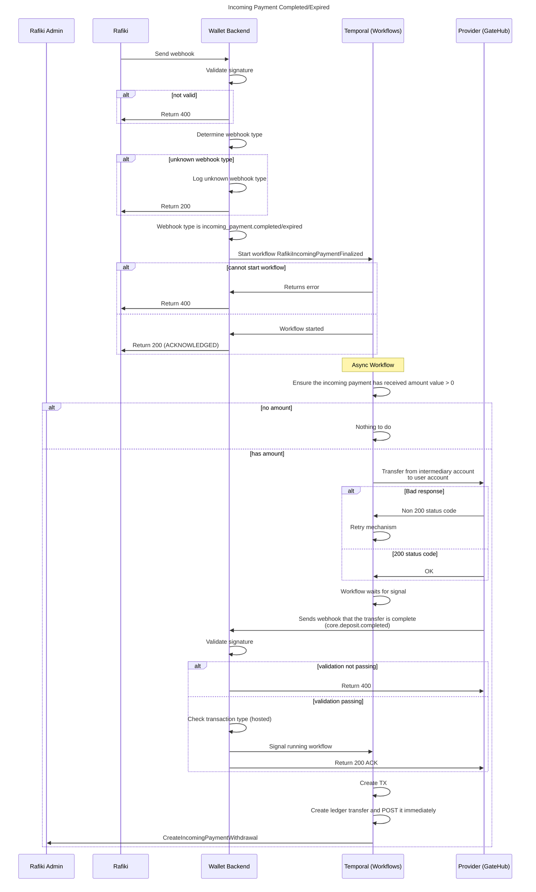
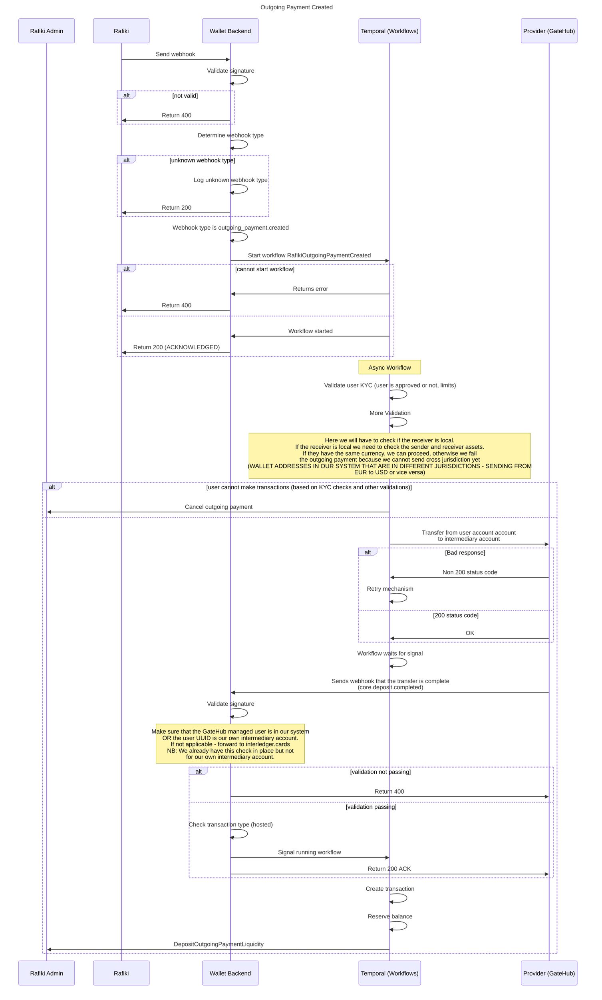
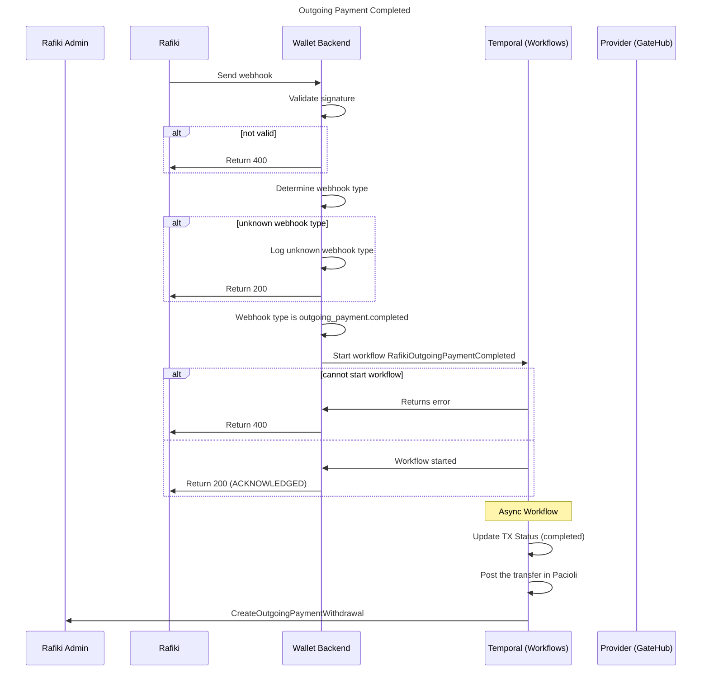
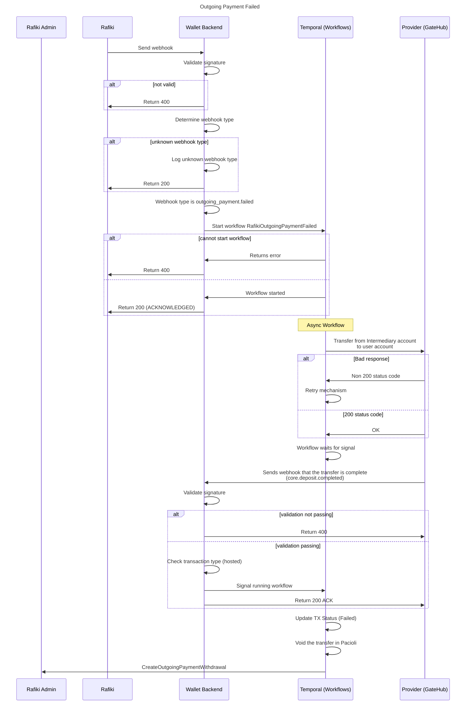

# Rafiki Full Node Upgrade Guide

> This page documents what changed in this branch compared to `main` to move the wallet from "Rafiki-connected" to a fuller Rafiki node integration.

## Why this change

Rafiki's ASE integration model requires more than creating payment pointers and funding an outgoing payment. A production ASE must also:

- react to webhook events across the payment lifecycle,
- perform provider-side money movements,
- keep internal transactions and ledger state synchronized with payment state,
- and manage liquidity in Rafiki as payments progress.

Reference: [Rafiki integration overview](https://rafiki.dev/integration/overview/).

## Scope summary (branch vs `main`)

This branch introduces the missing orchestration around Rafiki webhooks, provider transfers, liquidity actions, and ledger transitions.

The rollout is now gated behind the backend feature flag `RAFIKI_NODE_ENABLED`, which defaults to `false`. That means the full-node lifecycle described in this document is available in the codebase, but only active when the flag is enabled.

The implementation currently targets the GateHub path, with a specific focus on GateHub-to-GateHub Open Payments flows.

## What was missing before

Before this branch, integration focused on basic Rafiki participation (wallet address/payment pointer and selected payment actions), but lacked a complete event-driven lifecycle implementation for:

- `incoming_payment.completed` / `incoming_payment.expired`
- `outgoing_payment.completed`
- `outgoing_payment.failed`
- robust workflow signaling between GateHub transfer completion and Temporal workflows
- consistent liquidity withdraw/deposit handling tied to payment state

## Architecture introduced in this branch

## Detailed changes

### 0) Feature-flagged rollout

The full-node behavior is now protected by `RAFIKI_NODE_ENABLED`.

When `RAFIKI_NODE_ENABLED=false`:

- the backend still accepts Rafiki webhooks,
- `incoming_payment.created` continues to be processed,
- advanced node workflows for `incoming_payment.completed` / `expired` are skipped,
- advanced node workflows for `outgoing_payment.completed` / `failed` are skipped,
- `outgoing_payment.created` falls back to the legacy non-node path,
- GateHub hosted transfer completion does not signal `rafiki_gatehub_signal`,
- node-specific Temporal workflows are not registered in the worker.

When `RAFIKI_NODE_ENABLED=true`:

- the full GateHub-backed node lifecycle described below is active,
- GateHub intermediary-account configuration becomes required in production,
- the hosted transfer -> Temporal signal handshake is enabled.

### 1) Rafiki webhook routing expanded and provider-gated

The Rafiki webhook handler now routes these event types:

- `incoming_payment.created`
- `incoming_payment.completed`
- `incoming_payment.expired`
- `outgoing_payment.created`
- `outgoing_payment.completed`
- `outgoing_payment.failed`

Key behavior:

- incoming payment events are processed only for GateHub-linked receivers,
- advanced outgoing workflows run only for GateHub-to-GateHub paths,
- non-GateHub outgoing `created` still follows the previous path,
- non-GateHub outgoing `completed` / `failed` are intentionally skipped.
- all advanced node-specific routing is additionally gated by `RAFIKI_NODE_ENABLED`.

### 2) Four new Temporal workflows for full payment lifecycle

New workflows cover each major Rafiki transition:

- `RafikiIncomingPaymentFinalizedWorkflow`
- `RafikiOutgoingPaymentCreatedWorkflow`
- `RafikiOutgoingPaymentCompletedWorkflow`
- `RafikiOutgoingPaymentFailedWorkflow`

Workflow design highlights:

- deterministic workflow IDs per payment event,
- asynchronous wait for GateHub completion signal,
- compensation/cancellation logic for invalid or failed outgoing flows,
- idempotent-safe handling in ledger/provider operations.

### 3) New activity layer for provider transfer + ledger actions

New Rafiki activities now handle:

- transfer intermediary -> user (incoming finalize and failure compensation),
- transfer user -> intermediary (outgoing created),
- KYC and local receiver validation,
- creation/update of internal transactions,
- reserve/post/void in Pacioli,
- Rafiki liquidity deposit/withdraw operations.

Validation rules now include:

- sender KYC must be approved,
- sender and local receiver cannot be the same wallet,
- local cross-jurisdiction currency mismatch is rejected for now.

### 4) GateHub webhook <-> Temporal signal handshake

A new mapping table and signaling path ties provider transfer completion to the correct running workflow:

- GateHub transfer ID is stored with Temporal workflow ID,
- on GateHub hosted transfer completion webhook, backend resolves mapping,
- backend sends Temporal signal `rafiki_gatehub_signal` to unblock the workflow.

This is the core synchronization mechanism that was previously missing for full event-driven settlement.

This handshake is now feature-flagged as well: when `RAFIKI_NODE_ENABLED=false`, hosted GateHub deposit completion continues through the legacy payments signaling path instead of unblocking node workflows.

### 5) New DB artifact for transfer/workflow correlation

New table:

- `rafiki_gatehub_transfers`

Columns:

- `gatehub_tx_id` (PK)
- `workflow_id`
- `created_at`

Purpose:

- correlate external GateHub transfer lifecycle events with internal Temporal workflow execution.

### 6) Rafiki client/API surface expanded

The Rafiki client now includes operations required by the workflows:

- `GetIncomingPayment`
- `CancelOutgoingPayment`
- `WithdrawIncomingPaymentLiquidity`
- `WithdrawOutgoingPaymentLiquidity`

This enables workflow decisions and state transitions to directly interact with Rafiki payment and liquidity APIs.

### 7) GateHub integration updates for intermediary account model

GateHub integration now supports direct address-based hosted transfers (not only linked-account-to-linked-account), enabling intermediary account flows.

New GateHub config inputs:

- `GATEHUB_INTERMEDIARY_USER_ID`
- `GATEHUB_INTERMEDIARY_USER_ADDRESS`

These are wired through:

- backend CLI/env parsing,
- backend startup config,
- local development configuration (`local/example.env`, `local/wallet.yaml`).

These values are only required for production startup when `RAFIKI_NODE_ENABLED=true`.

### 8) Worker registration and runtime wiring

Temporal worker registration now includes all new Rafiki workflows and the updated activity constructor (with GateHub config dependency).

This is required so webhook-triggered workflows can execute end-to-end in the worker process.

The node-specific workflow registrations are now conditional on `RAFIKI_NODE_ENABLED`, which allows the code to ship with a safe default-off rollout.

### 9) Test and CI support improvements

Branch adds substantial coverage for this integration:

- dedicated Rafiki webhook unit tests,
- large integration suite for webhook/workflow behavior,
- TestMain path that provisions Postgres container when needed,
- CI/test migration setup adjustments and DB URL handling for backend test jobs.

## Event-by-event behavior

The following diagrams are copied from the source Mermaid files in `go/backend/rafiki/`.

### Incoming payment created

### Incoming payment finalized (`completed` / `expired`)

This path only runs when `RAFIKI_NODE_ENABLED=true`.

1. Rafiki webhook received and provider-gated.
2. Start workflow.
3. Transfer intermediary -> user in GateHub.
4. Wait for GateHub completion signal.
5. Create completed transaction entry.
6. Create and post ledger transfer.
7. Withdraw incoming liquidity from Rafiki.

### Outgoing payment created

When `RAFIKI_NODE_ENABLED=false`, this event falls back to the previous legacy path. The workflow below describes the enabled node-mode behavior.

1. Rafiki webhook received and GateHub-to-GateHub gated.
2. Validate KYC and local receiver constraints.
3. Transfer user -> intermediary in GateHub.
4. Wait for GateHub completion signal.
5. Create pending outgoing transaction.
6. Reserve in ledger.
7. Deposit outgoing liquidity in Rafiki.

### Outgoing payment completed

This path only runs when `RAFIKI_NODE_ENABLED=true`.

1. Start workflow.
2. Mark transaction completed.
3. Post pending ledger transfer.
4. Withdraw outgoing liquidity from Rafiki.

### Outgoing payment failed

This path only runs when `RAFIKI_NODE_ENABLED=true`.

1. Start workflow.
2. Refund intermediary -> user in GateHub.
3. Wait for GateHub completion signal.
4. Mark transaction failed.
5. Void pending ledger transfer.
6. Withdraw outgoing liquidity from Rafiki.

## Current constraints and follow-ups

- Advanced node behavior is currently implemented for GateHub flows.
- Outgoing advanced workflows are intentionally restricted to GateHub-to-GateHub routes.
- Cross-jurisdiction local receiver handling is explicitly blocked for now.
- The rollout is currently controlled globally via `RAFIKI_NODE_ENABLED`; wallet-level canary rollout is follow-up work.
- Future extension should generalize the same lifecycle model to other providers.

## Related implementation files

- `go/backend/rafiki/ops/webhooks.go`
- `go/backend/rafiki/ops/workflows.go`
- `go/backend/rafiki/ops/activities.go`
- `go/backend/providers/gatehub/ops/webhooks.go`
- `go/backend/db/schema.hcl`
- `go/backend/temporal/worker.go`
- `go/backend/cli/cli.go`
