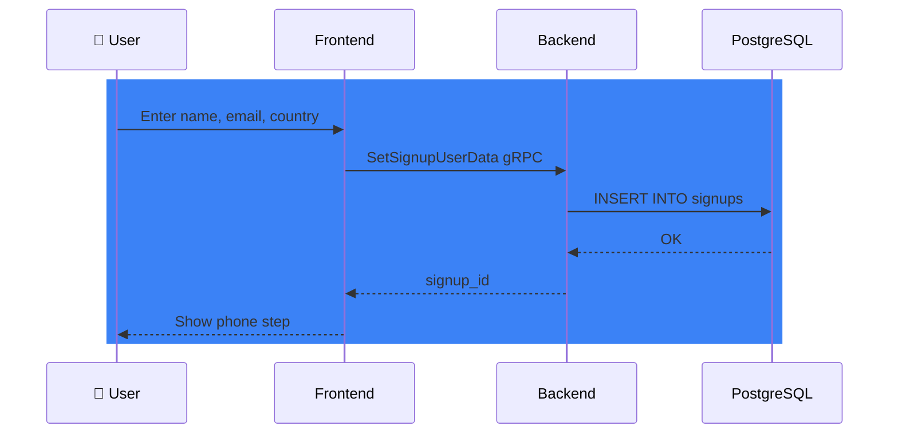
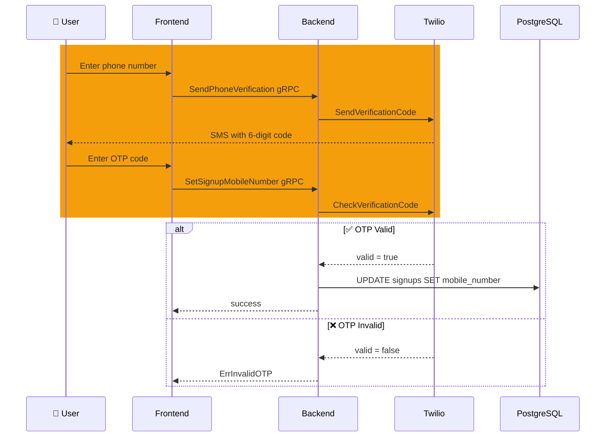
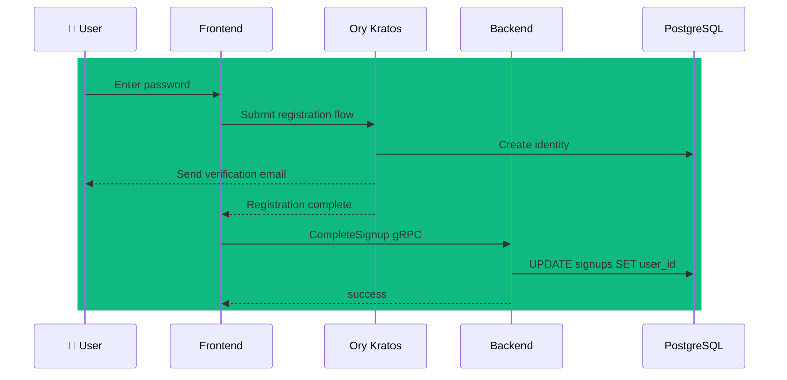
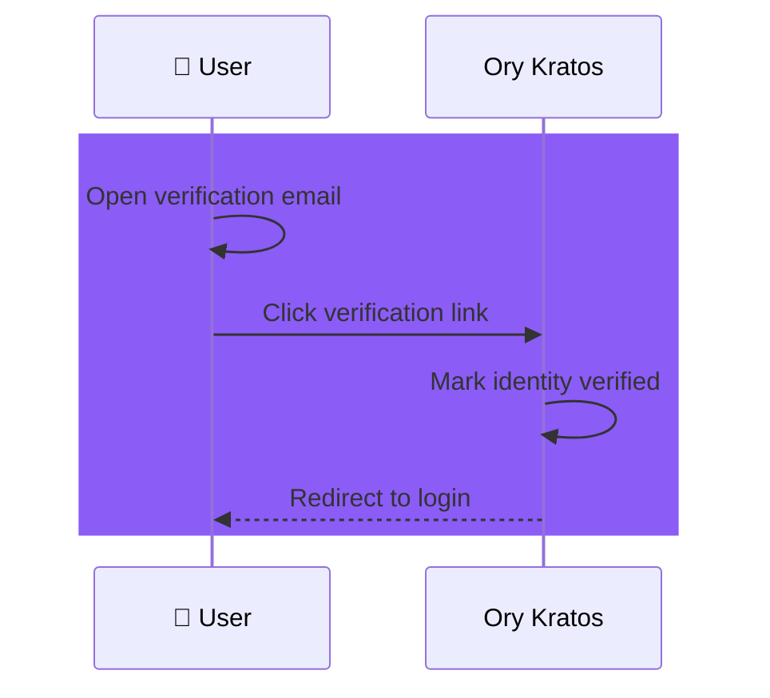
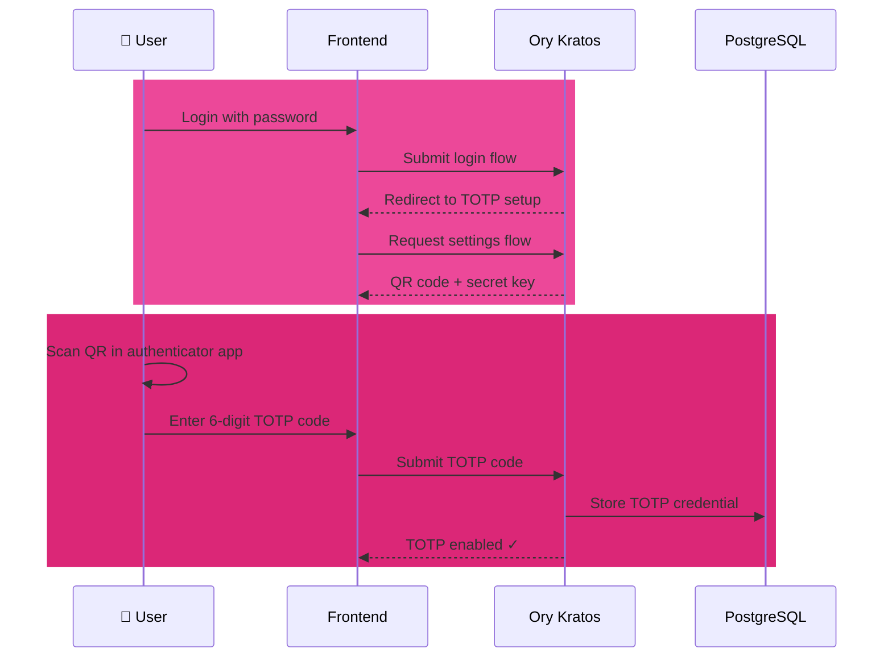
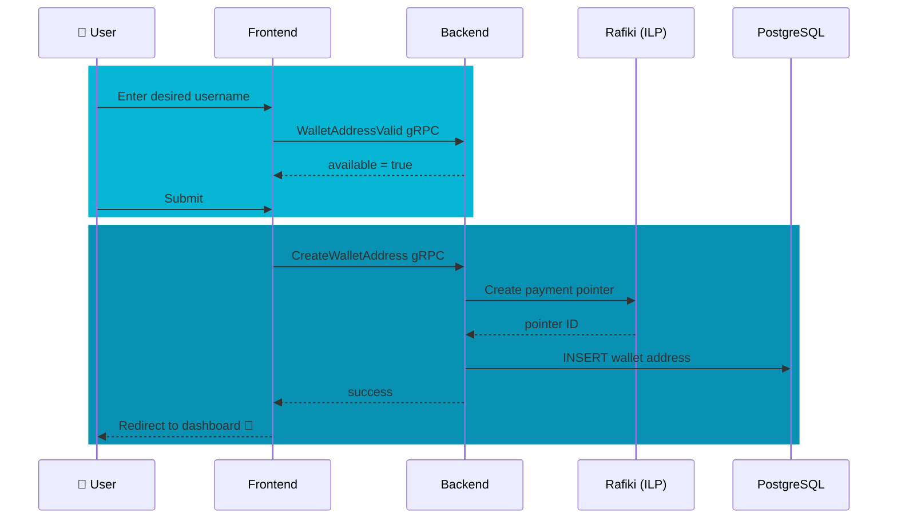

# Signup Explainer

> **User registration guide.** Understand the complete signup process, phone verification (OTP), two-factor authentication (TOTP), and wallet initialization workflows.

**Related documents:**

- [Concepts](terminology.md) — Wallet and linked-account terminology
- [KYC Explainer](kyc-guide.md) — Identity verification flows per provider
- [Wallets vs Accounts](wallets-accounts-addresses-guide.md) — Wallet activation architecture
- [Payments Guide](payments-guide.md) — How KYC and wallet setup enable transactions
- [Logging Policy](logging-reference.md) — What information can be safely logged during signup

**Quick Navigation:**

- **Need signup overview?** → Jump to [The Big Picture](#the-big-picture)
- **Phone verification issues?** → See [Phone Number Verification (OTP)](#2-phone-number-verification-otp)
- **TOTP setup problems?** → See [Two-Factor Authentication (TOTP)](#5-two-factor-authentication-totp)
- **Wallet address creation?** → See [Wallet Address Creation](#6-wallet-address-creation)
- **Backend workflow details?** → See [Temporal Workflows](#8-temporal-workflows-backend-orchestration)

**Scope:** What happens when a user signs up, how authentication is configured, and what backend workflows orchestrate the process.

---

## The Big Picture

The signup process creates a complete user account with authentication, wallet infrastructure, and a unique payment address. This enables the user to receive payments, send money, and interact with the Interledger network.

**The signup journey:**

1. **Profile Details** — User provides legal name, email, country of residence
2. **Phone Verification** — SMS OTP confirms phone number ownership
3. **Password Creation** — User sets a secure password via Ory Kratos
4. **Account Verification** — Email confirmation triggers account activation
5. **TOTP Registration** — Time-based one-time password setup for 2FA
6. **Wallet Address Creation** — Unique payment address (e.g., `https://ilp.link/alice`)

### Step 1 — Profile Details



### Step 2 — Phone Verification (OTP)

> **Note:** OTP verification is currently **disabled** in the codebase. The frontend OTP dialog is commented out (phone is stored locally and the flow advances to the password step), and the backend Twilio calls are stubbed to always return "approved". The intended flow is documented below.



### Step 3 — Password & Account Creation (Kratos)



### Step 4 — Email Verification



### Step 5 — TOTP Registration (2FA)



### Step 6 — Wallet Address Creation



---

## 1) Profile Details Collection

The first step captures basic identity information required for regulatory compliance and wallet provisioning.

### Frontend Flow

Route: `/signup` (`typescript/protea/app/routes/signup/route.tsx`)

The user fills in:
- **First Name** — Legal first name
- **Last Name** — Legal last name
- **Email** — Primary contact email
- **Country** — Country of residence (ISO 3166-1 alpha-2 code)

**Country restrictions:** Only users from CA, US, ZA, or EU countries can proceed. Others are redirected to the waitlist.

### Backend Processing

**gRPC:** `SetSignupUserData`  
**Handler:** `grpc/signup.go`  
**Operation:** `signup/ops/service.go::SetUserData`

```go
type UserDataArgs struct {
    ID          string // Optional: existing signup_id for updates
    FirstName   string // Required, trimmed
    LastName    string // Required, trimmed
    Email       string // Required, must be valid email
    CountryCode string // Required, ISO 3166-1 alpha-2
}
```

**Validation:**
- Email format validation (`validate:"required,email"`)
- Country code validation (`validate:"required,iso3166_1_alpha2"`)
- Name trimming removes extra whitespace

**Database:**
- Table: `signups`
- Action: `INSERT` (new) or `UPDATE` (existing)
- Returns: `signup_id` (UUID)

**Implementation note:** Extra spaces in names are normalized: `"John   Doe"` → `"John Doe"`.

---

## 2) Phone Number Verification (OTP)

Phone verification prevents automated account creation and ensures users can receive security alerts.

### OTP Generation

**Service:** Twilio Verify API  
**Code format:** 6-digit numeric code  
**Validity:** 10 minutes  
**Delivery:** SMS to user's phone

> **Current state:** OTP is disabled. The frontend OTP dialog is commented out in `Phone.tsx` (the phone number is stored locally and the flow skips directly to the password step). The backend Twilio calls in `twilio/service.go` are stubbed to always return `"approved"`. When re-enabled, the intended flow is described below.

### Frontend Flow

Route: `/signup` (`typescript/protea/app/routes/signup/route.tsx`) (Phone step)

1. User enters phone number in **E.164 format** (e.g., `+14155552671`)
2. Frontend calls `SendPhoneVerification` gRPC on the backend
3. Backend calls Twilio Verify API to send SMS
4. User receives SMS with 6-digit code
5. User enters code in verification field
6. Frontend submits phone + OTP to backend via `SetSignupMobileNumber` gRPC

### Backend Processing

**gRPC:** `SetSignupMobileNumber`  
**Handler:** `grpc/signup.go`  
**Operation:** `signup/ops/service.go::SetMobileNumber`

```go
type MobileNumberArgs struct {
    ID           string // signup_id
    MobileNumber string // E.164 format, e.g., "+14155552671"
    OTP          string // 6-digit numeric code
}
```

**Validation:**
- Phone format: `validate:"required,e164"`
- OTP format: `validate:"required,numeric,len=6"`

**OTP Verification Flow:**

```go
// 1. Verify OTP with Twilio
v, err := b.Twilio().CheckVerificationCode(ctx, &twilio.CheckVerificationCodeArgs{
    PhoneNumber: args.MobileNumber,
    Code:        args.OTP,
})

if !v.IsValid() {
    return signup.ErrInvalidOTP
}

// 2. Check for duplicate phone (AFTER OTP validation to prevent leakage)
var existsId string
err = b.DB().GetContext(ctx, &existsId, 
    "SELECT id FROM signups WHERE mobile_number=$1 AND user_id IS NOT NULL", 
    args.MobileNumber)

if existsId != "" {
    return signup.ErrDuplicatePhone
}

// 3. Update signup record
_, err = b.DB().ExecContext(ctx, 
    "UPDATE signups SET mobile_number=$1, updated_at=now() WHERE id=$2",
    args.MobileNumber, args.ID)
```

**Security consideration:** The duplicate phone check happens **after** OTP validation to prevent data leakage through timing attacks.

**Common errors:**
- `ErrInvalidOTP` — Wrong code or expired
- `ErrDuplicatePhone` — Phone already registered to another user

---

## 3) Password Creation

Password registration is handled entirely by **Ory Kratos** using the self-service registration flow.

### Kratos Registration Flow

**Kratos endpoint:** `/self-service/registration/browser`  
**Session:** Managed via cookies (set by Kratos)

**Note on phone numbers:** Kratos is not involved in phone/OTP verification. The phone number is passed to Kratos only as a passive `traits.phone` field during the registration step — Kratos stores it but does not verify it.

### Frontend Flow

Route: `/signup` (`typescript/protea/app/routes/signup/route.tsx`) (Password step)

1. Frontend initializes Kratos registration flow
2. Extracts `flowId` and `csrfToken` from Kratos response
3. User enters password (must meet Kratos password policy)
4. Frontend submits registration form to Kratos
5. Kratos creates identity and sends verification email
6. Frontend receives registration success response
7. Frontend calls `CompleteSignup` gRPC to link Kratos identity to signup record

### Backend Processing

**gRPC:** `CompleteSignup`  
**Handler:** `grpc/signup.go`  
**Operation:** `signup/ops/service.go::Complete`

```go
func Complete(ctx context.Context, b Backends, id, userID string) error {
    // Validate that signup exists and is not already completed
    current, err := Get(ctx, b, id)
    if current.UserID != "" && current.UserID != userID {
        return fmt.Errorf("tried to complete an already complete signup")
    }
    
    // Link Kratos identity to signup record
    _, err = b.DB().ExecContext(ctx, 
        "UPDATE signups SET user_id=$1, updated_at=now() WHERE id=$2 AND user_id IS NULL",
        userID, id)
    
    // Send Slack notification
    slack.SendToChannel(ctx, slack.ChannelNotifyEvents, "Fynbot", 
        fmt.Sprintf(":baby: New Sign Up\nID: %s\nUser ID: %s\nFull name: %s\nCountry: %s", 
        current.ID, userID, current.FirstName+" "+current.LastName, current.CountryCode))
    
    return nil
}
```

**Database changes:**
- Table: `signups`
- Action: `UPDATE signups SET user_id = {kratos_identity_id}`
- Also creates: Kratos identity in `identities` table

**Idempotency:** If signup is already completed with the same user_id, operation succeeds. If different user_id, operation fails.

---

## 4) Account Verification

After password creation, Kratos sends a verification email. The user must click the link to verify their email address.

### Email Verification Flow

1. **Kratos sends email** with verification link
2. **User clicks link** (format: `{KRATOS_URL}/self-service/verification?flow={flowId}&code={verificationCode}`)
3. **Kratos marks identity verified** in database
4. **User redirected to login** page

**No backend code required** — Kratos handles this entirely.

**Verification status** is stored in Kratos `identity_verifiable_addresses` table:
- `verified` = `false` → user must verify
- `verified` = `true` → user can proceed

---

## 5) Two-Factor Authentication (TOTP)

After email verification, users must set up TOTP for enhanced security. This is **mandatory** before accessing the application.

### What is TOTP?

**TOTP (Time-based One-Time Password)** generates a 6-digit code that changes every 30 seconds, based on:
- A shared **secret key** (stored in Kratos and user's authenticator app)
- The current **timestamp** (synchronized between server and client)

**Algorithm:** RFC 6238 TOTP (built on HMAC-SHA1)

### Frontend Flow

Route: `/totp/two-factor-authentication` (`typescript/protea/app/routes/totp_.two-factor-authentication.tsx`)

1. **User logs in** with email + password
2. **Kratos detects** TOTP not configured
3. **Kratos redirects** to TOTP setup page
4. **Frontend fetches** Kratos settings flow
5. **Kratos generates** TOTP secret key
6. **Frontend displays**:
   - QR code (for scanning)
   - Secret key (for manual entry)
7. **User scans QR** with authenticator app (Google Authenticator, Authy, 1Password, etc.)
8. **User enters** generated 6-digit code
9. **Frontend submits** TOTP code to Kratos
10. **Kratos validates** code and saves TOTP credential
11. **User redirected** to dashboard

### Kratos TOTP Setup

**Kratos settings endpoint:** `/self-service/settings/browser`  
**TOTP method:** `totp`

```typescript
// Frontend extracts TOTP data from Kratos flow
const totpSchema: TotpForm = nodes.reduce((acc, node) => {
    if (node.group !== 'totp') return acc
    
    // QR code image (data URI)
    if ('src' in node.attributes) 
        acc.qrNode = node.attributes.src
    
    // Secret key (text format for manual entry)
    if ('text' in node.attributes && node.attributes.id === 'totp_secret_key')
        acc.secretKey = node.attributes.text.text
    
    return acc
}, {})
```

**TOTP secret format:** Base32-encoded string (e.g., `JBSWY3DPEHPK3PXP`)

### TOTP Verification

When user submits the code:

1. **Kratos receives** `totp_code` field
2. **Kratos generates** expected code from secret key + current time
3. **Kratos compares** submitted code with expected code
4. **Kratos allows** time drift of ±1 period (30 seconds)
5. If valid: **Kratos saves** TOTP credential to `identity_credentials` table

**Database storage:**
- Table: `identity_credentials`
- Type: `totp`
- Identifiers: TOTP secret key (encrypted)

### Admin Operations

**Check TOTP status:**
```go
// Backend: user/ops/ops.go::CheckUserTotpEnabled
func CheckUserTotpEnabled(ctx context.Context, b Backends, identityID string) (bool, error) {
    creds, err := b.Kratos().ListIdentityCredentials(ctx, identityID)
    totp, ok := creds["totp"]
    return len(totp.Identifiers) > 0, nil
}
```

**Reset TOTP enrollment:**
```go
// Backend: user/ops/ops.go::Delete2FATotpEnrollment
func Delete2FATotpEnrollment(ctx context.Context, b Backends, identityID string) error {
    return b.Kratos().DeleteIdentityCredentials(ctx, identityID, "totp")
}
```

**gRPC admin endpoints:**
- `CheckUserTotpEnabled` — Returns whether user has TOTP configured
- `Delete2FATotpEnrollment` — Removes TOTP credential (user must re-enroll)

---

## 6) Wallet Address Creation

After TOTP setup, users create a unique payment address (also called wallet address or payment pointer).

### What is a Wallet Address?

A **wallet address** is a URL that identifies a user on the Interledger network, enabling them to receive payments.

**Format:** `https://ilp.link/{username}`  
**Examples:**
- `https://ilp.link/alice`
- `https://ilp.link/bob_123`
- `https://ilp.link/carol.doe`

**Purpose:** Acts as a stable identifier for the user's wallet, similar to an email address for payments.

### Frontend Flow

Route: `/wallet-address` (`typescript/protea/app/routes/wallet-address.tsx`)

1. **Frontend suggests** username (based on user's first name)
2. **Frontend validates** username availability (via `WalletAddressValid` gRPC)
3. **User customizes** username if desired
4. **User submits** form
5. **Backend creates** payment pointer in Rafiki
6. **Backend saves** wallet address to database
7. **User redirected** to dashboard

### Username Generation Logic

```typescript
let usernameIsValid = false
let attempts = 0
let username = session.identity.traits.firstName

while (!usernameIsValid && attempts < 5) {
    let response = await grpc.walletAddressValid(request, {
        url: `https://${PAYMENT_POINTER_BASE}/${username}`
    })
    
    if (response.exists) {
        attempts++
        username = session.identity.traits.firstName
        if (username.length < 4) 
            username += session.identity.traits.lastName
        if (attempts > 1)
            username += String(Math.floor(Math.random() * 10000)).padStart(4, '0')
    } else {
        usernameIsValid = true
    }
}
```

**Fallback strategy:**
1. Try `firstName` (e.g., `alice`)
2. Try `firstName + lastName` (e.g., `alicejones`)
3. Try `firstName + random4Digits` (e.g., `alice1234`)
4. After 5 attempts, leave blank (user must choose manually)

### Backend Processing

**gRPC:** `CreateWalletAddress`  
**Handler:** `grpc/address.go`  
**Operations:**
1. Parse and validate wallet address format
2. Add address to wallet (`wallets/ops/ops.go::AddAddress`)
3. Set wallet public name (`wallets/ops/ops.go::SetWalletName`)
4. Create Rafiki payment pointer (`rafiki/ops/ops.go::CreatePaymentPointer`)
5. Update payment pointer status in Rafiki

```go
func (g *rpcService) CreateWalletAddress(ctx context.Context, req *pb.CreateWalletAddressRequest) (*pb.Empty, error) {
    wallet, err := g.b.Wallets().ForContext(ctx)
    
    // Parse address (validates URL format)
    wa, err := wallets.ParseAddress(req.Url)
    
    // Save address to wallet
    _, err = g.b.Wallets().AddAddress(ctx, wallet.ID, wa.String())
    
    // Update wallet name
    wallet, err = g.b.Wallets().SetWalletName(ctx, wallet.ID, req.GetAlias())
    
    // Create payment pointer in Rafiki
    rafikiID, err := g.b.Rafiki().CreatePaymentPointer(ctx, *wallet)
    
    // Activate payment pointer
    err = g.b.Rafiki().UpdateWalletAddressStatus(ctx, rafiki.UpdateAddressStatus{
        ID:   rafikiID,
        Name: wallet.Name,
    }, false)
    
    return &pb.Empty{}, nil
}
```

**Database changes:**
- Table: `wallet_addresses`
- Action: `INSERT INTO wallet_addresses (wallet_id, url, alias)`
- Also creates: Payment pointer in Rafiki (ILP connector)

**Analytics tracking:** `TrackWalletPaymentPointerCreated` event sent to analytics service.

---

## 7) Wallet Initialization

After signup completes, a default wallet is created for the user.

### When is the Wallet Created?

**Timing:** During Kratos registration flow, after password creation.

**Trigger:** Frontend calls `CreateUserDefaultWallet` gRPC immediately after Kratos registration succeeds.

### Backend Processing

**gRPC:** `CreateUserDefaultWallet`  
**Handler:** `grpc/user.go`  
**Operation:** `wallets/ops/ops.go::Create`

```go
func (s *rpcService) CreateUserDefaultWallet(ctx context.Context, req *pb.CreateUserDefaultWalletRequest) (*pb.Empty, error) {
    _, err := s.b.Wallets().Create(ctx, wallets.CreateArgs{
        UserID: req.UserID,
    })
    return &pb.Empty{}, toGRPCError(err)
}
```

**Wallet creation:**
- Determines user's country from Kratos identity traits
- Creates wallet record in `wallets` table
- Associates wallet with user's Kratos identity

**Note:** At this stage, the wallet has no linked accounts yet. Provider account linking happens during KYC activation.

---

## 8) Temporal Workflows (Backend Orchestration)

Signup triggers several **Temporal workflows** for asynchronous, durable processing.

### What is Temporal?

**Temporal** is a workflow orchestration engine that ensures long-running, multi-step processes complete reliably even if services restart.

**Key features:**
- **Durable execution** — Workflows resume after crashes
- **Automatic retries** — Failed activities retry with backoff
- **Versioning** — Workflow code can evolve without breaking in-flight workflows

### Signup-Related Workflows

While the core signup flow is synchronous, several background workflows prepare the account for use:

#### 1. Provider User Creation Workflows

After wallet creation, provider-specific workflows provision external accounts:

**GateHub:** `CreateGatehubUserWorkflow`
- **Workflow ID:** `gatehub_create_user_{walletID}`
- **Activities:**
  1. `GetGatehubUser` — Check if user exists in GateHub
  2. `CreateGatehubUser` — Create managed user (if not exists)
  3. `SaveGatehubUser` — Save `external_user_id` to database
  4. `CreateGatehubWalletLinkedAccount` — Create linked account record
  5. `CreateGatehubBalanceAccount` — Initialize balance tracking account

**Xago:** `CreateBalanceAccountWorkflow`
- **Workflow ID:** `xago_create_balance_{walletID}`
- **Activities:**
  1. `CreateSubAccount` — Create Xago sub-account
  2. `CreateLinkedAccount` — Store linked account
  3. `CreateBalanceAccount` — Initialize balance tracking

**PTI:** `CreateUserWorkflow`
- **Workflow ID:** `pti_create_user_{walletID}`
- **Activities:**
  1. `GetPtiUser` — Check if PTI user exists
  2. `CreatePtiUser` — Create PTI user (if not exists)
  3. `SavePtiUser` — Save external user ID

**Chimoney:** `CreateChimoneyUserWorkflow`
- **Workflow ID:** Similar pattern

**Why Temporal?** Provider API calls can be slow or fail. Temporal ensures these operations complete even if the backend server restarts.

#### 2. Payment Pointer Provisioning

**Workflow:** `CreateRafikiPaymentPointersJob`
- **Purpose:** Backfill payment pointers for wallets created before Rafiki integration
- **Trigger:** Manual admin job (not part of normal signup)
- **Activities:**
  1. `ListAllWallets` — Find wallets without payment pointers
  2. `AddWalletToRafiki` — Create payment pointer for each wallet

#### 3. KYC Workflows (Post-Signup)

After signup, users must complete KYC to activate their wallet. These workflows are triggered during KYC:

**LinkGatehubUserToGatewayWorkflow**
- **Workflow ID:** `gatehub_link_user_{externalUserID}`
- **Purpose:** Connect managed user to Paywiser gateway
- **Trigger:** After `CreateGatehubUserWorkflow` completes

**BackfillAccountWorkflow**
- **Trigger:** `id.verification.accepted` webhook from provider
- **Purpose:** Sync provider balance to wallet database after KYC approval
- **Activities:**
  1. `CheckIfBackfillWasDone` — Prevent duplicate backfills
  2. `GetLinkedAccount` — Fetch linked account details
  3. `BackfillPaywiserBalanceAfterKYC` — Get current balance from provider
  4. `MarkBackfillUser` — Update account balance in database
  5. `SetKYCStatus` — Update `wallet_kyc_status` to `level1`

**See [KYC Explainer](kyc-guide.md) for detailed KYC workflow documentation.**

### Workflow Worker

**Worker service:** `cmd/mockgatehub/main.go::worker` subcommand

The Temporal worker runs separately from the HTTP server:

```bash
# Start HTTP server only
./backend start

# Start Temporal worker only
./backend worker

# Start both (for development)
./backend dev
```

**Worker registration:** `temporal/worker.go`

```go
func NewTemporalWorker(b Backends, gatehubConfig gatehub.Config, xagoConfig xago.Config) (worker.Worker, error) {
    w := worker.New(b.Temporal(), "backend", worker.Options{})
    
    // Register all workflows
    w.RegisterWorkflow(gatehub_workflows.CreateGatehubUserWorkflow)
    w.RegisterWorkflow(gatehub_workflows.LinkGatehubUserToGatewayWorkflow)
    w.RegisterWorkflow(xago_workflows.CreateBalanceAccountWorkflow)
    w.RegisterWorkflow(pti_workflows.CreateUserWorkflow)
    // ... many more
    
    return w, nil
}
```

**Workflow execution options:**
- **Timeout:** 10 seconds per activity (for user creation workflows)
- **Retry policy:** 3 maximum attempts
- **Task queue:** `backend`

---

## 9) Signup State Machine

The signup process tracks state in the `signups` table:

```sql
CREATE TABLE signups (
    id UUID PRIMARY KEY,
    user_id UUID REFERENCES identities(id),  -- NULL until password creation
    first_name TEXT NOT NULL,
    last_name TEXT NOT NULL,
    country_code TEXT NOT NULL,
    email TEXT NOT NULL,
    mobile_number TEXT,  -- NULL until phone verification
    created_at TIMESTAMPTZ DEFAULT NOW(),
    updated_at TIMESTAMPTZ DEFAULT NOW()
);
```

**State transitions:**

| Field | Initial | After Profile | After Phone | After Password |
|-------|---------|---------------|-------------|----------------|
| `id` | UUID | UUID | UUID | UUID |
| `first_name` | NULL | "Alice" | "Alice" | "Alice" |
| `last_name` | NULL | "Jones" | "Jones" | "Jones" |
| `email` | NULL | "alice@..." | "alice@..." | "alice@..." |
| `country_code` | NULL | "US" | "US" | "US" |
| `mobile_number` | NULL | NULL | "+14155551234" | "+14155551234" |
| `user_id` | NULL | NULL | NULL | "{kratos_id}" |

**Completion check:**
```go
func (s *Signup) IsCompleted() bool {
    return s.UserID != ""
}
```

---

## 10) Security Considerations

### OTP Timing Attack Prevention

**Problem:** If duplicate phone check happens before OTP validation, attackers can enumerate registered phone numbers by measuring response time.

**Solution:** Validate OTP **first**, then check for duplicates.

```go
// CORRECT ORDER:
// 1. Verify OTP (prevents enumeration)
v, err := b.Twilio().CheckVerificationCode(ctx, ...)
if !v.IsValid() {
    return signup.ErrInvalidOTP
}

// 2. Check duplicate (only if OTP valid)
var existsId string
err = b.DB().GetContext(ctx, &existsId, 
    "SELECT id FROM signups WHERE mobile_number=$1 AND user_id IS NOT NULL", ...)
```

### Password Security (Kratos)

Passwords are **never** stored in plaintext or logged. Kratos handles:
- Password hashing (Argon2id)
- Breach detection (Have I Been Pwned integration)
- Password policy enforcement

**Logging policy:** See [logging-reference.md](logging-reference.md) — Never log passwords, tokens, or secrets.

### TOTP Secret Storage

TOTP secrets are stored **encrypted** in Kratos `identity_credentials` table. Only Kratos can decrypt them.

**Secret rotation:** If user resets TOTP, old secret is deleted and new secret generated.

---

## 11) Common Issues and Troubleshooting

### Phone Verification Fails

**Symptom:** User enters OTP but gets `ErrInvalidOTP`

**Causes:**
1. Code expired (10-minute timeout)
2. User entered wrong code
3. Twilio service outage

**Resolution:**
- Resend OTP (user can request new code)
- Check Twilio dashboard for delivery status
- Verify phone number is in E.164 format

### TOTP Setup Fails

**Symptom:** User scans QR code but submitted code fails validation

**Causes:**
1. Time drift between server and user's device
2. User's authenticator app not synchronized
3. User scanned wrong QR code

**Resolution:**
- Check server time synchronization (NTP)
- User should use time-based sync in authenticator app
- Regenerate TOTP secret (via Kratos settings flow)

### Wallet Address Already Taken

**Symptom:** User's desired username is unavailable

**Causes:**
1. Another user already claimed that username
2. Frontend suggested username was taken between validation and submission

**Resolution:**
- User chooses different username
- Frontend suggests alternatives with random suffix

### Signup Stuck in Partial State

**Symptom:** Signup record exists but `user_id` is NULL

**Causes:**
1. User abandoned flow before password creation
2. Kratos registration failed but signup record persists
3. `CompleteSignup` gRPC call failed

**Resolution:**
- User can resume signup using same email
- Backend updates existing signup record instead of creating new
- Check backend logs for `CompleteSignup` errors

---

## 12) Testing Signup Flow

### E2E Test Coverage

**Feature file:** `e2e/features/000-signup.feature`

**Scenarios:**
- Successfully sign up as a German user
- Successfully sign up as a South African user
- Signup with phone verification
- TOTP registration after signup
- Wallet address creation

**Test implementation:** `e2e/gatehub_signup_clean.go`

**Workflow steps:**
```gherkin
Given a random test identifier is generated
And I impersonate 'signup-user'
And I completed the signup workflow          # Profile + phone + password
And I completed the account verification workflow  # Email verification
And I finished the TOTP registration workflow     # 2FA setup
And I finished the wallet address creation workflow # Payment address
Then I should be navigated to the application dashboard
```

### Unit Test Coverage

**Signup operations:** `signup/ops/service_test.go`

**Test cases:**
- `SetUserData` creates new signup
- `SetMobileNumber` validates OTP
- `Complete` links Kratos identity
- Duplicate phone number rejection
- Invalid OTP rejection

---

## 13) Next Steps After Signup

After completing signup, users proceed to:

1. **Wallet Activation** — Complete KYC verification (see [KYC Explainer](kyc-guide.md))
2. **Provider Linking** — Connect to payment providers (GateHub, Xago, etc.)
3. **Balance Management** — Deposit funds to wallet
4. **Payments** — Send and receive payments (see [Payments Guide](payments-guide.md))

**Critical:** Users cannot send or receive payments until KYC is complete and wallet is activated.

