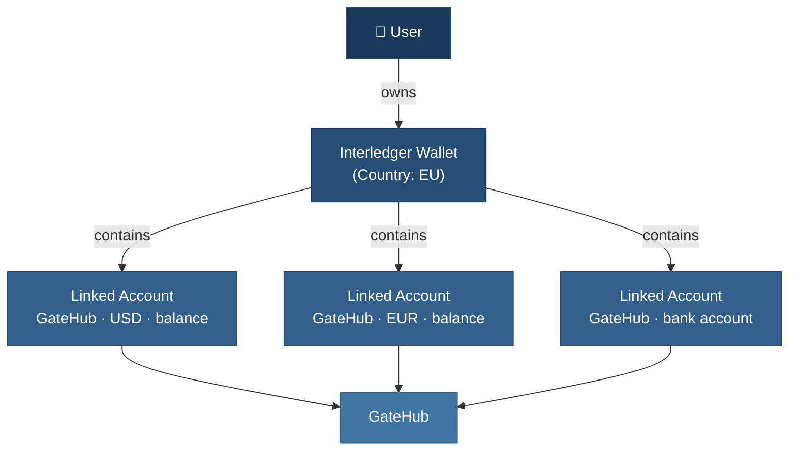

# Concepts: Interledger App vs Service Providers

> **Your terminology reference.** This document maps provider vocabularies to Interledger App concepts.

**Related documents:**

- [Wallets vs Accounts vs Addresses](wallets-accounts-addresses-guide.md) — Architectural deep dive on wallet/account/address layers
- [Payments & Transactions Guide](payments-guide.md) — How payments work and navigate to specialist guides
- [Ledger System Architecture](ledger-system-guide.md) — Dual-ledger model and reconciliation behavior
- [Payment Troubleshooting](payment-troubleshooting-guide.md) — Incident investigation workflow
- [KYC Explainer](kyc-guide.md) — Identity verification flows per provider
- [GateHub Cards](gatehub-cards-guide.md) — Card issuing integration details
- [Transaction Types Reference](transaction-types-reference.md) — Transaction field specifications
- [Provider Payments Guide](provider-payments-reference.md) — Provider-specific payment behavior

**Quick Navigation:**

- **Need terminology mapping?** → See [Core Terms](#core-terms) and [Provider Translation](#provider-translation) below
- **Confused about wallet structure?** → See [Wallet Structure](#wallet-structure) diagram
- **Looking for linked account types?** → See [Linked Account Types](#linked-account-types) table
- **Wondering what a transaction is?** → See [Transaction Types Reference](transaction-types-reference.md)

---

The Interledger App Wallet is a multi-provider payment platform built on the Interledger network. It operates as an Account Servicing Entity (ASE), enabling cross-border payments, high-speed transactions, and content creator monetization via Open Payments and Web Monetization.

The platform integrates with multiple payment providers — GateHub, PTI, Xago, and Chimoney — each with their own vocabularies. A "wallet" in the Interledger App is fundamentally different from a "wallet" in GateHub or PTI. This document maps the terminology.

## Wallet Structure

One user gets **one wallet** containing multiple **linked accounts** from their provider.

- Multiple currencies per wallet: **yes** (via linked accounts)
- Multiple providers per wallet: **typically no** — each wallet is associated with one country and one provider. This keeps the user experience simple (one KYC process, one set of compliance rules) and reflects the significant legal and operational effort required to onboard each provider. The data model does support multiple providers per wallet as a contingency for scenarios like provider migration.
- Multiple wallets per user: **no**

## Core Terms

| Term | Interledger App meaning | Notes |
|------|------------------------|-------|
| **Wallet** | The user's single financial account: one ILP address, one country, multiple linked accounts | See [Wallets vs Accounts vs Addresses](wallets-accounts-addresses-guide.md). GateHub "wallet" = XRPL address; PTI "wallet" = per-currency balance; Xago uses "SubAccount" |
| **Linked Account** | Any external account connected to the wallet (balance, bank account, card, interac) | Each has one provider and one currency. See [Provider shape differences](wallets-accounts-addresses-guide.md#provider-shape-why-linked-account-is-not-identical-across-integrations). |
| **User** | Identity & authentication (Kratos) — separate from the wallet | Keeps auth and financial data decoupled. In GateHub context, this user becomes a "Managed User" (see [GateHub Cards](gatehub-cards-guide.md#2-authentication)). |
| **Payment** | An intent to move money (P2P, deposit, withdrawal) — orchestrated asynchronously | Creates one or more Transactions. See [The Payment Story](payments-guide.md#the-payment-story) for a detailed walkthrough. |
| **Transaction** | A ledger entry recording what actually happened to money | Has types: sent, received, deposit, withdrawal, card, web monetization. See [Understanding Transactions](payments-guide.md#understanding-transactions). |

## Linked Account Types

| Type | Providers | Purpose | See also |
|------|-----------|---------|----------|
| `balance` | GateHub, PTI, Xago, Chimoney | Money held in custody by the provider | [Wallets and Accounts](payments-guide.md#wallets-and-accounts) |
| `bank_account` | PTI, Xago | External bank account for deposits/withdrawals | [Provider shape differences](wallets-accounts-addresses-guide.md#provider-shape-why-linked-account-is-not-identical-across-integrations) |
| `card` | PTI, GateHub | Debit or credit card | [GateHub Cards](gatehub-cards-guide.md) |
| `interac` | Chimoney | Interac e-Transfer (Canada) | [Provider shape differences](wallets-accounts-addresses-guide.md#provider-shape-why-linked-account-is-not-identical-across-integrations) |

## Provider Translation

| Concept | GateHub | PTI | Xago |
|---------|---------|-----|------|
| "Wallet" equivalent | XRPL address (multiple per user) | Per-currency balance (multiple per user) | SubAccount (~1:1 with user) |
| Money movement | Transaction | Transfer | Transfer |
| Status codes | Numeric (`100` = completed) | String (`SETTLED`) | String (`completed`) |
| User account | User | User | SubAccount |
| `provider_id` format | XRPL address (`rHb9C...`) | UUID | Composite (`xago_ZAR_...`) or beneficiary UUID |

## KYC and Wallet Activation

KYC (Know Your Customer) is a compliance gate linked to wallet activation and is provider-specific. Each provider has different verification flows and status models. See [KYC Explainer](kyc-guide.md) for detailed provider-by-provider guidance, status states, and troubleshooting.

---

## Common Pitfalls

| Pitfall | What to know |
|---------|-------------|
| Wallet confusion | Interledger wallet ≠ GateHub/PTI wallet. Use `linked_accounts.provider_id` for provider API calls, not `wallets.id`. |
| Transaction vs Payment lookup | Provider transaction ID → Interledger Transaction (via `foreign_id`) → Payment (via `send_transaction_id` / `receive_transaction_id`). |
| Balance mismatch | Check webhook logs, run backfill workflow, compare Pacioli ledger (`accounts` table) with provider API. See [The Two Ledgers](payments-guide.md#the-two-ledgers) for architecture explanation. |
| `provider_id` format | Provider-specific — never parse generically. GateHub=XRPL address, PTI=UUID, Xago=composite, Chimoney=external ID. |
| Status code types | GateHub returns ints, PTI/Xago return strings. Always use the provider-specific mapping in `backend/providers/*/external/`. |

