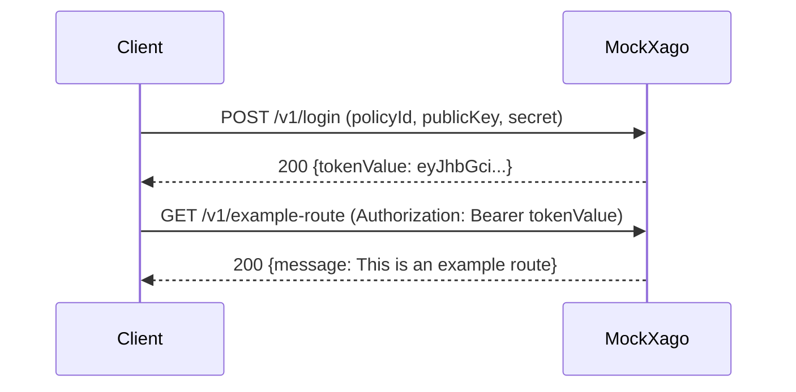

# MockXago (Work in Progress)

> **Status**: Minimal MockXago focused on authentication and a single protected endpoint.
>
> This iteration provides only the core authentication/token flow plus a protected `GET /v1/example-route` endpoint used by the authentication test suite. Additional features (sub-accounts, transfers, KYC, deposits, balances, jobs, currencies, etc.) are intentionally excluded.

MockXago is a lightweight mock of the Xago API used by the Interledger Wallet for local development and tests.

Please see Official Xago documentation at https://documenter.getpostman.com/view/49463771/2sB3QRo7pf.

## Quick Start

### Local Development with In-Memory Storage

```bash
# From go/mock/mockxago
export XAGO_API_PUBLIC_KEY=test_public_key_12345
export XAGO_API_SECRET=test_secret_key_98765
export XAGO_MOCK_PORT=8080
export LOG_LEVEL=info

go run ./cmd/mockxago
```

### Verify It's Running

```bash
curl -s http://localhost:8080/health | jq
```

Expected response:

```json
{
  "status": "ok"
}
```

### Test Authentication

```bash
curl -X POST http://localhost:8080/v1/login \
  -H "Content-Type: application/json" \
  -d '{
    "policyId": "5e2585a474b0e90012ce8ff1",
    "fields": [
      {"fieldName": "publicKey", "fieldValue": "test_public_key_12345"},
      {"fieldName": "secret", "fieldValue": "test_secret_key_98765"}
    ]
  }' | jq
```

## Configuration

### Basic Settings
- `XAGO_MOCK_PORT`: HTTP port (default `8080`)
- `XAGO_API_PUBLIC_KEY`: expected login public key (default `test-public-key`)
- `XAGO_API_SECRET`: expected login secret key (default `test-secret`)
- `LOG_LEVEL`: Logging level (default `info`)

### Storage Backend
- In-memory storage only (no Redis support in this minimal version)

## Authentication

MockXago uses a two-step authentication scheme:

### 1. **Credential-based Login** (Unauthenticated)

First, obtain an access token by exchanging your API credentials via the login endpoint. This endpoint does not require prior authentication.

### 2. **Bearer Token Authentication** (Authenticated)

Once you have a token, use it for all subsequent API requests. All protected endpoints require the token in the `Authorization` header in the format: `Authorization: Bearer <tokenValue>`

### Authentication Flow Diagram



## Implemented Features

### Authentication Endpoints

#### POST /v1/login

Authenticate with Xago credentials and obtain an access token.

This is an **unauthenticated endpoint** — no bearer token required.

**Request:**

```json
{
  "policyId": "5e2585a474b0e90012ce8ff1",
  "fields": [
    {"fieldName": "publicKey", "fieldValue": "test_public_key_12345"},
    {"fieldName": "secret", "fieldValue": "test_secret_key_98765"}
  ]
}
```

**Field Names**: The `fieldName` values are flexible and accept any of these variants for credentials:
- Public key: `publicKey`, `apiPublicKey`
- Secret key: `secret`, `secretKey`, `apiSecretKey`

**Response (success 200):**

```json
{
  "tokenValue": "eyJhbGciOiJIUzI1NiIsInR5cCI6IkpXVCJ9...",
  "expiresInMinutes": 55
}
```

The `tokenValue` is a bearer token that expires in 55 minutes. Use this token for all subsequent authenticated requests.

**Error Response (401 Unauthorized):**

Returned when credentials do not match the configured `XAGO_API_PUBLIC_KEY` and `XAGO_API_SECRET`.

```json
{
  "error": "unauthorized",
  "message": "unauthorized"
}
```

**Error Response (400 Bad Request):**

Returned when required fields are missing.

```json
{
  "error": "invalid_request",
  "message": "policyId is required"
}
```

Valid error messages:
- `"policyId is required"` — missing or empty `policyId`
- `"apiPublicKey is required"` — missing or empty public key in fields
- `"apiSecretKey is required"` — missing or empty secret key in fields

**Example with curl:**

```bash
curl -X POST http://localhost:8080/v1/login \
  -H "Content-Type: application/json" \
  -d '{
    "policyId": "5e2585a474b0e90012ce8ff1",
    "fields": [
      {"fieldName": "publicKey", "fieldValue": "test_public_key_12345"},
      {"fieldName": "secret", "fieldValue": "test_secret_key_98765"}
    ]
  }'
```

Response:

```json
{
  "tokenValue": "eyJhbGciOiJIUzI1NiIsInR5cCI6IkpXVCJ9...",
  "expiresInMinutes": 55
}
```

### Protected Endpoints

#### GET /v1/example-route

Returns a simple JSON payload. This endpoint requires a valid bearer token.

**Response (success 200):**

```json
{
  "message": "This is an example route"
}
```


#### Using Bearer Tokens on Protected Endpoints

All authenticated endpoints require the token in the `Authorization` header using the Bearer scheme:

```
Authorization: Bearer <tokenValue>
```

**Example with curl:**

```bash
TOKEN="eyJhbGciOiJIUzI1NiIsInR5cCI6IkpXVCJ9..."

curl -H "Authorization: Bearer $TOKEN" \
  http://localhost:8080/v1/example-route
```

**Error Response (401 Unauthorized) — Invalid/Missing Token:**

```json
{
  "error": "unauthorized",
  "message": "missing authorization header"
}
```

Possible error messages:
- `"missing authorization header"` — no Authorization header present
- `"invalid authorization format"` — malformed Authorization header (not in `Bearer <token>` format)
- `"invalid token"` — token not recognized or invalid
- `"token expired"` — token has expired (tokens expire after 55 minutes)

### Health Check

#### GET /health

Simple health check endpoint (no authentication required).

**Response:**

```json
{
  "status": "ok"
}
```

**Example:**

```bash
curl http://localhost:8080/health
```

### Complete Authentication Example Walkthrough

Here's a complete example of the authentication flow:

```bash
# Step 1: Obtain a token by login with credentials
TOKEN=$(curl -s -X POST http://localhost:8080/v1/login \
  -H "Content-Type: application/json" \
  -d '{
    "policyId": "5e2585a474b0e90012ce8ff1",
    "fields": [
      {"fieldName": "publicKey", "fieldValue": "test_public_key_12345"},
      {"fieldName": "secret", "fieldValue": "test_secret_key_98765"}
    ]
  }' | jq -r '.tokenValue')

echo "Got token: $TOKEN"

# Step 2: Use the token to call protected endpoints
curl -H "Authorization: Bearer $TOKEN" \
  http://localhost:8080/v1/example-route | jq

# Step 3: Invalid token rejection
curl -H "Authorization: Bearer invalid_token" \
  http://localhost:8080/v1/example-route
# Returns: {"error":"unauthorized","message":"invalid token"}

# Step 4: Missing token rejection
curl http://localhost:8080/v1/example-route
# Returns: {"error":"unauthorized","message":"missing authorization header"}
```

## Testing

Run the authentication feature tests:

```bash
make test       # All tests
make unit-test  # Unit tests only
make e2e-test   # E2E tests
```

The E2E tests cover:
- Successful login with valid credentials
- Authentication failures (invalid public key, secret key)
- Validation of required fields (policyId, publicKey, secret)
- Token reuse across multiple requests
- Token refresh on expiration
- Rejection of missing/invalid tokens
