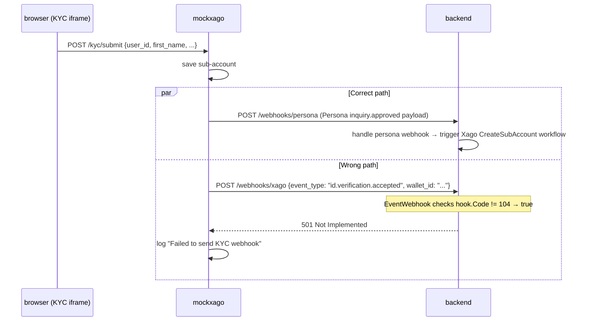
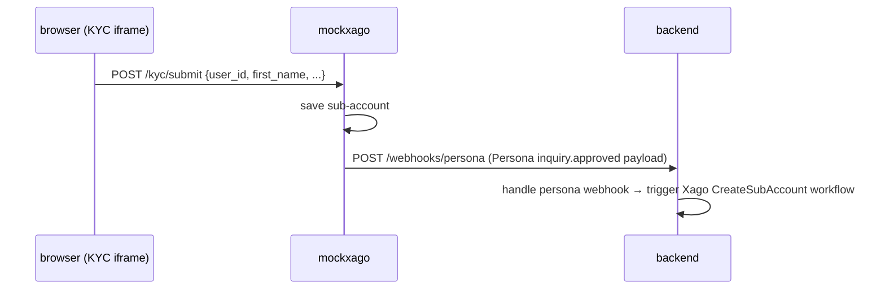

# Bug 2: Spurious Xago KYC webhook fires at the wrong endpoint

## Summary

After KYC iframe submission, `KYCIframeSubmit` fires **two** goroutines:

```go
go h.sendKYCWebhook(walletID)          // ← wrong: posts a GateHub-style payload
go h.sendPersonaInquiryApproved(walletID) // ← correct: posts to /webhooks/persona
```

`sendKYCWebhook` POSTs a `{"event_type": "id.verification.accepted", ...}` payload to
`WEBHOOK_URL=http://backend:8080/webhooks/xago`. The backend's Xago deposit webhook
handler (`EventWebhook`) speaks a completely different schema and has no concept of KYC
events. It checks `hook.Code != 104` (always true here) and returns 501.

## Evidence

```
mockxago:  ERROR: Failed to send KYC webhook: webhook returned status 501:
backend:   "msg":"unsupported xago webhook received",
           "webhook":"{\"event_type\":\"id.verification.accepted\",
                       \"wallet_id\":\"local-inquiry-id\",...}"
```

## Sequence diagram (current broken flow)



## Sequence diagram (desired flow after fix)



## Fix

In `internal/handler/kyc.go`, remove the spurious call inside `KYCIframeSubmit`:

```go
// Before
go h.sendKYCWebhook(walletID)         // ← delete this line
go h.sendPersonaInquiryApproved(walletID)

// After
go h.sendPersonaInquiryApproved(walletID)
```

Delete (or keep private and unexported) the `sendKYCWebhook` method entirely — there is
no matching handler on the backend side and the `WEBHOOK_URL` env var is unambiguously
only for deposit webhooks.

The same spurious call exists inside `PersonaInquirySubmit` in `internal/handler/persona.go`:

```go
go h.sendKYCWebhook(inquiryID)  // ← also remove
```
