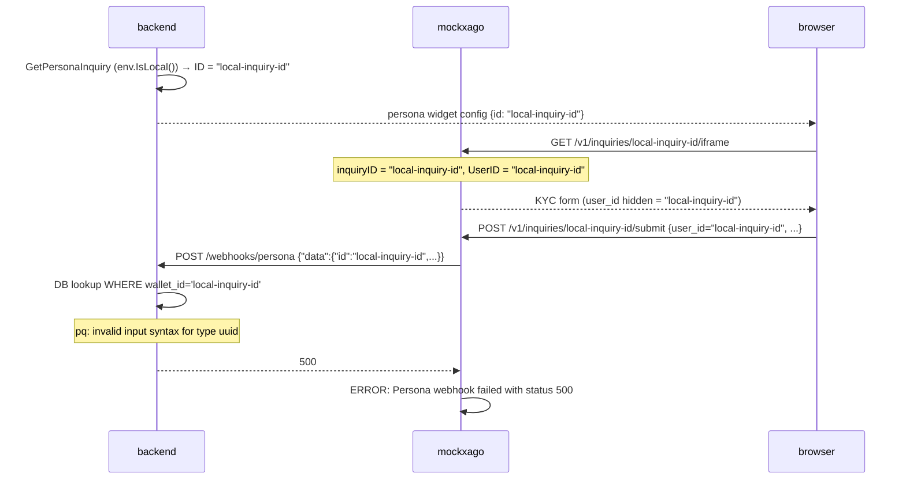
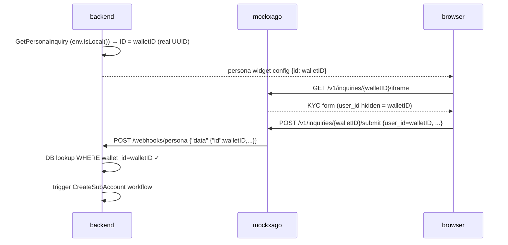

# Bug 3: Persona iframe submits `"local-inquiry-id"` instead of the wallet UUID

## Summary

In local mode the backend hardcodes the Persona inquiry ID to `"local-inquiry-id"`:

```go
// go/backend/kyc/ops/persona.go
if env.IsLocal() {
    return &kyc.PersonaInquiry{ID: "local-inquiry-id", ...}
}
// ...
if env.IsLocal() {
    return fmt.Sprintf(urlFormat, "local-inquiry-id"), nil
}
```

The frontend therefore opens the mockxago iframe at:
```
GET /v1/inquiries/local-inquiry-id/iframe
```

`PersonaGetInquiryIframe` passes `inquiryID` (the path param `"local-inquiry-id"`) directly
as `UserID` to the HTML template. The form submits `user_id=local-inquiry-id`.

The Persona webhook (`sendPersonaInquiryApproved`) fires with `"id": "local-inquiry-id"`.
The backend's webhook handler tries to query the DB:

```sql
-- wallet_id is a UUID column
SELECT ... FROM kyc_persona_inquiries WHERE wallet_id = 'local-inquiry-id'
```

Postgres rejects it:

```
pq: invalid input syntax for type uuid: "local-inquiry-id"
```

The KYC approval therefore never propagates; the `CreateSubAccount` Temporal workflow
never gets signalled.

## Sequence diagram (current broken flow)



## Sequence diagram (desired flow after fix)



## Root cause location

The literal string `"local-inquiry-id"` appears in two separate places in
`go/backend/kyc/ops/persona.go`. These are the canonical fix points; mockxago is a
consequence.

**Option A — fix the backend (preferred, authoritative):**

Replace the hardcoded constant with the real walletID in both local branches:

```go
// GetPersonaInquiry — local branch
if env.IsLocal() {
    err := GenerateKycData(ctx, b, walletID)
    return &kyc.PersonaInquiry{
        ID:     walletID,   // ← was "local-inquiry-id"
        Status: persona.InquiryStatus(persona.InquiryApproved),
    }, err
}

// GetApprovedPersonaInquiryURL — local branch
if env.IsLocal() {
    return fmt.Sprintf(urlFormat, walletID), nil   // ← was "local-inquiry-id"
}
```

With this change the Persona SDK opens the iframe at `/v1/inquiries/{walletID}/iframe`.
`PersonaGetInquiryIframe` already passes the URL path param as `UserID`, so the form
correctly submits the wallet UUID — no changes needed on the mockxago side for this bug.

**Option B — fix in mockxago only (workaround):**

Pass the wallet UUID as a separate query param (e.g. `?reference_id=<walletID>`) when
opening the iframe URL, and have `PersonaGetInquiryIframe` prefer that over the inquiry
ID. This is more fragile since it requires a coordinated change between the frontend and
mockxago.

Option A is strongly preferred because the backend is authoritative (per the brief).
