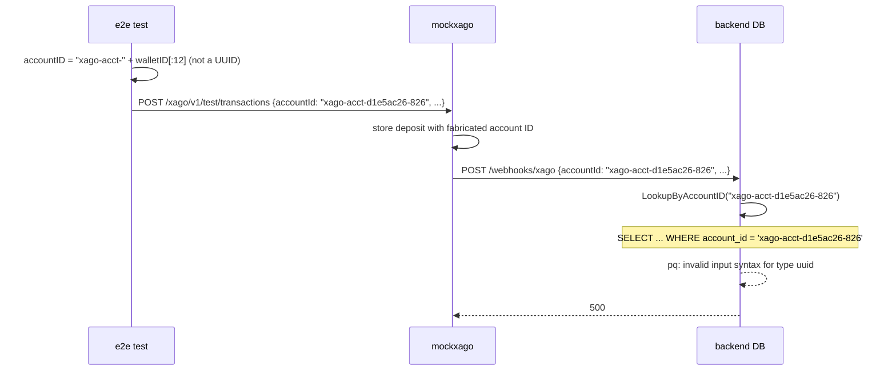
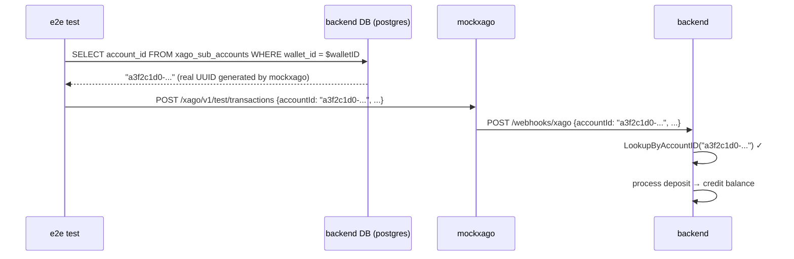

# Bug 4: E2E test fabricates a truncated, non-UUID account ID

## Summary

The E2E step `iCreateATestTransactionInMockXagoFor` derives an account ID by slicing the
wallet UUID:

```go
// local/e2e-playwright/xago_deposit.go
accountID := fmt.Sprintf("xago-acct-%s", walletID[:12])
// e.g. walletID = "d1e5ac26-8265-4d7b-8165-ae88921c028d"
// →    accountID = "xago-acct-d1e5ac26-826"   ← 23 chars, not a UUID
```

This fabricated string is embedded in both the test transaction and the deposit webhook.
The backend's `LookupByAccountID` queries:

```sql
SELECT ... FROM xago_sub_accounts WHERE account_id = 'xago-acct-d1e5ac26-826'
```

`account_id` is a UUID column — Postgres rejects it immediately:

```
pq: invalid input syntax for type uuid: "xago-acct-d1e5ac26-826"
```

Even after Bug 1 is fixed (so sub-accounts are properly created with a real UUID from
mockxago), this will still fail because the fabricated ID will never match the UUID that
mockxago generated and the backend stored.

## Evidence

```
backend: "msg":"failed to find sub account for xago webhook",
         "error":"xago: internal error pq: invalid input syntax for type uuid: \"xago-acct-c92ca649-3c0\""
```

## Sequence diagram (current broken flow)



## Sequence diagram (desired flow after fix)



## Fix

`iGetTheXagoSubAccountDetailsForTheCurrentUser` already fetches the walletID and stores
it. Extend it to also look up the `account_id` from the `xago_sub_accounts` table:

```go
func (sc *E2EContext) iGetTheXagoSubAccountDetailsForTheCurrentUser() error {
    // ... existing wallet ID lookup ...

    // NEW: look up the real account_id stored by the backend
    var accountID string
    err = sc.db.QueryRowContext(ctx,
        "SELECT account_id FROM xago_sub_accounts WHERE wallet_id = $1",
        walletID,
    ).Scan(&accountID)
    if err != nil {
        return fmt.Errorf("xago sub account not found for wallet %s: %w", walletID, err)
    }
    sc.userDetails[sc.currentUser].Fields["xago_account_id"] = accountID
    return nil
}
```

Then in `iCreateATestTransactionInMockXagoFor`, use the stored value instead of deriving
it:

```go
// Before (wrong)
accountID := fmt.Sprintf("xago-acct-%s", walletID[:12])

// After (correct)
accountID, exists := sc.userDetails[sc.currentUser].Fields["xago_account_id"]
if !exists || accountID == "" {
    return fmt.Errorf("xago_account_id not found — call 'get the Xago sub account details' first")
}
```

The `iCreateATestTransactionInMockXagoWithAccountIDFor` variant already accepts an
explicit account ID; it is unaffected.

## Prerequisites

This fix only has effect once Bug 1 is resolved, because until `CreateSubAccount`
returns a real response the `xago_sub_accounts` table remains empty for the test user.
