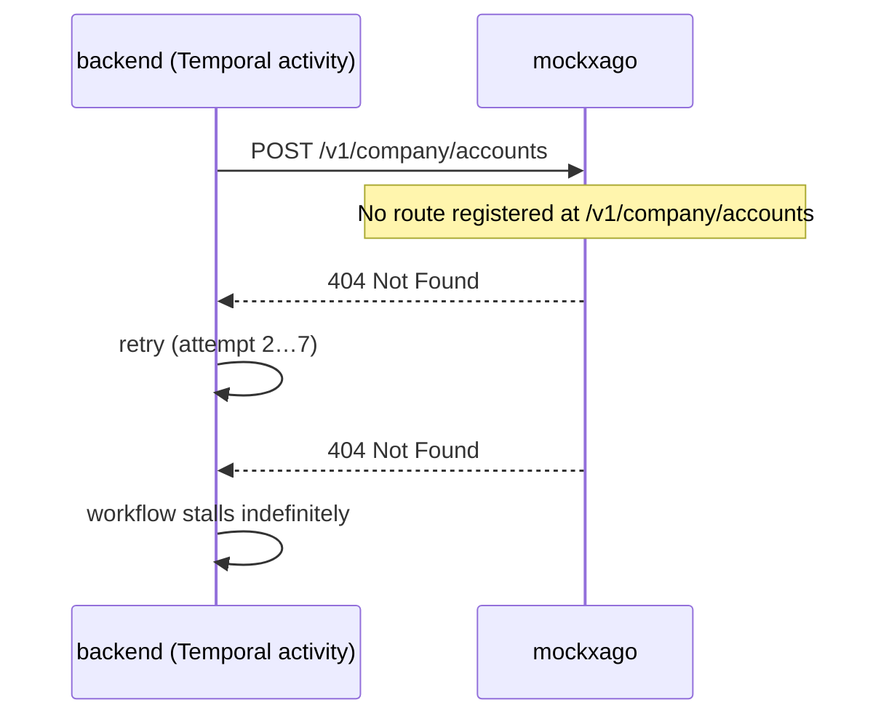
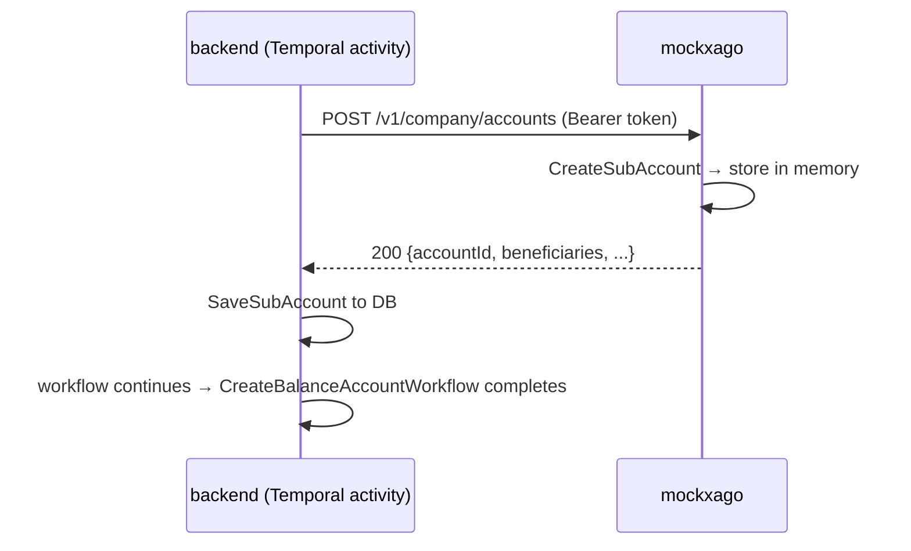

# Bug 1 (Root Cause): Protected route prefix mismatch → `CreateSubAccount` always 404

## Summary

Mockxago registers all protected API routes under `/xago/v1/...` — a legacy prefix
inherited from `mockbos`, which was a single mock service that differentiated providers
by route prefix. Mockxago is now a standalone service and doesn't need that prefix.

`wallet.yaml` already correctly configures `XAGO_API_BASE_URL=http://mockxago:8080/v1`
(no `/xago` prefix), so the backend's requests land on paths mockxago never registers
→ 404 every time.

This is the root cause. Every downstream flow (deposit webhooks, KYC-linked sub-account
creation) is dead because no sub-account ever gets created in the backend DB.

There is no environment-based logic remaining in the Xago provider code — `FYNBOS_ENV`
is not referenced there. The backend's behaviour is entirely driven by configuration,
which is already correct. The problem is solely in mockxago's route registration.

## Evidence

`backend` logs show `CreateSubAccount` retrying indefinitely:

```
"ActivityType":"CreateSubAccount","Attempt":7,"Error":"failed to create xargo sub account (404 - 404 Not Found)"
```

## How the URLs are built

**Backend** (`go/backend/providers/xago/external/client.go`):

```go
// XAGO_API_BASE_URL = "http://mockxago:8080/v1"
url.JoinPath(c.baseURL, "company", "accounts")
// → http://mockxago:8080/v1/company/accounts   ← not registered
```

**Mockxago** (`cmd/mockxago/main.go`):

```go
// Legacy /xago/v1 prefix — inherited from mockbos, does NOT match backend config
router.Route("/xago/v1", func(r chi.Router) {
    r.Post("/company/accounts", h.CreateSubAccount)    // → /xago/v1/company/accounts  ✗
    r.Put("/company/accounts/{accountId}", ...)         // → /xago/v1/company/accounts/{id}  ✗
    r.Get("/company/accounts", ...)                     // → /xago/v1/company/accounts  ✗
    r.Get("/accounts/{accountId}/balance", ...)         // → /xago/v1/accounts/{id}/balance  ✗
    ...
})
```

Note: someone already noticed this mismatch for transactions and worked around it by
adding a *separate* `/v1` block:

```go
// Patch: transactions registered at /v1 because backend calls /v1/company/transactions
router.Route("/v1/company/transactions", func(r chi.Router) {
    r.Get("/", h.ListTransactions)
    r.Get("/{id}", h.GetTransaction)
})
```

That workaround confirms the pattern — but adding parallel blocks for every route is the
wrong approach. The correct fix is to rename the primary block.

## Sequence diagram (current broken flow)



## Sequence diagram (desired flow after fix)



## Fix

In `cmd/mockxago/main.go`, **rename** the route block from `/xago/v1` to `/v1`.
Also remove the ad-hoc `/v1/company/transactions` workaround block and consolidate
everything under the single canonical prefix:

```go
// Xago API endpoints — canonical prefix /v1 matches XAGO_API_BASE_URL config
router.Route("/v1", func(r chi.Router) {
    r.Post("/login", h.Login)
    r.Get("/currencies", h.ListCurrencies)

    r.Group(func(pr chi.Router) {
        pr.Use(h.AuthMiddleware)
        pr.Post("/company/accounts", h.CreateSubAccount)
        pr.Put("/company/accounts/{accountId}", h.UpdateSubAccount)
        pr.Get("/company/accounts", h.GetSubAccountByWallet)
        pr.Get("/accounts/{accountId}/balance", h.GetBalance)
        pr.Get("/company/transactions", h.ListTransactions)
        pr.Get("/company/transactions/{id}", h.GetTransaction)
        // test endpoints:
        pr.Post("/test/balances/set", h.TestSetBalance)
        pr.Post("/test/balances/deposit", h.TestDeposit)
        pr.Post("/test/balances/transfer", h.TestTransfer)
        pr.Post("/test/transactions", h.TestCreateTransaction)
    })
})
```

No changes needed to `wallet.yaml` — `XAGO_API_BASE_URL` and `XAGO_IDENTITY_BASE_URL`
are already set to `http://mockxago:8080/v1`, which is the correct canonical prefix.
The standalone `/company/transactions` and the old `/xago/v1` blocks should be removed.

In `testenv/`, replace all `/xago/v1/` path strings with `/v1/` across:
- `auth_steps.go`
- `subaccount_steps.go`
- `balance_steps.go`
- `currency_steps.go`

## Result

`make test` passes: **35 scenarios, 222 steps — all passed**.
