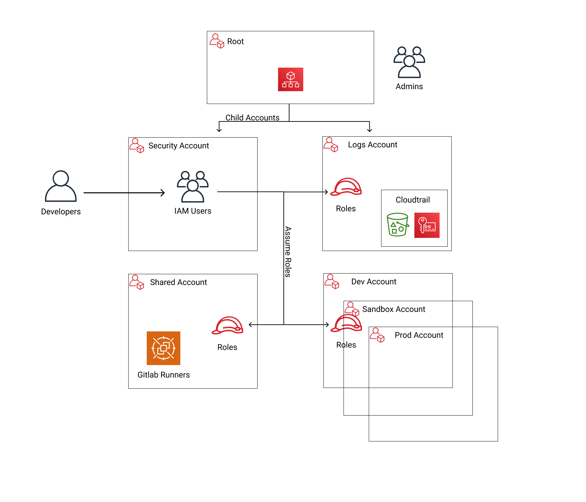

# AWS Architecture

The following document outlines the overall architecture of Fynbos AWS infrastructure. Where a diagram is outlined 
below to give a high level overview.

## Tools

Management of the AWS architecture uses a feels tools
* AWS CLI - To interact with AWS Resources
* Pulumi - For declaring Infrastructure as Code
* AWS Vault - securely managing AWS Access keys and profiles locally

## Root Account
At the top of the design, you have the root account of your AWS organization. This account is not used to run any infrastructure, and only one or a small number of trusted admins should have IAM users in this account, using it solely to create and manage child accounts and billing.

Do NOT attach any IAM policies directly to the IAM users; instead, create a set of IAM groups, with specific IAM policies attached to each group, and assign all of your users to the appropriate groups. The exact set of IAM groups you need depends on your company’s requirements, but for most companies, the root account contains solely a full-access IAM group that gives the handful of trusted users in that account admin permissions, plus a billing IAM group that gives the finance team access to the billing details.

## Child Accounts
Child accounts

### Security account
You will want a single security account for managing authentication and authorization. This account is not used to run any infrastructure. Instead, this is where you define all of the IAM users and IAM groups for your team (unless you’re using Federated auth, as described later). None of the other child accounts will have IAM users; instead, those accounts will have IAM roles that can be assumed from the security account. That way, each person on your team will have a single IAM user and a single set of credentials in the security account (with the exception of the small number of admins who will also have a separate IAM user in the root account) and they will be able to access the other accounts by assuming IAM roles.

### Application accounts (dev, stage, prod)
You can have one or more application accounts for running your software. At a bare minimum, most companies will have a production account ("prod"), for running user-facing software, and a staging account ("stage") which is a replica of production (albeit with smaller or fewer servers to save money) used for internal testing. Some teams will have more pre-prod environments (e.g., dev, qa, uat) and some may find the need for more than one prod account (e.g., a separate account for backup and/or disaster recovery, or separate accounts to separate workloads with and without compliance requirements).
### Shared-services account

The shared-services account is used for infrastructure and data that is shared amongst all the application accounts, such as CI servers and artifact repositories. For example, in your shared-services account, you might use ECR to store Docker images and Jenkins to deploy those Docker images to dev, stage, and prod. Since the shared-services account may provide resources to (e.g., application packages) and has access to most of your other accounts (e.g., for deployments), including production, from a security perspective, you should treat it as a production account, and use at least the same level of precaution when locking everything down.

### Logs account
You will want a single logs account for aggregating log data. All the other accounts—root, security, application accounts, shared-services, etc.—will send their AWS Config and CloudTrail data to this account so that you have a single, central place where all logs are stored and can be viewed. This account will also contain a KMS customer master key (CMK) that is used to encrypt CloudTrail logs

