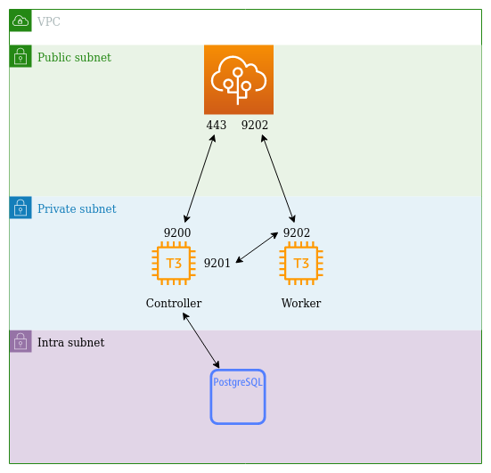

The Boundary deployment comprises:
- loadbalancer listening on port 443 and 9202
- 443 traffic is forwarded to the controller on port 9200
- 9202 traffic is forwarded to the worker on port 9202
- RDS Postgres instance in the intra subnet
- CNAME in Cloudflare for https://boundary.fynbos.dev to point to the AWS network loadbalancer

You will be able to access the boundary controller at https://boundary.fynbos.dev

## Prerequisites
The baseline project needs to be run first so that an AWS KMS key is provisioned with which we encrypt secrets in Pulumi.
Then the cloudflare/fynbos.dev project needs to be run. This generates a private key that is used to generate an origin certificate from Cloudflare.
The key and cert are needed so that they can be provisioned on the controller and worker to enable TLS on the `api` servers.

## First Time Deployment

### Initialising the stack
We use the an AWS Kms Key that was set up in the baseline project to encrypt the boundary certificate's private key (and any other secret). You need to initialise the stack with the following command to
`aws-vault exec <account that assumes shared role> -- pulumi stack init <name> --secrets-provider="aws://<kms-key-id>?region=eu-west-1"`

If you forgot to initialise it like that then change the secrets provider by running
`aws-vault exec <account that assumes shared role> -- pulumi stack change-secrets-provider "aws://<kms-key-id>?region=eu-west-1"`
This will update the `Pulumi.main.yaml` file with details about the external encryption provider (AWS KMS).

### Configuring Boundary
Boundary controller is deployed with all the presets disabled. This gives us full control of our config.
We create the `infra` organisation with the `eu-west-1` project. A super admin is created that gives access to both these scopes.

Our configuration scripts are in `./firstdeploysetup`. You will need the following environment variables
| Env                  | Value                                               |
|----------------------|-----------------------------------------------------|
| KMS_KEY_ID           | <recovery key id>                                   |
| ADMIN_PASSWORD       | <secure password>                                   |
| CLOUDFLARE_API_TOKEN | <cloudflare token with permission to edit dns zone> |
| OIDC_CLIENT_ID 	   | <Google OIDC client id>                             |
| OIDC_CLIENT_SECRET   | <Google OIDC client secret>                         |

We use Google as the OIDC provider to log into Boundary. A provider has been setup and can be found at `https://console.cloud.google.com/apis/credentials?project=high-ace-321809`.

Then run 
```sh
aws-vault exec <account that assumes shared role> -- go run main.go
```
At the moment the Go sdk for boundary fails to add principals to roles. So the script will output a command to export more env variables. e.g.
`export ORG_ID=o_Z5Dopz987h; export ADMIN_GROUP_ID=g_87p5hiP0w0; export ORG_ADMIN_ROLE_ID=r_JtImcUoMCK; export PROJECT_ADMIN_ROLE_ID=r_4A09rLcMsn; export GLOBAL_ANON_ROLE_ID=r_wyfZ3N7pv5; export ORG_ANON_ROLE_ID=r_X3yDcKTsdz;`

Export those variables and then run the following script
```sh
aws-vault exec <account that assumes shared role> -- bash ./assign-roles.sh
```

## Adding a user to the admin group
Ensure the user has a Fynbos Google account. Then get the user to login at https://boundary.fynbos.dev. They will go through the OIDC login flow be logged into Boundary without any priviledges.

You then need to manually add this person to the admin group for the `infra` organisation using the Boundary cli.
```sh
# lookup the infra organisation id
aws-vault exec shared-from-don -- boundary scopes list -recovery-config=config.hcl
# export the ORG_ID

# look up the admin group
aws-vault exec shared-from-don -- boundary scopes list -recovery-config=config.hcl
# lok for the infra-admin group and export the GROUP_ID

# look up the user that was created when they logged in via Google
aws-vault exec shared-from-don -- boundary users list -scope-id $ORG_ID -recovery-config=config.hcl
# find the user id from the list. Or get the user id out of the browser local storage and export the USER_ID

# add the user to the admin group
aws-vault exec shared-from-don -- boundary groups add-members -id $GROUP_ID -member $USER_ID -recovery-config config.hcl


```
