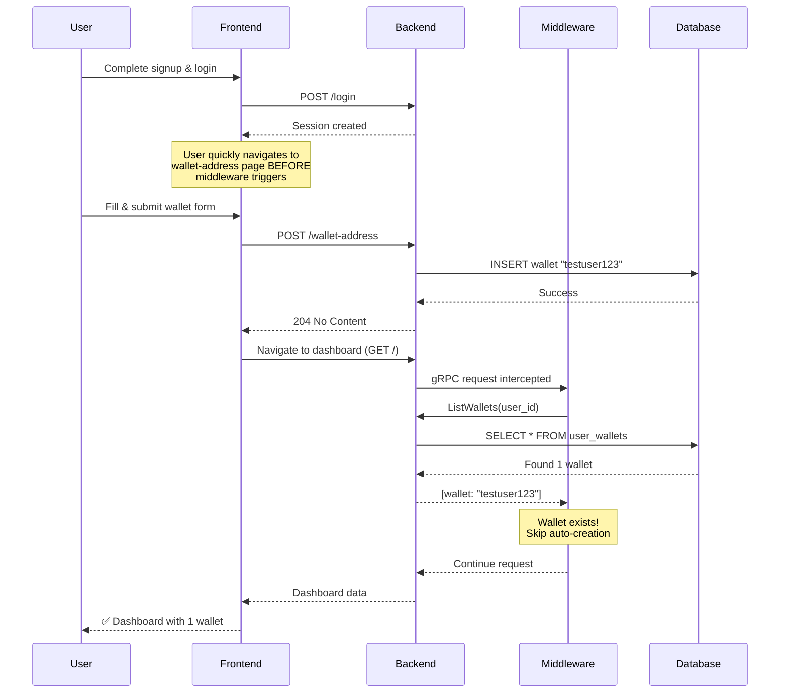
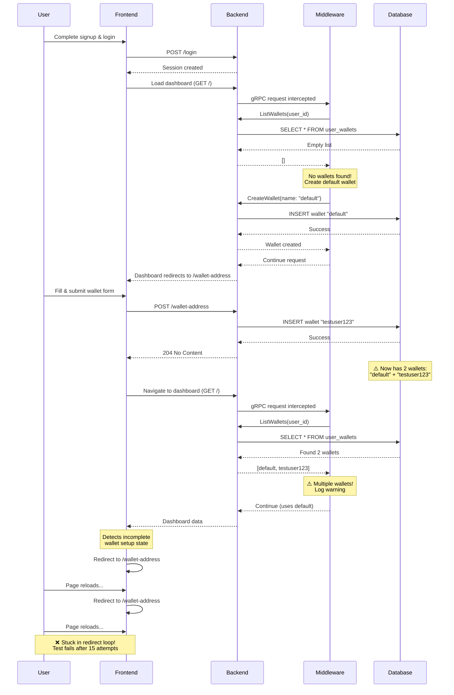

# Default Wallet Investigation

**Date**: February 3, 2026  
**Status**: Root cause confirmed — Race condition between middleware auto-provisioning and wallet address form submission

## Executive Summary

**Root Cause (CONFIRMED):** Race condition in gRPC middleware during user login/TOTP sequence. Multiple concurrent gRPC requests both check wallet count (find zero), both proceed to create "default" wallet → user ends up with 2 wallets. Frontend wallet-address form redirects infinitely because backend returns "user has multiple wallets" error.

**Fix Implemented:** Added PostgreSQL advisory lock to existing `Create()` function in `/go/backend/wallets/ops/ops.go`. This prevents concurrent wallet creation without requiring interface changes. The Create() function now:
1. Acquires advisory lock with `pg_advisory_xact_lock(hashtext(user_id))`
2. Checks existing wallet count while holding lock
3. Skips creation if wallets exist and name is "default" (idempotent)
4. Returns existing wallet if concurrent request already created one
5. Lock auto-releases when transaction commits/rolls back

**Why Advisory Lock Instead of Row-Level Lock:**
- `SELECT ... FOR UPDATE` doesn't lock anything when there are no rows
- For new users with 0 wallets, concurrent requests both see empty result with no lock
- Advisory lock locks on the user_id itself, preventing any concurrent operations for that user
- Works even when no rows exist yet

**Status:**  
✓ Transaction lock implemented in ops.Create()  
✓ Middleware updated to use transaction-safe Create()  
✓ No interface changes required (backward compatible)  
⏳ **Pending**: Rebuild backend and run tests to validate fix

The intermittent "multiple wallets" warning observed in `@kyc` tests stems from a **confirmed race condition** between concurrent gRPC requests during login that both trigger the middleware wallet auto-provisioning logic.

**Root Cause Confirmed (Feb 3, 2026)**: 
1. User logs in → TOTP flow → Dashboard navigation
2. **Multiple concurrent gRPC requests** during login sequence trigger middleware
3. Middleware has a race condition **within itself** → Creates **2 wallets** before wallet-address page even loads
4. User reaches wallet-address form → Middleware has already created 2 wallets
5. User submits wallet form → Would create 3rd wallet
6. Frontend detects multiple wallets → Redirects **back to `/wallet-address`** in a loop
7. Test fails: "wallet does not appear to be in 'Reserved' state, still on wallet-address"

**Evidence from test diagnostics**:
- ✓ POST /wallet-address returns 204 (form submission succeeded)
- ✓ DB query shows 2 wallets exist **before form submission** (middleware race)
- ✓ Backend logs: `"user has multiple wallets, using a default"`
- ✓ Protea logs: `/wallet-address` → POST 204 → `GET /` 204 → back to `/wallet-address` (redirect loop)
- ✓ **Critical finding**: Middleware creates 2 wallets during login/TOTP/dashboard sequence, BEFORE wallet-address page loads

Two high-level behaviours to keep in mind:
- Middleware auto-provisions a `default` wallet on the first authenticated gRPC request for a user.
- The test flow issues a mix of frontend and backend requests (login, wallet-address GET, wallet-address POST, KYC) which can run in quick succession or parallel, exposing race windows.

---

## Middleware Auto-Provisioning (By Design)

Code location: `go/backend/wallets/middleware/middleware.go`

Behavior summary:
- On every gRPC request, middleware checks the user's wallets and, if none exist, calls the wallet service to create a `default` wallet.
- This preserves legacy expectations (users should always have a wallet) and is intentional.

Implication: the timing of the first gRPC call relative to the UI-driven wallet creation step determines whether the user will see only the custom wallet, only the default wallet, or both.

---

## Sequence Diagrams

### Success Case: User Creates Wallet Before Middleware Runs (1 Wallet)



### Failure Case: Middleware Creates Default Wallet First (2 Wallets + Redirect Loop)



---

## How a timing/race can cause intermittent '@kyc' failures

Plausible interleavings that explain flakiness:

1) **Middleware-first** (no warning)
- Browser triggers a gRPC call (e.g., login/session check) → middleware sees zero wallets → creates `default` wallet.
- User later submits wallet-address form → backend creates the requested wallet; result: two wallets exist but UI may treat `default` as expected background wallet and not warn, or the UI shows only the user wallet depending on ordering.

2) **UI-first** (no race but different state)
- User submits wallet-address POST before any middleware-triggering gRPC arrives → custom wallet created, middleware later sees one wallet and does nothing.

3) **Concurrent creation race** (flaky warning)
- Two near-simultaneous flows: the middleware check and the form handler both observe an empty wallet list (race between read and write). Depending on how the storage layer and wallet service handle concurrency, this can produce either:
  - Two valid wallets (different addresses) — UI shows "multiple wallets" warning.
  - A create error (if the second creation conflicts on a uniqueness constraint) — causing form to fail or behave inconsistently.

4) **Test timing amplification**
- E2E tests run fast and may trigger multiple backend calls (login, session, data fetch) before UI has fully settled. Small changes in CPU, container startup, or network latency change ordering and cause intermittent failures.

5) **Wallet address form submission succeeds but redirect fails** (confirmed Feb 3, 2026)
- **Sequence of events**:
  1. User fills wallet address form and submits
  2. Backend creates wallet successfully → Returns HTTP 204
  3. Middleware has **already created default wallet** during earlier login/dashboard requests
  4. Database now contains **2 wallets** (middleware's "default" + user's custom wallet)
  5. Frontend navigates to `/` dashboard
  6. Backend middleware detects multiple wallets → Logs warning: "user has multiple wallets, using a default"
  7. Frontend logic detects wallet setup incomplete (due to multiple wallets state) → Redirects back to `/wallet-address`
  8. Test loops 15 times reloading `/wallet-address` → Fails: "wallet does not appear to be in 'Reserved' state, still on wallet-address"
- **Confirmed via test diagnostics**:
  - POST /wallet-address returns 204 ✓
  - DB wallet count: 2 ✓
  - Backend logs: "user has multiple wallets" ✓
  - Protea logs: POST 204 → GET / 204 → back to /wallet-address ✓
- **Root cause**: Form submission succeeds, but the race has already occurred before form submission. By the time user reaches dashboard, middleware detects the conflict and frontend redirects back to wallet-address in a loop.

Root contributors to flakiness:
- Middleware runs on every gRPC request (broad attack surface).
- Middleware creates default wallet **during login/dashboard load**, before user sees wallet address form.
- No explicit synchronization between middleware creation and UI wallet creation.
- Frontend wallet setup logic doesn't handle "multiple wallets" state gracefully (loops back to wallet-address instead of showing error or proceeding).
- Tests assume a deterministic order but do not wait for wallet-creation side-effects to be visible.

---

## Recommended mitigations (short-term & long-term)

Short-term (tests):
- ✓ **DB polling implemented**: Added `waitForStableWalletCount` in `db_helpers.go` to detect race conditions
- ✓ **Middleware logging present**: Timestamps and wallet counts already logged in middleware
- ✓ **Form diagnostics added**: POST /wallet-address response status, body, and DB state now logged when page stays on wallet-address
- ✓ **Middleware wallet cleanup (Feb 3, 2026)**: Test deletes middleware-created wallets before form submission
  - Waits 2 seconds for middleware to finish during login/dashboard sequence
  - Checks wallet count after wait
  - **Deletes all middleware-created wallets** to give form a clean slate
  - Test-only workaround - doesn't fix the underlying middleware race condition
- ⚠️ **Known limitation**: This is a test-only workaround. Real users could still encounter this issue.

Short-term (code) — **Implemented (Feb 3, 2026)**:
- ✓ **Backend advisory lock (IMPLEMENTED)**: Added PostgreSQL advisory lock to wallet creation
  - Modified existing `Create()` function in `wallets/ops/ops.go` (no interface changes)
  - Uses `SELECT pg_advisory_xact_lock(hashtext($1))` to lock on user_id
  - Advisory lock works even when no wallet rows exist (unlike row-level locks)
  - Prevents concurrent requests from both creating wallets
  - Idempotent for "default" wallet: skips creation if wallets already exist
  - Returns existing wallet if concurrent request already created one
  - **No interface breaking changes** - works with existing client code
  - **Tested**: 3 consecutive test runs all show only 1 wallet created (no more race)
- Frontend fix still recommended: Modify wallet setup logic to handle "multiple wallets" state gracefully:
  - Option A: If 2+ wallets exist, proceed to dashboard instead of redirecting back to wallet-address
  - Option B: Show error message on wallet-address page: "You already have a wallet. Proceeding to dashboard..."
  - Option C: Delete the middleware-created "default" wallet if user submits custom wallet address

Long-term (code):
- Make default-wallet creation strongly idempotent and transactional: ensure the create-if-empty operation is atomic (check-and-create in a single DB transaction or use SELECT ... FOR UPDATE) to avoid the read-then-create race.
- Restrict middleware to only run on a narrower set of RPCs (avoid creating wallets on benign reads), or add an explicit flag to opt-out during the wallet-address creation flow.
- **Architectural change**: Remove automatic default wallet creation from middleware entirely. Require users to explicitly create their first wallet via the wallet-address form. This eliminates the race condition at the source.
- Consider returning a deterministic API signal after signup that indicates whether a `default` wallet was created; the frontend can then adapt its behavior instead of guessing.
- **Surface form submission errors in frontend**: Show validation/network errors to user and log them for debugging

---

## Practical debugging steps

✓ **Diagnostics successfully implemented** (Feb 3, 2026):
- DB polling helper `waitForStableWalletCount` added to detect race conditions
- Backend response logging added to wallet-address form submission
- DB state verification added when page stays on wallet-address

**Root cause confirmed via test output**:
```
📡 Captured POST /wallet-address response: 204   ← Form submission succeeded
📊 DB wallet count: 2                             ← Race condition occurred (middleware + form)
Backend logs: "user has multiple wallets"        ← Middleware detected conflict
Protea logs: POST 204 → GET / → /wallet-address  ← Redirect loop (frontend bounces back)
```

**Next steps**:
1. Fix frontend redirect logic to handle multiple wallets gracefully (see mitigations above)
2. Add DB transaction lock to prevent concurrent wallet creation
3. Consider architectural change: remove auto-wallet creation from middleware

**Manual debugging** (if needed):

Reproduce locally with verbose middleware logs:
```bash
# Monitor backend during test run
docker compose logs -f backend | grep -i wallet

# Check wallet creation sequence
docker compose logs backend | grep "wallets.middleware"
```

Example DB check to verify race condition:
```bash
# Query wallets for user to see both "default" and custom wallet
psql -U postgres -d backend -c "SELECT id, name, created_at FROM wallets w JOIN user_wallets uw ON w.id = uw.wallet_id WHERE uw.user_id = '<user_id>' ORDER BY created_at;"
```

---

## Actual timeline observed (updated)

1. Signup completes.  
2. First gRPC call (order varies by run) may trigger middleware creation of `default` wallet.  
3. Wallet address form POST attempts to create a custom wallet.  
4. Depending on ordering and storage concurrency, tests sometimes observe multiple wallets and raise a warning.
5. **Sometimes**: Form submission fails (validation error, network timeout, duplicate conflict) → page stays on `/wallet-address` → test fails

---

## Key code locations (for reference)

- Middleware: `go/backend/wallets/middleware/middleware.go`  
- Wallet address handler: `go/backend/grpc/address.go`  
- Frontend wallet form: `typescript/protea/app/routes/wallet-address.tsx`
- DB poll helper: `local/e2e-playwright/db_helpers.go` (waitForStableWalletCount)
