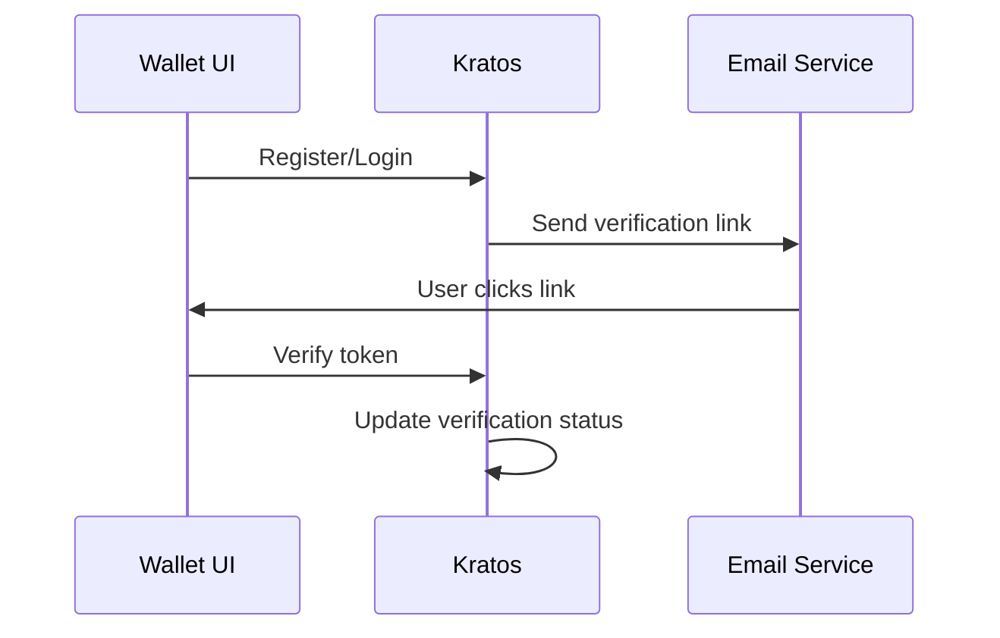

# Email Verification Troubleshooting (local)

## Quick checks
- Verify the user exists in Kratos
- Check the verification status in the database
- Confirm the verification flow was initiated
- Check Kratos logs for errors



## Checking verification status

### Via Kratos CLI

```bash
# List all identities and check verification status
docker compose exec kratos kratos list identities \
  --endpoint http://localhost:4434 \
  --format json-pretty | grep -A 30 "user@example.com"
```

Look for the `verifiable_addresses` array and check the `verified` field:
```json
"verifiable_addresses": [
  {
    "status": "sent",      // or "completed"
    "verified": false,     // should be true when verified
    "value": "user@example.com"
  }
]
```

### Via Database

```bash
# Check verification status directly in database
docker compose exec -T postgres psql -U postgres -d kratos -c \
  "SELECT id, value, verified, status, created_at, updated_at 
   FROM identity_verifiable_addresses 
   WHERE value = 'user@example.com';"
```

## Manually verifying a user

Sometimes the verification link doesn't work or you need to bypass email verification for testing.

### Method 1: Direct database update (recommended)

```bash
docker compose exec -T postgres psql -U postgres -d kratos -c \
  "UPDATE identity_verifiable_addresses 
   SET verified = true, status = 'completed' 
   WHERE value = 'user@example.com';"
```

### Method 2: Via Kratos Admin API

```bash
# First, get the identity ID
IDENTITY_ID=$(docker compose exec kratos kratos list identities \
  --endpoint http://localhost:4434 \
  --format json | jq -r '.[] | select(.traits.email == "user@example.com") | .id')

# Then update the verifiable address
# (Note: This requires constructing a PATCH request - database method is simpler)
```

## Troubleshooting common issues

### User can't find verification email

**Check if email was sent:**
```bash
docker compose logs kratos | grep "user@example.com" | tail -20
```

**In local development**, emails are not actually sent. Users must use one of these methods:
1. Check Kratos courier messages (if courier is enabled)
2. Extract the verification link from Kratos logs
3. Manually verify via database (see above)

### Verification link expired

Verification links expire after a certain time (default: 1 hour).

**Solution**: Generate a new verification flow:
```bash
# This would typically be triggered by the UI "Resend verification email" button
# In local dev, manually verify the user instead (see above)
```

### "Invalid or expired flow" error

This happens when:
- The flow ID in the URL is wrong
- The flow has expired
- The flow was already completed

**Solution**:
1. Check if user is already verified (see "Checking verification status")
2. If not verified, manually verify (see "Manually verifying a user")
3. If developing the verification flow, check the flow ID matches what Kratos expects

### User appears verified but still can't access features

**Check both Kratos AND backend database:**

```bash
# Check Kratos verification
docker compose exec kratos kratos list identities \
  --endpoint http://localhost:4434 \
  --format json-pretty | grep -A 30 "user@example.com"

# Check backend wallet status
docker compose exec -T postgres psql -U postgres -d backend -c \
  "SELECT id, email, country_code, first_name, last_name, created_at 
   FROM wallet_users 
   WHERE email = 'user@example.com';"
```

The user must:
1. Be verified in Kratos
2. Have a corresponding wallet_users entry in backend
3. Have completed onboarding steps

## Extracting verification link from Kratos logs

If you need to manually complete a verification flow:

```bash
# Find recent verification flows
docker compose logs kratos | grep "verification" | tail -50

# Look for lines containing flow IDs like:
# "flow_id":"15a73776-a13e-43bb-8007-63b766298643"

# Construct the verification URL:
# https://interledger.test/verify?flow=<FLOW_ID>
```

## Database schema reference

### Kratos tables

**identity_verifiable_addresses**:
- `id`: UUID of the verifiable address
- `nid`: Network ID (tenant)
- `identity_id`: Foreign key to identities table
- `value`: The email address
- `verified`: Boolean - true when verified
- `status`: Enum - 'sent', 'completed', 'pending'
- `via`: Always 'email' for email verification
- `created_at`: When the address was added
- `updated_at`: Last modification time

**identities**:
- `id`: UUID of the identity
- `nid`: Network ID
- `state`: 'active' or 'inactive'
- `traits`: JSONB containing user profile (email, firstName, lastName, etc.)

## Common SQL queries

### Find all unverified users
```sql
SELECT i.id, i.traits->>'email' as email, iva.verified, iva.status
FROM identities i
JOIN identity_verifiable_addresses iva ON i.id = iva.identity_id
WHERE iva.verified = false
ORDER BY iva.created_at DESC;
```

### Verify all users (testing only!)
```sql
UPDATE identity_verifiable_addresses 
SET verified = true, status = 'completed' 
WHERE verified = false;
```

### Check verification status for multiple users
```sql
SELECT 
  i.traits->>'email' as email,
  iva.verified,
  iva.status,
  iva.created_at as address_created,
  iva.updated_at as last_updated
FROM identities i
JOIN identity_verifiable_addresses iva ON i.id = iva.identity_id
WHERE i.traits->>'email' IN ('user1@example.com', 'user2@example.com')
ORDER BY iva.created_at DESC;
```

## Integration with wallet backend

After email verification in Kratos, the wallet backend should:
1. Detect the verified status (via Kratos webhook or polling)
2. Allow the user to proceed with wallet creation
3. Enable access to protected features

If a user is verified in Kratos but still can't access wallet features, check:
- Backend logs for errors during wallet creation
- The `wallet_users` table for the user entry
- KYC status (see [gatehub-kyc-troubleshooting.md](gatehub-kyc-troubleshooting.md))

## Local development shortcuts

For local testing, you can bypass email verification entirely:

### Auto-verify on registration (database trigger)
Create a trigger that auto-verifies emails:

```sql
-- WARNING: Only for local development!
CREATE OR REPLACE FUNCTION auto_verify_email()
RETURNS TRIGGER AS $$
BEGIN
  NEW.verified = true;
  NEW.status = 'completed';
  RETURN NEW;
END;
$$ LANGUAGE plpgsql;

CREATE TRIGGER auto_verify_trigger
BEFORE INSERT ON identity_verifiable_addresses
FOR EACH ROW
EXECUTE FUNCTION auto_verify_email();
```

To remove the trigger:
```sql
DROP TRIGGER IF EXISTS auto_verify_trigger ON identity_verifiable_addresses;
DROP FUNCTION IF EXISTS auto_verify_email();
```

## Things to watch out for
- **Network ID (nid)**: Kratos supports multi-tenancy. Always filter by the correct network ID when querying.
- **Flow expiry**: Verification flows expire. Don't rely on old flow IDs.
- **State vs Status**: Identity `state` (active/inactive) is different from verifiable_address `status` (sent/completed/pending).
- **Traits validation**: Email in `traits` must match the email in `verifiable_addresses`.
- **Verification loops**: If a user keeps getting "verify your email" messages after verifying, check both Kratos and backend sync.

## Related documentation
- [Gatehub KYC Troubleshooting](gatehub-kyc-troubleshooting.md)
- [Gatehub Account Activation](gatehub-kyc-account-activation.md)
- [Kratos Identity Schema](https://www.ory.sh/docs/kratos/manage-identities/identity-schema)
