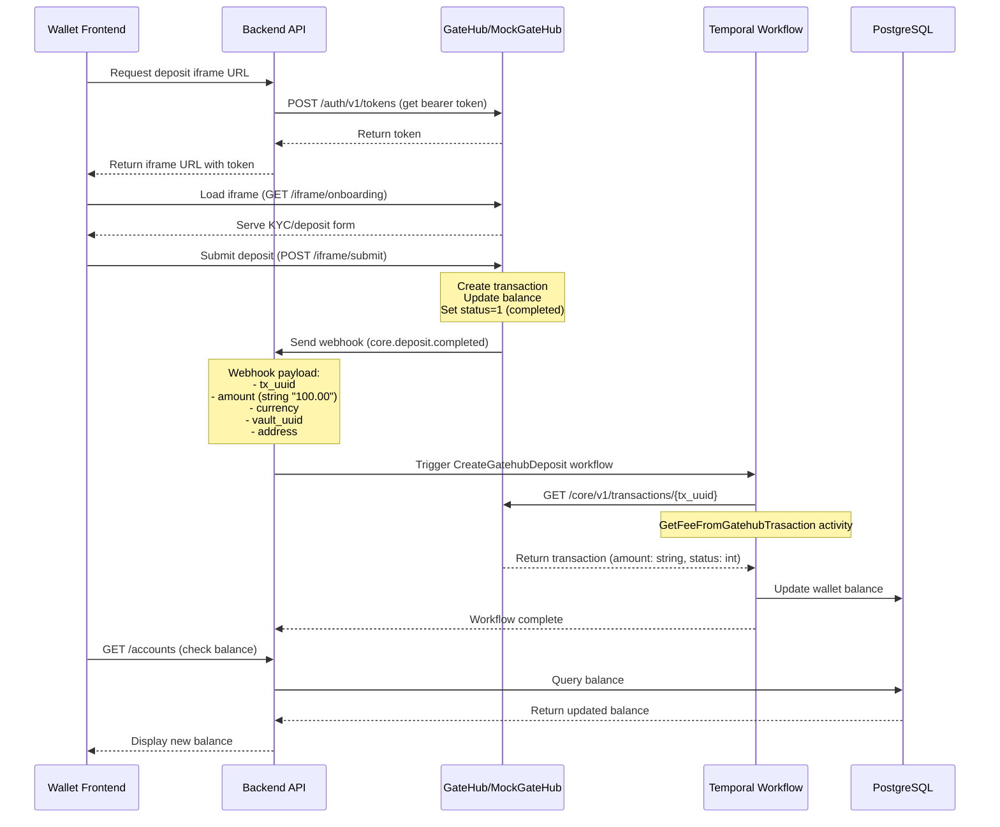

# GateHub Deposits Troubleshooting (local)

## Overview

GateHub deposits allow users to add fiat currency to their wallet balances. The deposit flow involves coordination between the wallet frontend, backend, and GateHub (or MockGateHub in local development).



## Prerequisites for Successful Deposits

Before a user can make a deposit, several conditions must be met:

### 1. User Must Exist in Backend Database

```bash
# Check if user exists
docker compose exec -T postgres psql -U postgres -d backend -c \
  "SELECT id, email, created_at FROM wallet_users WHERE email = 'user@example.com';"
```

The user record is created during the registration/onboarding flow.

### 2. User Must Have KYC Approved

**In Kratos:**
```bash
# Check Kratos verification status
docker compose exec kratos kratos list identities \
  --endpoint http://localhost:4434 \
  --format json-pretty | grep -A 30 "user@example.com"
```

Look for `"verified": true` in the `verifiable_addresses` section.

**In GateHub:**
The user must have `kyc_state: "accepted"` in the GateHub user record.

```bash
# For MockGateHub (check Redis)
docker compose exec -T redis redis-cli -n 2 GET 'user:{USER_ID}' | jq .kyc_state
```

Expected: `"accepted"`

### 3. User Must Have a Linked GateHub Account

```bash
# Check linked accounts
docker compose exec -T postgres psql -U postgres -d backend -c \
  "SELECT id, wallet_id, provider, provider_id, name, created_at 
   FROM linked_accounts 
   WHERE wallet_id = '{WALLET_ID}' AND provider = 'gatehub';"
```

This should return:
- `provider_id`: The GateHub wallet address (e.g., `rKqFBho952KMnVxD3zAEzPFdXq2r9ar1Ma`)
- `wallet_id`: The wallet UUID
- `name`: Currency name (e.g., "EUR Balance")

### 4. GateHub User Mapping Must Exist

```bash
# Check GateHub user mapping
docker compose exec -T postgres psql -U postgres -d backend -c \
  "SELECT wallet_id, external_id, created_at 
   FROM gatehub_users 
   WHERE wallet_id = '{WALLET_ID}';"
```

This links the wallet to the GateHub external user ID.

### 5. MockGateHub Must Have User Data (Local Development Only)

When using MockGateHub locally, the user must exist in Redis:

```bash
# Check if user exists in MockGateHub
docker compose exec -T mockgatehub curl -s http://localhost:8080/id/v1/users/{USER_ID} | jq .

# Check if wallet exists
docker compose exec -T mockgatehub curl -s http://localhost:8080/core/v1/wallets/{WALLET_ADDRESS} | jq .
```

**Important**: MockGateHub uses Redis DB 2 for storage. If Redis is flushed or the container is recreated, all user data is lost and must be manually restored.

## Temporal Workflow Details

### CreateGatehubDeposit Workflow

The deposit processing is handled by the `CreateGatehubDeposit` Temporal workflow, which is triggered when the backend receives a `core.deposit.completed` webhook from GateHub.

**Workflow Steps:**

1. **Receive Webhook**: Backend receives POST to `/gatehub-webhooks`
2. **Parse Event**: Extract transaction UUID, amount, currency, vault UUID
3. **Start Workflow**: Create `CreateGatehubDeposit` workflow in Temporal
4. **Fetch Transaction**: Execute `GetFeeFromGatehubTrasaction` activity
   - Makes GET request to GateHub: `/core/v1/transactions/{tx_uuid}`
   - Retrieves transaction details including fees
5. **Calculate Net Amount**: Subtract fees from gross amount
6. **Update Balance**: Record deposit in wallet database
7. **Complete**: Mark workflow as successful

### Accessing Temporal Workflow Logs

**View all backend logs** (includes Temporal workflow execution):
```bash
docker compose logs -f backend
```

**Filter for deposit-related logs**:
```bash
docker compose logs -f backend | grep -i "deposit\|webhook\|CreateGatehubDeposit"
```

**Search for specific workflow**:
```bash
docker compose logs backend | grep "gatehub_deposit_webhook{WEBHOOK_UUID}"
```

**Key log patterns to look for:**

✅ **Successful flow:**
```
{"level":"info","msg":"Gatehub webhook","body":"{\"event_type\":\"core.deposit.completed\"...}"}
{"level":"info","msg":"Creating gatehub deposit.","WorkflowType":"CreateGatehubDeposit"}
{"level":"debug","msg":"ExecuteActivity","ActivityType":"GetFeeFromGatehubTrasaction"}
{"level":"info","msg":"Gatehub signing request target=http://mockgatehub:8080/core/v1/transactions/{tx_uuid}"}
```

❌ **Common errors:**
```
# Transaction not found
{"level":"error","Error":"gatehub external: not found. Transaction not found"}

# Amount type mismatch (should be string)
{"level":"error","Error":"json: cannot unmarshal number into Go struct field Transaction.amount of type string"}

# Status type mismatch (should be int)
{"level":"error","Error":"json: cannot unmarshal string into Go struct field Transaction.status of type int"}
```

### Temporal UI (Optional)

If Temporal UI is running (typically on port 8233):
1. Navigate to http://localhost:8233
2. Search for workflow: `gatehub_deposit_webhook*`
3. View workflow history, activities, and errors

## Common Issues and Solutions

### Issue 1: "Transaction not found" Error

**Symptoms:**
```
{"level":"error","Error":"gatehub external: not found. Transaction not found"}
```

**Causes:**
- Transaction was never created in GateHub/MockGateHub
- Transaction ID in webhook doesn't match transaction ID in storage
- Redis was flushed (MockGateHub only) and transaction data lost

**Solution:**
```bash
# Verify transaction exists
TX_UUID="..." # From webhook logs
docker compose exec -T mockgatehub curl -s http://localhost:8080/core/v1/transactions/$TX_UUID | jq .
```

If transaction doesn't exist, the deposit form submission failed or didn't complete.

### Issue 2: JSON Unmarshal Errors

**Symptoms:**
```
{"level":"error","Error":"json: cannot unmarshal number into Go struct field Transaction.amount of type string"}
{"level":"error","Error":"json: cannot unmarshal string into Go struct field Transaction.status of type int"}
```

**Cause:** GateHub API contract mismatch. The backend expects:
- `amount`: string (e.g., `"100.00"`)
- `total_amount`: string
- `fee`: string
- `status`: integer (`0` = pending, `1` = completed, `2` = failed)

**Solution:** Ensure MockGateHub is returning correct types. Check transaction response:
```bash
docker compose exec -T mockgatehub curl -s http://localhost:8080/core/v1/transactions/{TX_UUID} | jq .
```

Expected format:
```json
{
  "uuid": "...",
  "user_id": "...",
  "amount": "100.00",          // STRING
  "total_amount": "100.00",    // STRING
  "fee": "0.00",               // STRING
  "currency": "EUR",
  "vault_uuid": "...",
  "receiving_address": "...",
  "type": 1,
  "deposit_type": "external",
  "status": 1,                 // INTEGER
  "created_at": "..."
}
```

If types are wrong, rebuild MockGateHub:
```bash
cd /path/to/mockgatehub
go build ./cmd/mockgatehub

# Or rebuild Docker container
docker compose build --no-cache mockgatehub
docker compose up -d mockgatehub
```

### Issue 3: User Data Missing in MockGateHub

**Symptoms:**
- Deposit iframe loads but submission fails silently
- Webhook is sent but transaction lookup fails
- User balance doesn't exist

**Cause:** MockGateHub Redis database doesn't have user/wallet data (common after `docker compose down` or Redis flush).

**Solution:** Manually recreate user and wallet in Redis:

```bash
# 1. Get wallet ID and external ID from backend
docker compose exec -T postgres psql -U postgres -d backend -c \
  "SELECT wallet_id, external_id FROM gatehub_users WHERE wallet_id = '{WALLET_ID}';"

# 2. Get wallet address from linked accounts
docker compose exec -T postgres psql -U postgres -d backend -c \
  "SELECT provider_id, name FROM linked_accounts 
   WHERE wallet_id = '{WALLET_ID}' AND provider = 'gatehub';"

# 3. Create user in MockGateHub Redis
USER_ID="..."  # external_id from step 1
docker compose exec -T redis redis-cli -n 2 SET "user:$USER_ID" \
  '{"id":"'$USER_ID'","email":"user@example.com","activated":true,"managed":true,"role":"user","features":["wallet"],"kyc_state":"accepted","risk_level":"low","created_at":"2026-01-23T12:00:00Z","updated_at":"2026-01-23T12:00:00Z"}'

# 4. Create wallet in MockGateHub Redis
WALLET_ADDR="..."  # provider_id from step 2
docker compose exec -T redis redis-cli -n 2 SET "wallet:$WALLET_ADDR" \
  '{"address":"'$WALLET_ADDR'","user_id":"'$USER_ID'","name":"EUR Balance","type":"hosted","network":"xrpl","created_at":"2026-01-23T12:00:00Z","updated_at":"2026-01-23T12:00:00Z"}'

# 5. Link wallet to user
docker compose exec -T redis redis-cli -n 2 SADD "user:$USER_ID:wallets" "$WALLET_ADDR"

# 6. Verify
docker compose exec -T mockgatehub curl -s http://localhost:8080/id/v1/users/$USER_ID | jq .
```

### Issue 4: Balance Doesn't Update After Deposit

**Symptoms:**
- Webhook received successfully
- Workflow completes without errors
- Balance in UI still shows 0 or old amount

**Debugging steps:**

1. **Check Temporal workflow completed:**
```bash
docker compose logs backend | grep "gatehub_deposit_webhook" | grep -i "complete\|success\|error"
```

2. **Verify transaction was recorded:**
```bash
docker compose exec -T postgres psql -U postgres -d backend -c \
  "SELECT id, wallet_id, amount, currency, status, created_at 
   FROM transactions 
   WHERE wallet_id = '{WALLET_ID}' 
   ORDER BY created_at DESC LIMIT 5;"
```

3. **Check account balance in database:**
```bash
docker compose exec -T postgres psql -U postgres -d backend -c \
  "SELECT id, wallet_id, asset_code, value, created_at 
   FROM accounts 
   WHERE wallet_id = '{WALLET_ID}';"
```

4. **Check MockGateHub balance:**
```bash
WALLET_ADDR="..."
docker compose exec -T mockgatehub curl -s http://localhost:8080/core/v1/wallets/$WALLET_ADDR/balances | jq '.[] | select(.vault.asset_code == "EUR")'
```

5. **Frontend cache:** Clear browser cache or hard refresh (Ctrl+Shift+R)

### Issue 5: Webhook Not Received

**Symptoms:**
- Deposit form submits successfully
- Transaction created in GateHub
- No webhook logs in backend

**Debugging:**

1. **Check webhook URL configuration:**
```bash
# In MockGateHub container
docker compose exec mockgatehub env | grep WEBHOOK
```

Expected: `WEBHOOK_URL=http://backend:8080/gatehub-webhooks`

2. **Check MockGateHub logs:**
```bash
docker compose logs mockgatehub | grep -i webhook
```

Look for:
```
[WEBHOOK] Sending POST request to http://backend:8080/gatehub-webhooks
[WEBHOOK] Response received in XXms: status=200
```

3. **Verify network connectivity:**
```bash
docker compose exec mockgatehub ping -c 2 backend
docker compose exec mockgatehub curl -v http://backend:8080/health
```

4. **Check backend webhook endpoint:**
```bash
# Should return 405 Method Not Allowed (GET not supported)
curl -v http://localhost:3003/gatehub-webhooks
```

## Manual Testing Flow

### 1. Create a Test Deposit

```bash
# 1. Get your wallet ID
docker compose exec -T postgres psql -U postgres -d backend -c \
  "SELECT id FROM wallet_users WHERE email = 'your@email.com';" 

# 2. Get linked account info
WALLET_ID="..."  # From step 1
docker compose exec -T postgres psql -U postgres -d backend -c \
  "SELECT provider_id FROM linked_accounts 
   WHERE wallet_id = '$WALLET_ID' AND provider = 'gatehub';"

# 3. Open wallet app and navigate to deposit page
# The iframe should load from MockGateHub

# 4. Submit deposit form (e.g., 100 EUR)

# 5. Monitor logs in real-time
docker compose logs -f backend | grep -i "deposit\|webhook"
```

### 2. Expected Log Flow

```
# Webhook received
{"level":"info","msg":"Gatehub webhook","method":"POST"}
{"level":"info","msg":"Gatehub webhook: ","body":"{\"event_type\":\"core.deposit.completed\",...}"}

# Workflow started
{"level":"info","msg":"Creating gatehub deposit.","WorkflowType":"CreateGatehubDeposit"}

# Activity executing
{"level":"debug","msg":"ExecuteActivity","ActivityType":"GetFeeFromGatehubTrasaction"}

# Fetching transaction
{"level":"info","msg":"Gatehub signing request target=http://mockgatehub:8080/core/v1/transactions/{tx_uuid}"}

# Success (no error logs)
# Workflow completes silently on success
```

### 3. Verify Results

```bash
# Check transaction in database
docker compose exec -T postgres psql -U postgres -d backend -c \
  "SELECT id, amount, currency, status FROM transactions 
   WHERE wallet_id = '{WALLET_ID}' 
   ORDER BY created_at DESC LIMIT 1;"

# Check updated balance
docker compose exec -T postgres psql -U postgres -d backend -c \
  "SELECT asset_code, value FROM accounts WHERE wallet_id = '{WALLET_ID}';"
```

## API Compatibility Reference

### GateHub Transaction API Contract

The backend expects GateHub transactions to follow this exact schema:

```typescript
interface Transaction {
  uuid: string;              // Transaction ID (not "id")
  user_id: string;           // GateHub user UUID
  uid?: string;              // External reference (optional)
  amount: string;            // MUST be string "100.00", NOT number 100
  total_amount: string;      // Total including fees (string)
  fee: string;               // Fee amount (string "0.00")
  currency: string;          // "USD", "EUR", "GBP", etc.
  vault_uuid: string;        // Currency vault UUID
  receiving_address: string; // Wallet address (e.g., "rXXXX...")
  type: number;              // 1 = deposit, 2 = hosted
  deposit_type: string;      // "external" or "hosted"
  status: number;            // 0 = pending, 1 = completed, 2 = failed
  created_at: string;        // ISO 8601 timestamp
}
```

### Webhook Payload Format

```json
{
  "uuid": "webhook-uuid",
  "timestamp": "1769178166863",
  "event_type": "core.deposit.completed",
  "user_uuid": "user-id",
  "environment": "sandbox",
  "data": {
    "tx_uuid": "transaction-uuid",
    "amount": "100.00",           // STRING
    "currency": "EUR",
    "vault_uuid": "vault-uuid",
    "address": "wallet-address",
    "deposit_type": "external",
    "total_fees": "0"             // STRING
  }
}
```

## Environment-Specific Notes

### Local Development (MockGateHub)

- Uses Redis DB 2 for storage (volatile)
- Data is lost when container restarts unless Redis persistence is configured
- Webhook URL: `http://backend:8080/gatehub-webhooks`
- No real money involved
- KYC is simulated (auto-approved on form submission)

### Sandbox/Production (Real GateHub)

- Uses real GateHub API
- Persistent storage
- Real KYC verification required
- Webhook URL must be configured in GateHub dashboard
- HMAC signature validation required

## Quick Diagnostic Checklist

- [ ] User exists in `wallet_users` table
- [ ] Email verified in Kratos (`verified: true`)
- [ ] KYC approved in GateHub (`kyc_state: "accepted"`)
- [ ] Linked account exists in `linked_accounts` table
- [ ] GateHub user mapping exists in `gatehub_users` table
- [ ] (MockGateHub) User exists in Redis: `GET user:{USER_ID}`
- [ ] (MockGateHub) Wallet exists in Redis: `GET wallet:{WALLET_ADDRESS}`
- [ ] Webhook URL configured correctly
- [ ] Backend can reach GateHub/MockGateHub
- [ ] Transaction API returns correct types (strings for amounts, int for status)
- [ ] Temporal workflow logs show no errors

## Related Documentation

- [Email Verification Troubleshooting](email-verification-troubleshooting.md)
- [GateHub KYC Account Activation](gatehub-kyc-account-activation.md)
- [Temporal Workflow Documentation](https://docs.temporal.io/)
- [MockGateHub README](https://github.com/interledger/mockgatehub/blob/main/README.md)

## Support Contacts

For issues not covered in this guide:
- Check backend logs: `docker compose logs backend --tail=200`
- Check MockGateHub logs: `docker compose logs mockgatehub --tail=100`
- Check Temporal UI: http://localhost:8233
- Review GateHub API documentation (sandbox environment)
