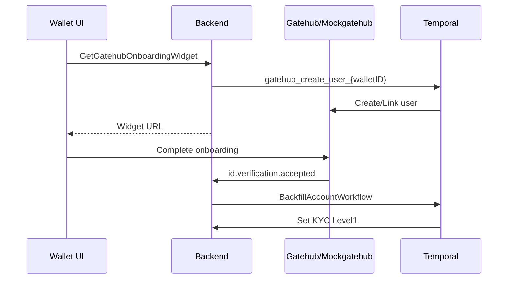
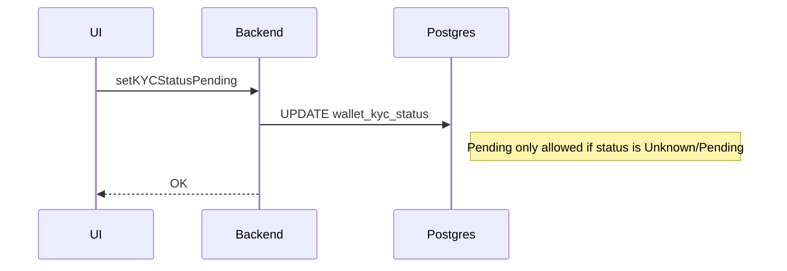

# Gatehub KYC troubleshooting (local)

## Quick checks
- Confirm the wallet is EU (non‑EU wallets cannot start Gatehub onboarding).
- Verify mockgatehub is receiving requests and webhooks.
- Verify the webhook handler sees `data.gateway` containing “paywiser” and `data.verified.short` of `accepted`.

## Temporal CLI
- List workflows:
  - `docker compose exec -T temporal temporal workflow list --namespace default`
- Describe the create-user workflow:
  - `docker compose exec -T temporal temporal workflow describe --namespace default --workflow-id gatehub_create_user_{walletID}`
- Show history (look for failed activities):
  - `docker compose exec -T temporal temporal workflow show --namespace default --workflow-id gatehub_create_user_{walletID}`
- Terminate and retry after fixes:
  - `docker compose exec -T temporal temporal workflow terminate --namespace default --workflow-id gatehub_create_user_{walletID}`

## Sample SQL queries
- Gatehub user mapping:
  - `SELECT wallet_id, gatehub_user_id FROM gatehub_users WHERE wallet_id = '{walletID}';`
- KYC status:
  - `SELECT status, updated_at FROM wallet_kyc_status WHERE wallet_id = '{walletID}';`
- Latest KYC inquiry (Persona, if used):
  - `SELECT external_id, state, updated_at FROM kyc_persona_inquiries WHERE wallet_id = '{walletID}' ORDER BY updated_at DESC LIMIT 1;`

## Things to watch out for
- **Race to Pending:** the personal‑details action can set KYC to Pending after a webhook sets Level1. Pending is now guarded, but older builds can overwrite.
- **Missing primary wallet:** Gatehub user must include a wallet with `primary: true` or linked‑account creation fails.
- **Webhook URL mismatch:** local config must point to `/webhooks/gatehub`.
- **Gateway mismatch:** verification payloads without the expected gateway are ignored.
- **Stale mapping:** if `gatehub_users` exists for the wallet but is wrong, delete it and retry activation.
