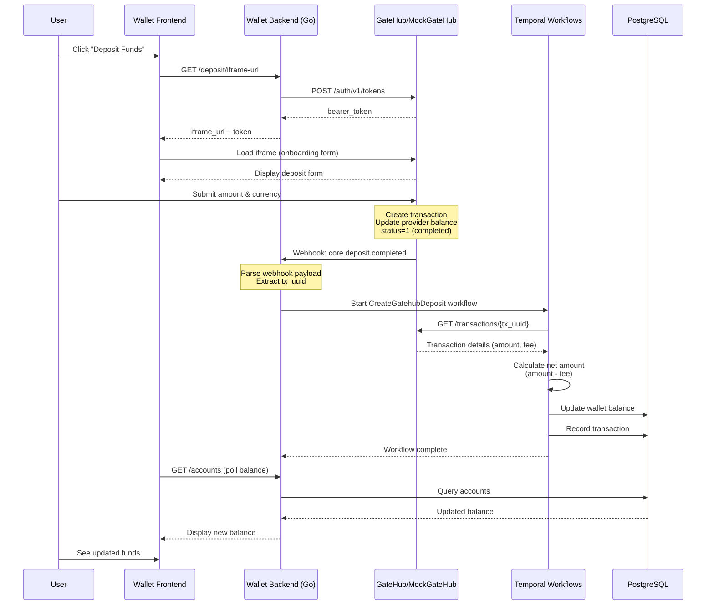
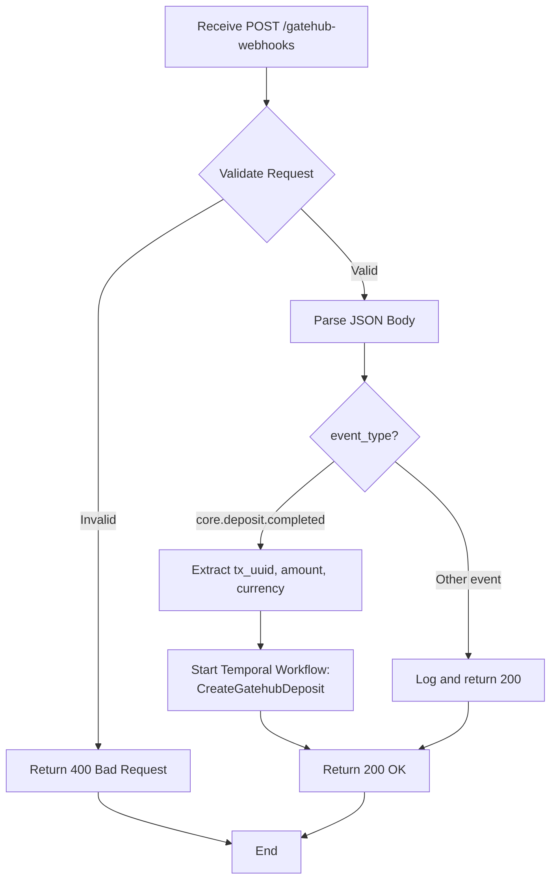
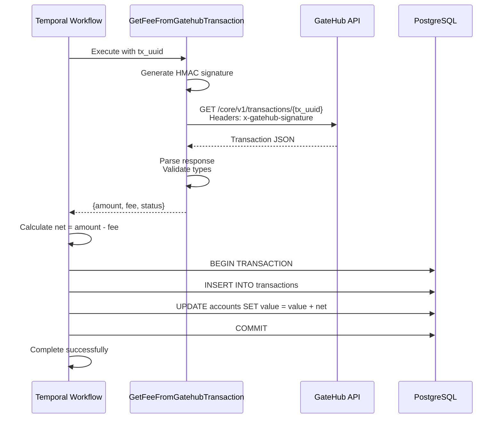

# GateHub Deposits Guide (Local Development)

## Overview

This document explains how fiat currency deposits work within the Interledger Wallet application when using GateHub as the custody provider. Deposits allow users to add funds to their wallet balances through an iframe-based flow that coordinates between the wallet frontend, backend, GateHub (or MockGateHub in local development), and Temporal workflows.

**Key Components:**
- **Wallet Frontend**: Next.js application displaying the deposit interface
- **Wallet Backend**: Go API handling authentication, webhooks, and database operations
- **GateHub/MockGateHub**: External provider managing custody, KYC, and transactions
- **Temporal**: Workflow engine orchestrating async deposit processing
- **PostgreSQL**: Persistent storage for users, accounts, and transactions

## Deposit Flow Architecture

### High-Level Flow



### Provider-Specific Logic

The deposit flow is designed to work with multiple custody providers, but the implementation currently focuses on GateHub. Here's where provider-specific logic exists:

#### Provider-Agnostic Components

- **Frontend deposit UI**: Generic iframe embedding
- **Backend webhook endpoint**: `/gatehub-webhooks` (provider-specific route, but pattern is reusable)
- **Database schema**: `linked_accounts` table with `provider` field supports multiple providers
- **Account balance updates**: Standard wallet account operations

#### GateHub-Specific Components

The following logic would need to be adapted for different providers:

**1. Authentication & Token Generation**
```go
// Location: Backend API (Go)
// GateHub-specific: HMAC signature + bearer token flow
POST /auth/v1/tokens
Headers:
  x-gatehub-app-id: {app_id}
  x-gatehub-timestamp: {unix_timestamp}
  x-gatehub-signature: HMAC-SHA256(timestamp + method + path + body, secret)
```

**Alternative providers might use:**
- OAuth 2.0 flows
- API key authentication
- JWT-based tokens

**2. Webhook Event Format**
```json
// GateHub-specific webhook structure
{
  "event_type": "core.deposit.completed",
  "user_uuid": "...",
  "data": {
    "tx_uuid": "...",
    "amount": "100.00",
    "currency": "EUR",
    "vault_uuid": "...",
    "address": "..."
  }
}
```

**Alternative providers might:**
- Use different event type naming conventions
- Send webhooks to different endpoints
- Include additional metadata (timestamps, signatures)
- Use different authentication mechanisms for webhooks

**3. Transaction Retrieval**
```go
// Location: Temporal workflow activity
// GateHub-specific API contract
GET /core/v1/transactions/{tx_uuid}
Response: {
  "amount": "100.00",        // STRING (GateHub requirement)
  "total_amount": "100.00",
  "fee": "0.00",
  "status": 1,               // INTEGER (0=pending, 1=completed, 2=failed)
  "vault_uuid": "...",
  "receiving_address": "..."
}
```

**Alternative providers might:**
- Use numeric types for amounts (requires adapter)
- Have different status code mappings
- Structure fees differently
- Not provide transaction retrieval APIs

**4. Multi-Currency Vault System**
```go
// Location: Backend database
// GateHub uses vault UUIDs per currency
const VaultUUIDs = map[string]string{
  "USD": "450d2156-132a-4d3f-88c5-74822547658d",
  "EUR": "a09a0a2c-1a3a-44c5-a1b9-603a6eea9341",
  // ... 11 currencies total
}
```

**Alternative providers might:**
- Use account IDs instead of vault UUIDs
- Support different currency sets
- Not separate currencies into distinct vaults

#### Where to Implement Provider Abstraction

To support additional providers, create an interface:

```go
// Hypothetical provider abstraction (not currently implemented)
type DepositProvider interface {
  GetIframeURL(userID, currency string) (string, error)
  FetchTransaction(txID string) (*Transaction, error)
  ValidateWebhook(req *http.Request) (*WebhookEvent, error)
}

// Implementations:
// - GatehubProvider
// - CircleProvider (hypothetical)
// - StripeProvider (hypothetical)
```

**Key integration points:**
- `backend/deposit_handler.go`: Iframe URL generation
- `backend/webhook_handler.go`: Webhook parsing
- `temporal/workflows/deposit.go`: Transaction retrieval
- `database/models/linked_accounts.go`: Provider field mapping

## Component Details

### Frontend: Deposit Iframe Embedding

**Technology**: Next.js React components

**Flow**:
1. User navigates to deposit page
2. Frontend requests iframe URL from backend
3. Backend generates URL with bearer token
4. Frontend embeds iframe in secure context
5. User completes deposit form within iframe
6. Iframe posts message to parent window on completion
7. Frontend polls backend for balance update

**Key Files**:
- `frontend/src/components/deposit/DepositIframe.tsx`
- `frontend/src/pages/deposit.tsx`

### Backend: Webhook Processing

**Technology**: Go HTTP server (port 3003 in local development)

**Webhook Endpoint**: `POST /gatehub-webhooks`

**Processing Flow**:



**Expected Webhook Payload**:
```json
{
  "uuid": "webhook-uuid",
  "timestamp": "1769178166863",
  "event_type": "core.deposit.completed",
  "user_uuid": "user-id",
  "environment": "sandbox",
  "data": {
    "tx_uuid": "transaction-uuid",
    "amount": "100.00",
    "currency": "EUR",
    "vault_uuid": "vault-uuid",
    "address": "wallet-address",
    "deposit_type": "external",
    "total_fees": "0"
  }
}
```

### Temporal: Async Workflow Processing

**Workflow Name**: `CreateGatehubDeposit`

**Workflow ID Pattern**: `gatehub_deposit_webhook{WEBHOOK_UUID}`

**Activities**:
1. **GetFeeFromGatehubTransaction**: Fetches full transaction details from GateHub API
2. **UpdateWalletBalance**: Records transaction and updates account balance in PostgreSQL

**Activity Flow**:



**Key Validations**:
- `amount`, `total_amount`, `fee` must be strings (e.g., `"100.00"`)
- `status` must be integer (0=pending, 1=completed, 2=failed)
- Only process if `status == 1` (completed)

### Database: Storage Schema

**Relevant Tables**:

```sql
-- User identity
wallet_users (
  id UUID PRIMARY KEY,
  email VARCHAR UNIQUE,
  created_at TIMESTAMP
)

-- GateHub user mapping
gatehub_users (
  wallet_id UUID REFERENCES wallet_users(id),
  external_id VARCHAR, -- GateHub user UUID
  created_at TIMESTAMP
)

-- Linked custody accounts
linked_accounts (
  id UUID PRIMARY KEY,
  wallet_id UUID REFERENCES wallet_users(id),
  provider VARCHAR,     -- 'gatehub'
  provider_id VARCHAR,  -- GateHub wallet address (e.g., rXXXX...)
  name VARCHAR,         -- 'EUR Balance'
  created_at TIMESTAMP
)

-- Wallet balances
accounts (
  id UUID PRIMARY KEY,
  wallet_id UUID REFERENCES wallet_users(id),
  asset_code VARCHAR,  -- 'EUR', 'USD', etc.
  value DECIMAL(20,8),
  created_at TIMESTAMP
)

-- Transaction history
transactions (
  id UUID PRIMARY KEY,
  wallet_id UUID REFERENCES wallet_users(id),
  amount DECIMAL(20,8),
  currency VARCHAR,
  status VARCHAR,      -- 'pending', 'completed', 'failed'
  external_ref VARCHAR, -- GateHub tx_uuid
  created_at TIMESTAMP
)
```

### MockGateHub: Local Development Provider

**Technology**: Go HTTP server (port 8080)

**Storage**: Redis DB 2 (volatile - data lost on restart unless persistence configured)

**Key Endpoints**:
- `POST /auth/v1/tokens` - Generate bearer token
- `GET /?paymentType=onboarding&bearer={token}` - Serve deposit iframe
- `POST /iframe/submit` - Process deposit form submission
- `GET /core/v1/transactions/{tx_uuid}` - Fetch transaction details
- `POST /core/v1/wallets/{address}/balance` - Get wallet balance

**Redis Keys**:
- `user:{USER_ID}` - User object (JSON)
- `wallet:{ADDRESS}` - Wallet object (JSON)
- `tx:{TX_UUID}` - Transaction object (JSON)
- `balance:{USER_ID}:{CURRENCY}` - Balance (float)
- `token:{BEARER_TOKEN}` - Token metadata

**Webhook Delivery**:
- Async delivery with 3 retries (1s, 2s, 4s exponential backoff)
- HMAC signature in `x-gatehub-signature` header
- Configured via `WEBHOOK_URL` and `WEBHOOK_SECRET` environment variables

## Prerequisites for Successful Deposits

Before a user can make a deposit, several prerequisites must be met:

## Prerequisites for Successful Deposits

Before a user can make a deposit, several prerequisites must be met:

### 1. User Must Exist in Backend Database

The user must have completed registration/onboarding.

**Verification**:
```bash
docker compose exec -T postgres psql -U postgres -d backend -c \
  "SELECT id, email, created_at FROM wallet_users WHERE email = 'user@example.com';"
```

### 2. KYC Must Be Approved

**In Kratos** (email verification):
```bash
docker compose exec kratos kratos list identities \
  --endpoint http://localhost:4434 \
  --format json-pretty | grep -A 30 "user@example.com"
```
Expected: `"verified": true`

**In GateHub** (KYC state):
```bash
# For MockGateHub (Redis storage)
docker compose exec -T redis redis-cli -n 2 GET 'user:{USER_ID}' | jq .kyc_state
```
Expected: `"accepted"`

### 3. Linked GateHub Account Must Exist

```bash
docker compose exec -T postgres psql -U postgres -d backend -c \
  "SELECT id, wallet_id, provider, provider_id, name 
   FROM linked_accounts 
   WHERE wallet_id = '{WALLET_ID}' AND provider = 'gatehub';"
```

This links the wallet to a GateHub wallet address (e.g., `rKqFBho952KMnVxD3zAEzPFdXq2r9ar1Ma`).

### 4. GateHub User Mapping Must Exist

```bash
docker compose exec -T postgres psql -U postgres -d backend -c \
  "SELECT wallet_id, external_id, created_at 
   FROM gatehub_users 
   WHERE wallet_id = '{WALLET_ID}';"
```

This links the wallet to the GateHub external user UUID.

### 5. MockGateHub Must Have User Data (Local Only)

When using MockGateHub, the user and wallet must exist in Redis DB 2:

```bash
# Verify user exists
docker compose exec -T mockgatehub curl -s http://localhost:8080/id/v1/users/{USER_ID} | jq .

# Verify wallet exists
docker compose exec -T mockgatehub curl -s http://localhost:8080/core/v1/wallets/{WALLET_ADDRESS} | jq .
```

**⚠️ Important**: MockGateHub uses volatile Redis storage. Data is lost when containers restart unless Redis persistence is configured.

## Troubleshooting

### Diagnostic Commands

#### Check User Setup

```bash
# Get user ID from email
USER_EMAIL="user@example.com"
docker compose exec -T postgres psql -U postgres -d backend -c \
  "SELECT id, email FROM wallet_users WHERE email = '$USER_EMAIL';"

# Get wallet ID (same as user ID typically)
WALLET_ID="..."  # From previous command

# Check linked GateHub account
docker compose exec -T postgres psql -U postgres -d backend -c \
  "SELECT provider_id, name FROM linked_accounts 
   WHERE wallet_id = '$WALLET_ID' AND provider = 'gatehub';"

# Check GateHub user mapping
docker compose exec -T postgres psql -U postgres -d backend -c \
  "SELECT external_id FROM gatehub_users WHERE wallet_id = '$WALLET_ID';"
```

#### Monitor Deposit Processing

```bash
# Watch backend logs in real-time
docker compose logs -f backend | grep -i "deposit\|webhook\|CreateGatehubDeposit"

# Watch MockGateHub logs
docker compose logs -f mockgatehub | grep -i "webhook\|transaction\|deposit"

# Check Temporal workflow logs
docker compose logs backend | grep "gatehub_deposit_webhook"
```

#### Verify Transaction Processing

```bash
# Check recent transactions
docker compose exec -T postgres psql -U postgres -d backend -c \
  "SELECT id, wallet_id, amount, currency, status, external_ref, created_at 
   FROM transactions 
   WHERE wallet_id = '{WALLET_ID}' 
   ORDER BY created_at DESC LIMIT 5;"

# Check account balances
docker compose exec -T postgres psql -U postgres -d backend -c \
  "SELECT asset_code, value FROM accounts WHERE wallet_id = '{WALLET_ID}';"

# Check MockGateHub balance
WALLET_ADDR="..."  # From linked_accounts.provider_id
docker compose exec -T mockgatehub curl -s \
  http://localhost:8080/core/v1/wallets/$WALLET_ADDR/balances | jq .
```

### Common Issues & Solutions

#### Issue 1: Transaction Not Found

**Symptoms**:
```
{"level":"error","Error":"gatehub external: not found. Transaction not found"}
```

**Root Causes**:
- Transaction was never created in GateHub/MockGateHub
- Transaction ID mismatch between webhook and storage
- Redis data was flushed (MockGateHub only)

**Solution**:
```bash
# Verify transaction exists in MockGateHub
TX_UUID="..."  # From webhook logs
docker compose exec -T mockgatehub curl -s \
  http://localhost:8080/core/v1/transactions/$TX_UUID | jq .
```

If transaction doesn't exist, the deposit form submission likely failed silently.

#### Issue 2: JSON Type Mismatch Errors

**Symptoms**:
```
{"level":"error","Error":"json: cannot unmarshal number into Go struct field Transaction.amount of type string"}
{"level":"error","Error":"json: cannot unmarshal string into Go struct field Transaction.status of type int"}
```

**Root Cause**: GateHub API contract violation. Backend expects:
- `amount`, `total_amount`, `fee`: **STRING** (`"100.00"`)
- `status`: **INTEGER** (0, 1, or 2)

**Solution**: Verify MockGateHub response format:
```bash
docker compose exec -T mockgatehub curl -s \
  http://localhost:8080/core/v1/transactions/{TX_UUID} | jq '.'
```

Expected structure:
```json
{
  "amount": "100.00",       // STRING, not number
  "total_amount": "100.00",
  "fee": "0.00",
  "status": 1,              // INTEGER, not string
  "currency": "EUR",
  "vault_uuid": "...",
  "receiving_address": "..."
}
```

If types are incorrect, rebuild MockGateHub:
```bash
cd /path/to/mockgatehub
docker compose build --no-cache mockgatehub
docker compose up -d mockgatehub
```

#### Issue 3: Missing User/Wallet Data in MockGateHub

**Symptoms**:
- Deposit iframe loads but submission fails
- Balance endpoint returns empty or 404
- Webhook sent but transaction lookup fails

**Root Cause**: Redis DB 2 doesn't have user/wallet data (common after `docker compose down`).

**Solution**: Recreate user and wallet in Redis:

```bash
# 1. Get IDs from backend database
WALLET_ID="..."  # From wallet_users.id
docker compose exec -T postgres psql -U postgres -d backend -c \
  "SELECT external_id FROM gatehub_users WHERE wallet_id = '$WALLET_ID';"

EXTERNAL_ID="..."  # From previous query

docker compose exec -T postgres psql -U postgres -d backend -c \
  "SELECT provider_id FROM linked_accounts 
   WHERE wallet_id = '$WALLET_ID' AND provider = 'gatehub';"

WALLET_ADDR="..."  # From previous query

# 2. Create user in MockGateHub Redis
docker compose exec -T redis redis-cli -n 2 SET "user:$EXTERNAL_ID" \
  "{\"id\":\"$EXTERNAL_ID\",\"email\":\"$USER_EMAIL\",\"activated\":true,\"managed\":true,\"role\":\"user\",\"features\":[\"wallet\"],\"kyc_state\":\"accepted\",\"risk_level\":\"low\",\"created_at\":\"$(date -u +%Y-%m-%dT%H:%M:%SZ)\",\"updated_at\":\"$(date -u +%Y-%m-%dT%H:%M:%SZ)\"}"

# 3. Create wallet in MockGateHub Redis
docker compose exec -T redis redis-cli -n 2 SET "wallet:$WALLET_ADDR" \
  "{\"address\":\"$WALLET_ADDR\",\"user_id\":\"$EXTERNAL_ID\",\"name\":\"EUR Balance\",\"type\":\"hosted\",\"network\":\"xrpl\",\"created_at\":\"$(date -u +%Y-%m-%dT%H:%M:%SZ)\",\"updated_at\":\"$(date -u +%Y-%m-%dT%H:%M:%SZ)\"}"

# 4. Link wallet to user
docker compose exec -T redis redis-cli -n 2 SADD "user:$EXTERNAL_ID:wallets" "$WALLET_ADDR"

# 5. Verify
docker compose exec -T mockgatehub curl -s \
  http://localhost:8080/id/v1/users/$EXTERNAL_ID | jq .
```

#### Issue 4: Webhook Not Received by Backend

**Symptoms**:
- Deposit form submits successfully
- Transaction created in GateHub
- No webhook logs in backend

**Debugging Steps**:

1. **Verify webhook URL configuration**:
```bash
docker compose exec mockgatehub env | grep WEBHOOK_URL
```
Expected: `WEBHOOK_URL=http://backend:3003/gatehub-webhooks`

2. **Check MockGateHub webhook logs**:
```bash
docker compose logs mockgatehub | grep -i webhook
```
Look for: `[WEBHOOK] Sending POST request to http://backend:3003/gatehub-webhooks`

3. **Test network connectivity**:
```bash
docker compose exec mockgatehub ping -c 2 backend
docker compose exec mockgatehub curl -v http://backend:3003/health
```

4. **Verify backend webhook endpoint**:
```bash
# Should return 405 Method Not Allowed (GET not supported)
curl -v http://localhost:3003/gatehub-webhooks
```

#### Issue 5: Balance Not Updated After Successful Workflow

**Symptoms**:
- Webhook received successfully
- Temporal workflow completes without errors
- Frontend still shows old balance

**Debugging Steps**:

1. **Confirm workflow completion**:
```bash
docker compose logs backend | grep "gatehub_deposit_webhook" | tail -20
```

2. **Verify transaction was recorded**:
```bash
docker compose exec -T postgres psql -U postgres -d backend -c \
  "SELECT id, amount, currency, status, created_at 
   FROM transactions 
   WHERE wallet_id = '{WALLET_ID}' 
   ORDER BY created_at DESC LIMIT 3;"
```

3. **Check database balance**:
```bash
docker compose exec -T postgres psql -U postgres -d backend -c \
  "SELECT asset_code, value FROM accounts WHERE wallet_id = '{WALLET_ID}';"
```

4. **Frontend cache**: Try hard refresh (Ctrl+Shift+R) or clear browser cache

#### Issue 6: Deposit Form Doesn't Load

**Symptoms**:
- Iframe shows blank page or loading spinner indefinitely
- Browser console shows CORS errors or 404

**Debugging Steps**:

1. **Check iframe URL**:
```bash
# Should include bearer token parameter
echo "Check browser network tab for: /?paymentType=onboarding&bearer=XXXX"
```

2. **Verify MockGateHub is running**:
```bash
docker compose ps mockgatehub
curl http://localhost:8080/health
```

3. **Check MockGateHub logs for errors**:
```bash
docker compose logs mockgatehub | tail -50
```

4. **Test iframe endpoint directly**:
```bash
# Get a token first
TOKEN=$(docker compose exec -T mockgatehub curl -s \
  -X POST http://localhost:8080/auth/v1/tokens \
  -H "Content-Type: application/json" \
  -d '{"user_id":"test-user"}' | jq -r .bearer_token)

# Load iframe
curl -v "http://localhost:8080/?paymentType=onboarding&bearer=$TOKEN"
```

### Log Analysis Patterns

#### Successful Deposit Flow

```
# Step 1: Webhook received
{"level":"info","msg":"Gatehub webhook","method":"POST"}
{"level":"info","msg":"Gatehub webhook: ","body":"{\"event_type\":\"core.deposit.completed\",...}"}

# Step 2: Workflow started
{"level":"info","msg":"Creating gatehub deposit.","WorkflowType":"CreateGatehubDeposit"}

# Step 3: Activity executing
{"level":"debug","msg":"ExecuteActivity","ActivityType":"GetFeeFromGatehubTrasaction"}

# Step 4: Fetching transaction
{"level":"info","msg":"Gatehub signing request target=http://mockgatehub:8080/core/v1/transactions/{tx_uuid}"}

# Step 5: Success (no error logs, workflow completes silently)
```

#### Failed Deposit Flow (Examples)

```
# Transaction not found
{"level":"error","Error":"gatehub external: not found. Transaction not found"}
{"level":"error","msg":"Workflow failed","WorkflowType":"CreateGatehubDeposit"}

# Type mismatch
{"level":"error","Error":"json: cannot unmarshal number into Go struct field Transaction.amount of type string"}
{"level":"error","msg":"Activity failed","ActivityType":"GetFeeFromGatehubTrasaction"}

# Network error
{"level":"error","Error":"dial tcp: lookup mockgatehub: no such host"}
{"level":"error","msg":"Activity failed","ActivityType":"GetFeeFromGatehubTrasaction"}
```

### Quick Diagnostic Checklist

Use this checklist to verify all prerequisites:

- [ ] User exists in `wallet_users` table
- [ ] Email verified in Kratos (`verified: true`)
- [ ] KYC approved in GateHub (`kyc_state: "accepted"`)
- [ ] Linked account exists in `linked_accounts` table (provider='gatehub')
- [ ] GateHub user mapping exists in `gatehub_users` table
- [ ] **(MockGateHub)** User exists in Redis: `GET user:{USER_ID}`
- [ ] **(MockGateHub)** Wallet exists in Redis: `GET wallet:{WALLET_ADDRESS}`
- [ ] Webhook URL configured correctly in MockGateHub
- [ ] Backend can reach MockGateHub (network connectivity)
- [ ] Transaction API returns correct types (strings for amounts, int for status)
- [ ] Temporal workflow logs show no errors

### Manual Testing Procedure

Follow these steps to manually test a deposit:

```bash
# 1. Get user information
USER_EMAIL="your@email.com"
docker compose exec -T postgres psql -U postgres -d backend -c \
  "SELECT id FROM wallet_users WHERE email = '$USER_EMAIL';" 

WALLET_ID="..."  # From previous command

# 2. Get linked account details
docker compose exec -T postgres psql -U postgres -d backend -c \
  "SELECT provider_id FROM linked_accounts 
   WHERE wallet_id = '$WALLET_ID' AND provider = 'gatehub';"

# 3. Open wallet application and navigate to deposit page
# URL: http://localhost:4003/deposit (or similar)

# 4. Monitor logs in separate terminals
# Terminal 1: Backend logs
docker compose logs -f backend | grep -i "deposit\|webhook"

# Terminal 2: MockGateHub logs  
docker compose logs -f mockgatehub | grep -i "webhook\|transaction"

# 5. Submit deposit form (e.g., 100 EUR)

# 6. Verify results
docker compose exec -T postgres psql -U postgres -d backend -c \
  "SELECT id, amount, currency, status FROM transactions 
   WHERE wallet_id = '$WALLET_ID' 
   ORDER BY created_at DESC LIMIT 1;"

docker compose exec -T postgres psql -U postgres -d backend -c \
  "SELECT asset_code, value FROM accounts WHERE wallet_id = '$WALLET_ID';"
```

### API Contract Reference

#### GateHub Transaction API

```typescript
// Expected structure from GET /core/v1/transactions/{tx_uuid}
interface GatehubTransaction {
  uuid: string;              // Transaction ID
  user_id: string;           // GateHub user UUID
  uid?: string;              // External reference (optional)
  amount: string;            // ⚠️ STRING "100.00", NOT number
  total_amount: string;      // ⚠️ STRING including fees
  fee: string;               // ⚠️ STRING "0.00"
  currency: string;          // "USD", "EUR", "GBP", etc.
  vault_uuid: string;        // Currency vault UUID
  receiving_address: string; // Wallet address (rXXXX...)
  type: number;              // 1 = deposit, 2 = hosted
  deposit_type: string;      // "external" or "hosted"
  status: number;            // ⚠️ INTEGER: 0=pending, 1=completed, 2=failed
  created_at: string;        // ISO 8601 timestamp
}
```

#### Webhook Payload Format

```json
{
  "uuid": "webhook-uuid",
  "timestamp": "1769178166863",
  "event_type": "core.deposit.completed",
  "user_uuid": "user-id",
  "environment": "sandbox",
  "data": {
    "tx_uuid": "transaction-uuid",
    "amount": "100.00",          // STRING
    "currency": "EUR",
    "vault_uuid": "vault-uuid",
    "address": "wallet-address",
    "deposit_type": "external",
    "total_fees": "0"            // STRING
  }
}
```

### Environment Differences

#### Local Development (MockGateHub)

- **Storage**: Redis DB 2 (volatile)
- **Data Persistence**: Lost on container restart (unless Redis persistence configured)
- **Webhook URL**: `http://backend:3003/gatehub-webhooks` (internal Docker network)
- **Security**: No real authentication, simplified HMAC validation
- **KYC**: Auto-approved on form submission
- **Money**: No real funds involved

#### Sandbox/Production (Real GateHub)

- **Storage**: GateHub's persistent database
- **Data Persistence**: Permanent
- **Webhook URL**: Must be publicly accessible HTTPS endpoint
- **Security**: Full HMAC signature validation required
- **KYC**: Real verification process with document upload
- **Money**: Real funds (production) or test funds (sandbox)

## Related Documentation

- [Email Verification Troubleshooting](email-verification-troubleshooting.md)
- [GateHub KYC Account Activation](gatehub-kyc-account-activation.md)
- [Temporal Workflow Documentation](https://docs.temporal.io/)
- [MockGateHub README](https://github.com/interledger/mockgatehub/blob/main/README.md)
- [GateHub API Documentation](https://developers.gatehub.net/) (external)
