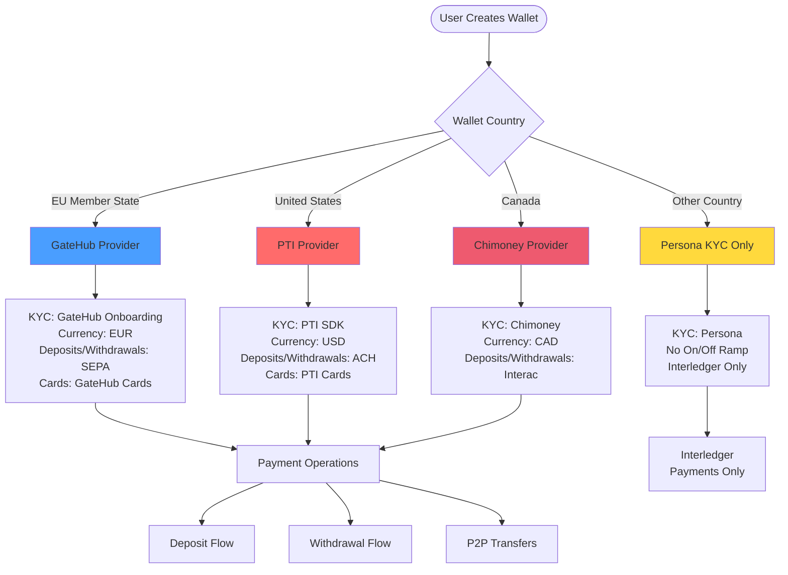

# Service Provider Selection in Interledger App

## Overview

The Interledger App integrates with multiple external service providers for KYC (Know Your Customer) verification, fiat currency custody, and on/off-ramp functionality. This document explains how and where the codebase determines which provider to use based on user wallet country and service type.

## Current Service Providers

The application currently integrates with **four primary service providers**:

| Provider | Primary Region | Currencies | Purpose |
|----------|---------------|------------|---------|
| **GateHub** | European Union (27 countries) | EUR | KYC, custody, deposits, withdrawals, cards |
| **PTI (Pay Theory International)** | United States | USD | KYC, custody, deposits, withdrawals, cards |
| **Xago** | South Africa (legacy/testing) | ZAR, USD | Balance accounts, deposits, withdrawals |
| **Chimoney** | Canada | CAD | KYC, Interac transfers |

Additionally, **Persona** is used as a fallback KYC provider for regions not covered by the above providers.

## Provider Selection Logic

### Geographic-Based Selection

Provider selection is **primarily geography-based**, determined by the user's wallet country. The selection logic is centralized in specific backend gRPC handlers.

### KYC Provider Selection

**Location:** [`go/backend/grpc/kyc.go`](../../go/backend/grpc/kyc.go) - `GetKYCProviderWidget()`

```go
func (s *rpcService) GetKYCProviderWidget(ctx context.Context, req *pb.GetKYCProviderWidgetRequest) (*pb.KYCProviderWidget, error) {
    wallet, err := s.b.Wallets().ForContext(ctx)
    
    // EU Countries → GateHub
    if _, isEU := country.EUCountries[wallet.Country]; isEU {
        return gatehub.ProviderName, onboardingWidget
    }
    
    // Canada → Chimoney
    if country.CA == wallet.Country {
        return chimoney.ProviderName, widget
    }
    
    // United States → PTI
    if country.US == wallet.Country {
        return pti.ProviderName, widget
    }
    
    // All other countries → Persona (fallback)
    return "persona", personaInquiry
}
```

**EU Countries (27 total):**
Austria (AT), Belgium (BE), Bulgaria (BG), Croatia (HR), Cyprus (CY), Czech Republic (CZ), Denmark (DK), Estonia (EE), Finland (FI), France (FR), Germany (DE), Greece (GR), Hungary (HU), Ireland (IE), Italy (IT), Latvia (LV), Lithuania (LT), Luxembourg (LU), Malta (MT), Netherlands (NL), Poland (PL), Portugal (PT), Romania (RO), Slovakia (SK), Slovenia (SI), Spain (ES), Sweden (SE)

### On/Off-Ramp Provider Selection

**Location:** [`go/backend/grpc/deposit.go`](../../go/backend/grpc/deposit.go) - `GetOnOffRampProvider()`

```go
func (s *rpcService) GetOnOffRampProvider(ctx context.Context, req *pb.Empty) (*pb.GetOnOffRampProviderResponse, error) {
    w, err := s.b.Wallets().ForContext(ctx)
    
    provider := "interledger"  // default
    
    if country.EUCountries[w.Country] {
        provider = "gatehub"
    } else if country.CA == w.Country {
        provider = "chimoney"
    } else if country.US == w.Country {
        provider = pti.ProviderName
    }
    
    return &pb.GetOnOffRampProviderResponse{
        Provider: provider,
    }
}
```

This determines which provider's deposit/withdrawal UI and workflows are shown to the user in the frontend.

## Provider-Specific Implementation Details

### GateHub (EU Region)

**Provider Name:** `"gatehub"`

**Key Files:**
- `go/backend/providers/gatehub/`
- `go/backend/grpc/gatehub.go`
- `typescript/protea/app/routes/personal-details.tsx` (KYC iframe)
- `typescript/protea/app/routes/deposit/route.tsx` (deposit UI)

**Account Types:**
- `balance` - EUR balance account linked to Pacioli ledger

**Ledger Configuration:**
- Ledger ID: `4482387` (spells "ghubeur" on Nokia 3320 keyboard)
- Ops Account: `1854f171-eafa-4e30-bf66-7dbfe167ccfa`

**Workflow Features:**
- KYC via GateHub onboarding widget (iframe)
- Card issuance and management
- Deposits via SEPA bank transfers
- Withdrawals to EU bank accounts

### PTI (United States)

**Provider Name:** `"pti"`

**Key Files:**
- `go/backend/providers/pti/`
- `go/backend/grpc/pti.go`
- `typescript/protea/app/routes/personal-details.tsx` (KYC SDK)

**Account Types:**
- `balance` - USD balance account
- `bank_account` - US bank account for deposits/withdrawals
- `card` - PTI-issued debit cards

**Ledger Configuration:**
- Ledger ID: `784873` (spells "ptiusd" on Nokia 3320 keyboard)
- Ops Account: `fb4713ba-94c5-4a56-a5bf-82b551e9bd40`

**Workflow Features:**
- KYC via PTI SDK integration
- ACH transfers for deposits/withdrawals
- Card services

### Xago (South Africa)

**Provider Name:** `"xago"`

**Key Files:**
- `go/backend/providers/xago/`
- `go/backend/grpc/xago.go`
- `go/mockxago/` (mock implementation for local development)

**Account Types:**
- `balance` - ZAR or USD balance accounts
- `bank_account` - South African bank account

**Ledger Configuration:**
- ZAR Ledger ID: `9246927` (spells "xagozar")
- USD Ledger ID: `9246873` (spells "xagousd")
- ZAR Ops Account: `b0944908-16e6-4ef4-8677-192165e33c59`
- USD Ops Account: `868196c3-f6b4-4920-bbfb-d1c7f6a98183`

**Currency Support:**
- ZAR (South African Rand)
- USD (US Dollar)

**Note:** Xago is primarily used for legacy support and testing. The application doesn't automatically route new users to Xago based on country (South Africa).

### Chimoney (Canada)

**Provider Name:** `"chimoney"`

**Key Files:**
- `go/backend/providers/chimoney/`
- `typescript/protea/app/routes/personal-details.tsx` (KYC)

**Account Types:**
- `balance` - CAD balance account
- `interac` - Interac e-Transfer for withdrawals

**Features:**
- KYC verification
- CAD balance accounts
- Interac e-Transfer for deposits and withdrawals

## Provider Selection Flow Diagram



## Linked Account Structure

All provider accounts are stored as **Linked Accounts** in the database. The `provider` field determines which provider's API to use for operations.

**Database Schema (relevant fields):**

```sql
CREATE TABLE linked_accounts (
    id UUID PRIMARY KEY,
    wallet_id UUID NOT NULL,
    provider VARCHAR(50) NOT NULL,           -- 'xago', 'pti', 'gatehub', 'chimoney'
    provider_id VARCHAR(255) NOT NULL,       -- External account ID
    type VARCHAR(50) NOT NULL,               -- 'balance', 'bank_account', 'card', 'interac'
    can_send BOOLEAN DEFAULT true,
    can_receive BOOLEAN DEFAULT true,
    state VARCHAR(50) NOT NULL,              -- 'verified', 'pending', etc.
    send_currency CURRENCY,                  -- ZAR, USD, EUR, CAD, etc.
    receive_currency CURRENCY,
    send_country COUNTRY,
    receive_country COUNTRY,
    ...
);
```

## Payment Flow by Provider

### Deposit Flow

1. **User selects deposit** → Frontend calls `GetOnOffRampProvider()` → Routes to provider-specific UI
2. **Provider-specific deposit UI** displays based on provider:
   - GateHub: SEPA deposit instructions
   - PTI: ACH deposit via SDK
   - Chimoney: Interac deposit
   - Xago: Bank transfer details
3. **External deposit detected** via:
   - Webhook (GateHub, PTI, Chimoney)
   - Polling (Xago - legacy)
4. **Backend creates transaction** and credits Pacioli ledger
5. **Balance updated** in user's balance account

### Withdrawal Flow

**Location:** [`go/backend/grpc/withdraw.go`](../../go/backend/grpc/withdraw.go)

```go
func (s *rpcService) GetLinkedAccountsForWithdraw(...) {
    // Returns linked accounts filtered by provider
    if balance.Provider == xago.ProviderName && la.Type == xago.AccTypeBank {
        // Xago bank account enabled
    }
    if balance.Provider == pti.ProviderName && la.Type == pti.TypeBank {
        // PTI bank account enabled
    }
    if balance.Provider == chimoney.ProviderName && la.Type == chimoney.AccTypeInterac {
        // Chimoney Interac enabled
    }
}
```

1. **User initiates withdrawal** from balance account
2. **Backend validates** linked bank account matches provider
3. **Payment created** with provider-specific workflow
4. **External API call** to provider to execute withdrawal
5. **Transaction tracked** until completion

## Frontend Provider Handling

### Route-Level Provider Detection

**Deposit Routes:** [`typescript/protea/app/routes/deposit/route.tsx`](../../typescript/protea/app/routes/deposit/route.tsx)

```tsx
export default function Page() {
  const { provider } = useLoaderData<typeof loader>()

  if (provider == 'gatehub') {
    return <GatehubDepositPage />
  } else if (provider == 'chimoney') {
    return <ChimoneyDepositPage />
  } else {
    return <FynbosDepositPage />  // Xago/PTI/default
  }
}
```

**Withdrawal Routes:** [`typescript/protea/app/routes/withdraw.tsx`](../../typescript/protea/app/routes/withdraw.tsx)

```tsx
export async function loader(args: LoaderFunctionArgs) {
  const providerResponse = await grpc.getOnOffRampProvider(args.request, {})
  
  if (providerResponse.provider == 'gatehub') {
    return gatehubWithdrawalLoader(args)
  } else if(providerResponse.provider == 'pti') {
    return ptiWithdrawalLoader(args)
  } else {
    return fynbosWithdrawalLoader(args)
  }
}
```

**KYC Routes:** [`typescript/protea/app/routes/personal-details.tsx`](../../typescript/protea/app/routes/personal-details.tsx)

```tsx
export default function Page() {
  const { provider } = useLoaderData<typeof loader>()

  if (provider == 'persona') {
    return <PersonaPage />
  } else if (provider == 'chimoney') {
    return <ChimoneyPage />
  } else if (provider == 'pti') {
    return <PtiPage />
  } else {
    return <GatehubPage />  // Default for EU
  }
}
```

## Key Decision Points in Code

### Where Provider Selection Happens

| Decision | File | Function | Logic |
|----------|------|----------|-------|
| **KYC Provider** | `go/backend/grpc/kyc.go` | `GetKYCProviderWidget()` | EU → GateHub, CA → Chimoney, US → PTI, Other → Persona |
| **Deposit/Withdrawal UI** | `go/backend/grpc/deposit.go` | `GetOnOffRampProvider()` | Same as KYC |
| **Balance Account Creation** | `go/backend/grpc/xago.go`<br/>`go/backend/grpc/pti.go`<br/>`go/backend/grpc/gatehub.go` | Provider-specific RPCs | Explicit provider specified by frontend |
| **Payment Routing** | `go/backend/linkedaccounts/ops/service.go` | `Create()` | Based on linked account's `provider` field |
| **Withdrawal Validation** | `go/backend/grpc/withdraw.go` | `GetLinkedAccountsForWithdraw()` | Filters bank accounts by provider match |

### Linked Account Provider Validation

**Location:** [`go/backend/linkedaccounts/types.go`](../../go/backend/linkedaccounts/types.go)

```go
type CreateArgs struct {
    Provider string `validate:"oneof=xago pti gatehub chimoney"`
    // ... other fields
}
```

The system validates that the provider field is one of the four supported values.

## Provider-Specific Workflows

### Balance Reserve/Finalize Pattern

All providers use Pacioli ledger for balance management with a common pattern:

1. **Reserve:** Create pending debit (`DebitsPending` incremented)
2. **Finalize:** Convert pending to posted (`DebitsPending` → `DebitsPosted`)
3. **Rollback:** Cancel pending debit if needed

**Implementation locations:**
- Xago: `go/backend/providers/xago/ops/ops.go`
- PTI: `go/backend/providers/pti/ops/ops.go`
- GateHub: `go/backend/providers/gatehub/ops/ops.go`

### Transaction Types by Provider

| Payment Type | GateHub | PTI | Xago | Chimoney |
|--------------|---------|-----|------|----------|
| **Peer-to-Peer** | ✅ | ✅ | ✅ | ✅ |
| **Withdrawal** | ✅ (SEPA) | ✅ (ACH) | ✅ (Bank) | ✅ (Interac) |
| **Deposit** | ✅ (SEPA) | ✅ (ACH) | ✅ (Bank) | ✅ (Interac) |
| **Card Operations** | ✅ | ✅ | ❌ | ❌ |

## Testing and Local Development

### Mock Services

| Provider | Mock Service | Location |
|----------|-------------|----------|
| **GateHub** | MockGateHub | `/mockgatehub` (separate repo) |
| **Xago** | MockXago | `go/mockxago/` |
| **Chimoney** | Not implemented | - |
| **PTI** | Not implemented | - |

### Local Environment Configuration

**Docker Compose:** [`local/docker-compose.yaml`](../docker-compose.yaml)

```yaml
services:
  mockgatehub:
    image: ghcr.io/interledger/mockgatehub:latest
    environment:
      - WEBHOOK_URL=http://backend:8080/gatehub-webhooks
      
  mockxago:
    build:
      context: ../go/mockxago
    environment:
      - WEBHOOK_URL=http://backend:8080/xago-webhooks
```

## Configuration Files

Provider-specific configuration is in `local/` directory:

- [`mockgatehub.yaml`](../mockgatehub.yaml) - GateHub mock service config
- [`mockxago.yaml`](../mockxago.yaml) - Xago mock service config (if exists)

## Common Patterns

### Determining Provider for an Operation

When processing a payment or transaction:

1. **Lookup sender's linked account** from payment
2. **Check `linkedAccount.Provider` field**
3. **Route to provider-specific client:**
   - `s.b.Xago()` for Xago
   - `s.b.PTI()` for PTI
   - `s.b.Gatehub()` for GateHub
   - `s.b.Chimoney()` for Chimoney

### Provider Client Initialization

**Location:** [`go/backend/main.go`](../../go/backend/main.go)

```go
import (
    gatehub_client "gitlab.com/fynbos/backend/providers/gatehub/client"
    pti_client "gitlab.com/fynbos/backend/providers/pti/client"
    xago_client "gitlab.com/fynbos/backend/providers/xago/client"
    chimoney_client "gitlab.com/fynbos/backend/providers/chimoney/client"
)

// Each provider client is initialized and injected into the backend
gatehubClient := gatehub_client.New(opsBackends)
ptiClient := pti_client.New(opsBackends)
xagoClient := xago_client.New(opsBackends)
chimoneyClient := chimoney_client.New(opsBackends)
```

## Summary

The Interledger App uses a **geography-based** provider selection strategy:

- **EU users** → GateHub (EUR)
- **US users** → PTI (USD)
- **Canadian users** → Chimoney (CAD)
- **South African users (legacy)** → Xago (ZAR/USD)
- **All other regions** → Persona KYC only (no on/off ramp)

Provider selection happens at **two main decision points**:

1. **KYC/Onboarding** (`GetKYCProviderWidget`) - determines verification provider
2. **On/Off Ramp UI** (`GetOnOffRampProvider`) - determines deposit/withdrawal UI

Once a linked account is created with a specific provider, **all operations for that account** must use the same provider's API, enforced through the `provider` field on linked accounts.

## References

- **Terminology Comparison:** [terminology-comparison.md](terminology-comparison.md) - Understanding how different providers use the same terms differently
- Provider Constants: `go/backend/providers/*/types.go`
- KYC Selection: `go/backend/grpc/kyc.go`
- On/Off Ramp Selection: `go/backend/grpc/deposit.go`
- Country Definitions: `go/backend/country/types.go`
- Linked Account Operations: `go/backend/linkedaccounts/ops/service.go`
