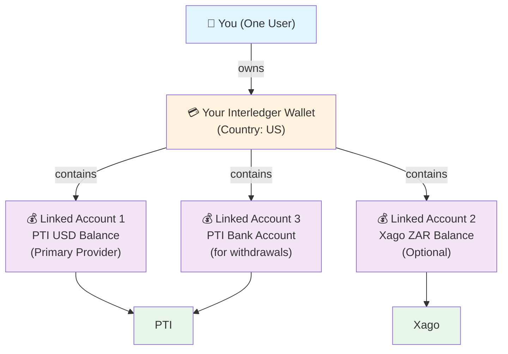

# Terminology Comparison: Interledger App vs Service Providers

## Introduction

The Interledger App integrates with multiple external service providers (GateHub, PTI, Xago, Chimoney), each with their own API vocabularies and conceptual models. This document clarifies how key terms are used differently across systems.

**Why this matters:** A "wallet" in the Interledger App is fundamentally different from a "wallet" in GateHub. Understanding these distinctions prevents confusion and helps with debugging integration issues.

## User-Facing Concepts: Your Wallet

### How Multiple Currencies and Providers Work in Your Wallet

When you create a wallet in the Interledger App, you get **one unified wallet** with one **country setting**. This single wallet acts as a container for multiple **currency accounts**, potentially from different service providers.



**Key Points:**
- ✅ **Multiple currencies:** YES (via multiple Linked Accounts)
- ✅ **Multiple providers:** YES (your one wallet can have accounts from different providers)
- ❌ **Multiple wallets:** NO (one wallet per user)
- ❌ **Separate addresses per currency:** NO (one Interledger address, but multiple currency accounts)

---

## Core Term Definitions

### 1. Wallet

#### **Interledger App Definition**

**Meaning:** Your entire financial account in the Interledger App:
- **One Interledger payment address** (e.g., `$ilp.interledger.tech/alice`)
- **One country** (which determines your primary provider)
- **Multiple currency accounts** (linked accounts from one or more providers)
- Your unified entry point to the financial system

**Key Characteristics:**
- You have exactly one wallet (1:1 with your user account)
- All your money and accounts are grouped under this wallet
- Your country determines which provider is your "primary" (US→PTI, EU→GateHub, Canada→Chimoney, etc.)

---

#### **GateHub's "Wallet" (Different Concept)**

**Meaning:** A GateHub "Wallet" is:
- **An blockchain address** (XRP Ledger address like `rHb9CJaAPteKhEvFZYENqztDjvh73znQMF`)
- A **container for currency vaults** (EUR, USD, etc.)
- Users can have **multiple wallets** (multiple blockchain addresses)
- One wallet is marked as the **primary** address

**Conceptual Mismatch:**
- Interledger Wallet ≠ GateHub "Wallet"
- GateHub "Wallet" → Becomes a **Linked Account** in Interledger (specifically: a balance account with your GateHub blockchain address)

---

#### **PTI's "Wallet" (Different Concept)**

**Meaning:** A PTI "Wallet" is:
- A **currency-specific balance container** (one per currency: USD, EUR, etc.)
- Users can have **multiple wallets** (one per currency)
- Tied to a single PTI User

**Conceptual Mismatch:**
- Interledger Wallet ≠ PTI "Wallet"
- PTI "Wallet" → Becomes a **Linked Account** in Interledger (specifically: a balance account holding USD, EUR, etc.)

---

#### **Xago's "SubAccount" (Different Concept)**

**Meaning:** Xago uses "SubAccount" instead of "Wallet":
- A **user's identity within Xago** (like a company account holder)
- Contains deposit details for both fiat and crypto
- Links to multiple currency balances (ZAR, USD)

**Conceptual Mismatch:**
- Interledger Wallet ≈ Xago "SubAccount" (roughly 1:1)
- Xago doesn't use the term "Wallet" in their API

### 2. Linked Account

#### **Interledger App Definition**

**Meaning:** Any external account connected to your Interledger Wallet:
- **Balance accounts** - Currency accounts held by a provider (Xago ZAR, PTI USD, GateHub EUR, Chimoney CAD)
- **Bank accounts** - External bank accounts for deposits and withdrawals
- **Cards** - Debit or credit cards issued by a provider
- **Other services** - Interac transfers, payment methods, etc.

**Key Characteristics:**
- Each linked account belongs to exactly one provider
- Each linked account has a currency (ZAR, USD, EUR, CAD, etc.)
- Each linked account can have different settings for sending/receiving
- You can have multiple linked accounts from the same provider (e.g., Xago ZAR + Xago USD)

**Linked Account Types:**

| Type | Provider | What It Represents |
|------|----------|------------------|
| `balance` | Xago, PTI, GateHub, Chimoney | Money held in custody by the provider |
| `bank_account` | Xago, PTI | Your external bank account (for withdrawals) |
| `card` | PTI, GateHub | Debit or credit card |
| `interac` | Chimoney | Interac e-Transfer in Canada |

**Example Linked Accounts for a US User:**

1. **PTI USD Balance** (primary, auto-created)
   - Currency: USD
   - Provider: PTI
   - Type: balance
   - Purpose: Your USD money held by PTI

2. **PTI Bank Account** (optional, user-added)
   - Currency: USD
   - Provider: PTI
   - Type: bank_account
   - Purpose: Your US bank account (for withdrawals)

3. **Xago ZAR Balance** (optional, requires South African KYC)
   - Currency: ZAR
   - Provider: Xago
   - Type: balance
   - Purpose: Your ZAR money held by Xago

4. **Xago USD Balance** (optional, requires South African KYC)
   - Currency: USD
   - Provider: Xago
   - Type: balance
   - Purpose: Your USD money held by Xago (different from PTI)

---

### 3. Account / User

#### **Interledger App Definition**

The Interledger App separates two concepts:

- **User** - Your identity and authentication (who you are)
- **Wallet** - Your financial account (what you own)

These are kept separate so that your authentication provider (Kratos) doesn't need to know about your financial data.

---

### 4. Payment

#### **Interledger App Definition**

**Meaning:** Your intention to move money from one account to another:
- **Peer-to-Peer payment** - Send money to another Interledger wallet user
- **Withdrawal** - Move money from your balance account to your bank account
- **Deposit** - Add money from your bank account to your balance account

**Key Characteristics:**
- Represents multiple steps (reserve, confirm, process, complete)
- Creates one or more underlying **Transactions** in your ledger
- Managed by workflow orchestration (happens asynchronously)

---

### 5. Transaction

#### **Interledger App Definition**

**Meaning:** A ledger entry recording a financial event:
- **Represents what actually happened** to your money
- Created by a Payment or an external event (like a deposit detected)
- Shows in your transaction history

**Transaction Types:**
- **Sent** - Money you sent to another user
- **Received** - Money another user sent to you
- **Deposit** - Money you received from your bank
- **Withdrawal** - Money you moved to your bank
- **Card Transaction** - Purchase or ATM withdrawal
- **Web Monetization** - Incoming micropayment

**Key Characteristics:**
- Each transaction involves one or more **Transfers** (actual money movements)
- Records amount, currency, status, timestamp
- Links to the linked accounts involved

---

## Provider Translation Layer

Different providers use different terminology:

| Concept | GateHub calls it | PTI calls it | Xago calls it |
|---------|-----------------|-------------|---------------|
| Money movement | Transaction | Transfer | Transfer |
| Status codes | Numbers (0, 1, 100, 101) | Strings (SETTLED, REJECTED) | Strings (completed, failed) |
| User account | User | User | SubAccount |
| Balance container | Wallet (XRPL address) | Wallet | Not exposed in API |

The Interledger App **translates** between these different vocabularies, so you don't have to think about provider-specific terminology.

## Common Pitfalls and Debugging Tips

### 1. "Wallet" Confusion

**Problem:** Developer assumes Interledger Wallet = GateHub Wallet

**Reality:**
- Interledger Wallet = User's entire account
- GateHub Wallet = XRPL address (one of many the user might have)
- The GateHub **primary wallet** address becomes the Linked Account's `provider_id`

**Fix:** Always use `linked_accounts.provider_id` when calling GateHub APIs, not `wallets.id`

---

### 2. Transaction vs Payment

**Problem:** Trying to look up a Payment by GateHub transaction ID

**Reality:**
- Payments create Transactions
- Transactions have `foreign_id` = GateHub transaction ID
- Payments have `send_transaction_id` and `receive_transaction_id`

**Fix:** Lookup flow:
1. GateHub transaction ID → Interledger Transaction (via `foreign_id`)
2. Transaction → Payment (via `send_transaction_id` or `receive_transaction_id`)

---

### 3. Balance Discrepancies

**Problem:** User's Pacioli balance differs from provider balance

**Causes:**
- Webhook not received/processed
- Failed reconciliation
- Provider-side fee deduction
- Pending transaction not yet completed

**Fix:**
- Check webhook logs
- Run backfill workflow manually
- Compare Pacioli ledger (`accounts` table) with provider API response

---

### 4. Provider ID Formats

**Problem:** Assuming `provider_id` is always a UUID

**Reality:**

| Provider | provider_id Format | Example |
|----------|-------------------|---------|
| GateHub | XRPL address | `rHb9CJaAPteKhEvFZYENqztDjvh73znQMF` |
| PTI | PTI Wallet ID (UUID-like) | `550e8400-e29b-41d4-a716-446655440000` |
| Xago (balance) | Deterministic composite | `xago_ZAR_abc123-def456-...` |
| Xago (beneficiary) | Xago Beneficiary ID | `beneficiary-uuid-from-xago` |
| Chimoney | External ID | `chimoney-provided-id` |

**Fix:** Never parse or validate `provider_id` format generically - it's provider-specific.

---

### 5. Transaction State Codes

**Problem:** GateHub returns numeric status codes, but code expects strings

**Reality:**
- GateHub: `status: 100` (int)
- Interledger: `state: "Completed"` (string)
- Mapping happens in `backend/providers/gatehub/external/client.go`

**Fix:** Always use provider-specific status mapping functions:

```go
// GateHub
if tx.Status == external.TransactionStatusCompleted { // 100
    state = transactions.StateCompleted
}

// PTI
if payload.Status == "SETTLED" {
    state = transactions.StateCompleted
}
```

---

## Architectural Goals

The Interledger App's terminology layer serves several purposes:

1. **Abstraction:** Hide provider-specific quirks behind a unified interface
2. **Flexibility:** Swap providers without changing UI or core logic
3. **Consistency:** Provide users with consistent terminology regardless of provider
4. **Extensibility:** Add new providers without rewriting the payment engine

**Trade-off:** Complexity in the translation layer (backend code must map provider concepts to Interledger concepts).

---

**Authors:** Interledger Foundation Development Team  
**Last Updated:** February 16, 2026  
**Version:** 1.0
