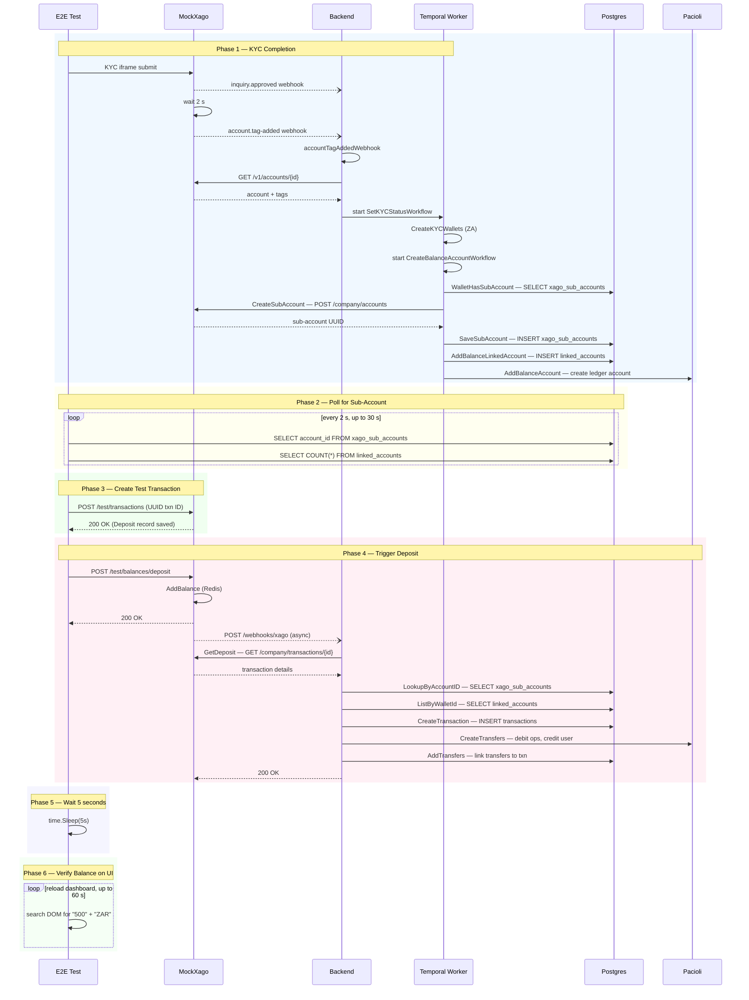

# Xago Mock Deposit Flow — E2E Test Perspective

This document traces the full lifecycle of a ZAR deposit in the E2E test
`Successfully deposit 500 ZAR into wallet via MockXago test deposit`
([002-deposit.feature L46](../e2e-playwright/features/002-deposit.feature#L46)).

It is intended as a debugging guide: when the deposit webhook returns 500 or
the balance never appears, use this document to identify which stage failed.

---

## High-Level Sequence



---

## Phase 1 — KYC Completion (prerequisite)

The deposit scenario requires a fully KYC-approved South African user with an
active Xago sub-account and linked account. This is handled by the
`I complete the minimal KYC flow` step.

### 1.1 KYC Iframe Submission

The user navigates to the personal details page, where the frontend loads a
Persona SDK iframe. The iframe `src` points at MockXago:

```
https://mockxago.interledger.test/v1/inquiries/{walletID}/iframe
```

When the user submits the form, MockXago's
[`KYCIframeSubmit`](../../go/mockxago/internal/handler/kyc.go#L76) handler
parses the form data and stores a sub-account locally (for its own Redis
lookups), then spawns an async goroutine:

```go
go h.sendPersonaInquiryApproved(walletID)
```

### 1.2 Persona Webhooks

[`sendPersonaInquiryApproved`](../../go/mockxago/internal/handler/kyc.go#L159)
sends an `inquiry.approved` Persona webhook to the backend, then after a
**2-second delay** calls
[`sendPersonaAccountTagAdded`](../../go/mockxago/internal/handler/kyc.go#L236)
which sends an `account.tag-added` webhook with tag `STATUS:KYC-LEVEL:1`.

### 1.3 Backend Processes `account.tag-added`

The backend's Persona webhook handler routes `account.tag-added` to
[`accountTagAddedWebhook`](../../go/backend/kyc/ops/webhooks.go#L157), which:

1. Calls MockXago's
   [`PersonaGetAccount`](../../go/mockxago/internal/handler/persona.go#L225)
   (`GET /v1/accounts/{id}`) — returns tags `["DIRTY", "STATUS:KYC-LEVEL:1"]`,
   identity data, and ZA identification number.
2. Performs a "dirty sync" — updates individual details, calls
   [`PersonaRemoveTag`](../../go/mockxago/internal/handler/persona.go#L287)
   (`POST /v1/accounts/{id}/remove-tag`).
3. Calls `SetKYCStatus` which starts the `SetKYCStatusWorkflow` Temporal workflow.

### 1.4 `CreateBalanceAccountWorkflow`

For South African users, [`CreateKYCWallets`](../../go/backend/kyc/ops/workflows.go#L122)
(activity inside `SetKYCStatusWorkflow`) checks `w.Country == country.ZA` at
[line 135](../../go/backend/kyc/ops/workflows.go#L135) and starts
[`CreateBalanceAccountWorkflow`](../../go/backend/providers/xago/ops/workflows.go#L149)
with currency ZAR.

This Temporal workflow runs **5 sequential activities**:

| # | Activity | File | Line | Effect |
|---|----------|------|------|--------|
| 1 | `WalletHasSubAccount` | [workflows.go](../../go/backend/providers/xago/ops/workflows.go#L53) | L53 | Checks if sub-account already exists |
| 2 | `CreateSubAccount` | [workflows.go](../../go/backend/providers/xago/ops/workflows.go#L122) | L122 | Calls `POST /company/accounts` on MockXago with KYC data |
| 3 | `SaveSubAccount` | [workflows.go](../../go/backend/providers/xago/ops/workflows.go#L62) | L62 | `INSERT INTO xago_sub_accounts` — maps Xago account UUID to wallet |
| 4 | `AddBalanceLinkedAccount` | [workflows.go](../../go/backend/providers/xago/ops/workflows.go#L240) | L240 | Creates `linked_accounts` row (provider=xago, type=balance) |
| 5 | `AddBalanceAccount` | [workflows.go](../../go/backend/providers/xago/ops/workflows.go#L208) | L208 | Configures Pacioli ledger account (ZAR ledger) |

> **Critical**: The E2E test must wait for activities 3 AND 4 to complete
> before triggering the deposit. The deposit webhook handler requires both
> `xago_sub_accounts` (activity 3) and `linked_accounts` (activity 4) rows.

---

## Phase 2 — Retrieve Sub-Account Details

**Step**: `When I get the Xago sub account details for the current user`

**Implementation**: [`iGetTheXagoSubAccountDetailsForTheCurrentUser`](../e2e-playwright/xago_deposit.go#L27)

This step:

1. Looks up the user's Kratos identity by email, then queries the backend DB
   for their `wallet_id`.
2. **Polls** (up to 30 seconds, every 2 seconds) for the `xago_sub_accounts`
   row to appear, using
   [`getXagoAccountIDByWalletID`](../e2e-playwright/db_helpers.go#L211):
   ```sql
   SELECT account_id FROM xago_sub_accounts WHERE wallet_id = $1 LIMIT 1
   ```
3. **Polls** for the linked account to appear, using
   [`xagoLinkedAccountExists`](../e2e-playwright/db_helpers.go#L241):
   ```sql
   SELECT COUNT(*) FROM linked_accounts
   WHERE wallet_id = $1 AND provider = 'xago' AND type = 'balance'
   ```
4. Stores `xago_wallet_id` and `xago_account_id` in the test context.

### Why polling is needed

The `CreateBalanceAccountWorkflow` is a Temporal workflow running
asynchronously. The sub-account row (activity 3) appears before the linked
account row (activity 4). If the test proceeds to deposit before activity 4
completes, the backend webhook handler will return 500 because it can't find
the linked account.

---

## Phase 3 — Create Test Transaction

**Step**: `And I create a test transaction in MockXago for "500" "ZAR"`

**Implementation**: [`iCreateATestTransactionInMockXagoFor`](../e2e-playwright/xago_deposit.go#L88)

This step:

1. Generates a **UUID** transaction ID using [`generateUUID()`](../e2e-playwright/xago_deposit.go#L16).
2. Logs into MockXago (`POST /v1/login`).
3. Calls [`POST /v1/test/transactions`](../../go/mockxago/cmd/mockxago/main.go#L164)
   with `{transactionId, accountId, amount, currencyCode}`.
4. MockXago's [`TestCreateTransaction`](../../go/mockxago/internal/handler/test_balance.go#L31)
   saves a `Deposit` record with status `"settled"` and code `104`.

> **Critical**: The transaction ID **must be a UUID**. The backend's
> `CreateTransactionArgs.ID` field has a `validate:"uuid"` tag. Non-UUID
> transaction IDs (e.g. `test-tx-123456`) cause the backend to return 500
> with `Field validation for 'ID' failed on the 'uuid' tag`.

### Why this step exists

When the deposit webhook arrives at the backend, `EventWebhook` calls
[`GetDeposit`](../../go/backend/providers/xago/ops/webhooks.go#L71) which makes
`GET /company/transactions/{id}` to MockXago to verify the transaction exists
and the amount matches. Without this pre-created record, the verification
fails.

---

## Phase 4 — Trigger Deposit

**Step**: `And I perform a test deposit of "500" "ZAR" in MockXago`

**Implementation**: [`iPerformATestDepositOfInMockXago`](../e2e-playwright/xago_deposit.go#L332)

This step:

1. Logs into MockXago.
2. Calls [`POST /v1/test/balances/deposit`](../../go/mockxago/cmd/mockxago/main.go#L162)
   with:
   ```json
   {
     "walletId": "<backend wallet UUID>",
     "accountId": "<xago account UUID from xago_sub_accounts>",
     "amount": 500,
     "currencyCode": "ZAR",
     "transactionId": "<UUID from step 3>"
   }
   ```
3. MockXago's [`TestDeposit`](../../go/mockxago/internal/handler/test_balance.go#L133)
   handler:
   - Adds the balance to the wallet in Redis.
   - Returns `200 {"status":"ok"}` immediately.
   - **Asynchronously** calls
     [`sendDepositWebhook`](../../go/mockxago/internal/handler/test_balance.go#L176).

> **Critical**: The `accountId` field is required. Without it, MockXago's
> `sendDepositWebhook` tries to look up the sub-account by `walletId` — but the
> backend's `CreateSubAccount` does not send `walletId` when creating the
> sub-account on MockXago, so the lookup fails and the webhook either isn't sent
> or is sent with an empty account ID.

### 4.1 Deposit Webhook Delivery

[`sendDepositWebhook`](../../go/mockxago/internal/handler/test_balance.go#L176)
builds a JSON payload:

```json
{
  "accountId": "<xago account UUID>",
  "amount": 500,
  "currencyCode": "ZAR",
  "transactionId": "<UUID>",
  "code": 104,
  "status": "settled"
}
```

It POSTs this to `WEBHOOK_URL` (`http://backend:8080/webhooks/xago`, configured
in [mockxago.yaml L22](../mockxago.yaml#L22)) with an HMAC-SHA256 signature
in the `X-Signature` header.

### 4.2 Backend Processing (`EventWebhook`)

The backend's [`EventWebhook`](../../go/backend/providers/xago/ops/webhooks.go#L42)
handler processes the webhook in a strict sequence:

1. **Verify transaction** — calls
   [`GetDeposit`](../../go/backend/providers/xago/ops/webhooks.go#L71)
   → `GET /company/transactions/{id}` on MockXago
   ([`GetTransaction`](../../go/mockxago/internal/handler/transactions.go#L310)).
   Checks amount matches.

2. **Check code** — only code `104` (successful deposit) is accepted.

3. **Lookup sub-account** —
   [`LookupByAccountID`](../../go/backend/providers/xago/ops/ops.go#L37):
   ```sql
   SELECT id, wallet_id, account_id, deposit_address, deposit_tag, deposit_reference
   FROM xago_sub_accounts WHERE account_id = $1
   ```

4. **Lookup linked account** —
   [`ListByWalletId`](../../go/backend/providers/xago/ops/webhooks.go#L97)
   finds the linked account with `provider=xago`, `type=balance`,
   `sendCurrency=ZAR`.

5. **Create transaction** —
   [`CreateTransaction`](../../go/backend/providers/xago/ops/webhooks.go#L126)
   records the deposit with state `completed`.

6. **Create Pacioli transfers** —
   [`CreateTransfers`](../../go/backend/providers/xago/ops/webhooks.go#L156)
   debits the ZAR ops account, credits the user's linked account.

7. **Link transfers to transaction** —
   [`AddTransfers`](../../go/backend/providers/xago/ops/webhooks.go#L173).

If all steps succeed, the handler returns `200 OK`.

---

## Phase 5 — Wait

**Step**: `And I wait "5" seconds for the webhook to be processed`

**Implementation**: [`iWaitSecondsForTheWebhookToBeProcessed`](../e2e-playwright/xago_deposit.go#L476)

A simple `time.Sleep`. The webhook is sent asynchronously from MockXago,
so there is a small delay before the backend processes it.

---

## Phase 6 — Verify Balance on UI

**Step**: `Then I should see my balance updated with "500" "ZAR"`

**Implementation**: [`iShouldSeeMyBalanceUpdatedWithAmount`](../e2e-playwright/gatehub_deposit.go#L152)

This step:

1. Navigates to the dashboard (`https://interledger.test`).
2. Polls up to 30 times (every 2 seconds, 60 seconds total) by reloading the
   page and searching the DOM for elements containing both `"ZAR"` and `"500"`
   within a balance-related container (looks for text like "Balance",
   "Available", "wallet").
3. If found on two consecutive checks, takes a screenshot and passes.
4. If not found after 60 seconds, takes a failure screenshot. Currently this
   step does **not** fail the test — it logs a warning and continues. This
   soft-assertion behavior should be hardened once the deposit flow is reliable.

---

## Docker Networking

All Docker-internal communication uses service names (not Traefik hostnames):

| From | To | URL | Config |
|------|----|-----|--------|
| Backend → MockXago | Persona API, Xago API | `http://mockxago:8080` | [wallet.yaml L109](../wallet.yaml#L109) |
| MockXago → Backend | Deposit webhook | `http://backend:8080/webhooks/xago` | [mockxago.yaml L22](../mockxago.yaml#L22) |
| MockXago → Backend | KYC webhooks | `http://backend:8080/webhooks/persona` | `PERSONA_WEBHOOK_URL` in mockxago.yaml |
| E2E Test → MockXago | Test APIs | `https://mockxago.interledger.test` | Via Traefik (TLS) |
| E2E Test → Backend DB | Direct Postgres | `localhost:5432` | Exposed port |

---

## Common Failure Modes

### Webhook returns 500

| Symptom | Root Cause | Fix |
|---------|-----------|-----|
| `failed to find sub account for xago webhook` | `LookupByAccountID` can't find the row in `xago_sub_accounts` | Ensure `accountId` in webhook matches `account_id` column. The `account_id` comes from MockXago's `CreateSubAccount` response, not the backend's internal UUID. |
| `failed to create transaction … Field validation for 'ID' failed on the 'uuid' tag` | Transaction ID is not a valid UUID | Use `generateUUID()` instead of `test-tx-{timestamp}`. |
| `failed to find balance linked account for xago webhook` | `linked_accounts` row for `provider=xago, type=balance` doesn't exist yet | Poll for the linked account before triggering the deposit (Phase 2). The `CreateBalanceAccountWorkflow` activity 4 may not have completed. |
| `failed to get xago transaction for webhook` | MockXago has no matching `Deposit` record for the transaction ID | Ensure Phase 3 (`POST /test/transactions`) completed before Phase 4. |

### Balance not visible on UI

| Symptom | Root Cause | Fix |
|---------|-----------|-----|
| 60-second timeout, balance never appears | Webhook returned 500 (deposit was rejected) | Check MockXago logs for `"Deposit webhook returned status 500"` and backend logs for the specific error. |
| Balance shows 0.00 | Pacioli transfer failed (ops account not configured, ledger mismatch) | Check backend logs for Pacioli errors after the webhook. |

### Debugging commands

```bash
# MockXago logs — look for webhook delivery
docker compose logs --since 5m mockxago | grep -i "deposit\|webhook"

# Backend logs — look for webhook processing errors
docker compose logs --since 5m backend | grep -i "xago webhook\|sub account\|linked account\|pacioli"

# Check xago_sub_accounts table
docker compose exec postgres psql -U postgres -d backend -c \
  "SELECT id, wallet_id, account_id FROM xago_sub_accounts ORDER BY id DESC LIMIT 5;"

# Check linked_accounts table
docker compose exec postgres psql -U postgres -d backend -c \
  "SELECT id, wallet_id, provider, type, send_currency FROM linked_accounts WHERE provider='xago' ORDER BY id DESC LIMIT 5;"

# Check Temporal workflows
# Open http://localhost:8233 and search for workflow type "CreateBalanceAccountWorkflow"
```

---

## Key Files Reference

| File | Purpose |
|------|---------|
| [features/002-deposit.feature](../e2e-playwright/features/002-deposit.feature) | Gherkin scenario definition |
| [e2e-playwright/xago_deposit.go](../e2e-playwright/xago_deposit.go) | E2E step implementations for deposit |
| [e2e-playwright/db_helpers.go](../e2e-playwright/db_helpers.go) | Database polling helpers |
| [e2e-playwright/gatehub_deposit.go](../e2e-playwright/gatehub_deposit.go) | Balance verification step |
| [e2e-playwright/context.go](../e2e-playwright/context.go) | Step registration (wiring) |
| [go/mockxago/internal/handler/test_balance.go](../../go/mockxago/internal/handler/test_balance.go) | MockXago test deposit + webhook sender |
| [go/mockxago/internal/handler/transactions.go](../../go/mockxago/internal/handler/transactions.go) | MockXago transaction retrieval (verification) |
| [go/mockxago/internal/handler/kyc.go](../../go/mockxago/internal/handler/kyc.go) | MockXago KYC webhooks (inquiry.approved, account.tag-added) |
| [go/mockxago/internal/handler/persona.go](../../go/mockxago/internal/handler/persona.go) | MockXago Persona API endpoints |
| [go/backend/providers/xago/ops/webhooks.go](../../go/backend/providers/xago/ops/webhooks.go) | Backend deposit webhook handler |
| [go/backend/providers/xago/ops/ops.go](../../go/backend/providers/xago/ops/ops.go) | `LookupByAccountID` query |
| [go/backend/providers/xago/ops/workflows.go](../../go/backend/providers/xago/ops/workflows.go) | `CreateBalanceAccountWorkflow` (5 activities) |
| [go/backend/kyc/ops/webhooks.go](../../go/backend/kyc/ops/webhooks.go) | Backend KYC webhook handler (triggers wallet creation) |
| [go/backend/kyc/ops/workflows.go](../../go/backend/kyc/ops/workflows.go) | `CreateKYCWallets` (starts balance account workflow for ZA) |
| [local/wallet.yaml](../wallet.yaml) | Backend env vars (`MOCKXAGO_ENDPOINT`) |
| [local/mockxago.yaml](../mockxago.yaml) | MockXago env vars (`WEBHOOK_URL`) |
