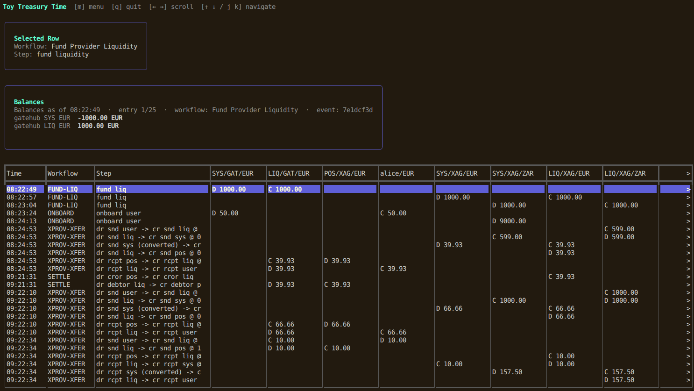

# Toy Treasury Time (TTT)

Toy Treasury Time (TTT) is a terminal-based ledger simulator for multi-provider wallet flows.
It models double-entry bookkeeping across providers, currencies, users, liquidity pools, and bilateral settlement.

The app is built with a strict split between:
- `engine`: accounting domain logic and invariants
- `gui`: Bubble Tea TUI for running workflows and inspecting state




## Features

### Ledger and accounting model
- Pure double-entry ledger with per-event posting.
- Integer-only amounts (no floating-point ledger math).
- Credit-normal balance semantics (`credit = +`, `debit = -`).
- Currency-aware global balancing checks.

### Account types
- **System account** per provider (printer/origin account).
- **Liquidity account** per provider and currency.
- **Position account** per liquidity account and counterparty provider.
- **User account** per user + provider + currency.

### Implemented workflows
- **Fund Provider Liquidity**
  - Debits provider system account and credits provider liquidity.
- **User Onboard**
  - Debits provider system account and credits user account.
- **P2P Transfer (Same Provider)**
  - Debits sender and credits recipient.
- **User Offboard**
  - Debits user and credits provider system account.
- **Cross-Provider Transfer**
  - Runs as a guided multi-step wizard.
  - Sender and recipient are looked up by globally unique user IDs.
  - Provider/currency are auto-derived from user account lookup.
  - Shows a pre-submit summary with FX and expected recipient amount.
  - Automatically creates missing position accounts.
  - Stores FX metadata on each ledger entry.
  - Uses internal FX service (no manual rate input in UI).
- **Bilateral Settlement**
  - Settles net position between two providers for a currency up to a cutoff time.
  - Cutoff defaults to `now` in the form.
  - UI shows a live preview of who should pay whom and how much (positive amount).
- **Configure Transfer Charge**
  - Sets or clears a per-direction charge (e.g. GateHub → Xago) as a percentage of the dispatch amount.
  - Charges survive "Clear Everything" — they are config, not ledger data.
  - Empty percentage field clears the charge back to nil (feature disabled for that direction).
- **Clear Everything (DANGER)**
  - Wipes providers/accounts/entries from the store after explicit confirmation (`CLEAR`).
  - Re-seeds default demo providers/accounts.

### Transfer charges (Phase 4)
- Per-direction charge configured independently for each provider pair (e.g. GH → XG and XG → GH are separate).
- Stored in the database and changeable at runtime through the **Configure Transfer Charge** menu.
- A `nil` charge means the feature is entirely skipped — no extra entries are created.
- A charge of `0%` is valid (set but has no financial effect).
- Charge is applied **before FX conversion**, denominated in the sender's currency.
- Sender is debited `dispatch amount + charge`; the transfer is rejected if the balance is insufficient.
- Charge amount is credited back into the **sending provider's liquidity account** and does not cross provider boundaries.
- All ledger lines in a charged event carry `charge.rate_num`, `charge.rate_den`, and `charge.amount` metadata.
- The confirmation screen itemises dispatch, charge (with percentage), total sender cost, FX rate, and expected recipient amount. The submit action is blocked with a clear message when the sender's balance is insufficient.

### Variable FX simulation
- Internal FX service with integer rational rates (`num/den`).
- Starts with `1 EUR = 15 ZAR` at app boot.
- Each **successful** cross-provider conversion mutates the rate by exactly `+5%` or `−5%`.
- Mutation direction is random in production and injectable/deterministic for tests.
- Failed conversions do **not** mutate the FX rate.
- Historical event metadata preserves the exact rate used at execution time.

### Integrity checks
Main view continuously runs and displays:
- Per-event zero-sum check (last event)
- Global per-currency zero-sum check
- Liquidity decomposition check (`float = liquidity - sum(position balances)`)
- Bilateral mirror check (position pairs must sum to zero)

### TUI capabilities
- Main ledger table with horizontal and vertical navigation.
- Frozen metadata columns (`Time`, `Workflow`, `Step`).
- Wide step descriptions including FX rate marker in step text.
- Cross-provider wizard with user lookup and confirmation step.
- **Balances panel** at the top:
  - Shows account balances at the point in time of the currently highlighted row.
  - Includes event/workflow context for that highlighted entry.
- Live FX section showing current internal FX quote(s).
- Workflow menu with guided forms and dynamic user dropdowns where applicable.

### Storage
- Default runtime store is SQLite via `modernc.org/sqlite` (pure Go; no CGO required).
- DB path defaults to `ttt.db` in the working directory.
- Override with environment variable:
  - `TTT_DB=/path/to/file.db`
- A `config` table stores the selected account-topology paradigm.
- On first run, the app prompts for paradigm selection and persists it.
- On later runs, startup requires a valid stored paradigm; invalid/missing config fails fast.
- In-memory store implementation also exists for tests/dev.

### Test coverage
- Extensive engine tests for workflows, checks, FX behavior, and store parity.
- SQLite and memory stores validated for equivalent behavior in scenario tests.

## Project layout

- `main.go`: app bootstrap, SQLite wiring, FX initialization, seed data
- `engine/`: domain model, workflows, checks, FX service, store interface
- `engine/memory/`: in-memory store backend
- `engine/sqlite/`: SQLite store backend and persistence tests
- `gui/`: Bubble Tea model/update/view and workflow forms

## Requirements

- Go `1.25+`

Optional for `make test`:
- `golangci-lint` installed and on PATH

## Getting started

```bash
go mod tidy
go run .
```

## Build

```bash
go build ./...
```

## Test

Run unit tests directly:

```bash
go test ./...
```

Run lint + coverage workflow from Makefile:

```bash
make test
```

`make test` enforces a minimum total coverage of **80%** across `./engine/...`.

## Cross-compile for macOS

Apple Silicon:

```bash
CGO_ENABLED=0 GOOS=darwin GOARCH=arm64 go build -o dist/ttt-darwin-arm64 .
```

Intel macOS:

```bash
CGO_ENABLED=0 GOOS=darwin GOARCH=amd64 go build -o dist/ttt-darwin-amd64 .
```

## Notes for simulation use

- Amounts are entered as decimal values in UI forms and converted to base units internally.
- On first run, choose a paradigm in the setup screen:
  - `Standard` (alias: `POS_TWO`, recommended): GateHub EUR + Xago EUR/ZAR topology.
  - `Single GateHub EUR POS` (legacy): GateHub EUR + Xago ZAR topology.
- On startup, demo entities for the stored paradigm are seeded idempotently:
  - Providers: `gatehub`, `xago`
  - Users:
    - `alice` on `gatehub` (`EUR`)
    - `bob` on `gatehub` (`EUR`)
    - `carlos` on `xago` (`ZAR`)
- Because seeding is idempotent, restarting the app preserves existing DB data.
- `Clear Everything` preserves the stored paradigm and re-seeds that same topology.

### Onboarding note

- Xago onboarding is restricted to `ZAR` in the provider/currency drill-down menus.

## License

No license file is currently defined in this repository.
